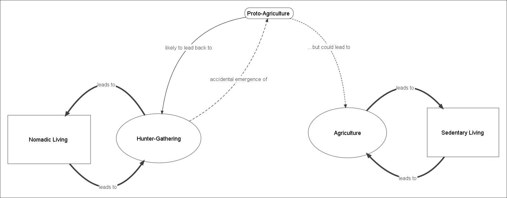
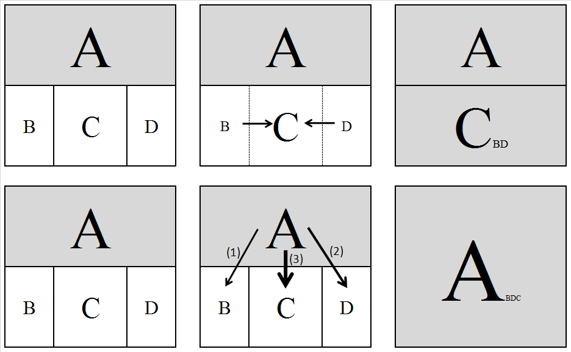

::: {.archive-notice}
**Source:** Pages 40--58 of *MintonThesis.pdf* (September 2009). Text extracted from PDF; figures extracted directly as images.
:::

3 Empires, Elites and States: Some Theories of Very Large
Scale Social Phenomena
3.1 Introduction
Within the previous chapter, I considered biological organisms in order both to
understand some of the biological processes that underlie everyday experiences; and
also to provide a conceptual device -- organism-as-abstract-machine -- that one may
attempt to apply to understanding other phenomena. This chapter will draw more from
the latter aspect of the previous chapter than the former. The suggestion will be made
that very-large scale social structures share a number of striking similarities with verysmall scale biological structures: these include a lack of prior intentional design; a
(tautologically-defined) homeostatic purpose; and a co-emergence of functional
specialisation and hierarchy with structure complexity.
This does not mean, however, that the contents of this chapter will not speak to, and
attempt to explain aspects of, everyday lived experiences as chapter two did. Instead,
one may argue that the results of the processes described here have shaped our
experiences to an overwhelming extent. Furthermore, the processes described in this
chapter, like those described in the previous chapters, are prerequisites for the existence
of the kinds of social, economic and political issues discussed in later chapters.
As with the previous chapter, in order to maintain consistency in terminology and focus,
the chapter will be based around a single account; in this case, Jared Diamond‟s account
of the emergence and dominance of complex societies over the last 10,000 years.28 The
account offered within this chapter will attempt to remain close to the original source,
but will: a) more explicitly suggest the potential application of an „evolutionary‟ mode
of thinking to understanding the processes described; b) highlight the idea that modern
societies are variations of, rather than alternatives to, earlier societies, and may be
thought of as part of an unbroken continuation of predecessors; and c) emphasise the
holistic coherence, the extent to which the whole should be considered qualitatively
different from the sum of its parts, of the social structures described.

28

Diamond, J. (1998). Guns, Germs and Steel: A short history of everybody for the last 13,000 years.
London, Vintage.; in particular pp. 265-292, a chapter called 'From Egalitarianism to Kleptocracy', which
is based on seventeen source materials written, primarily, by anthropologists in the 1960s and 1970s.

3.2 Evolution and Social Processes
The psychologist and social science methodologist Donald Campbell suggests that,
when applying evolutionary thinking to cultural phenomena, the terms „blind variation‟
and „selective retention‟ be used instead of „natural selection‟. The reasons for this are
two-fold: firstly, because these terms describe the two basic mechanisms that together
constitute a natural selective process (but that may also exist separately); and secondly,
to emphasise -- by using the word „blind‟ -- that variation need not be completely
random in order for the process to operate.29 In adopting this terminology, it becomes
clearer that valid applications of the concept are those where one can identify the
existence of, and interplay between, these two mechanisms, and so one is not restricted
to those instantiated in similar materials or operating at similar scales as those in which
they were originally identified and applied.
Another useful concept with which Campbell is credited is that of „downward
causation‟. As Campbell described it:
Where natural selection operates through life and death at a higher level of
organization, the laws of the higher level selective system determine in part the
distribution of lower level events and substances. Description of an
intermediate-level phenomenon is not completed by describing its possibility
and implementation in lower level terms. Its presence, prevalence, or
distribution […] will often require reference to laws at a higher level of
organization as well. […] [A]ll processes at the lower levels of a hierarchy are
restrained by, and act in conformity to, the laws of the higher levels.30
As the following discussion will show, the survival of the individual has consistently
and extensively depended on the qualities of the social structure within which he or she
is born and embedded.

3.3 Food, Social Structure, and Societal Complexity
The most basic version of the argument presented in this chapter is indicated in Figure
3.1. On both the left and right sides of the figure, a form of social structure (rectangle) is
linked reciprocally to a means of acquiring food (oval). The social structure „Nomadic
29

See Campbell, D. T. (1969). "Variation and Selective Retention in Socio-Cultural Evolution." General
Systems 14: 69-&.
30
P. 4 of Campbell, D. T. (1990). Levels of Organization, Downward Causation, and the Selection-Theory
Approach to Evolutionary Epistemology. Theories of the Evolution of Knowing. E. Tobach. Hillsdale, NJ,
Lawrence Erlbaum: 1-17. Of course, the idea - that in order to understand the part, one must
understand the whole -- is not new, and is often associated with, amongst others, Emile Durkheim.

Living‟ is paired with the „Hunter-Gathering‟ means of provisioning; and the social
structure „Sedentary living‟ is paired with „agriculture‟ as a means of provisioning.

{#fig-3-1}

Figure 3.1 Two 'modes of living'.
Rectangles denote social structures; ovals denote means of acquiring food. Thickness of lines indicates degree of
association. Arrows indicate causality. Note that causal path exists linking hunter-gathering to agriculture, but
not agriculture to hunter-gathering

The reasons for these two particular types of pairing are relatively simple: „huntergathering‟ requires moving from place to place, as hunting and gathering in a single
area would lead to a degradation in its feeding capacity; acquiring food in this way thus
needs a willingness to relocate, frequently, to more hospitable places. Agriculture, by
contrast, requires a long period of intensive cultivation, development, and maintenance
of an environment in order for it to produce food; this requires staying close to the areas
being cultivated, in order to be able to tend to it sufficiently.
The item labelled „Proto-Agriculture‟ provides a link between the former and the latter
means of provisioning. „Proto-Agriculture‟, to use Campbell‟s term, may be thought of
as a „blind variation‟ of traditional hunter-gathering practices. Diamond suggests
humans, like other animals, may have accidentally cultivated and domesticated a
number of species as an incidental by-product of finding and eating suitable foods:
Countless […] plants have fruits adapted to being eaten and dispersed by
particular species of animals. Just as strawberries are adapted to birds, so acorns
are adapted to squirrels, mangoes to bats, and some sedges to ants. That fulfils
part of our definition of plant domestication, as the genetic modification of an
ancestral plant in ways that make it more useful to consumers. But no one would
serious describe this evolutionary process as domestication, because birds and

bats and other animal consumers don‟t fulfil the other part of the definition: they
don‟t consciously grow plants. In the same way, the early unconscious stages of
crop evolution from wild plants consisted of plants evolving in ways that
attracted humans to eat and disperse their fruit without yet intentionally growing
them. Human latrines, like those of aardvarks, may have been a testing ground
of the first unconscious crop breeders.31
The act of gathering suitable foods from a wide area then eating them thus has the
inadvertent effect of concentrating such foods in a much smaller area. These food-rich
areas are thus likely to be visited again later, causing them to become even more
„refined‟. Choosing to further cultivate such areas, by intentionally bringing and
planting the most edible and nutritious plants, and removing less edible plants, can thus
be seen to emerge as a subtle, „blind variation‟ of a standard hunter-gathering pattern.
However, and as indicated by the dashed lines in Figure 3.1, the wholesale adoption of
an agricultural pattern is not necessarily an inevitable transition. As Diamond writes:
Formerly, all people on earth were Hunter-Gatherers. Why did any of them
adopt food production at all? […] From our modern perspective […] the
drawbacks of being a hunter-gatherer appear so obvious [but] […] [I]n reality,
only for today‟s affluent First world citizens, who don‟t actually do the work of
raising food themselves, does food production (by remote agribusiness) mean
less physical work, more comfort, freedom from starvation, and a longer
expected lifetime. Most peasant farmers and herders, who constitute the great
majority of the world‟s actual food producers, aren‟t necessarily better off than
hunter-gatherers. Time budget studies show that they may spend more rather
than fewer hours per day at work than hunger-gatherers do. Archaeologists have
demonstrated that the first farmers in many areas were smaller and less well
nourished, suffered from more serious diseases, and died on the average at a
younger age than the hunter-gatherers they replaced. If those first farmers could
have foreseen the consequences of adopting food production, they might not
have opted to do so. Why, unable to foresee the result, did they nevertheless
make that choice?32

31

Diamond, J. (1998). Guns, Germs and Steel: A short history of everybody for the last 13,000 years.
London, Vintage. , pp. 116-7
32
Ibid. pp. 104-5

Diamond uses the term „choice‟ somewhat ironically, as he suggests that the transition
towards agriculture was seldom made consciously, and tended to emerge as a series of
piecemeal changes with provisioning practices likely to involve an admixture of both
agricultural and foraging aspects. Although any particular group, at this „dabbling‟
stage, may vacillate between greater and lesser reliance on agricultural practices, the
longer-term transition has been one way. Diamond suggests four factors were important
in first generating, then exacerbating, and then locking in this change:
1. The "decline in the availability of wild foods."
2. An "increased availability of domesticable wild plants", occurring concurrently
with the first factor.
3. The "cumulative development of technologies on which food production would
eventually depend -- technologies for collecting, processing, and storing wild
foods."
4. The "two-way link between the rise in human population density and the rise in
food production."33
These four factors are unlikely to have been independent from one another: one can
imagine a steeper decline in the availability of wild foods (factor one) leading to
increasing reliance on agriculture, and increasing effort being put into finding
domesticable wild plants, leading to increased availability thereof (factor two), as well
as more emphasis on developing means of collecting, processing and storing such foods
(factor three). Conversely, increasing agriculture (following from factors two and three)
can be understood to reduce the heterogeneity of the environment, and thus reduce the
availability of wild foods (factor one).
Bearing the above in mind, however, the focus within this chapter is on factor four: this
„two-way link‟ between human population density and the rise in food production.
Increased population density does not simply lead to existing forms of social structure
being reproduced on ever larger (or more compressed) scales, but to qualitative shifts
in the form of social structure that operate. The "size of the regional population",
Diamond writes, "is the strongest single predictor of societal complexity"34 As the
population density grows, so the society becomes more complex.

33
34

Ibid. pp. 110-1
Ibid. p. 284, emphasis added.

Intensified food production and societal complexity stimulate each other, by
autocatalysis. That is population growth leads to societal complexity [...] while
societal complexity in turn leads to intensified food production and thereby to
population growth. Complex centralized societies are uniquely capable of
organizing public works [...], long-distance trade [...], and activities of different
groups of economic specialists [...] All these capabilities of centralized societies
have fostered intensified food production and hence population growth
throughout history. 35
Autocatalysis, in this case, describes a process of positive feedback between two
components, in which the rate of increase in the magnitude of each of the components is
a positive function of the magnitude of the other component. Another term for
autocatalysis is reciprocal causation.

3.4 Stages of Societal Complexity
Diamond posits four broad stages of societal complexity: bands, tribes, chiefdoms and
states.36 Diamond summarises the main features, and differences between, these stages
in a table, which is reproduced as table 3.1 below.

35

Ibid. p. 285, emphasis added
Diamond credits the typology to two books: Service, E. (1962). Primitive Social Organization. New
York, Random House, Service, E. (1975). Origins of the State and Civilization. New York, Norton. Each of
the classificatory stages is heuristic, and in reality levels of societal complexity exist along a continuum,
rather than as easily identifiable discrete stages: just as there is no definite point at which day becomes
night, there is no definite dividing line between a social group organised as a band, one organised as a
tribe, one organised as a chiefdom, and one organised as a state.
36

Band

Tribe

Chiefdom

State

dozens

hundreds

thousands

over 50,000

Membership
Number of
people
Settlement
pattern

nomadic

fixed: 1 village

fixed: 1 or more
villages

Basis of
relationships

kin

kin-based clans

class and
residence

fixed: many
villages and
cities
class and
residence

1

1

1

1 or more

"egalitarian"

"egalitarian" or
big-man

centralized,
hereditary

centralized

none

none

none, or 1 or 2
levels

many levels

Monopoly of
force and
information

no

no

yes

yes

Conflict
resolution

informal

informal

centralized

laws, judges

no

no

no → paramount
village

capital

no

no

yes

yes → no

Food production

no

no → yes

yes → intensive

intensive

Division of labor

no

no

no → yes

yes

reciprocal

reciprocal

Control of land
Society

band

clan

redistributive
("tribute")
chief

redistributive
("taxes")
various

Stratified

no

no

yes, by kin

yes, not by kin

Slavery

no

no

small-scale

large-scale

Luxury goods
for elite

no

no

yes

yes

Public
architecture

no

no

no → yes

yes

Indigenous
literacy

no

no

no

often

Ethnicities and
languages
Government
Decision
making,
leadership
Bureaucracy

Hierarchy of
settlement
Religion
Justifies
kleptocracy
Economy

Exchanges

Table 3.1 Jared Diamond's 'Types of Societies'
Original caption: 'A horizontal arrow indicates that the attribute varies between less and more complex societies
of that type'
Source: pp. 368-9 of Diamond, J. (1998) Guns, Germs and Steel London: Random House

Bands, according to Diamond, "lack many institutions that we take for granted in our
own society".
They have no permanent single base of residence. The band‟s land is used
jointly by the whole group, instead of being partitioned among subgroups or
individuals. There is no regular economic specialization, except by age and sex:
all able-bodied individuals forage for food. There are no formal institutions,
such as laws, police, and treaties, to resolve conflicts within and between
bands.37
Diamond continues:
Band organisation is often described as "Egalitarian": there is no formalized
social stratification into upper and lower classes, no formalized or hereditary
leadership, and no formalized monopolies of information and decision making.
However, the term "egalitarian" should not be taken to mean that all band
members are equal in prestige and contribute equally to decisions. Rather, the
term merely means that any band "leadership" is informal and acquired through
qualifies such as personality, strength, intelligence, and fighting skills.38
One level of social complexity above is the tribe, typically with a few hundred, rather
than a few dozen, members. These differ from the bands by "usually having fixed
settlements",39 and may be considered the first of the „sedentary‟ social structures that
emerged.
[A] tribe also differs [from a band] in that it consists of more than one formally
recognized kinship group, termed clans, which exchange marriage partners.
Land belongs to a particular clan, not to the whole tribe. However, the number
of people in a tribe is still low enough that everyone knows everyone else by
name and relationships.40
Within both bands and tribes:
Their economy is based on reciprocal exchanges between individuals or
families, rather than on a redistribution of tribute paid to some central authority.
37

Diamond, J. (1998). Guns, Germs and Steel: A short history of everybody for the last 13,000 years.
London, Vintage. pp. 268-7
38
Ibid. p. 269
39
Ibid. p. 270
Ibid. p. 271

Economic specialization is slight: full-time crafts specialists are lacking, and
every able-bodied adult … participates in growing, gathering, or hunting food.41
Chiefdoms, with typical group sizes in the thousands, are the next level of societal
complexity:
The most distinctive economic feature of chiefdoms was their shift from reliance
solely on the reciprocal exchanges characteristic of bands and tribes, by which A
gives B a gift while expecting that B at some unspecified future time will give a
gift of comparable value to A. [...] While continuing reciprocal exchanges and
without marketing or money, chiefdoms developed an additional new system
termed a redistributive economy. A simple example would involve a chief
receiving wheat and gradually giving it out again in the months between
harvests.42
Arguably, it is with the emergence of chiefdoms and the redistributive economy that
something like a „welfare state‟ (rather than simply a bottom-up, collectivist „state of
welfare‟ that occurs spontaneously between tribal members in smaller groups) can first
be identified.
With states, the most complex of the four types:
Economic specialization is more extreme, to the point where today not even
farmers remain self-sufficient. Hence the effect on society is catastrophic when
state government collapses, as happened in Britain upon the removal of Roman
troops, administrators, and coinage between A. D. 407 and 411.43
The danger of „catastrophic collapse‟ caused by the collapse of state governments
suggests that states exert a very powerful force of „downwards causation‟ upon the
persons out of whom they are constituted; perhaps even more so than for chiefdoms,
tribes, and bands.

3.5 Societal Complexity and Environmental Carrying Capacity
In order to understand why increasing population sizes and societal complexity are
linked in the ways suggested in table 3.1, it may be helpful to draw upon the concept of
„carrying capacity‟ from ecology. This defines the maximum population that a given

Ibid. p. 272
Ibid. p. 275, emphasis added
Ibid., p. 279

environment can support. For example, if the environment is a given hectare of land, a
quarter of which has been cultivated and can support 20 people, then one might assume
the carrying capacity of the environment to be 80 people per hectare. The carrying
capacity, however, is determined both by „biogeographical‟ factors -- such as amount of
rainfall, type of soil, availability and type of wildlife, and so on -- and social factors --
such as the level of conflict or co-operation between people living in the same area.
Both sets of factors operate to „set‟ the environmental carrying capacity.
If the local environment is suitable -- contains appropriate plants for cultivation, animals
for domestication, appropriate soil and so on -- then switching from hunter-gathering to
agriculture operates to increase the carrying capacity by altering the biogeographical
factors: population, and population density, therefore increases. As the population
density increases, however, it generates and exacerbates a number of social problems
that inhibit further population growth and reduce the carrying capacity of the
environment to a level below that which is theoretically attainable given the
biogeography. Unless these problems are solved, the population density remains capped
at this lower, socially constrained level.
Note here that we have a situation where mechanisms for both „blind variation‟ and
„selective retention‟ can be identified:
Blind Variation: Individuals and groups of individuals within the social
structure produce (whether purposively or accidentally) a number of variations
of the standard rituals, practices and so on which collectively constitute the
social structure. Just as genes are not „perfect‟ replicators, and occasionally
miscopy information, so people are not „perfect‟ learners, and often produce
variations on an existing cultural practice by pure accident; variations on
existing patterns may also, of course, be produced intentionally.
Selective Retention: If a variation on an existing practice reduces the social
problems which limit the carrying capacity, it is more likely to be retained.
Furthermore, as the carrying capacity of this modified social structure has been
increased, the population density increases, and so the proportion of all persons
born into social structures with this selected variation, as opposed to the
„unmodified variant‟, increases.

3.6 Types of Social Problems
So far, the generic term „social problems‟ has been used, but the specific types of social
problem encountered as a result of greater population density have not been defined.
According to Diamond (but to use a slightly different terminology to him) two broad
types of social problem threaten to impose a social carrying capacity below the
biogeographical level: 1) Internal Security Problems and 2) Internal Logistics
Problems. Both of these types of problem will now be considered in more detail,
together with an explanation for why the particular types of attributes associated with
the more complex types of society described in Table 3.1 operate to provide „solutions‟
to these problems. (After this, I will consider how more complex societies -- the result of
„solving‟ these first two types of problem -- greatly exacerbates a third type of problem
-- External Security Problems -- for which, perhaps, the only solution is the adoption of a
complex societal structure.)
3.6.1 Internal Security Problems: The problem of conflict between
unrelated strangers
In small groups, informal methods of conflict resolution are possible, and so formal
systems are not required. As Diamond writes:
In a band, where everyone is closely related to everyone else, people related
simultaneously to both quarrelling parties step in to mediate quarrels. In a tribe,
where many people are still close relatives and everyone at least knows everyone
else by name, mutual friends mediate the quarrel. But once the threshold of
"several hundred", below which everyone can know everyone else, has been
crossed, increasing numbers of dyads become pairs of unrelated strangers. When
strangers fight, few people present will be friends or relatives of both
combatants, with self-interest in stopping the fight. Instead, many onlookers will
be friends or relatives of only one combatant and will side with that person,
escalating the two-person fight into a general brawl. Hence a large society that
continues to leave conflict resolution to all of its members is guaranteed to blow
up.44
The "problem [of conflict resolution] grows astronomically as the number of people
making up the society increases."45

Ibid., p. 286
Ibid. p. 286

Relationships within a band of 20 people involve only 190 two-person
interactions (20 people times 19 divided by 2), but a band of 2,000 people would
have 1,999,000 dyads. Each of those dyads represents a potential time bomb that
could explode in a murderous argument. Each murder in band and tribal
societies usually leads to an attempted revenge killing, starting one more
unending cycle of murder and countermurder that destabilizes the society.46
The „solution‟ elites have „offered‟ to this problem is Hobbesian: "for one person, the
chief, to exercise a monopoly on the legitimate use of force."47
[The] chief held a recognized office, filled by hereditary right. Instead of the
decentralized anarchy of a village meeting, the chief was a permanent
centralized authority, made all significant decisions, and had a monopoly on
critical information.48
It is worth taking note, at this point, that the words „police‟, „polity‟, „policy‟, „politic‟,
„political‟ and „polite‟ all share the same etymological lineage.49
3.6.2 Internal Logistical Problems: The problem of transferring goods
between members
One of the primary advantages of any form of social group is the ability it provides its
members to share risks. People are not (as implicitly assumed by aspects of
microeconomic theory) utility-maximising robots, but instead risk-constraining, mortal,
animals. The gain to one‟s well-being of having twice as much food to eat as one needs
is not twice as beneficial as having half as much food as one needs to eat is detrimental:
the former provides some slight gluttonous pleasure; the latter brings the chronic,
intense pain of starvation. Though one can, in certain cases, calculate the expected
return from an investment on average, what matters most to people is the minimisation
of the probability that one‟s return will ever fall below some minimal threshold: the

Ibid. p. 286
Ibid. p. 273
Ibid. p. 273
According to the Concise Oxford English Dictionary (Tenth Edition), the origin of the term 'police' is
1
1
"C15 (in the sense of 'public order'): from Fr., from med. L. politia (see Policy )"; for Policy , the notes
for origin are listed as "ME: from OFr. policie 'civil administration', via L. from Gk. politeia 'citizenship'".
Also note, for example, that the origin of the term 'politic' derives from the Greek politickos, itself
derived from the term politēs: 'citizen', which in turn derives from polis: 'city' (Pearsall, J. (1999). The
Concise Oxford Dictionary. J. Pearsall. Oxford, Oxford University Press.)

threshold required for survival.50 In small groups, where everyone knows each other by
name and reputation, sharing one‟s surplus ensures that one‟s own fortunes are always
closely aligned to those of the group, and thus that, so long as the group‟s resources per
capita are above the starvation threshold, no one will starve.
However, as the group size is small, it may be that none or very few of the members
have been fortunate in acquiring resources, and thus bad fortune could mean the
starvation of the entire group. Having a larger group means greater stability in the per
capita wealth of the group; however, this larger size also leads to far greater logistical
difficulties in ensuring effective distribution of such wealth to all members. As
Diamond puts it:
Any society requires means to transfer goods between its members. One
individual may happen to acquire more of some essential commodity on one day
and less on another. Because individuals have different talents, one individual
consistently tends to wind up with an excess of some essentials and deficit of
others. In small societies with a few pairs of members, the resulting necessary
transfers of goods can be arranged directly between pairs of individuals or
families, by reciprocal exchanges. But the same mathematics that make direct
pairwise conflict resolution inefficient in large societies makes direct pairwise
economic transfers also inefficient. Large societies can function economically
only if they have a redistributive economy in addition to a reciprocal economy.
Goods in excess of an individual‟s needs must be transferred from the individual
to a centralized authority, which then redistributes the goods to individuals with
deficits.51
As well as, and to an extent despite, the symbolic violence of the potlatch, 52 the ceding
of some proportion of one‟s wealth to an administrative elite may be tolerated by
commoners so long as the administrators ensure the availability of sufficient food, and
other necessary and highly desired resources, on occasions when both oneself, and
one‟s friends, are simultaneously suffering from acute shortage. The establishment of

This follows from the homeostatic function of the organism: internal regulation can maintain life, the
bounded distinction between the organism and its environment, to some extent, but if external
conditions are too extreme, or remain adverse for too long, then the distinction cannot be maintained
and the organism will die.
Diamond, J. (1998). Guns, Germs and Steel: A short history of everybody for the last 13,000 years.
London, Vintage. p. 287
See Mauss, M. (2000). The Gift: the form and reason for exchange in archaic societies. London, V. W.
Norton.

the administrated redistributive economy, in parallel with the kinship-based reciprocal
economy, ensures that members of larger social groups are able to access its riskconstraining benefits.
3.6.3 Internal Logistical Problems: Societal Decision Making
A related type of issue facing larger social groups is how communal decisions are to be
made quickly and effectively. Diamond writes:
Decision making by the entire adult population is still possible in New Guinea
villages small enough that news and information spread quickly to everyone,
that everyone can hear everyone else in a meeting of the whole village, and that
everyone who wants to speak at the meeting has the opportunity to do so. But all
those prerequisites for communal decision making become unattainable in much
larger communities. Even now, in these days of microphones and loudspeakers,
we all know that a group meeting is no way to resolve issues for a group of
thousands of people. Hence a larger society must be structured and centralized if
it is to reach decisions effectively.53
Again, this form of social problem leads more (tautologically defined) successful highdensity societies to adopt a more complex structure with greater specialisation, more
centralisation and more hierarchy.
A result of this, and as indicated in the „Government‟ section of table 3.1, is usually for
those at the centre of the power structure to attempt to exercise a monopoly of crucial
information required for political decision-making.
Even in democracies today, crucial knowledge is available to only a few
individuals, who control the flow of information to the rest of the government
and consequently control decisions.54
3.6.4 External Security Issues: Threat from other states55
Once chiefdom and state-sized social structures emerged, their existence became a
significant factor leading to their increasing prevalence. This is because, as Diamond
describes it, "large units potentially enjoy an advantage over individual small units if --
and that‟s a big „if‟ -- the large units can solve the problem that come with their larger

Diamond, J. (1998). Guns, Germs and Steel: A short history of everybody for the last 13,000 years.
London, Vintage. , p. 287
Ibid., p. 279
This section is based primarily on pp. 288-92 of Ibid.

size".56 If two social structures occupy contiguous territory, then the larger, more
complex, more centralised, more specialised society is more likely to be able to
successfully attack the smaller society than the smaller social group is the larger society.
Irrespective of how the smaller group responds, the result, over a large time-scale, is
likely to be the increasing prevalence of the larger, more complex social structures.
To see why the particular decisions made by the individual groups do not affect the
longer-term trend towards large, complex, hierarchical societies, consider a number of
small, egalitarian societies occupying a border with a large, hierarchical society. If the
existence of the large society on the small societies‟ border is considered a threat to the
smaller societies‟ security, then they become more willing to merge together into a
single polity of comparable size to their much larger neighbour. In the process of doing
so, however, as a result of the internal pressures of managing and coordinating a large
and high density society, they end up adopting much the same complex hierarchical
societal structure as their neighbour. In this case, a transition to complex society has
occurred through „merger‟.
If, however, the smaller polities choose not to merge, and the larger polity really is a
threat, then each of the smaller polities is unlikely to be able to defend itself if-andwhen the larger polity attacks. Once it does so, it cedes the smaller polity‟s territory and
kills or subjugates its members. The surviving members of the smaller former polity
become part of the larger polity, but are likely to do so as low status members (such as
slaves), and face poorer conditions than if they had been willing to merge with the other
smaller polities. In this case, a transition to complex society has occurred through
„acquisition‟. (Awareness amongst smaller polities that the consequences of
„acquisitions‟ are likely to be worse than those of „mergers‟ is likely to further increase
the rate at which smaller groups make the transition to more complex societies, thus
further accelerating the transformation of societies along this one-way vector of
civilisation.)
A graphical abstraction of these two processes is presented in 

{#fig-3-2}

Figure 3.2.

Ibid., p. 289

Figure 3.2 Mergers and Acquisitions.
Two processes relating to 'external security issues' leading to the accelerated adoption of complex societal
structures. Grey boxes represent large, complex, hierarchical social structures; white boxes represent smaller,
egalitarian social structures. The complex structure 'A' is contiguous with the simpler, smaller structures B, C and
D. Two different scenarios are presented. In the 'merger' scenario (top row), the mutual threat posed by A causes
B and D (the smallest structures) to cede control to C (the largest of the smaller structures) and in doing so form a
new large, unequal complex structure C(AB). In the 'acquisition' scenario (bottom row), the smaller structures do
not respond to the threat posed to A, and are taken over.

A substantive conclusion that one can draw from the above discussion is that societal
„evolution‟ (the „selective retention‟ of „blind variations‟ in cultural practices) does not
necessarily lead to improvements in the quality of life of those living within such
societies. One saw near the start of the previous chapter, in discussing the „psychosocial
model‟ of health inequalities, that the „human organism‟ is fairly averse to being placed
in a low position within a complex hierarchy, yet societal structures -- composed of
people and their practices -- have evolved to be increasingly hierarchical, and so have
led to increasingly large proportions of the population to persistently experience the
feeling of being „low status‟. This chapter will conclude by considering the implications
of societal structure to social experiences, with an emphasis on social inequalities.

3.7 Kleptocracy and the Growth of Inequality
In this chapter, I have described and discussed a theory suggesting that, although the
transition from small-scale to large-scale societies was, once initially established,
inexorable in the longer term, the results of such a transition have been at best a „mixed
good‟, and at worst a disaster, for those people living within the new social structures.

In 1987, Diamond wrote a short polemic to this effect, the start and end of which are
reproduced below:
To science we owe dramatic changes in our smug self image. Astronomy taught
us that our earth isn‟t the center of the universe but merely one of billions of
heavenly bodies. From biology we learned that we weren‟t specially created by
God but evolved along with millions of other species. Now archaeology is
demolishing another sacred belief: that human history over the past million years
has been a long tale of progress. In particular, recent discoveries suggest that the
adoption of agriculture, supposedly our most decisive step toward a better life,
was in many ways a catastrophe from which we have never recovered. With
agriculture came the gross social and sexual inequality, the disease and
despotism, that curse our existence.57
[…]
Hunter-gatherers practiced the most successful and longest lasting life style in
human history.58 In contrast, we're still struggling with the mess into which
agriculture has tumbled us, and it's unclear whether we can solve it. Suppose that
an archaeologist who had visited us from outer space were trying to explain
human history to his fellow spacelings. He might illustrate the results of his digs
by a 24-hour clock on which one hour represents 100,000 years of real past time.
If the history of the human race began at midnight, then we would now be
almost at the end of our first day. We lived as hunter-gatherers for nearly the
whole of that day, from midnight through dawn, noon, and sunset.
Finally, at 11:54 p.m., we adopted agriculture. As our second midnight
approaches, will the plight of famine stricken peasants gradually spread to
engulf us all? Or will we somehow achieve those seductive blessings that we
imagine behind agriculture's glittering facade, and that have so far eluded us?
Writing in more measured tones in Guns, Germs and Steel a decade later, Diamond
states that: "chiefdoms introduced the dilemma fundamental to all centrally governed,
nonegalitarian societies."

Diamond, J. (1987). The Worst Mistake in the History of the Human Race. Discover: 64-66.
Arguably, Diamond is here defining success simply by longevity, and so this statement is a tautology.

At best, they do good by providing expensive services impossible to contract for
on an individual basis. At worst, they function unabashedly as kleptocracies,
transferring net wealth from commoners to upper classes. These noble and
selfish functions are inextricably linked, although some governments emphasize
much more of one function than the other. The difference between a kleptocrat
and a wise statesman, between a robber baron and a public benefactor, is merely
one of degree[.]59
Diamond‟s idiosyncratic terms „kleptocrat‟ and „kleptocracy‟, derived from the Greek
word for „thief‟, „kleptēs‟, helps remind us that the motivation driving those at the top of
the societal hierarchy to take (often under threat of force) resources from those at the
bottom of the hierarchy may often have been simple, ignoble greed.
Does it matter whether „elites‟ are acting out of selfish motivations, however, if the
consequences of their actions are „functionally benevolent‟ to „commoners‟? For
instance, a group of elites may establish a monopoly on the use of force, and disarm the
populace at large, simply in order to make it harder for them to be deposed by rivals;
furthermore, they may use this monopoly of force „lightly‟, not simply to attack groups
and individuals they do not like, and only at the behest of commoners, in order to make
it harder for rival elites to establish popular support. The intentions may be selfish, but,
if this leads to a cessation of internecine revenge cycles of murder and countermurder,
then the social consequences will be altruistic. Are the consequences of, rather than the
motivations for, political (and proto-political) acts what really matters? More generally,
is large social-structural inequality necessarily bad, if it is simply the outcome of a long
series of blind-variation-and-selective-retention iterations?
Questions like these may simply be „academic‟, in the pejorative sense of being
„without obvious application‟. But by considering them we bring into sharper relief both
the ultimate historical and social-procedural mechanisms that make possible our
contemporary problems of social inequalities; and also the range of options, within the
social-structural apparatus history has bequeathed us, that are available to alleviate
complex society‟s most unpleasant side-effects.
When the qualities of complex societies, described in this chapter, are contrasted with
the qualities of the complex organisms known as „human beings‟, described in the
59

Diamond, J. (1998). Guns, Germs and Steel: A short history of everybody for the last 13,000 years.
London, Vintage., p. 276

previous chapter, then one‟s understanding of the consequences of social inequalities
becomes sharper still: complex society, from the perspective of the person, is
experienced as a tapestry of social relationships between individuals. From the
perspective of the organism, each relationship is experienced as an embodied set of
dispositions, tendencies towards complex systematic patterns of response, to „objects‟.
Some social relationships are experienced as pleasant from the perspective of the
person, because from the perspective of the organism they are understood to be
consonant with trouble-free living. Other social relationships are experienced as
unpleasant and stressful, because the organism senses and categorises them as a threat,
and thus urges the individual to remove themselves from the stressful environment. As
suggested by the passage describing the psycho-social model of health inequalities,60
the organism, in response to a stressful social encounter, also pre-emptively readies the
body for physical attack.
Complex society, due to its characteristic pattern of hierarchy and structural inequality,
increases the frequency with which the individual will encounter other individuals on
persistently unequal terms. Perhaps the sensation that one‟s own destiny, one‟s own
quality and quantity of life, is subject to the arbitrary decisions of someone else, simply
as a result of the different positions that that person and oneself hold within the social
power structure, is a sensation much more frequently experienced in complex societies
(to which we are, it would seem, physiologically and psychologically mal-adapted) than
it was in simple societies (to which we were likely better adapted).
In the next chapter I will shift from the very large scale to the small scale, and look in
some depth at the „raw material‟ of complex social structures more generally, and
bureaucratic organisations more specifically: dyadic and triadic hierarchical
relationships between individuals. I will discuss how the behaviour of an individual is
usually very strongly and systematically influenced by the social structural situation
within which he find himself „placed‟, how this is experienced by persons-as-organisms
at different levels within the hierarchy, and how this operates to increase the level of
power and control individuals in positions of authority have over individuals in
subordinate positions.

In chapter five I will return to large-scale thinking by

considering Max Weber‟s classic sociological theories of modernity and bureaucracy.

60

See page 9.
