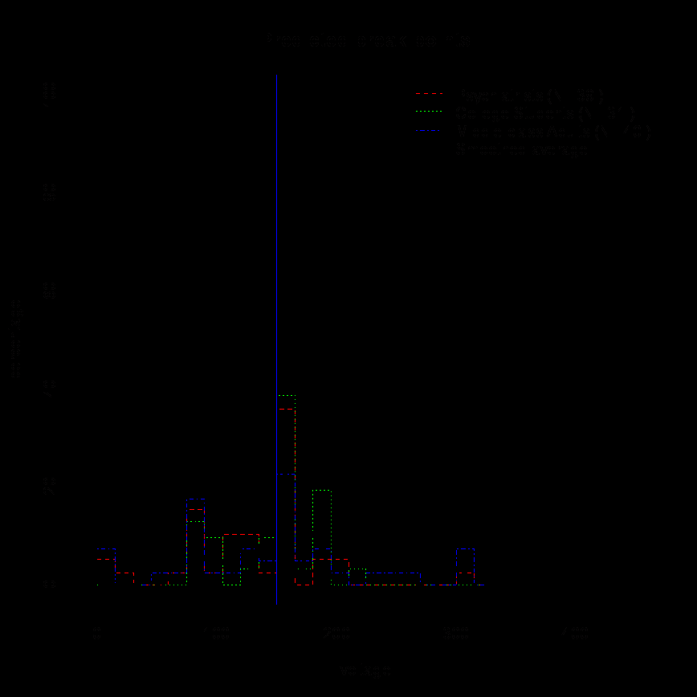
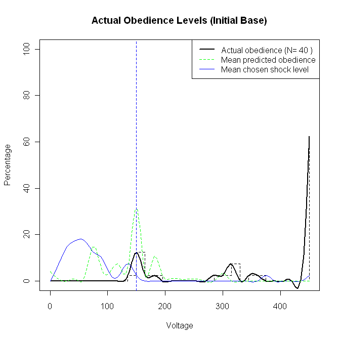

::: {.archive-notice}
**Source:** Pages 59--75 of *MintonThesis.pdf* (September 2009). Text extracted from PDF; figures extracted directly as images.
:::

4 Obedience and Hierarchy: Some Theories of Small Scale
Social Phenomena
4.1 Introduction
Within the two previous chapters I discussed, respectively, the very small scale
biological and neurological structure known as the 'organism', and the very large scale
sociological structure known as 'society'. Metaphorically, these two chapters may be
thought of as first drawing a stick figure, and then drawing a box around the stick
figure.
Within this chapter, I will start to add some more detail to the 'stick figure', shifting my
attention from 'the organism' in general, to the particular type of organism known as 'the
individual'. In a mirror of this process, the next chapter will shift our attention from the
processes and qualities of complex societies more generally, to a more specific
consideration of bureaucratic hierarchical structures prevalent and predominant within
such societies. Both of these chapters will shift our attention back towards the kinds of
phenomena experienced and observed on an everyday basis, as part of everyday
activity.
In moving towards the 'mundane' and familiar, from the direction of the more esoteric
and unfamiliar, the hope is that our understanding of such apparently banal phenomena
as office work, filing, rule-books, paper-work, bosses, and wages become „reenchanted‟ with a sense of the strange and exotic. In doing so, the hope is that some of
the forces of habitualisation that make many aspects the familiar 'invisible', unnoticed
and not worthy of further comment and analysis, are temporarily disabled, and instead
aspects of every-day practice may be seen in new, unfamiliar light.
In this chapter, I will attempt to de-familiarise the familiar through the Obedience to
Authority research of Stanley Milgram. Broadly, the interpretation I wish to make of
Milgram's research, the claims I will make, are that Milgram demonstrated the
following:
1. The behaviours made by individuals are very strongly determined by the social
situation within which they find themselves.
2. More specifically, where a particular individual, 'Ego', wishes to perform action
A, and another individual, 'Alter', to whom Ego is socially related in some sense,
wishes for Ego to perform action B, Ego's performance - whether Ego does A or

B - will be largely determined by the form of social relationship that connects
Ego to Alter.
3. More specifically still, where both Ego and Alter understand themselves to be
playing different, well defined roles within a shared social situation, and where
Ego understands his61 role to be as direct and exclusive subordinate of Alter,
then Ego is much more likely to perform action B (Alter's preference) than
action A (Ego's preference).
4. Where Ego performs action B, he acts not according to Ego's will, but according
to Alter's will. He thus acts as an 'agent' of Alter, and enters, to use Milgram's
terminology, 'the agentic mode'. This may contrast markedly with Ego's
'autonomous mode', where he is most likely to perform action A.
5. Information (or mis-information) available to Ego affects his differential
likelihood of performing action B as against action A. This information may be
divided broadly into two sets of factors: those defining the situation, and those
determining the quality of the performances within the situation.
6. Situation-Defining Factors: This first set of factors determines Ego's mode of
response: whether he acts according to his own will and performs action A
('autonomous mode'), or whether he acts according to Alter's will and performs
action B ('agentic mode'). Slight variations and permutations within the forms of
information available to Ego can drastically alter the definition of the situation,
and thus whether Ego operates within the agentic or the autonomous mode.
7. Role-Fidelity Factors: Once the social situation is defined, another set of factors
determine the fidelity with which Ego performs his role as 'agent'. Subtle
variations of the factors have the effect either of amplifying, sustaining, or
attenuating the quality of Ego's agentic performance.
8. Situation-Defining Factors should be thought of as 'primary' factors, and RoleFidelity Factors as 'secondary' factors. This is both because Situation-Defining
Factors are causally antecedent to Role-Fidelity Factors, and also because they
more strongly determine (and knowledge about them can more strongly predict)
how Ego acts.

For brevity, I will use the male pronoun here. The majority of variations of Milgram's experiments
were conducted using male subjects, but the one variation where female subjects were used showed no
significant differences in levels or quality of obedience, and so one can assume that what applies for
males also applies for females.

9. From the perspective of bureaucratic and organisational structure (the focus of
the next chapter) local-scale authority-subordinate pairs may be thought of as the
micro-level components out of which the macro-level structure is constructed.
As well as developing and supporting the above claims, I will also discuss many of the
possible variations of the Situation-Defining and Role-Fidelity factors, together with the
effects they have upon the type and fidelity of role they induce Ego to embody.

4.2 Description
Milgram begins his book as follows:
Obedience is as basic an element in the structure of social life as one can point
to. Some system of authority is a requirement of all communal living [...]
Obedience, as a determinant of behaviour, is of particular relevance to our time.
It has been reliably established that from 1933 to 1945 millions of innocent
people were systematically slaughtered on command. Gas chambers were built,
death camps were guarded, daily quotas of corpses were produced with the same
efficiency as the manufacture of appliances. These inhumane policies may have
originated in the mind of a single person, but they could only have been carried
out on a massive scale if a very large number of people obeyed orders.62
He continues with a definition:
Obedience is the psychological mechanism that links individual action to
political purpose. It is the dispositional cement that binds men to systems of
authority. ... [F]or many people obedience may be a deeply ingrained
behavioural tendency, indeed, a proponent impulse overriding training in ethics,
sympathy and moral conduct.63
Milgram‟s method for operationalising research into this concept is, broadly, very well
known. However, the specific description and details he offers of his set up are worth
quoting at some length in order to dispel the kind of confusion and ambiguity which
emerges from perpetual but superficial over-familiarity with the experiments. He states
that "Simplicity is the key to effective scientific enquiry."64 More specifically, that:

Milgram, S. (2005 [1974]). Obedience to Authority: An Experimental View. London, Pinter & Martin.,
p. 3
Ibid., p. 1, emphasis added
Ibid., p. 14

In order to take a close look at the act of obeying, I set up a simple experiment at
Yale University. Eventually, the experiment was to involve more than a
thousand participants and would be repeated at several universities, but at the
beginning, the concept was simple. A person comes to a psychological
laboratory and is told to carry out a series of acts that come increasingly into
conflict with conscience. The main question is how far the participant will
comply with the experimenter‟s instructions before refusing to carry out the
actions required of him.65
More specifically still, the set up is as follows:
Two people come to a psychology laboratory to take part in a study of memory
and learning. One of them is designated as a „teacher‟ and the other a „learner‟.
The experimenter explains that the student is concerned with the effects of
punishment on learning. The learner is conducted into a room, seated in a chair,
his arms strapped to prevent excessive movement, and an electrode attached to
his wrist. His is told that he is to learn a list of word pairs; whenever he makes
an error, he will receive electric shocks of increasing intensity.
[However, the] real focus of the experiment is the teacher. After watching the
learning being strapped into place, he is taken into the main experimental room
and seated before an impressive shock generator. Its main feature is a horizontal
line of thirty switches, ranging from 15 volts to 450 volts, in 15-volt increments.
There are also verbal designations which range from SLIGHT SHOCK to
DANGER -- SEVERE SHOCK. The teacher is told that he is to administer the
learning test to the man in the other room. When the learner responds correctly,
the teacher moves on to the next item; when the other man gives an incorrect
answer, the teacher is to give him an electric shock. He is to start at the lowest
level (15 volts) and to increase the level each time the man makes an error,
going through 30 volts, 45 volts, and so on.
The „teacher‟ is a genuinely naive subject who has come to the laboratory to
participate in an experiment. The learner, or victim, is an actor who actually
receives no shock at all. The point of the experiment is to see how far a person
will proceed in a concrete and measurable situation in which he is ordered to

Ibid., p. 4, emphasis added

inflict increasing pain on a protesting victim. At what point will the subject
refuse to obey the experimenter?66

4.3 The Break-point
Milgram‟s procedure for making clear that the „teacher‟ has to decide between
conscience and obedience to authority is described as follows:
Conflict arises when the man receiving the shock begins to indicate that he is
experiencing discomfort. At 75 volts, the „learner‟ grunts. At 120 volts he
complains verbally; at 150 he demands to be released from the experiment. His
protests continue as the shocks escalate, growing increasingly vehement and
emotional. At 285 his response can only be described as an agonised scream.67
What is most important in the above passage is the response scripted to occur at 150
volts: at this shock level, the victim "demands to be released from the experiment". As
soon as this level has been reached, and this demand has been made, the decision the
„teacher‟ has to make is utterly clear and explicit: whether to agree to the demands of
the „victim‟, and stop at 150 volts; or whether to agree to the demands of the
„authority‟, and continue to 450 volts. The experimental results clearly show the effects
of the social situation upon the decisions made. The „dependent variable‟ is the voltage
at which the subject will cease his involvement in the experiment, and the majority of
observations of this variable occur at one of these two break-points: 150 volts: agrees to
victim‟s demands; or 450 volts: agrees to authority‟s demands. As is well known, in
most of the perturbations of the basic set-up, the „teacher‟ cedes to the demands of the
„authority‟.

4.4 Predictions
A large number of psychological experiments have shown that people are much less
able to predict, within a given circumstance, their own behaviour, than they would
assume. This includes Milgram‟s own research, in which he collected data from
respondents who had come to hear him "lecture on the topic of obedience of
authority."68
The experiment is described in detail without, however, disclosing the results in
any way. The audience is provided with a schematic diagram of the shock

Ibid., p. 5, emphasis added
Ibid., p. 5, emphasis added
Ibid., p. 28

generator, showing verbal and voltage designations. Each respondent is asked to
reflect on the experiment, then privately to record how he himself would
perform in it. Predictions were made by three groups: psychiatrists, college
students, and an audience of middle-class adults of varied occupations.69
The break-off points predicted by the three groups, together with a smoothed average of
the three groups (unweighted), and a vertical line indicating the 150 volt point at which
victim categorically declares his refusal to participate further, are presented in Figure
4.1:

{#fig-4-1}

Figure 4.1 Milgram's Obedience to Authority experiments: Predicted break-points
Source: Table 1 of Milgram, S. (2004 [1974]), Obedience to Authority, An Experimental View, London: Pinter &
Martin. (Original Figure in Colour)

Ibid., p. 28

Not one person, out of the 110 people asked, predicted that anyone would comply fully
and deliver the full 450 volt shock. Around one person in twenty predicted they would
simply refuse to carry out the experiment from the outset (in fact, no one initially
refused to participate once they knew the set up), and between around one-person-inthree and one-person-in-four predicted they would stop as soon as the victim told them
to, or soon after. To use the terminology introduced near the start of this chapter,
individuals outside of the social situation defined, asked to predict how individuals
within the social situation would act, were unable to guess that their mode of response
would be agentic rather than autonomous.

4.5 Modes of Response
Milgram conducted over twenty versions of his experiment, but the vast majority of the
results look very similar, and fit just one of two patterns: either a large proportion of
subjects continue to the end (450 volts), or they stop at the behest of the victim (150
volts). These two „modes of response‟ -- „attentive to victim‟ (autonomous mode) and
„obedient to authority‟ (agentic mode) -- seemed to be overwhelmingly dependent upon
the social situation the subject was placed within. Thomas Blass, reviewing the legacy
of Milgram‟s research in 1991, stated this in the first sentence of the article abstract:
"Among the far-reaching implications that have been drawn from Milgram‟s obedience
research is that situations powerfully override personal dispositions as determinants of
social behaviour"70
The main result Milgram observed, the result that „shocked the world‟, to use the title of
a biography written about Milgram,71 was that people were far more obedience to
immoral orders than they themselves (i.e. we ourselves) assume. 

{#fig-4-2}

Figure 4.2 compares
the actual obedience results (thick, solid lines) with the smoothed average of the
predicted obedience levels (thin, dashed line), and the results of an experimental
variation where subjects were asked to choose the shock level (thin, solid line).

Blass, T. (1991). "Understanding Behavior in the Milgram Obedience Experiment:The Role of
Personality, Situations, and Their Interactions." Journal of Applied Social Psychology 60(3): 398-413.
Blass, T. (2004). The Man Who Shocked the World: The Life and Legacy of Stanley Milgram.
Cambridge, MA, Perseus Books.

Figure 4.2 Actual, predicted, and chosen shock levels
Source: Table 2 of Milgram, S. (2004 [ 1974]), Obedience to Authority: An Experimental View, London: Pinter &
Martin

As shown by the thick, solid line, the majority of the subjects in the actual experiment,
62%, were fully obedient. In comparison, and as shown by the thin, dashed line, the
levels of obedience predicted were much lower, and much more variable.
Fundamentally, people predicted that subjects would almost all be „attentive to victim‟
(by stopping at the 150 volt break point indicated by the vertical line), rather than be
„obedient to authority‟ (i.e. stop only at the very end of the experiment).

4.5.1 Performative Morality
In describing full obedience-to-authority as an „immoral act‟, we risk forgetting that in
many cases individuals performed the act out of a moral sense, a sense of „doing the
right thing‟. As Milgram explains, drawing upon Erving Goffman:
Underlying all social occasions is a situational etiquette that plays a part in
regulating behaviour. In order to break off the experiment, the subject must
breach the implicit set of understandings that are part of the social occasion. He
made an initial promise to aid the experimenter, and now he must renege on this
commitment. Although to the outsider the act of refusing to shock stems from
moral considerations, the action is experienced by the subject as renouncing an
obligation to the experimenter, and such repudiation is not undertaken lightly.
There is another side to this matter.
Goffman (1959)72 points out that every social situation is built upon a working
consensus among the participants. One of its chief premises is that once a
definition of the situation has been projected and agreed upon by participants,
there shall be no challenge to it. Indeed, disruption of the accepted definition by
one participant has the character of moral transgression. Under no
circumstance is open conflict about the definition of the situation compatible
with polite social exchange.73
Although „politeness‟ may not strike someone, disengaged from the social situation
described, as an adequate explanation for why someone is prepared to inflict pain on
someone else against their will, it should not be over-looked. As well as feeling it
morally transgressive for himself to question the definition of the situation by refusing
to obey the authority figure‟s orders, a common refrain given by subjects towards the
„victim‟, once the „victim‟ starts demanding to be released at the 150 volt level, is that
neither the „victim‟ or the „teacher‟ should renege on their obligations to the authority
figure and the experiment.

4.6 Variations
As mentioned previously, a large number of variations of the basic experimental set-up
were performed. A short description of each of these variations is as follows:

Milgram is citing Goffman, E. (1959). The Presentation of Self in Everyday Life. New York, Doubleday
Anchor Books.
Milgram, S. (2005 [1974]). Obedience to Authority: An Experimental View. London, Pinter & Martin.,
p. 151, emphasis added

1)

Remote:

Subject and Victim in separate rooms. Subject

neither sees nor hears Victim, though Victim bangs on walls to indicate distress.
2)

Voice-Feedback:

Default Set-up.

3)

Proximity:

Victim physically close and visible to Subject.

4)

Touch-Proximity:

Subject has to force Victim‟s hand onto plate to

administer shocks.
5)

New Baseline:

Slightly less elegant surroundings; Victim reports

heart condition to authority figure and subject before start of experiment and
asks for assurances that electric shocks are not dangerous. During experiment
states, at 150 volts: "Get me out of here. I told you I had heart trouble. My
heart‟s starting to bother me now. Get me out of here, please".74
6)

Change of Personnel:

Different actors play Experimenter and

Experimenter Absent:

Experimenter calls to issue commands, but

Victim.
7)

is not physically in attendance.
8)

Women:

Subjects are female rather than male.

9)

Enters with Prior Condition: Victim states to Experimenter, before

experiment begins and in presence of Subject, that he has a heart condition and
"can agree to be in the experiment only on condition that the experiment be
halted on his demand".75
10)

Office Building, Bridgeport: Much less impressive office for

experiment; research no longer officially affiliated with Harvard University, but
instead an anonymous firm.
11)

Subject Chooses Shock Level: When Victim makes mistake, Subject

shocks at level of Subject‟s own choosing, rather than at incrementally
increasing levels dictated by Experimenter.
12)

Learner Demands to Be Shocked: At 150 volts, Experimenter states

that experiment should no longer continue as too dangerous, but Victim states
that he still wants to proceed.
13)

Ordinary Man Gives Orders: Experimenter role filled by „ordinary

man‟ (a confederate) rather than someone identified as „legitimate‟ authority
figure.

Ibid., p. 57
Ibid., p. 65

13a)

Subject as Bystander: New „ordinary man‟ (a confederate) takes over

task of „shocking‟ Victim if Subject states he will not continue.
14)

Authority as Victim: Experimenter („authority figure‟) assumes role of

Victim, and Victim („non-authority figure‟) assumes role of Experimenter.
15)

Two Authorities, Contradictory Commands: Two Experimenters; at

150 volts, one states that experiment should continue, the other that it should
not.
16)

Two Authorities, One as Victim: Two Experimenters; Victim fails to

attend, and so one of the experimenters assumes Victim role
17)

Two Peers Rebel: Three „teachers‟ (actually two confederates and the

Subject); the two confederates state they will not proceed with the experiment
when the Victim protests
18)

Peer Administers Shocks: „Teaching‟ role split into composite parts;

co-teacher (confederate) administers shocks, and Subject „just‟ reads out
questions.
A qualitative summary of the results of this experiment is given in Table 4.1. The three
columns are as follows:
Result: Whether the majority of subjects continue until the end of the
experiment („Continues‟), or stop at the 150 volt break-point („Stops‟).
Mode (Situation-Defining): Whether the subject is acting as an „agent‟ of the
Experimenter („Agentic‟), or as he would in a non-hierarchical social situation
(„Autonomous‟). Where the commands of the authority figure are not in conflict
with the desires of the subject, the designation „Both‟ is used.
Modification (Role-Fidelity): Whether the experimental variation acts to
„amplify‟ or „attenuate‟ the degree to which the subject performs his role. For
example, if the situation defined is such that the subject operates within the
agentic mode, then other factors that „amplify‟ this mode increase the extent to
which the subject behaves like an „ideal‟ agent, and continues unhesitatingly to
the end; whereas „attenuation‟ causes increased degradation from this „ideal‟,
and so causes a smaller proportion of subjects continue to the end.

Experiment

Result

Mode

Modification

1)

Remote

Continues

Agentic

Amplified

2)

Voice-Feedback

Continues

Agentic

(default)

3)

Proximity

Continues

Agentic

Moderately Attenuated

4)

Touch-Proximity

Continues/Stops

Agentic

Strongly Attentuated

5)

New Baseline

Continues

Agentic

Slightly Attenuated

6)

Change of Personnel

Continues

Agentic

None

7)

Experimenter Absent

Continues/Stops

Agentic

Strongly Attentuated

8)

Women

Continues

Agentic

None

9)

Enters with Prior
Condition

Continues

Agentic

Slightly/Moderately
Attenuated

10)

Office Building,
Bridgeport

Continues

Agentic

Slightly Attenuated

11)

Subject Chooses Shock
Level

NA

NA

NA

12)

Learner Demands to be
Shocked

Stops

Both

Amplified

13)

Ordinary Man Gives
Orders

Stops

Autonomous
(Agentic)

Attenuated

13a)

Subject as Bystander

Continues

Agentic

Attenuated

14)

Authority as Victim

Stops

Both

Amplified

15)

Two Authorities,
Contradictory Commands

Stops

Autonomous
(Both)

Amplified

16)

Two Authorities, One as
Victim

Continues

Agentic

Slightly/Moderately
Attenuated

17)

Two Peers Rebel

Stops

'Autonomous'

Moderately Attenuated

18)

Peer Administers Shocks

Continues

Agentic

Amplified

Table 4.1 Qualitative interpretation of results to different types of Milgram experiment
Derived from Milgram, S. (2005 [1974]), Obedience to Authority: An Experimental View, London: Pinter & Martin

The above results help identify the main ingredients of a „successful‟ dominance
hierarchy, (where „success‟ is defined instrumentally as the extent to which a
subordinate operates as a faithful agent of an authority figure). Firstly, factors which
define an authentic situation of dominance appear to include:

A clear chain-of-command, with a one-to-one, rather than many-to-one,
command vector connecting Authority to Subordinate. As Experiment 15
demonstrates, where two authority figures give contradictory commands, the
definition of the situation is largely destroyed and the individual who would
otherwise assume the role of Subordinate instead acts as per his own inclination,
rather than as an agent.
Display-signals (props), by the presumptive authority figure („Alter‟) , sufficient
to convince the presumptive subordinate figure („Ego‟) that Alter‟s claim to the
Authority figure role is legitimate. As Experiment 10 indicates, the displaysignals do not have to be so „expensive‟ that only the richest and most
prestigious institutions are capable of producing them (A man wearing a suit in a
shabby office owned by an anonymous firm was about as capable of producing
the appropriate display-signal as a man wearing a lab-coat at an expensive
laboratory at an Ivy League university). As Experiment 13 (and to a lesser extent
Experiment 12) indicates, they have to be convincingly displayed at the outset in
order for the situation-definition to be accepted (The manifestly „ordinary man‟
was incapable of producing the appropriate display-signals to be accepted in the
authority figure role).
Once a common definition of an authentic situation of dominance has been established,
however, the roles allotted to individuals within the situation appear to have greater
salience to the „performers‟, and a greater influence on the extent to which the situation
will be maintained, than does shared knowledge about the characteristics and qualities
of the individuals occupying the roles.
For example, in Experiment 9 the individual occupying the role of Victim shared with
the individuals Ego and Alter (later to adopt the roles of Subordinate and Authority
respectively) details about his heart condition, and his desire to make his continuing
performance conditional. Once the situation had been defined, however, and the roles
adopted, this common knowledge about the Victim role-player only had a small
influence on Ego‟s likelihood of rejecting the situation-definition mid „performance‟.
Similarly, in Experiment 16 two individuals („Alter‟ and „Anti-Alter‟) share with Ego
the fact that they have both previously and effectively performed the role of Authority.
However, the definition of the situation requires that only one of these individuals,
Alter, plays this role, and so Anti-Alter assumes the Victim role. Once these roles are

established, Ego‟s knowledge about Anti-Alter‟s previous experience does little to stop
Ego from, along with Alter, continuing the performance even when Anti-Alter begins to
protest.
The command structure is most „successful‟ when:
Subordinates do not see the deleterious consequences of carrying out their
orders. (Experiments 1-4.)
Subordinate figures are under close and consistent surveillance from the
Authority figure issuing the command. (Experiment 7.)
Actions with deleterious consequences, previously performed by one individual,
are sub-divided into a larger number of component tasks, each of which is
performed by a different subordinate. (Experiment 18; the most manifestly
unpleasant tasks, in this case actually shocking the victim, can be given to those
individuals least likely to object, leaving less unpleasant intermediate tasks to be
performed by those who are more squeamish.)
The Subordinate‟s peers do not object to the actions he has been ordered to
perform. (Experiments 17 and 18.)
The Authority figure orders that the Subordinate do something that the
Subordinate wants to do anyway. (Experiments 12 and 14, and to a lesser extent
Experiment 15.)
This last point perhaps needs further explanation: In the majority of the experimental
variations Milgram induced conditions where the Authority figure‟s orders were
directly and strongly in conflict with the subordinate‟s wishes. In Experiments 12 and
14, however, the Authority figure issues a „moral‟ rather than „immoral‟ order - to halt
the experiment early to avoid harming the Learner - that coincides with the Subject‟s
intention. In the similar case of Experiment 15, the Subject is given two different
commands by two different individuals, one of whom orders him to do something he
does not want to do (i.e. continue) and one of whom orders him to do something he does
want to do (i.e. stop); a possible interpretation of this result is that the Subject chooses
the order least in conflict with his own intentions, as this way he is able both to obey
orders and his internal conscience.
This type of situation -- where the subordinate is not simply „externally compliant‟ with
an order given by an authority figure, but also „internally concordant‟ to such
commands (believes the authority figure‟s interests match with his own) -- may not be

as dramatic an example of obedience phenomena in action, but does represent, perhaps,
the vast majority of obedient acts within organisations and institutions. What Milgram
shows, in producing a situation where the authority‟s orders sharply diverge from the
subordinate‟s intentions, is in a sense a „worst case scenario‟ level of obedience. In this
divergent scenario (the archetypical Experiment 3), obedience levels are, infamously,
still around 65%. In the more usual convergent scenarios (for example, Experiment 12),
obedience levels are of course much closer to 100%. Somewhat disturbingly, levels of
obedience to dangerously incompetent orders, rather than immoral orders, have also
been shown to be close to 100%.76
Two final points warrant a brief mention: Firstly, according to Experiment 8, females do
not behave substantially differently to males when exposed to the same social
dominance situation; although only one of the many variations used females rather than
males, the null finding within this variation suggest that the rest of the results also apply
to females as much as males. Secondly, as indicated by Experiment 11, where subjects
choose the level of shock to administer, and do not generally administer high voltages,
the vast majority of people do not want to be cruel to other („innocent‟) people. Further
evidence in support of this latter assertion is also found in Experiment 7, where reduced
surveillance led subjects to act more subversively, out of compassion for the victim.
According to Milgram:
Though continuing with the experiment, several subjects administered lower
shocks than were required and never informed the experimenter of their
deviation from the correct procedure. Indeed, in telephone conversations some
subjects specifically assured the experimenter that they were raising the shock
level according to instruction, while, in reality, they repeatedly used the lowest
shock on the board.77
As Milgram observes, these behaviours suggest that the subjects do not care about the
stated ultimate purpose of the activity („to advance scientific knowledge on learning and

76

For example, social psychologist Robert Cialdini refers to research conducted in the mid 1960s to
judge the extent to which nurses will carry out orders given to them by doctors, even if the orders are,
given the nurses' level of medical knowledge, demonstrably incompetent. In this situation, obedience
levels were around 90-95% (See Hofling, C. K., E. Brotzman, S. Dalrymple, N. Graves and C. M. Pierce
(1966). "An Experimental Study of Nurse-Physician Relationships." Journal of Nervous and Mental
Disease 143: 171-80., cited in Cialdini, R. B. (2007). Influence: The psychology of persuasion. London,
HarperPress.)
77
Milgram, S. (2005 [1974]). Obedience to Authority: An Experimental View. London, Pinter & Martin.,
p. 63

memory‟) so much as satisfying competing obligations from two forms of social
relationship: their duty towards the authority figure, and their empathy for the victim.
Even without any belief in the „higher purpose‟ of the organisation within which they
function, individuals will often attempt to perform their duties to the best of their
ability.

4.7 Summary & Discussion
Within this chapter, I have used Milgram‟s experimental results to arrive at a set of
general theories for understanding the circumstances under which individuals are more
likely to act as „agents‟ obediently performing the orders of others, and under which
they act more autonomously. I have shown that individuals enter „the agentic mode‟
more substantially and more systematically than we tend to assume, and tend to do so
largely „unconsciously‟, unable to notice the extent to which situational factors affect
their own behaviour, and to predict the extent to which such factors for affect others‟
behaviour. More specifically, I have seen how a majority of individuals, not found to be
different in any systematic or substantial way from anyone else, were influenced by
their social circumstances to perform actions that only a tiny minority of individuals,
with strong sadistic and sociopathic tendencies, would freely choose to perform.
Milgram was, perhaps unsurprisingly, deeply troubled about the results of his obedience
research, and deeply pessimistic about the implications the findings had for the future of
the human race. "This [obedience to authority] is a fatal flaw nature has designed into
us," he wrote, "and which in the long run gives our species only a modest chance of
survival."78
Milgram‟s argument was not that obedience and hierarchy, per se, are inherently bad.
From an evolutionary standpoint, he noted that being able to co-ordinate the actions of
small numbers of people towards a common purpose was likely to have significant
adaptive benefits, and to the extent that this co-ordination is dependent upon social
hierarchies and obedience, such tendencies to form hierarchies and obey authorities are
likely to have been selected for.79 Instead, Milgram‟s pessimism emerged from the
alignment of these evolved tendencies with much more recent historical and
technological conditions. These are the historical conditions of nation-states and
bureaucratic structures, which mean that, for the first time in human existence, a single
leader was able to effectively command not just dozens or hundreds, but thousands or
78
79

Ibid., p. 188
Ibid., pp. 125-136

millions of people, and to order them to use weaponry orders of magnitude more
destructive than had ever previously existed. The next chapter will consider the nature
and implications of bureaucracy and bureaucratisation in more detail.
