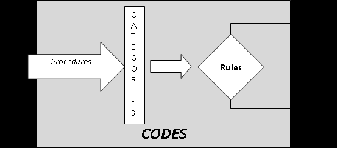

::: {.archive-notice}
**Source:** Pages 76--100 of *MintonThesis.pdf* (September 2009). Text extracted from PDF; figures extracted directly as images.
:::

5 Bureaucracies and Organisations: Some Theories of Large
Scale Social Phenomena
5.1 Introduction
The previous chapter ended by noting Stanley Milgram‟s pessimistic assessment of his
experimental results: an instinctive propensity to automatic obedience may have been
adaptive in small groups, when from time to time co-ordinated action required that one
person take charge and the others obey, but within modern societies it has made
possible atrocities on a scale that had never previously been realisable. Milgram feared
that the combination of a prehistoric instinct for obedience, with deep, centralised,
durable multi-hierarchical structures, capable of mobilising millions of people to
collective action, made species-suicide-by-mass-obedience a genuine possibility.
Bureaucracies do not, however, just allow greater control and mobilisation of people for
the purposes of warfare. Instead, almost any collective action can be bureaucratised,
making it possible to co-ordinate the actions of huge numbers of people towards a
single purpose, or mesh of inter-related purposes. Bureaucratisation of the task of
producing tools and other goods meant far fewer people could make far more items;
bureaucratisation of the task of distribution meant the products of the collectivised few
were able to benefit the „civilised‟ many; bureaucratisation of the task of learning meant
that skills, techniques and methods that were previously only known to minority of
individuals, developed as a series of blind-variations-and-selective-retentions, and
passed on as part of a package of cultural traditions within small kinship groups,
became accessible to large numbers of unrelated and geographically diffuse individuals
throughout the polity; bureaucratisation of the task of avoiding malnutrition, starvation
and other forms of physical hardship, meant that a bad harvest for one group of
households no longer threatened the group‟s survival, as it could be offset with the
redistributed surplus of others groups far away.
In other words, bureaucratisation may be thought of as an „amplifier‟ of the effects of
collective action: benevolent collective intention yields a more benevolent collective
result, and (as Milgram noted) malevolent collective intention yields a more malevolent
collective result.
However, bureaucratisation may also be thought of as a „modifier‟ on collective action,
changing the manner in which such actions are performed, as well as the type of
interpersonal relationships encountered and experienced by those collectively engaged

in the performance. As detailed in chapter 3, an increase in the size of a social structure
often leads to a change in the shape of a social structure: large-scale collective actions
do not look and feel like small-scale collective actions.
With the above in mind, the purposes of this chapter are as follows:
1. To describe the historical processes and conditions that led to large-scale
bureaucratisation and how prior conditions differed from those postbureaucratisation.
2. Using Max Weber‟s accounts, to describe and discuss the distinguishing features
of bureaucratic social structures.
3. To discuss in more detail the implications of being a member and aspect of a
bureaucratic structure to the experiences to those individuals out of which a
bureaucracy is composed; more specifically, to consider the implications that a
partial transition from person-based to role-based thinking („functionarialism‟),
which occurred as a result of bureaucratisation, had to the nature of collective
action and to the experience of being engaged in a performance of collective
action.
4. To understand how processes of bureaucratisation led to changes in the types of
skills, knowledge, and behavioural repertoires expected from citizens of a
political social structure.
5. To introduce and explore the similarities between bureaucratic organisations and
biological organisms, in order to consider the extent to which bureaucracies may
be considered to an ontology distinct from their constituent parts, and may even
thought to be (in certain senses) „alive‟.
The discussions and expositions within this chapter will be pivoted around accounts and
descriptions of bureaucracies produced by Max Weber in the late Nineteenth and early
Twentieth century. Weber will thus be used -- as were Damasio, Diamond, and Milgram
in chapters 2, 3, and 4 respectively -- as this chapter‟s „lynchpin‟.

5.2 Weber's Anatomy of Bureaucracy
The American sociologist Charles Lemert‟s social theory „reader‟80 contains a selection
of writings from Max Weber under the heading „The Bureaucratic Machine‟. Within a
sub-heading, „Characteristics of Bureaucracy‟, is an extended passage by Weber in
which he attempts to enumerate and describe the fundamental qualities of bureaucracies.

Lemert, C., Ed. (2004). Social Theory: the multicultural and classic readings. Oxford, Westview Press.

This passage81 will be referred to throughout this chapter, but due to word limit
considerations will not be reproduced within this thesis.
The passage is subdivided into clearly identifiable parts -- I, II, III, IV, and so on --
meaning that relevant parts can be referred to fairly precisely, without needing to
extensively recite them, in the discussions that follow. These discussions will be divided
into the following sections, each addressing a different theme or aspect of bureaucratic
development and structure:
Durable Multi-level Hierarchies
Modernity: the transition from traditional to legal rule
Functionaries and Roles
Writing, Law and Literacy
Bureaucratic Organisations as „Organisms‟
As with the previous chapter, a primary function of this chapter will be to make certain
aspects of familiar and every-day experience seem somewhat more strange and unusual;
considering the arguments made in chapter 3, it is certainly „historically‟ (and
archaeologically) the case that bureaucracies are a very new and strange phenomenon,
even if they have now existed in a very developed state for over a century.

5.3 Durable Multi-level Hierarchies
As suggested by Milgram, one can easily imagine how, within a small group with a
common goal, collective action can be organised and executed more effectively if
someone assumes a centralising, co-ordinating role, issuing commands to other
individual group members, based upon a reflexive and continual assessment of the
situation, in order to allow the group members to operate efficiently and synchronously
towards a common purpose; furthermore, one can imagine the effectiveness of
collective action increasing further if, when one individual has adopted the mantle of
leadership, other members are ready to follow orders relatively „automatically‟, rather
than constantly query, argue with, and critically appraise each of the leader‟s edicts. To
the extent that the efficiency of collective action has been a consistent and significant
factor in the survival of the social group (and thus by logical implication the individuals
within the group), then one can imagine the extent to which an „instinct‟ towards
obedience -- defined as a proclivity for members of a social group to demarcate

Weber, M. (1946). The Bureaucratic Machine. Social Theory: The multicultural and classic readings. C.
Lemert. Oxford, Westview Press: 104-110., pp. 104-106

themselves into commonly-accepted authority-subordinate

dyads, and for the

subordinate within the dyad to obey the orders of the authority figure with the dyad --
would be evolutionarily adaptive over a large number of generations.
To recapitulate, and develop slightly, some of the arguments made in chapter 3, one can
assume that, following the adoption of agriculture, and the resultant changes in societal
structure, dominance relations changed in two very important ways: firstly, increased
specialisation and surplus wealth meant multi-tiered hierarchies began to appear;
secondly, dominance hierarchies changed from being transitory disruptions of normally
(relatively) egalitarian social arrangements, to durable conditions. Both of these
changes may be thought of as preconditions for the emergence of bureaucracy; they are
also conditions observed within bureaucracies, but are not, in-and-of-themselves,
sufficient to distinguish bureaucracies from all other forms of social arrangement.
The first change, from single to multiple-tiered hierarchies, can be best understood by
first considering why multiple hierarchical tiers would have been extremely rare, if not
completely unprecedented, in subsistence economies:
to the extent that leaders are materially parasitic upon the goods produced by
others, then economies where per capita productivity only slightly exceeds each
individual‟s subsistence requirements lack the surplus capacity to support
multiple tiers of hierarchy;
furthermore:
to the extent that the likelihood of someone acquiescing to someone else‟s rule
depends on whether doing so benefits (or at least does not harm) the individual
acquiescing, and to the extent that being ruled by someone means having to
materially support the ruler, then acquiescing is likely to be more harmful, and
less likely to be agreed, where people do not produce enough surplus goods to
support someone else.
These two points also begin to explain why hierarchies in subsistence economies were
unlikely to have been as durable as they were later to later become: the role of „leader‟
could only be supported and accepted when and if there are sufficient surplus
resources, by other members of the community, to subsidise the individual occupying
the „leader‟ role. This follows from the simple observation that someone who is
supervising, co-ordinating, and managing the productive actions of others (such as

sowing, building, making clothes, and so on) is not acting in a way that is directly
productive himself. An „opportunity cost‟ thus exists when someone adopts a leadership
role -- the productivity lost by that individual not working himself -- and this additional
cost of „not working‟ should be (or appear to be) outweighed by the additional benefit --
in terms of increased collective efficiency -- created by having someone „in charge‟ of
the proceedings. Additionally, it seems reasonable to assume that, for many routinised,
essential, every-day activities (such as cooking), the additional „efficiency benefit‟ of
having someone occupying a leadership role would be minimal (or even negative), as
the repertoire of skills, behaviours and know-how required to perform such activities
effectively are likely to have become embodied and habituated within the individuals
performing them.
It thus seems to follow that durable hierarchies are, on an archaeological timescale at
least, a relatively recent development. Until the development of complex societies,
leadership would have tended to be a temporary state: a form of relationship that some
group members adopt some of the time when the group has to perform some forms of
collective action (e.g. those which are more unfamiliar and less capable of being
routinised). For most of their activities, most of the time, those group members who had
temporarily adopted a position of leadership during these unusual circumstances would
behave (and look) just like everybody else in the group, engaging in the same kinds of
subsistence activities, and experiencing the same material conditions, as everyone else.
Whether or not a particular group member did or did not, during these unusual
circumstances, become a group leader was unlikely to have been entirely arbitrary, and
instead would generally have been influenced by the individual‟s standing and
reputation within the group, which would in turn have been influenced by both personal
and relational qualities relating to the individual and his (or her) relationships with other
group members.
Jared Diamond states that, in most of the small tribal groups and bands he has met, the
individual within the group most widely considered to be a potential leader is known as
the „big-man‟, as such individuals tended to be both male and in many cases, as one of
their leadership „qualifications‟, slightly bigger than most of their peers. 82 Interestingly,
one of the three ideal types of authority Weber identifies, along with „legal authority‟

Although they deserve further consideration, research, and analysis, the issues of gender divisions
within ancient societies, and the extent to which leadership activities tended to be restricted to males
within such societies, will not be explored in further detail within this chapter.

and „ traditional authority‟, is „charismatic authority‟, which he describes as "resting on
devotion to the specific and exceptional sanctity, heroism or exemplary character of an
individual person, and of the normative patterns of order revealed or ordained by
him".83
5.3.1 Types of Authority
Charismatic authority, however, is a Weberian „ideal type‟ or „pure form‟, rather than a
simple synonym of „guy who takes charge‟: something only approximated, rather than
ever fully realised, within any of the „big-men‟ who have ever really existed. A leader
who is just a poor approximation of the ideal „charismatic authority‟ figure, might be
able to get other group members to follow some of his commands some of the time, but
will not be able to engender the kind of blind subservience and loyal devotion that a
charismatic authority figure closer to the ideal type will be able to. Whereas, as we saw
to some extent in Milgram‟s experiments (where changing the authority figure did little
to change the level of obedience), a condition of obedience can be created relatively
easily, the duration of such obedience is relatively limited (if the authority figure, after
commanding the subject to shock the victim into a state of unconsciousness, then asked
the subject to turn up again tomorrow, and the next day, and the day after that, to do the
same, how many subjects would likely obey?); by „charismatic authority‟, Weber seems
to be suggesting a capacity to create a more durable obedience relationship.
Weber defines the other two types of legitimate authority as follows:
Legal Authority: "resting on a belief in the „legality‟ of patterns of normative
rules and the right of those elevated to authority under such rules to issue
commands"84
Traditional Authority: "resting on an established belief in the sanctity of
immemorial traditions and the legitimacy of the status of those exercising
authority under them"85
Weber writes first of „legal authority‟, then „traditional authority‟, then „charismatic
authority‟. Given our knowledge of how complex societies emerged and developed, the
historical order in which these three types of authority emerged is likely to have been
the reverse of this: first was „charismatic authority‟, then „traditional authority‟, and
then finally „legal authority‟. This final form of authority, legal authority, is the form

Weber, M. (1947). The Theory of Social and Economic Organization. New York, The Free Press., p. 328
Ibid., p. 328
Ibid., p. 328

made possible by bureaucratic structure; traditional authority -- the durable maintenance
and reproduction of pre-established dominance relationships across multiple tiers --
emerged once durable multi-level hierarchies became established.86
Weber suggests that both „traditional authority‟ and „legal authority‟ emerge as
solutions to the problem of „routinizing charisma‟: a paradoxical notion, given that
Weber suggests one of the essential qualities of charismatic authority is the concept of
change, the antithesis of routine. Crudely (but hopefully illustratively), dominance
relationships maintained through charismatic authority may be thought of as social
movements; the dominance relationships then „mutate‟ in ways that „routinize‟ this
charismatic authority, converting it first into traditional authority and then later into
legal authority; in doing so the social movement (emblematic of change) becomes a
social institution (emblematic of continuity).

5.4 Modernity: the transition from traditional to legal rule
So, some charismatic individual has, through force of character and conspiracy of
circumstance, formed a social movement: a set of disciplines and acolytes obey his (or
her) every command, believing in him (or her) as a force of positive revolutionary
change, never wavering from their commitment to him (or her). But then, whether due
to war, illness, or old age, the charismatic individual who formed the movement dies.
Either the movement dies with the individual who founded it, in which case it becomes
at most a historical footnote, and the disciplines and acolytes who had devoted
themselves to him (or her) and his (or her) mission disperse on their separate paths; or
means are found of keeping the movement, the dominance structure, alive even when
the movement‟s founder is not. At this stage, the movement starts to mutate into an
institution.
Weber states that: "The most primitive types of traditional authority are the cases where
a personal administrative staff of the chief is absent. These are „gerontology‟ [rule by
elders] and „patriarchalism‟ [rule by male head of household]."87 In both cases, one can

This causal sequence seems to be well understood by Weber. The reason he began his discussion with
legal authority appears to do with familiarity rather than chronology. For example, he writes in a
footnote to the section "Legal authority with a bureaucratic administrative staff" that "The specifically
modern type of administration has intentionally been taken as a point of departure in order to make it
possible later to contrast the others with it." (Ibid. ,p. 329). After introducing and discussing first legal,
then traditional, then charismatic authority, Weber describes how charismatic authority can lead to
traditional and legal authority in a section titled "The Routinization of Charisma" (pp. 363-386 of Weber,
M. (1947). The Theory of Social and Economic Organization. New York, The Free Press.)
Weber, M. (1947). The Theory of Social and Economic Organization. New York, The Free Press., p. 346

imagine how the sense of charismatic authority a leader has over a group becomes
transferred to either another person who has accrued as much experience as he or she
did (the former case) or to other members of the same household, the same bloodline, as
the charismatic authority figure. It is within „patriarchalism‟, rather than „gerontology‟,
that economic differentiation starts to appear: the patriarchal, „ruling‟ household may be
slightly wealthier than other households, although initially the differences between this
and other households may be very slight.
In those cases where the comparative wealth and power of the patriarchal household
increase to such an extent that the patriarch does not have time to make all of the
decisions necessary to remain in charge, some tasks may start to be delegated. With this,
the most basic forms of administrative staff begin to emerge. Weber delineates between
two sources of recruitment of administrative staff within traditional systems of rule:
„patrimonial‟ recruitment (essentially friends and family), and „extra-patrimonial‟
recruitment (essentially everyone else).88 Given the apparent small-scale „patriarchal‟
origins of these proto-political structures, one can assume the stock of administrative
recruits first being drawn from „patrimonial‟ sources, then „extra-patrimonial‟ sources
once both the size and complexity of the polity reach scales otherwise unsustainable.
A moderately complex, geographically diffuse, form of durable multi-level hierarchy
which draws relatively extensively from extra-patrimonial stock is feudalism,
characteristic of European mediaeval rule, in which each of the lord‟s „vassals‟ is
granted exclusive control of a different territory, in return for pledging an oath of
„fealty‟ to the lord: "The contract of fealty is not an ordinary business contract, but
establishes a relation of personal solidarity which, though naturally unequal, involves
reciprocal obligations of loyalty." 89
Pre-modern durable, multi-level hierarchies are thus the stuff of monarchies and
dynasties: of emperors, chiefs, kings and queens presiding over thousands (or even
millions) of loyal subjects, basking in the glory of extensive and expensive rituals and
ceremonies

„designed‟

(through

blind-variation-and-selective-retention

cultural

processes) to ostentatiously convey the supreme wealth and authority that the individual
at the top of the hierarchy has over all lower tiers. Never before or since has the
appearance of power and control been so gratuitously displayed, so strongly „signalled‟,

Ibid., p. 342
Ibid., p. 374, emphasis added

as when these pre-modern hierarchies were the most prevalent forms of societal
structure.
However, the appearance of power and control is not always the same as the reality of
power and control. The structural and positional advantage held by those individuals at
the top of the hierarchy was less absolute, less durable, more contingent and
circumstantial, than the various power-displays -- ceremonies, castles, special clothes
and so on -- were meant to indicate. As the historical sociologist Charles Tilly writes, in
a book discussing the origins of the European nation state, at the start of the sixteenth
century:
An ambitious king could form coalitions with the landlords, could attempt to
destroy, subvert, or bypass them or (more likely) could try a combination of all
of these tactics. He could not ignore them, especially when the chief among
them formed a self-conscious hereditary caste, a nobility.90
Contrary to initial appearances, therefore, the power that the individual at the top of the
hierarchy had over many commoners at the bottom of the hierarchy was usually strictly
limited and conditional upon him (or her) being accepted as „legitimate‟ by
intermediate-level elites. A king or queen could not simply do exactly as he or she
wished, but had to continually take into account the beliefs, motivations and
relationships of (and between) intermediaries. Intermediate-level elites possessed
varying levels of discretion in how (and whether) to implement a particular command,
received from an authority figure, and consequently what to command subordinates
(who may themselves still be elites, in command of geographically or ethnically more
localised groups) to do.
Although there may have been various reasons for those elites at the next-to-top level in
the hierarchy to cede some of their power and authority over to a central figure (perhaps
most notably to manage a stable coalition of other elites at the same level in the
hierarchy, and so to help protect them from each other), if next-to-top level elites felt
that they had allowed to be at the top of the pyramid was misusing or abusing his
position, then he would likely be replaced by someone else within their ranks. As
Weber states, as a „pure type‟, within feudalism: "The authority of the chief is reduced

Tilly, C. (1975). Reflections on the History of European State-making. The Formation of National States
in Western Europe. C. Tilly. Princeton, Princeton University Press: 3-83., p. 21

to the likelihood that the vassals will voluntarily remain faithful to their oaths of
fealty."91
In short, for most of the duration over which complex, durable, multi-level societal
hierarchies have existed, the individual at the centre of the hierarchy only tended to
have very indirect rule over the masses at the bottom of the hierarchy. With the
development of bureaucracy, there was a significant transition from indirect rule to
direct rule, to the degree of directed power and intentional influence that those
individuals at the very top of a hierarchy had to the life experiences of those at the
bottom. As with the transition from small-scale to large-scale societies, however, this
increase in the „quantity‟ of power possessed by those at the centre of the power
structure also led to particular changes to the „quality‟ of the power commanded and the
means through which it was realised.
Consider the points Weber makes in the final part (part VI) of his bureaucratic typology,
in which he contrasts the „deep embeddedness‟ of rules within modern bureaucracies
with the regulation through „privilege‟ and „bestowal of favour‟ which were the norm
within „patrimonialism‟. Consider also the paragraph at the end of part I, sub-part 3:
"Permanent and public office authority, with fixed jurisdiction, is not the historical rule
but rather the exception. […] [More usually], the ruler executes the most important
measures through personal trustees, table-companions, or court-servants. Their
commissions and authority are not precisely delimited and are temporarily called into
being for each case"; and also last sentence of part II: "Once established and having
fulfilled its task, an office tends to continue in existence and be held by another
incumbent." These statements illustrate how the „quality‟ of power changed when the
„quantity‟ of power increased. To use the term in Weber‟s sense, the increased power of
direct rule made the administration of power more rational.
The next two sections will consider two of the most important ways in which the
„quality‟ of bureaucratic rule differed from traditional rule: firstly, with respect to the
creation of functionaries and roles; and secondly, with respect to writing and literacy.

5.5 Functionaries and Roles
Within Weber‟s description of bureaucracies, Part I mentions "the principle of fixed and
official jurisdictional areas"; part III mentions that "Public monies and equipment are
divorced from the private property of the official"; and part V that "official activity

Weber, M. (1947). The Theory of Social and Economic Organization. New York, The Free Press., p. 375

demands the full working capacity of the official". Linking these statements is a subtle
though important point, distinguishing pure rational-legal (bureaucratic) from pure
traditional and pure charismatic rule: the official roles that individuals within
bureaucracies occupy are ontologically distinct from the individuals themselves. I.e a
role continues to exist within the bureaucratic structure, even when the individual
performing the role is replaced by someone else. As a result of this, the durability of the
hierarchical structure increases.
The transition from the pure type of traditional rule, to the pure type of bureaucratic
rule, is from one where an individual performs some roles, to one where a role is
performed by an individual. In terms of social hierarchical structure, the pure types
differ according to the ontology of the „nodes‟ connected through A-S dyads: in
traditional rule, the nodes are „individuals‟; in bureaucratic rule, they are „roles‟. I will
refer to an individual who occupies a role within a bureaucratic structure as a
„functionary‟.
Weber identifies the origins of the pure bureaucratic category of „role‟ within some of
the practices and qualities of traditional rule, as one can see from the following quote:
Obedience [in traditional authority] is not owed to enacted rules, but to the
person who occupies a position of authority by tradition or who has been chosen
for such a position on a traditional basis. His commands are legitimized in one
of two ways: (a) partly in terms of traditions which themselves directly
determine the content of the command and the objects and extent of authority. In
so far as this is true, to overstep the traditional imitations would endanger his
traditional status by undermining acceptance of this legitimacy. (b) In part, it is a
matter of the chief‟s free personal decision, in that tradition leaves a certain
sphere open for this. This sphere of traditional prerogative rests primarily on the
fact that the obligations of obedience on the basis of personal loyalty are
essentially unlimited. There is thus a double sphere: on the one hand, of action
which is bound to specific tradition; on the other hand, of that which is free of
any specific rules.92
One of the origins of the role is thus in this sphere of action bound by tradition, rather
than those actions fully at the discretion of the authority figure. Another origin of the
role found in traditional systems of rule is an increased functional specialisation of the

Ibid., pp. 341-2

duties performed by subordinates, which emerges with increased societal size and
complexity. The transition, within systems of traditional rule, from feudal generalists to
bureaucratic specialists is suggested in the following passage:
[Originally, in systems of traditional rule] In place of a well-defined impersonal
sphere of competence, there is a shifting series of tasks and powers
commissioned and granted by a chief through his arbitrary decision of the
moment. They then tend to become permanent and are often traditionally
stereotyped. An important influence is exerted by competition for sources of
income and advantage which are at the disposal of the persons acting on behalf
of the chief or of the chief himself. It is often in the first instance through these
interests that functional spheres are first marked off and, with them, genuine
administrative organs. 93
To the extent that increased functional specialisation, increased stereotyping of
administrative actions, leads to increased efficiency of collectivised action, and to the
extent that increased efficiency of collective action is „selected for‟ by societal and
material factors, then, as before, the dual mechanisms of blind-variation-and-selectiveretention lead to the emergence of administrative functionaries („role players‟) from the
increasingly specialised practices of patrimonial „vassals‟.
Whereas an individual can exist without occupying a role, a role can only be brought
into being, can only „exist‟, by being performed by an individual. This asymmetry of
dependence does not mean, however, that the individual is necessarily more „powerful‟
than the role. Instead, within a system of bureaucratic rule, the authoritative powers of
the individual exist only within her capacity as functionary, as role-player.
Partly because of this, the relationship between the type of rule, and the level of power
of the ruler, is complex. One cannot simply say that, within a rational-legal system, the
level of power commanded by the ruler is greater or less than the level of power
commanded by a ruler commanding a system of traditional rule. At the same time,
however, the level of power that a legal-rational system has over the average citizen is
likely to be greater than that held by its irrational antecedent system. Broadly, the
transition from traditional to legal-rational rule transfers and alters power relations in
the following ways:

Ibid., pp. 343-4

1. Power is transferred from the individual to the role: In a pure (i.e. ideal and
imaginary) legal-rational system of rule, the ontological status of the
functionary („individual-as-role-player‟) needs to be strictly demarcated, with
respect to the degree of power she holds, into two separate domains: that of the
role, and that of the individual. As role-player, she is granted full command of a
(clearly defined) number of subordinate nodes; as individual, however, her
power within the power-structure is non-existent. The functionary‟s power is,
therefore, contingent upon the extent and fidelity with which she performs her
agreed role. The individual only gets to exert power through the power
structure, to command subordinate nodes to perform actions based on decisions
she herself has made, to the extent that aspects of the role‟s expected
performance are left unspecified, and she is expected to „improvise‟ aspects of
her role‟s behaviour. This represents a continuation and extension of the
„double sphere‟ of actions mentioned by Weber above, but with greater
consistency and formalisation within the non-discretionary sphere. As a
limiting case, every aspect of the role‟s expected performance may be specified
in advance, in which case the power of the individual within the power
structure drops to nothing.
2. Power is transferred from the periphery to the centre: the size of
intermediate-level nodes‟ „discretionary sphere‟ of activity shrinks, as the nondiscretionary sphere of activity, those activities dictated by the definition of the
role, expands. This may be seen as a transfer from periphery to centre to the
extent that the role definitions are decided upon centrally. This point will be
discussed in more detail later.
3. Power is transferred from the central node (the ruler) to the power system
itself: In a rational-legal power system, the legitimacy of the ruler‟s power
depends, to a large extent, on the ruler being seen both to operate within, and
act as defender and promoter of, the existing system of laws enforced by the
power system. Laws define those actions acceptable and not acceptable by
various classes and categories of person, and in more developed rational-legal
systems some of these categories of person (whose actions are proscribed)
become very general ("All members of Nation X", "All human beings"), and so
may include the person-occupying-role-of-ruler himself (in his capacity as
member-of-legally-defined-category-of-person). This often operates to severely

reduce the size of the sphere of „discretionary actions‟ the ruler may perform,
so making the individual-as-ruler in some senses less powerful.
4. The overall level of power held by the power system increases: The above
process of increased legal-categorical proscription leads the power-system itself
to make increasing claims over the allowable and disallowable actions of ever
larger number of citizens: to the extent that the power structure has the capacity
to enforce such claims, the overall „amount‟ of power held by the power system
increases. As legal-rational power systems are more „efficient‟ than traditional
power systems, they are also better able to enforce and „legitimate‟ such claims
to power.
The above transitions substantially change the manner in which the individual (or
individuals) at the centre of the power structure must operate in order to affect changes
in the lived experiences of (i.e. „have power over‟) citizens. The range of commands the
central node can transmit to immediate subordinates is reduced. Likewise, the range of
legitimate responses available to the functionary receiving the orders is reduced (as her
powers are only legitimate to the extent that she fulfils per proscribed role). Therefore,
both at the „transmission‟ and „reception‟ ends of the A-S dyad, the archetypical channel
through which social power is exercised, the level of power appears to be reduced.
Instead, power comes to be exerted effectively through a different means: the central
node can re-write role definitions (or, more accurately, can order subordinates
occupying various technical-definitional roles to re-write the role definitions). By
defining the roles which exist at the furthest periphery of the power structure (i.e. those
encountered most frequently by the average state citizen), the central nodes are able to
control the manner in which the power structure responds to different types of person it
encounters much more comprehensively, and much more precisely, than was the case in
traditional systems of rule. Thus, although legal-rational rule curtails the power that the
central nodes have in a „direct‟ sense, through A-S dyad channels, they also introduce a
second channel of influence which, though „indirect‟ in its effects, potentially allows for
a much greater level of power to be exerted through the power structure.
Defining roles and observing role-players are, very crudely, the tasks of lawyers and
accountants/auditors respectively. Both of these specialist bureaucratic roles require
knowledge of a range of technical skills, which in pure type legal-rational systems are
always assessed through professional (i.e. standardised) qualifications. The pivotal
importance of roles, of ensuring that role definitions are consistent in their interpretation

and application, and that persons-occupying-roles are only able to make use of their
position within the power structure when operating as role-players, also increases the
general level of technical knowledge required of persons operating within the power
structure, to the extent that they need to be literate, and closely share a common
language. The reasons for, and implications of, this new general requirement will be the
subject of the next section.

5.6 Writing, Law and Literacy
In order for two people to communicate, they need to share a common language, and for
the communication to travel, relatively undistorted, from sender to receiver. These two
simple facts, combined with the large scale and geographical breadth of modern
political power structures, have a number of profound and substantial implications for
the common experiences and range of knowledge embodied by the average state citizen.
Broadly, I suggest three types of transition in forms of communication are related to the
transition from traditional to legal-rational rule:
1. Standardisation: From Local Idioms to National Standards. Although
previously communities from a wide geographical breadth may have nominally
been under ultimate authority of a single king, the extent to which this shared
central authority figure led to substantial and continual shared experiences in
other ways was limited. As previously described, geographically diffuse
polities of traditional rule tended to be feudal, split into a patchwork of local
fiefdoms. Local identities mattered much more than national identities, to the
extent that communication and interaction tended to be conducted almost
exclusively within the community in which people were born, lived, and died.
As a result, standards of communication only needed to be locally coherent and
comprehensible, and as so dialects, terminology, and even grammatical
conventions were likely to differ markedly between regions nominally ruled by
the same central authority.
2. Literacy: From Spoken to Written Communication. Until relatively recently,
transmitting verbal information through sound required the physical copresence of speaker and listener. There were thus severe physical constraints on
the number of subordinates an authority could issue verbal commands to if, as
in the case of fiefs, the subordinates were geographically distant from one
another. Writing ( the symbolic reproduction of such verbal information) and

literacy (the learned capacity to encode and decode such symbols) were thus a
prerequisite for more direct central rule in geographically diffuse polities, but
mass literacy was not. In legal-rational systems, the need for large-scale literacy
increased significantly, as role-definitions were stored and transmitted in
written documents, and even relatively peripheral persons within the power
structure were required to understand such documents in order both to know
their own role, and to enforce the role fidelity of subordinates.
3. Formalisation: From Tacit to Explicit Referents. As most communication
within pre-modern eras was conducted at a very local scale, it tended to involve
face-to-face interactions, and was thus able to utilise both non-verbal and verbal
channels. A single verbal utterance could, at different times and in different
contexts, be used to refer to a range of actions and objects, but would be
understood due to it being combined with a range of non-verbal information
(such as pointing and gesturing within a shared environment) which reduced
the range of possible interpretations. Communication over greater distances
meant the non-verbal channel could no longer be relied upon to disambiguate
and verify the meaning of verbal utterances, and so verbal language itself had to
become more exact in its referents.
Consider first a small community: members have common, tacit knowledge of the
context in which they interact, perform, and speak. Within a given context, sentences
such as "it‟s over there" or "no, the other one" convey all the information both speaker
and listener need in order to perform effectively within that context. However, such
statements rely heavily on knowledge which is embedded in the environment the
community members share94. Such statements thus lose their meaning, their
instrumental efficacy, as and when they become detached from the context in which
they are spoken. When the task of linguistic communication becomes to transfer usable
information across a wide variety of disparate communities, therefore, language must be
developed which is more context-independent, less embedded in the implicit knowledge
of specific circumstance. Stated another way, there needs to be a shift from pronouns to
proper nouns.

For example, one would need to know which verbal utterances mean something like "it's over there"
and which mean "no, the other one". Even rudimentary sentences like this require a common language
to be understood by outsiders from a given community.

Abram de Swaan, in a chapter in his book In Care of the State called „The Elementary
Curriculum as a National Communication Code‟,95 highlights the connection between
the interests of public and private sector bureaucracies and the development of
standardised education within Europe:
An increasing number of citizens came to depend for their livelihood either on
state bureaucracy or on trade in national and international markets. These
people, officials and entrepreneurs, did not live off their landed property and
were therefore much less connected with a particular local or regional
community. On the contrary, they stood to gain from the greatest freedom of
movement and the most unencumbered exchange of messages between regions.
[...] They stood to profit from the emergence of a national network of
communication and therefore supported the teaching of the standard language
throughout the land. They themselves spoke this lingua franca when at work,
and often also at home. Their business, keeping books and files, drafting
contracts and statutes, was transacted in writing, and they wrote in the standard
version of the language.96
Following this line of argument, it was thus (in part) due to the demands of private and
public bureaucracies -- in need of more people who could function effectively within a
bureaucratic regime -- that systems of standardised, formalised education emerged
through a national communication code:
Elementary education was first of all a means to convey fluency in the standard
language and literacy in its written version, thus providing access to a
corresponding communications network. Literacy in the standard language
provided unmediated access to a national network of written communication.97
One should note that, even within modern societies, linguistic standardisation and
formalisation is still a matter of degree. Sometimes, the drives for standardisation and
formalisation move in slightly different directions. Specialist linguistic communities
emerge that, by virtue of their profession, employ a more formalised and extended
system of proper naming than the general public. For example, a large part of standard
medical training involves learning specific and unique names for thousands of distinct

de Swaan, A. (1988). In Care of the State: Health Care, Education and Welfare in Europe and the USA
in the Modern Era. Cambridge, Polity Press., pp. 52-117
Ibid., pp. 58-9
Ibid., p. 63

part of the body, and distinct patterns of ailments affecting such body parts. Instead of
simply stating that someone has "a pain in their tummy", a medical practitioner could
determine relatively exactly the position and form of the pain, and then communicate
precisely this information to other medical practitioners also versed in the same
specialised speech code. However, it should be clear that these specialist linguistic
communities are, unlike communicators in an age before standardisation, not
geographically bound in terms of those with whom they can communicate, and are not
entirely unintelligible to those who have not had such further specialised education.
5.6.1 Written Documents as Symbolic Authority Figures
Weber describes the transition from early to modern forms of power structures as
involving the „routinisation of charisma‟. I broadly interpret „charisma‟ in this sense to
refer to „the shared understanding and acceptance, amongst persons associated through
A-S dyads, of the validity (and hence "legitimacy") of the existing dyadic
configurations‟. „Routinisation‟, in this sense, may thus be understood to refer to „the
application of a very broad set of processes, methods, tools, and techniques for ensuring
that this shared understanding and acceptance of existing A-S dyadic configurations is
maintained.‟ Tools for „routinising charisma‟ thus include the „display signals‟ (or
„props‟) mentioned in the previous chapter (such as crowns, sceptres, lab-coats, suitsand-ties, castles and large office buildings), but also a much broader range of cultural
factors (such as the propagation of „kleptocratic ideologies‟, to use Diamond‟s terms,
which attempt to legitimate existing power structures) and technological factors (such as
communication technologies which increase the apparent „omniscience‟, knowledge and
„wisdom‟ of those currently in power).
Part III of Weber‟s description mentions the importance of „written documents‟ in the
management of bureaucratic offices. In modern societies, many written documents have
become „charismatic‟, in the sense that commands contained within them are often
„obeyed‟ as if they were commands given by persons in a position of authority. Charles
Tilly provides a vivid illustration of this phenomenon:
When we wanted to copy some crucial and voluminous nineteenth century
household records from Milan, Louise Tilly and I had an instructive encounter
with codes proposed by Ragionier [Accountant] Ciampan, director of Milan‟s
municipal archives. First the Ragioner dismissed us by insisting that only the
city‟s mayor could authorize outsiders to use the records. When we pulled
strings and actually returned with a letter from the mayor, I asked the Ragionier

when I could start setting up my camera. The small man strode to a huge book of
municipal regulations on their stand by the window, opened to a passage
declaring that "no one external to the archives may photograph their contents,"
placed his hand on the great book, raised his other hand in the air, and declared,
"I am bound by the law." We painfully copied the records by hand.98
As mentioned in the above, Tilly uses a special term to refer to such „charismatic‟
written documents: codes. Tilly suggests codes comprise of three basic components:
categories, procedures, and rules. In order to verify my understanding of Tilly‟s use of
these terms, I contacted Tilly on 17 July 200799 to state my interpretation of his use of
these three terms, and ask for clarification and correction. I stated that my interpretation
was as follows:
There exists tacit, fuzzy, informal evidence external to the code system.
This evidence is processed by functionaries working within the code
system („procedures for ordering evidence‟) into a set of explicit, formal
ontologies („specialized sets of categories‟)
These categories form the „input‟ material for a sequence of if-then
algorithms („rules of interpretation‟) which define (often exhaustively)
the actions of code functionaries to given evidence.
This entire system is what constitutes „a code‟
Furthermore, […] 1) code functionaries are often split into the distinct functions
of evidence collection, classification, and rule-following; and 2) […] there are,
to an extent and in the Kuhnian sense, both „normal‟ and „abnormal‟ code
phases

involving,

respectively,

code-compliance

and

code-construction

(including the construction of rules)?
In addition to the above, I also sent Tilly the graphic shown in 

{#fig-5-1}

Figure 5.1, and received
the following response:
Yes, you've grasped the sense of it. My only modifications are that a) codes in
this sense vary in their relative emphasis on categories, procedures, and rules
and b) most codes invite innovation, as when barristers press analogies no one
else has previously recognized.

Tilly, C. (2006). Why? what happens when people give reasons ... and why. Oxford, Princeton
University Press., pp. 17-8
Professor Tilly died on 29 April 2008, aged 78, of lymphoma

Figure 5.1 Graphical representation of Charles Tilly's 'codes'

This (verified) interpretation of Tilly‟s related concepts of „codes‟, „procedures‟,
„categories‟, and „rules‟ can hopefully go far in explaining both how certain written
documents come to exert such power within bureaucratic structures, and also why legalrational bureaucracies demand much greater levels of technical knowledge on some of
its members than did previous forms of power structure: the management of codes
(including the creation, enforcement, maintenance, and development thereof) requires a
wide range (and often large number) of specialists working in a variety of distinct but
interrelated roles. Without codes there would be no roles, and without roles legalrational rule would collapse back into traditional rule.
What I have referred to as „role defining‟ may involve any combination of these three
code components. A written document may operate to define a role by defining (or
redefining) the procedures used to gather and organise evidence into a form where it
may categorically defined (For example, by defining the sampling approach to be
adopted, the location from which evidence should be drawn, or the recording devices to
be used to store the raw evidence). Or it could define a new typology for categorising
evidence (For example, a new disease categorisation scheme). Or it could define a new
set of rules for responding to existing evidence, collected and categorised in existing
ways (For example, the definition of and ways of „collecting‟ evidence about burglaries
may stay the same, but the type of sentence given to persons categorised as „burglars‟
may change). Whenever a new authoritative document (legitimated by the bureaucracy)
is issued to relevant functionaries, the effect is to alter their roles. As Tilly emphasised
in his response, and as he states within Why?, codes (and thus bureaucratic role

definitions) should not be thought of as static, and thus the precise roles performed by
functionaries change constantly over time.
Codes have their own dynamics. Categories change, procedures for offering
relevant evidence change, interpretative rules change, and the three interact.
Most visibly, participants change the rules. We most easily detect a code when
we discover a connected set of rules for behaviour in some arena of human
activity -- the law, of course, but also some other arena of professional expertise,
a complex came, or a specific organization. Within any such arena, authorities
commonly change the rules as they encounter some new problem; accumulated
rules therefore provide a map of significant earlier problems people have faced
in their arena.100
As indicated by the last statement, the ways in which rules (and, one would assume,
procedures and categories) change are usually influenced and, to a certain extent
constrained, by historical factors. This „historicicity‟ may even be considered one of the
central ways in which legal systems legitimise their authority: In a traditional system,
the way in which a particular individual relates with the power structure may be
strongly determined by the whims and idiosyncrasies (and mood) of the local fief, and
so the same individual, in the same situation, may be treated in very different ways in
different regions at different times. By contrast, within a (pure) legal-rational system
(and to the extent that the same roles are defined the same way throughout the polity)
the same individual will be treated in exactly the same way by the polity, irrespective of
the particular functionary the individual encounters, and the region in which she lives.
This interpretation of codes, formalised written documents operating as „symbolic
authority figures‟, and their functions within bureaucratic rule, suggests that, in order to
understand how political power is exercised in the modern age, attention should be paid
both to the details, and to the historical conditions of formation, of the technical and
administrative documents defining procedures, categories, and rules. When
investigating processes of political-bureaucratic continuity and change, however, such
documents only tell part of the story. To use Tilly‟s terminology again, these documents
offer formulas, which Tilly suggests "identify an appropriate correspondence between Y
(the event, action or outcome at hand) and X (its antecedent), but enter little or not at all

Tilly, C. (2006). Why? what happens when people give reasons ... and why. Oxford, Princeton
University Press., p. 103, emphasis added

into the causal chain connecting Y to X."101 They do not offer cause-effect accounts,
which "trace causal lines from X to Y".102 Tilly divides both formulas and cause-effect
accounts into „popular‟ and „specialised‟ variants, as shown in Table 5.1.

Formulas
Cause-Effect Accounts

Popular
Conventions
Stories

Specialized
Codes
Technical Accounts

Table 5.1 Charles Tilly's 4 types of reasons
Source: Redrawn from page 19 of Tilly, C. (2006), Why? What happens when people give reasons... and why,
Princeton: Princeton University Press

Tilly refers to „popular‟ (as in, not requiring extensive specialised training to articulate
or understand) cause-effect accounts as stories. Cause-effect accounts, Tilly argues,
tend to be offered to people of similar social rank, whereas formulas are given to those
of lower rank. In order to understand why particular codes are implemented within a
bureaucratic structure, therefore, one also needs to know something about the types of
stories, causal „models of the world‟, popular amongst those in command of the
structure. Although formulas do not offer reasons why one should do Y in the event of
X, one can assume that, often, they are formulated and prescribed because their
application is assumed to cause a desired outcome; driving many codes, therefore, are
stories.

5.7 The Self-sustaining Qualities of Bureaucratic Structures
In a complex biological organism, discussed in chapter 2, there are broadly two types of
way in which its brain and central nervous system can influence the behaviour of many
of its peripheral aspects: either it can sent a very fast, directed, electrical signal to a
given peripheral component (like a finger), in which case the central system comes to
yield a specific response upon the peripheral system, very quickly, but for only a brief
duration (the finger commanded by an electrical signal to contract towards the palm will
not remain in that contracted state for hours, days or months after the command has
been issued); or, it can (initially via electrical signals) cause changes in the chemical
composition, the milieu, surrounding the peripheral system, leading to a slower, less
directed, but more durable influence. For many cells and systems of cells, repeated
exposure to particular patterns of electrical or chemical signal leads to long-term
changes to their autonomous mode of operation.
101

Ibid., p. 20
Ibid., p. 20. Tilly continues: "even if we observers find those causal lines absurd or
incomprehensible."
102

To what extent is it wise to pursue the analogy between biological organisms and
bureaucratic organisations? Furthermore, if one were to pursue the analogy, what sort
of organism might a bureaucracy best be compared to? An amoeba? An insect? A small
mammal?

What possible isomorphisms, identifiable commonalities, exist between

organisms and organisations?
Some suggestions are as follows:
Formal rules, which accrete and emerge over time in response to new general
classes of situation, or are emulated and adapted from other organisations,
produce complex, specific, stereotyped patterns of response to a given, identified
situation, and thus bear some qualitative similarity to the emotions and
dispositional tendencies of organisms.
Fast communication technology, such as email or telephone, allows the quick
relaying of signals to or from a site of central command; the central authority
can then make a quick, specific decisions with respect to a very local aspect of
the organisation -- for example telling the head of a particular department that
their request for funding for a particular project has been granted or rejected; or
the central authority may choose to make more general changes to the
organisation: asking the legal or quality-control department to draft new codes
of practice by which employees within the organisation as a whole should
thereafter conform (analogous inducing an emotion or creating a new
dispositional memory).
So long as one is aware of the extent to which the above represents analogy rather than
exact homology of function, I suggest that comparisons between organisms and
organisations are useful in indicating why, in bureaucracies, paperwork is such an
integral feature of their general coherence and function. At the very least, and in a very
general, cybernetics or systems theory sense, it should certainly not be controversial to
state that bureaucratic organisations, as well as biological organisations, appear to
exhibit the qualities of being:
1. Bounded: with a clear, categorical demarcation between within and without.
Boundaries are almost always clearly identified, such that individuals
working as functionaries within bureaucratic structures tend to be both able
and willing to identify the name of the organisation within which they are
working.

2. Self-regulating: in that perturbations occurring at the local level (to a
particular aspect of the system) are generally mitigated such that they do not
tend to lead to the collapse of the global coherence of the system. (For
example, if a departmental lawyer chooses to quit the company and move
elsewhere, there are procedures in place -- for example, a substantial period
of notice and procedures for internal and external recruitment - to ensure that
the role of departmental lawyer „survives‟ the loss of the individual.)
3. Self-repairing: In the sense that a global coherence of the organisation is
usually maintained even as and when local aspects of the structure are
replaced. The maintenance of global coherence in the face of absolute local
change is best illustrated through the example of the Ship of Theseus: a ship
that has existed so long, and been subject to so many repairs, that no part of
it is original structure remains; the same logic underlies a particular pattern
of joke: "This is my grandfather‟s axe: the handle has been changed three
times and the head four times but it‟s still the same axe". Unlike in these
examples, however, the prefix self- suggests that the repair occurs due to
internal rather than external volitions and actions.
Together, these three qualities help explain much of the self-sustaining „nature‟ of
bureaucratic structures. As Weber noted, the structures often even survive the loss of
their most senior nodes:
During the course of his long years in power, Bismarck brought his ministerial
colleagues into unconditional bureaucratic dependence by eliminating all
independent statesmen. Upon his retirement, he saw to his surprise that they
continued to manage their offices unconcerned and undismayed, as if he had not
been the master mind and creator of these creatures, but rather as if some single
figure had been exchanged for some other figure in the bureaucratic machine.103
This above quote also suggests something else important to note about bureaucratic
rule: As with the emergence of complex and unequal nation-states (Chapter 3), the
bureaucratic structure, by eliminating prior social structures, is autocatalytic, causing
increasing demand for and dependence upon itself. To consider the issue in ecological
terms, one might say that the bureaucratic structure, like a beaver building a dam or a
spider building a web, is able to adapt aspects of its environment to make it more suited
103

Weber, M. (1946). The Bureaucratic Machine. Social Theory: The multicultural and classic readings. C.
Lemert. Oxford, Westview Press: 104-110., p. 110

to its own requirements. In the case of bureaucracies, we are its environment, and we
have, in various ways, been adapted to become more consonant with bureaucratic
living.
