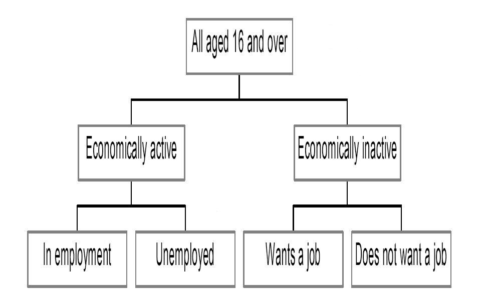

::: {.archive-notice}
**Source:** Pages 112--134 of *MintonThesis.pdf* (September 2009). Text extracted from PDF; figures extracted directly as images.
:::

7 The Emergence of the Work-As-Employment and State-AsProviders Norms
7.1 Introduction
This chapter, the first chapter of the „evidence‟ section of this thesis, will consider the
contemporary state, and historical origins, of „employment‟ and „unemployment‟ as
bureaucratic, statistical categories. In doing so, it will to an extent sketch the creation of
unemployment, and employment, as politically salient social entities, towards which
political actions are directed, and through the statistical lens of which the citizens of the
nation, and of the world, are observed and their actions interpreted by political actors.
The chapter comprises two main sections, each taking conceptually orthogonal slices
through the same underlying social phenomena. The first section will take a broadly
cross-sectional slice through the issues, by presenting, reviewing, and then commenting
upon a number of technical documents that describe contemporary national and
international standards for the economic categorisation of people and their activities.
The second section will take a broadly longitudinal slice through the same issues,
presenting a standard account of the historical origins of „unemployment‟ as a
politically salient and formally recorded social category, together with an unorthodox
reading and interpretation of this account.
The chapter will then conclude by offering a small number of conceptual devices or
tools that I hope will be useful in interpreting the evidence presented, and highlighting
their continuing relevance to the topics considered in later chapters.

7.2 A Cross-sectional Slice through Contemporary Economic
Categorisation
This section of the chapter will begin by reproducing, „as is‟, a number of passages,
figures, and quotations from a range of dry, technical documents defining national and
international standards of labour market categorisation. This material will form the
evidence, the data, the object-for-analysis at the heart of this section. This analysis, an
attempt to understand the sociological theories and assumptions underlying and
promoted by these statistical categories, will be provided in the second half of this
section.
The reasons for this sub-division, and for beginning with a substantial tranche of largely
unmediated quotation from the sorts of document that are not, usually, considered

interesting or exciting reading, have to an extent already been alluded to in chapter five
-- where I discussed the importance of „codes‟ and „written documents as authority
figures‟ within bureaucratic (including political) structures -- and in chapter six -- where
I suggested that a very broad range of interpersonal behaviours can be identified as
having an economic function, and that if economic theories do not recognise the
economic function (or even existence) of such behaviours, then they fail to properly
understand the economy. I suggest that these documents - generally overlooked as dull,
unimportant, mundane -- constitute evidence that the theories of Weber and Tilly (in the
case of chapter 5) and Fiske and Polanyi (in the case of chapter 6) can do much to
illuminate.
Furthermore, in presenting passages and descriptions of these documents in a largely
unmediated and uninterpreted form, I hope to indicate how strong theoretical
assumptions and political implications can become hidden and lost within technical
minutiae.116

If the first part of this section appears somewhat overwhelming in

bureaucratic detail and categorical description, to the extent that it becomes difficult to
see the wood for the trees (or the office for the paperwork), then that is partly the point.
7.2.1 Technical Documents as Evidence
To begin this subsection, here is a passage from an Office for National Statistics
publication introducing labour market categories, called „How exactly is unemployment
measured?‟
The definition of unemployment is internationally agreed and recommended by
the International Labour Organisation (ILO) - an agency of the United Nations.
The Statistical Office of the European Union (Eurostat) and the Organisation for
Economic Co-operation and Development (OECD) and other countries use this
definition.
Under the LFS guidelines,117 all people aged 16 and over can be classified into
one of three [discrete] states: in employment; unemployed; or economically
inactive.118

To an extent, this chapter's approach is inspired and informed by that adopted within Bowker &
Star's book Sorting Things Out, which explores the theoretical assumptions underlying and societal
consequences of systems of classification relating to race, disease, and medical practice. However, this
chapter began before I had read or known about their book. (See Bowker, G. C. and S. L. Star (1999).
Sorting Things Out: Classification and its Consequences. Cambridge, Massachusetts, The MIT Press.)
Labour Force Survey.

The document continues:
Unemployed people are:
without a job, want a job, have actively sought work in the last 4 weeks
and are available to start work in the next 2 weeks, or
out of work, have found a job and are waiting to start it in the next 2
weeks.
In general, anybody who carries out at least one hour‟s paid work in a week, or
who is temporarily away from a job (e.g. on holiday) is in employment. Those
who are out of work but do not meet the criteria of unemployment are
economically inactive.119

The concept of economic activity is present throughout these definitions, as is the
International Labour Organisation (ILO). The ILO attempts to standardise the
definitions used by different nation states in measuring forms of labour activity,
allowing cross-national comparison on a range of labour-based economic indicators.
Unemployment is not measured directly, but estimated, from a sample of the population
known as the Labour Force Survey.120 As the National Statistics publication states: "It is
a legal requirement for every country in the European Union to conduct a Labour Force
Survey."121 Enforcing standards in classification schemes is thus an integral aspect of
European international law.
Chart A of this document, reproduced as 

{#fig-7-1}

Figure 7.1 below, shows how the International
Labour Organisation standards classify individuals:

ONS. (2007, September). "How exactly is unemployment measured?" Retrieved 6 November, 2007,
from http://www.statistics.gov.uk/downloads/theme_labour/unemployment.pdf., p. 4, emphasis added
Ibid., p. 4, emphasis added
Ibid., p. 5
Ibid., p. 5

Figure 7.1 International Labour Organisation classifications
Source: Chart A of ONS (2007), "How exactly is employment measured?", accessed 1 September 2008, available at
http://www.statistics.gov.uk/downloads/theme_labour/unemployment.pdf

The ILO categories presented here involve three stages of disjoint nesting. Firstly, all
people are divided into two discrete subgroups: Those-aged-under-16, and Those-aged16-and-over; only the latter category of which is then considered of importance. Then,
this latter group is subdivided into Those-economically-active, and Thoseeconomically-inactive. Those-economically-active are then further subdivided into
Those-in-employment,

and

Those-who-are-unemployed.

Likewise,

Those-

economically-inactive are further divided into Those-who-want-a-job, and Those-whodo-not-want-a-job.
The majority of further classification the Office for National Statistics conducts
involves further subdividing one of these low-level subgroups, Those-in-employment.
The ONS uses what it calls the Standard Occupational Classification 2000 (SOC2000).
According to the ONS website, "The Standard Occupational classification was first
published in 1990 to replace both the Classification of Occupations 1980 (CO80) and
the Classification of Occupations and Dictionary of Occupational Titles (CODOT).
SOC 1990 has been revised and updated to produce SOC2000."122

www.ons.gov.uk. (2008). "About the Standard Occupational Classification 2000." Retrieved 1
September, 2008, from http://www.ons.gov.uk/about-statistics/classifications/current/SOC2000/aboutsoc2000/index.html.

SOC2000 adds another 4 disjoint layers to those in employment: major groups, submajor groups, minor groups, and unit groups. "SOC2000 has nine major groups, 25 submajor groups, 81 minor groups and 353 unit groups."123
The nine major groups are "defined in terms of the general nature of the qualifications,
training and experience associated with competent performance of tasks in the
occupations classified within".124 They range from, at the bottom of the list,
„Elementary Occupations‟:
Occupations classified at this level will usually require a minimum general level
of education (i.e. that which is provided by the end of the period of compulsory
education). Some occupations at this level will also have short periods of workrelated training in areas such as health and safety, food hygiene, and customer
service requirements.125
To, at the top of the list, „Managers and Senior Officials‟, who are defined as needing
and possessing:
A significant amount of knowledge and experience of the production processes
and service requirements associated with the efficient functioning of
organisations and businesses.126
As one may gather from these major group classifications, the ONS adopts assumptions
about a hierarchy of occupational types, each requiring greater or lesser levels (as
opposed to simply different types) of skill. The assumptions about skill levels are
described explicitly near the start of the SOC2000 manual:
[Occupations] are classified into groups according to the concept of „skill level‟
and „skill specialisation‟. As in SOC90, skill level is defined with respect to the
„…duration of training and/or work experience recognised in the field of
employment concerned as being normally required to pursue the
occupation competently‟.
(Employment Department Group/Office of Population Censuses and
Surveys, 1990)

ONS. (2000). "Standard Occupational Classification 2000 Volume 1." Retrieved 7 November, 2007,
from http://www.statistics.gov.uk/methods_quality/ns_sec/downloads/SOC2000_Vol1_V5.pdf., p. 11
Ibid., p. 11
Ibid., p. 11
Ibid., p. 11

[...]
Skill levels are approximated by the length of time deemed necessary for a
person to become fully competent in the performance of the tasks associated
with a job. This, in turn, is a function of the time taken to gain necessary formal
qualifications or the required amount of work-based training. Apart from formal
training and qualifications, some tasks require varying types of experience,
possibly in other tasks, for competence to be acquired. Within the broad
structure of the classification (major groups and sub-major groups) reference can
be made to these four skill levels.127
The first, most rudimentary, of these skill levels is described as equating:
[W]ith the competence associated with a general education, usually acquired by
the time a person completes his/her compulsory education and signalled via a
satisfactory set of school-leaving examination grades. Competent performance
of jobs classified at this level will also involve knowledge of appropriate health
and safety regulations and may require short periods of work-related training.
Examples of occupations defined at this skill level within the SOC90 include
postal workers, hotel porters, cleaners and catering assistants. 128
At the other end of the spectrum, the fourth skill level:
[R]elates to what are termed „professional‟ occupations and managerial positions
in corporate enterprises or national/local government. Occupations at this level
normally require a degree or equivalent period of relevant work experience.129
All occupations, from „lowest‟ to „highest‟, exist with industries, and the ONS adopts a
complementary classification system, the UK Standard Industrial Classification, or UKSIC, which classifies the industries employed persons are employed within.
A Standard Industrial Classification (SIC) was first introduced into the United
Kingdom in 1948 for use in classifying business establishments and other
statistical units by the type of economic activity in which they are engaged. The
classification provides a framework for the collection, tabulation, presentation
and analysis of data and its use promotes uniformity. In addition, it can be used

Ibid., p. 4
Ibid., p. 5
Ibid., p. 5

for administrative purposes and by non-government bodies as a convenient way
of classifying industrial activities into a common structure.130
Since its introduction in 1948, the classification has been revised in 1958, 1968, 1980,
1992, 1997, 2004, and 2007.131 In parallel with the UK-SIC, there also exists an
International Standard Industrial Classification of All Economic Activities, or ISIC,
which also began in 1948, and has been revised in 1958, 1968, 1989 and 2003132; as
well as a European Communities standard known as Nomenclature générale des
activités économiques dans les Communautés européennes, and usually abbreviated as
NACE.133
In 1980, one of the principal objectives of the revision of the SIC was to
examine and eliminate differences […] [between SIC and NACE:] […] the
activity classification issued by the Statistical Office of the European
Communities (Eurostat)[.]
[…]
In 1990 […] the first revision of NACE was made by EC regulation and this
presented a different set of circumstances.134
[…] The NACE regulation […] made it obligatory on the UK to introduce a new
Standard Industrial Classification, SIC(92), based on NACE Rev 1, and to use it
where the UK is required to transmit to the European Commission statistics on
economic activity.135
The NACE regulation gives effect to the wish of Eurostat to establish a common
statistical classification of economic activities in order to promote comparability
between national and Community classifications and, therefore, between
national and Community statistics. … [A] new version of NACE, NACE Rev.
1.1, […] came into effect in January 2003. 136

ONS. (2007). "Introduction to UK Standard Industrial Classification of Economic Activities SIC(92)."
Retrieved 25 November, 2007, from http://www.statistics.gov.uk/methods_quality/sic/default.asp., p. 4
Ibid., p. 4
Ibid., p. 4
Ibid., p. 4
Ibid., p. 5
135
Ibid., p. 5
136
Ibid., p. 5

Processes of enforced standardisation of statistical labour market categories, therefore,
exist both within and between rich European nations. As with the ILO economic
activity categorisations, and the SOC classifications, SIC adopts a multi-level, disjoint
nesting structure:
UK SIC(2003) is based exactly on NACE Rev.1.1 but, where it was thought
necessary or helpful, a fifth digit has been added to form subclasses of the
NACE Rev.1.1 four digit classes. Thus, UK SIC(2003) is a hierarchical five
digit system [and] […] is divided into 17 sections, each denoted by a single
letter from A to Q. Some sections are, in turn, divided into subsections (each
denoted by the addition of a second letter). The letters of the sections or
subsections can be uniquely defined by the next breakdown, the divisions
(denoted by two digits). The divisions are then broken down into groups (3
digits), then into classes (4 digits) and, in several cases, again into subclasses (5
digits).137
Although it is often difficult to state, exactly and consistently, what different industrial
groups do, both NACE and SIC require this assumption to be made:
The main criteria applied in delineating groups and divisions of NACE concern
the following characteristics of activities of production units:
the character of the goods and services produced,
the uses to which the goods and services are put and
the inputs, the process, and the technology of production.138

The criteria concerning the manner in which activities are combined in, and
allocated among, enterprises are central in the definition of classes (most
detailed categories) of NACE. […] [T]he classes of NACE are defined so that
the following two conditions are fulfilled whenever possible:
a. The production of the category of goods and services which characterises a
given class accounts for the bulk of the output of the units classified to that
class;

137
138

Ibid., p. 5-6
Ibid., p. 15

b. The class contains the units which produce most of the category of goods
and services which characterize it.139
An industry is an economic unit considered to produce activities:
An economic activity takes place when resources such as capital goods, labour,
manufacturing techniques or intermediary products are combined to produce
specific goods or services. Thus, an economic activity is characterised by an
input of resources, a production process and an output of products (goods or
services).140
"In practice," an associated document adds, "the majority of production units perform
activities of a mixed character."141 However, the requirement that all economic entities
have a single industrial classification necessitates honouring and „enforcing‟ the
assumption that the entities have a single, „principle activity‟.
The principal activity is … ideally based on the value added although other
criteria such as employment are often used in practice. The principal activity so
identified does not necessarily account for 50% or more of the business‟ total
value added.142
Value added, the document states, is "the difference between output and intermediate
consumption,"143 and "is an additive measure of the contribution of each economic unit
to Gross Domestic Product (GDP)."144 Value added is based on what is called the
„relevant valuation concept‟: "gross value added at basic prices."145
Gross value added at basic prices is defined as the difference between output at
basic prices and intermediate consumption at purchaser‟s prices. Thus, value
added at basic prices consists of other taxes on production, net compensation of

139

Ibid., p. 14
Ibid., p. 15, emphasis added
141
http://www.statistics.gov.uk/. (2007, ). "UK Standard Industrial Classification of Economic Activities
2007."
Retrieved
7
November,
2007,
from
http://www.statistics.gov.uk/methods_quality/sic/downloads/SIC2007explanatorynotes.pdf., p. 9
142
Ibid., p. 9
143
Ibid., p. 11
144
Ibid., p. 11
145
Ibid., p. 11
140

employees, consumption of fixed capital and an operating surplus balancing
item.146
7.2.2 Analysis of Evidence
The above excerpts and summaries of ONS documents hopefully provide a sufficient
indication of the extent to which apparently objective measures of social phenomena
depend upon layers upon layers of conventions, legally-enforced standards, and
assumptions. The rigidity of the categorical divisions and the extent to which
phenomena are considered unambiguous supersets and subsets of one another suggest
an attempt to impose a kind of false certainty and definitiveness upon social phenomena
which are inherently fuzzy and ambiguous.
Furthermore, the choice of the particular taxonomies, elected to be deduced from social
phenomena, suggests a strong belief in particular types of theories about social
motivations, actions and purpose. It is natural, the theory underlying these legal and
statistical conventions seems to suggest, that human beings should organise themselves
within economic industrial units, which exist within clearly defined nation states, so that
the economic industrial units may add value to goods and services by performing
economic activities; this added value performs a service to the nation state, by
bolstering its Gross Domestic Product.
Individuals employed within economic industrial units, like the units themselves, are
considered economically active. The nature of their activity is of great interest to
national governments, because they are performing an inherently important function
within modern competitive economies, and so are recorded and catalogued in fine grain
detail (hence, for example, the 353 unit categories within the SOC2000). The same level
of detail is not applied to those who are not economically active; presumably because,
from this perspective, they are not as important.
A corollary to the above is that some individuals are seen as more important than others,
because the amount of „value‟ they are said to add to the national product is considered
greater. In defining major occupational classifications by „skill levels‟, the SOC implies
that „higher-skilled‟ occupations are of greater national importance, are more valuable,
than „lower-skilled‟ occupations. Two observations about the occupational skill levels
are worth making: firstly that „skill‟ is largely equated with „formal qualification‟; and
secondly, that as the official skill level of the occupation rises, so the tangibility and
146

Ibid., p. 11

objective „existence‟ of the product the occupation‟s economic activity produces tends
to decrease.
Why are standards for categorising economic activities internationally enforced through
organisations like the ILO and EuroStat? The simple answer seems to be that this allows
direct comparability between nations. And the reason for this, I suggest, is because of
the importance most modern rich nation states place on competing with one another --
and, if one considers the importance placed on economic growth rates, with their past
selves -- on a small number of macroeconomic metrics. Perhaps, as with sport,
commerce has become a substitute for war, a channel through which nation-states may
compete and „fight‟ with one another for world superiority, without quite the same level
of destruction, bloodshed, or civil disquiet that warfare proper would induce. National
and international organisations that establish and enforce the categorisation standards
for defining and measuring economic activity thus allow the metrics to be comparable
between states, and so the game of Macroeconomics to be played on the world stage.
There are at least two other reasons why these metrics may have become privileged in
this way.

Firstly, as the metrics present point estimates, they provide a greater

semblance of objectivity (to anyone not trained in statistical inference) than if they
presented interval metrics. (i.e. Official statistics tend to provide „an employment rate‟
and „an inflation rate‟, rather than „a range of possible employment rates‟ or „range of
inflation rates‟, that follow from different, but equally valid, subjective decisions being
applied in their construction.) Secondly, they facilitate the use of political „decisionrules‟, which reduce the extent to which politicians must involve themselves with more
detailed minutiae of a situation before making a decision.
Decision-rules (or simply „Rules‟ in the context of the describing Charles Tilly‟s
„Codes‟ in chapter five) have the additional advantage of reducing the level of personal
responsibility a politician has for the decisions she makes. If the decision a politician
makes leads to adverse and unanticipated side-effects, then she may be seen as more
personally culpable if the decision she made was idiosyncratic - due to her own,
personal evaluation of the political situation -- rather than the result of following
standard, formalised assumptions about how societies operate. If she makes decisions
based on standard, widely accepted decision-rules, however, the failure of actions to
produce the desired and intended results can be attributed to the decision-rules
themselves, rather than the individuals who implement them (although, conversely, a

shrewd politician will attribute successful outcomes, based on applying the same
decision-rules, to her own volitions).
7.2.2.1 Unemployment and the Commodity Fiction
With the above in mind, I will now return to the issue with which this chapter section
began: unemployment. I noted that, according to the ILO, unemployment is considered
a form of „economic activity‟. This categorisation may seem strange and counterintuitive, and so I will consider it now in more detail.
As Karl Polanyi suggested in The Great Transformation, the social component of the
industrial revolution involved re-interpreting people and places as the „fictional
commodities‟ of „labour‟ and „land‟ respectively. As Polanyi puts it:

It is with the help of the commodity concept that the mechanism of the market is
geared to the various elements of industrial life. Commodities are here
empirically defined as objects produced for sale on the market; markets, again,
are empirically defined as actual contacts between buyers and sellers.
Accordingly, every element of industry is regarded as having been produced for
sale, as then and then only will it be subject to the supply-and-demand
mechanism interacting with price. In practice this means that there must be
markets for every element of industry; that in these markets each of these
elements is organised into a supply and demand group; and that each element
has a price which interacts with demand and supply. These markets -- and they
are numberless -- are interconnected and form One Big Market.
The crucial point is this: labor, land, and money are essential elements of
industry; they must also be organised in markets; in fact, these markets form an
absolutely vital part of the economic system. But labor, land, and money are
obviously not commodities, the postulate that anything bought and sold must
have been produced for sale is emphatically untrue in regard to them. In other
words, according to the empirical definition of a commodity they are not
commodities. Labor is only another name for a human activity which goes with
life itself, which in its turn is not produced for sale but for entirely different
reasons, nor can that activity be detached from the rest of life, be stored or
mobilized; land is only another name for nature, which is not produced by man;
actual money, finally, is merely a token of purchasing power which, as a rule, is

not produced at all, but comes into being through the mechanism of banking or
state finance. None of them is produced for sale. The commodity description of
labor, land, and money is entirely fictitious.147
Consider this perspective with respect to the ONS definition stated earlier that value
added is "the difference between output and intermediate consumption."148 Given this
definition of value added, and the re-interpretation of people as „labour‟, the higher the
price of the labour-commodity, the greater the intermediate consumption costs of
production, so the lower the value added by the economic activity to the gross domestic
product.
The fact that labour is not „ontologically‟ a commodity, in the sense of being an item
produced for sale, makes labour economics, from an economic theory perspective, a
fairly strange sub-discipline. For example, the Encyclopaedia Britannica article on
„labour economics‟, which begins by defining it as the "study of the labour force as an
element in the process of production",149 writes that:
The economist cannot study the capabilities, jobs, and earnings of men and
women without taking account of psychology, social structures, cultures, and the
activities of government [which] often play a more conspicuous part in the field
of labour than do the market forces with which economic theory is mainly
concerned. The most important reason for this arises from the peculiar nature of
labour as a commodity. The act of hiring of labour, unlike that of hiring a
machine, is necessary but not sufficient for the completion of work. Employees
have to be motivated to work to an acceptable standard; the employment
contract is, in effect, open-ended. This may be no problem when employees are
weak and easily replaced, but the more skilled, organized, and indispensible they
are, the more the care that must be given to creating an institutional setting that
will win their compliance and meet their notions of fairness.150
The article continues:

147

Polanyi, K. (2001 [1957]). The Great Transformation: The Political and Economic Origins of Our Time.
Boston, Beacon Press., p. 75
148
ONS. (2002). "UK Standard Industrial Classification of Economic Activites 2003." Retrieved 7
November
2007,
from
http://www.statistics.gov.uk/methods_quality/sic/downloads/UK_SIC_Vol1(2003).pdf., p. 11
149
Brown, S. E. H. P. and W. A. Brown. (2006). "Labour Economics." Retrieved 20 November, 2007,
from Encyclopedaedia Britannica 2006 Ultimate Reference Suite DVD.
150
Ibid., emphasis added

A second major reason for looking beyond straightforward labour market forces
is the often highly imperfect nature of the industrialized labour market. The
majority of jobs are occupied by the same employees for many years, and only a
small minority of employees quits their jobs in order to move to a comparable
job that is better paid. [There exists] substantial variation in the level of pay
offered for the same job by different firms in the same local labour market. This
sluggishness of labour market response is particularly notable for more skilled
labour [...].151
These provisos notwithstanding, it remains evident -- axiomatic, even -- that labour,
within this framework, is considered a commodity, albeit one with some unusual
features. From this perspective market forces, such as the classical economic principles
of supply and demand, can still usefully be applied to theorising about labour.
So, from the ILO perspective, it makes sense to describe the unemployed as
„economically active‟, as they are performing the economically useful activity of
increasing labour supply surplus, thus reducing labour-commodity prices and so, ceteris
paribus, the intermediate consumption costs of, and so value added by, industrial
activity.
However, It only makes sense to describe someone as a member of the economically
active category of „unemployed‟, rather than some other, economically inactive
category, if they are actively seeking work, as otherwise they are not presenting
themselves to industries as surplus units of this (as is assumed to be) commensurable
commodity. It is worth bearing this in mind when considering that the current state
unemployment benefit is known as „Job-seekers Allowance‟ and is payable only on
condition that claimants are „actively seeking work.‟
None of these concepts and ideas are original, and by reiterating them here I am not
attempting to suggest otherwise. By stating them explicitly, however, my aim is
primarily to highlight the extent to which social theories, that posit people as
commodities in service of „One Big Market‟, are pervasive within statistical
bureaucratic categories and integral aspects of the political doxa.
Politically, the ultimate implications of the above theory -- that unemployment should be
kept high in order to keep wages low -- are untenable. From a social ecology perspective
151

Ibid., emphasis

-- relatively easy to describe qualitatively, but perhaps more difficult to model
quantitatively -- this perspective is also largely untenable, because the ceteris paribus
assumption about the value of a good remaining constant when average consumer
spending power is lower is generally not valid unless (as with some forms of
international trade) the waged employees of an industry producing a type of good are
never also the consumers of the good. As such, a broadly Keynesian argument may be
applied against the implicit „encouragement‟ of unemployment as a means of keeping
the value of the labour commodity in check, by recognising that the average net
economic activity of the employed tends to be more than of the unemployed, as the
greater purchasing power of the employed increases the value of products and services
produced by industries more so than high employment fails to inhibit the price of the
labour commodity and thus increases the costs of goods produced.
Once the logic of state welfare measures is accepted, their symbiotic relationship to
economic systems becomes a matter of great importance: to be „unemployed‟ has to be
both a categorical state people are willing to enter, in order that there be „surplus labour‟
and the economy functions „efficiently‟, but at the same time it cannot be considered
preferable to that of „employment‟, otherwise, by definition, the unemployed aren‟t
really „unemployed‟, as they are not presenting themselves as a ready surplus
commodity for use and consumption by industries.
That being unemployed is overwhelmingly considered, within rich modern societies, to
be an undesirable state, is evidenced in the political importance placed on reducing
unemployment. This is despite the fact that, from a labour economics perspective, a
significant surplus of labour --ready to do the work of the currently employed quickly
and willingly, and without demanding any increase in pay or improvement in working
conditions (part of the industry‟s „intermediate costs‟) -- is theoretically desirable.
Political organisations thus have a complex balance to make regarding how labour
market statistics are operationalised as decision-rules. On the one hand, as commodities,
it makes sense to have a significant surplus of labour so as to ensure the price of labour
to economically active industries remains low; the proviso being that the cost of
„storing‟ this surplus -- i.e. in providing unemployment benefit- should not exceed the
value added from suppressing marginal production costs, and this human capital stock
should not be stored so long that it „spoils‟ (for example, by becoming too old and,
relative to current skill demands, „out-of-date‟).

On the other hand, to satisfy voters, unemployment should be kept low because people,
overwhelmingly, do not wish to be unemployed. As previous chapter has discussed,
people, as social beings, have a very strong tendency to think in terms of „in-groups‟
and „out-groups‟, dyadic categorisations, as well as to employ the principle of
reciprocation when thinking about issues of justice and fairness. To be unemployed is to
be considered a „needy‟, „temporarily misfortunate‟ member of an abstract (but
overwhelmingly still emotionally salient) national „in-group‟, who has presently been
provided with necessary resources by more fortunate members of the community, but
who recognises that such provisions are contingent upon future reciprocation -- through
work -- during times of better fortune.

7.3 Longitudinal

Considerations:

The

Historical

Origins

of

Recorded Unemployment
Having taking a cross-sectional slice through contemporary statistical definitions of
employment and unemployment, I now want to take a longitudinal slice through these
issues by considering how, and why, the state definition of „unemployment‟ came into
existence and to be applied. To do this, I will draw my evidence primarily from W. R.
Garside‟s book, The Measurement of Unemployment, but offer a somewhat unorthodox
reading and interpretation of this evidence.
Garside states that government figures for unemployment were first recorded in the UK
towards the end of the Nineteenth century. "Returns showing the percentage of the total
union membership unemployed at the end of each month were made monthly to the
Board of Trade by a number of trade unions from 1888."152
7.3.1 The Use of Union Records
The choice, by agents of the government, to use union figures to assess unemployment
makes sense when one considers the collective self-provisioning, and relative
geographic and skills homogeneity, of unions at the time. Unions were, to an extent,
self-selecting, new, primarily urban communities. Like other communities, notions of
ingroup membership and reciprocal fairness arrangements helped ensure that, for each
member, individual hardships could be dampened by communal provisions. These
communal provisions involved paying into the union at times of surplus, so as to have
union support at times of shortage. "A large number of trade unions in the engineering,

152

Garside, W. R. (1980). The Measurement of Unemployment: Methods and Sources in Great Britain
1850-1979. Oxford, Basil Blackwell., p. 10

shipbuilding, metal, printing, woodworking, building and other trades made payments
of one sort or another to their unemployed numbers."153
Though the Board of Trade first published estimates for overall unemployment in 1888,
they had started collecting unemployment registers from unions a few decades earlier.
In 1872, figures were collected for around 100,000 union members.154 "By 1914 the
membership of the reporting unions had increased to 993,000. From 1900 to the
outbreak of World War I it represented about one-quarter of the total membership of
trade unions and other employees‟ associations in the United Kingdom." 155
7.3.2 Historical Context and 'General Employment'
Garside‟s book, in particular the first chapter,156 focuses on the issue of whether the
general unemployment figures, collected by the Board of Trade from selected union
accounts, represent an accurate measure of the „true‟ level of unemployment during the
late Nineteenth and early Twentieth centuries. However, I suggest that this represents,
to some extent, an application of a fairly contemporary mode of thinking to historically
incomparable social circumstances. For members of any given union, comprising
persons with a specific set of employable skills and living in a particular geographic
area, the level of unemployment within their particular union was surely of more
importance and meaning than a weighted average of unemployment rates collected from
a large number of unions based at many locations within the country. A general
unemployment rate, given that the government was not, at the time, also responsible for
providing unemployment benefits for union members, would thus have been primarily a
„statistical fiction‟, at best a way of crudely summarising general trends and levels
recorded within a wide variety of diverse social situations.
The national unemployment rate only began to acquire a more substantial social
significance as the government began to take over the provisioning function of unions;
just as unions were a way for geographically mobile non-kin to perform the
provisioning function that the „organic‟ communities from which the labourers had
emigrated had previously provided. Once the nation state became more involved in this
form of hardship provisioning, so the requirement to record increasingly accurate and
comprehensive figures for unemployment became a prime national accounting priority.

153

Ibid., p. 10
Ibid., p. 12
155
Ibid., p. 13
156
Ibid., pp. 9-28
154

As Garside writes:
The extension of unemployment insurance after 1916 marked the beginning of a
more comprehensive and detailed statistical treatment of unemployment. In July
1916 approximately 1.5 million workers […] were added to the 2.1 million or so
persons already insured under the 1911 National Insurance Act.157
Of the many types of people engaged in paid, specialised labour, military personnel and
civil servants may perhaps be considered those whose welfare needs are most directly
the responsibility of the state. It thus makes sense that much of the early rise in directly
recorded government unemployment figures was of ex-soldiers.
During the period 1919 to 1920 considerable numbers of demobilized exservicemen and civilian workers, including juveniles over 15 and under 18,
whose war work had come to an end were temporarily unemployed. Few had
any rights to benefit under the insurance scheme so temporary arrangements
were made for non-contributory benefits, known as Out-of-Work Donations, to
be paid to them for limited periods.158
Once the principle and process by which the State begins to provision for a subset of its
members, those who have performed particular deeds for the State considered worthy of
positive reciprocation, this principle and process can be extended to other members of
the nation.
The largest expansion of the unemployment insurance scheme came in 1920
when it was applied to all persons of 16 years and over who were employed
under a contract-of-service or apprenticeship and, if non manual workers,
receiving remuneration not exceeding £250 a year.159
7.3.3 Centralisation and Adaptation
The use of union-based employment estimates was seceded in 1926.160 Instead, the
government moved to a system of estimates based on central bureaucratic
documentation:

157

Ibid., p. 30
Ibid., p. 30
159
Ibid., p. 31
160
Ibid., p. 29
158

The basis of all insurance statistics is the total number of insured persons. Upon
becoming unemployed insured persons in the inter-war period were required to
lodge their unemployment books at an Employment Exchange in order to claim
unemployment benefit and to seek fresh employment. To arrive at a percentage
rate of unemployment it is necessary to know the total number of insured
workpeople to which the unemployment figures relate. This number was
estimated in July of each year from the annual issue of new unemployment
books in exchange for those of the previous year‟s currency, classified by
industry, sex, and locality.161
As more people became insured through the State, so there was a shift from local, union
provisioning to central, nation state provisioning. Records of unemployment books
lodged came to assume an accounting, monitoring function, allowing the State to
„balance its own books‟. A consequence and requirement of this is that the State both
came to manage the direct social security needs of increasing proportions of its citizens,
and, through increasingly comprehensive book-keeping, came to monitor and, in an
abstract sense, observe the yearly, monthly, and daily activities of its citizens.
As well as monitoring its citizens‟ behaviour in this way, the State also came to
proscribe citizens‟ activities to a greater extent than before. In the paragraph most
recently quoted from Garside, for example, mention is made of „Employment
Exchanges‟, whose two functions were to allow citizens to „claim unemployment
benefit‟ and „seek fresh employment‟. Within a particular trade union, these two
functions would have been coterminous: the only reason members of a union join it is
because of their continual and active interest in a particular type of employment,
„unemployment‟ within the union being simply the (generally unwanted) time between
opportunities to ply one‟s chosen trade in exchange for money. It seems illustrative that
state-based Employment Exchanges, in combining the two functions of unemploymentprovisioning and employment-seeking into the same building, adopted this same model
from standard union practices.
There are some issues, however, with extending this kind of practice to a general
population. Unions emerged as self-selecting groups of people, all possessing a
common set of vocation-specific abilities, generally fit and healthy, and actively seeking
particular lines of employment. Any random sample of citizens of a nation-state,
161

Ibid., p. 33

however, even those within a given age bracket, cannot be assumed to have anywhere
near this level of homogeneity and the domain-specific work-readiness of a random
sample of members of a single trade union. Work-based assumptions that can be made
about union members cannot, necessarily, be made with the same degree of confidence
about the general population.
State-run Employment Exchanges thus risked converting something based on a
voluntary system of provisioning for persons choosing to engage in the formalised,
monetary economy, into a set of materially „enforceable‟ proscriptions about how
citizens, in general, should run their lives. The following passage from Garside may
help to illustrate this:
The fact that an unemployment book was lodged on a particular day at an
Employment Exchange indicated that the person was not working on that day in
an insured occupation. The only insured persons who might have refrained from
lodging their books would be those who believed that they had no current
prospects or future hope of obtaining either unemployment benefit or
employment or who did not wish to make application for it. The potential
number of such persons was reduced, however, by two factors. First many poor
law authorities required as one of the conditions on which outdoor relief was
given that an able-bodied applicant should maintain registration at an
Employment Exchange. Second, by registering at an Exchange when
unemployed persons after 1928 who were insured under the Health Insurance
Scheme had their health card franked and thus avoided an accumulation of
arrears of health insurance contributions.162
Thus, being able to secure the material requirements for an ongoing existence became
increasingly conditional on following work-seeking practices that had, at the union
level, been voluntary. With the move towards increasingly centralised, state-run
provisioning, so increased the degree to which acquiring access to provisioning services
became conditional on seeking employment within the formal, monetary economy.

7.4 Two Concepts: 'Epistemic Poverty' and 'Gaming the System'
With the above discussions as points of reference, I will now introduce two concepts,
two small theories, that I hope will both be useful in interpreting the evidence presented

162

Ibid., p. 35

so far, and their relevance to the more contemporary debates introduced in the next four
chapters.
7.4.1 Epistemic Poverty
By „epistemic poverty‟, I have in mind a relative dearth of knowledge about a given
phenomenon. The qualifier „relative‟ suggests the concept must be involved in some
form of comparative act, to distinguish in some way between two or more things.
With this in mind, I suggest that an act of comparison be made between state-based and
union-based provisioners of social security. Here I would suggest that State-based
provisioners tend to be epistemologically impoverished, relative to union-based
provisioners, about the circumstances and conditions under which the unemployed
became unemployed: about their current circumstances, and about their future
employment prospects. At the level of national decision-making and accounting,
unemployment becomes reduced to a single dimension, and assumes a simple, binary
categorical identity. It is this epistemologically impoverished reduction of the
phenomena, this switching ontological dyad, which eventually caused the statistical
indicator to be created, and that is utilised within much bureaucratic state-level (and
even international) decision-making.
7.4.2 Gaming the System
Once accounting metrics are established, they come to be relied upon by large
bureaucracies to allow knowledge and information about local social circumstances to
be transmitted centrally. Without such metrics, national governments would be largely
blind to the circumstances which would lead to loss of structural integrity and eventual
organisational collapse. Like an organism, a bureaucratic organisation relies on the
transmission of information into more and less integrated decision-making centres, in
order that it produces responses that help to maintain its general form and structure: its
ongoing survival, as it were.
In the case of unemployment benefit, the organisation‟s structural integrity is more
severely compromised if the amount of resources leaving the structure greatly and
persistently exceeds the amount entering the structure (just as an organism dies and
decays if the amount of energy it acquires from consuming food greatly and persistently
exceeds the amount expended in acquiring food). This means that, as the responsibility
to provide resources for unemployed citizens increases, so does the requirement for

more comprehensive and complete information about the flows and magnitudes of
resources acquired from, and by, these citizens.
It is with the above in mind that the second concept -- „gaming the system‟ -- becomes
relevant. As organisations increase in size and complexity, so individuals employed
within them become, as Max Weber suggested, „functionaries‟, whose own integrity as
components within the organisation -- whose job security -- depends increasingly in
performing very specific information- and resource-transfer „functions‟.
Unlike mechanical or electronic components, however, or internal organs within a
biological organism, bureaucratic functionaries are generally intelligent, conscious,
sentient beings. Aware that their „functional integrity‟ is more sound if some kinds of
information and resources are transferred than others, people will generally attempt to
send signals through the organisational structure that are most consonant to their
continued and improved status as functionaries. The organisation, out of a desire to
increase the integrity of its information- and resource-transfer systems, may attempt to
establish more comprehensive internal monitoring procedures and systems -- punch
cards, double-entry bookkeeping, email logs, and so on -- but such procedures consume
valuable resources, as well as reduce the speed of information- and resource-transfer,
and so the level of functionary monitoring will never be so comprehensive as to prevent
functionaries from transmitting information which is more internally consonant, less
honest and accurate.
It is perhaps this organisational logic which at the root of the many observations which
led Donald T. Campbell, a social science methodologist, to write that:
Evaluation research [...] is becoming a recognized tool for social decisionmaking. Certain social indicators [...] have already achieved this status [...] As
regular parts of the political decision process, it seems useful to consider them as
akin to voting in political elections [...] From this enlarged perspective, which is
suggested by qualitative sociological studies of how public statistics get created,
I come to the following pessimistic laws [...] : The more any quantitative social
indicator is used for social decision-making, the more subject it will be to

corruption pressures and the more apt it will be to distort and corrupt the social
processes it is intended to monitor.163

7.5 Concluding Remarks
In this chapter, I have tried to take two broad, orthogonal swipes through labour market
classification, centred around the concept and measurement of unemployment. In the
cross-sectional swipe, I presented a brief summary of official labour market social
classifications as they are presently defined and applied; in the longitudinal swipe, I
drew upon a conventional account of the history of unemployment as a nationally
measured and standardised metric. In both cases, I tried to draw meaning from the
evidence, by presenting interpretations broadly consonant with many of the theories
discussed in the previous five chapters. At the end of the chapter, by way of analysis of
the longitudinal material, I briefly introduced, described, and applied two simple
theories -- „epistemic poverty‟ and „gaming the system‟ -- that help to further reinforce
the link between the broad theoretical frameworks presented in the previous chapters,
and the empirical close readings offered in this chapter.
In the introduction to this thesis, I described this chapter as being broadly about a
„hundred year‟ topic. Broadly, given that the longitudinal story described in the second
half of the chapter began in the late nineteenth century, this is correct, although the
time-scales given are heuristic rather than precise, and simply intended to suggest that
the materials covered in this chapter should be thought of as context or background
material for those materials and issues discussed in chapter eight (the „thirty year‟
topic), which should themselves be thought of as context or background material for
those materials and issues discussed, in much more depth, within chapters nine, ten, and
eleven. (The „five year‟ topic.)

163

Campbell, D. T. (1976). Assessing the Impact of Planned Social Change. Dartmouth College, Harvard
University Press., p. 49
