::: {.archive-notice}
**Source:** Pages 135--162 of *MintonThesis.pdf* (September 2009). Text extracted from PDF; figures extracted directly as images.
:::

8 Invalidity Benefit and Incapacity Benefit
8.1 Introduction
The purpose of this chapter is to learn more about how the labour market has changed
over the last thirty years, in order to provide an appropriate historical and social context
from which the „five year topic‟ covered in the next three chapters, the piloting and
expansion of a programme of welfare reform known as Pathways to Work, can be better
understood.
As with the previous chapter, I will take broadly orthogonal swipes through the
phenomena, first using longitudinal statistical data, to identify salient trends in the
labour market and claimant rates over the last three chapters; then using relatively
recent cross-sectional data to identify prominent demographic features in the IB
claimant population, and the working age economically inactive more generally.

8.2 On the Conditions Under Which the Qualities of Government
Benefit (And Related) Statistics Arose
Collecting and storing data on people is usually expensive, both in terms of time and
money, and so it seems sensible to assume that there are reasons why such data are
stored. Broadly, and not withstanding various nuances and complexities, it seems
sensible to assume that the data institutions collect are related to the functions they
perform. To understand more about government statistics, therefore, it helps to have at
least a rudimentary understanding of what the functions of the British Welfare State are,
and of what they used to be.
What follows is thus an attempt to present a very partial discussion of the original
intentions underlying the British Welfare State, some developments to the system since,
and the main details of systems of provision at the time of writing, with respect to social
security systems for those of working age and long-term sick. These represent my
interpretation of what I assume to be a privileged account of the development of
Invalidity and Incapacity Benefit over the course of the twentieth century. The account
is privileged because it is found in the introduction to a book intended for practicing
lawyers, specialising in the field of British social security legislation, and so, where
there is ambiguity in the interpretation and application of the legislation, this account
may be relied upon to guide those practicing law in this field towards the „correct‟
interpretation. Pages 2-7 of the Fourth Edition of Ogus & Wikeley‟s book The Law of

Social Security164 provide this privileged account, my interpretation of which is as
follows:
1. A tapestry of local social provisioning systems had already emerged during
and before the twentieth century, to provide for the needs of members in
times of greater hardship. Meanwhile, the general level of state power
increases, and a number of these local provisioning systems find themselves
complemented with, superseded by, regulated by, or consolidated into a set
of national systems. However, this nationalisation of provisioning systems
occurred in a „haphazard‟ manner, with some social services being provided
increasingly by the state; and other, complementary and overlapping
systems, being provided much more extensively by local organisations.
2. The increasingly shared experiences of risk and common fate which
occurred during the Second World War meant the national government was
ceded additional central control by various local socioeconomic interests.
This provided an opportunity for the haphazard system of social security the
government was in charge of to be „rationalised‟, systematised, and turned
into a comprehensive system that ensures a minimum, sufficient, standard of
existence for all British systems. Ironically, the model for this system was
one of social insurance, and inspired by that observed in the nation with
whom Britain was presently at war.
3. The shared fate and sense of national identity of British citizens waned, and
so the degree to which the average citizen would allow the government
further extensive involvement in their lives waned. Instead, future
adjustments to the Welfare State were „variations on a theme‟. During the
1970s and before, attempts were made to update and adjust the Beveridge
model, while remaining ideologically „friendly‟ to it.
4. During the 1980s, adjustments were made to the Welfare State which were
based on ideological hostility to many of the principles and practices of the
Beveridge model, because of perceptions of the deleterious consequences „welfare dependency‟, corrosion of traditional family values and the strength
of the community, and discouragement from thrift -- of a welfare system that
was seen as „too comprehensive‟. However, the ironic consequence of

164

Ogus, A. I. and N. J. Wikeley (1995). The Law of Social Security. London, Butterworths.

Thatcherite economic policies was to induce mass unemployment, and thus
make far more people dependent upon state aid.
Concurrent with the rise in unemployment during this last period, was a rise in working
age long-term sickness benefit claimants. This led to a further degree of dependence, for
millions of people, upon state welfare, and thus -- from the government‟s accounting
perspective -- another unanticipated and significant form of expenditure.
Most of the longitudinal statistics to be presented here cover a period of time from the
last part of stage three, to the present time. Depending upon one‟s interpretation of
events, the present time could either be seen as a continuation of stage four („LateThatcherite‟); or as a new stage („Post-Thatcherite‟). Either way, I will show that the
policies, possibilities, and ideologies of each of these eras have had a significant
influence upon present-day circumstances, which will themselves be considered in more
detail.

8.3 Longitudinal Investigations
In 2007, the Department of Work and Pensions commissioned David Freud, a former
investment banker, to write a report providing advice on how to reduce benefit claimant
numbers.165 The Freud Report presents a graph summarising some of the shorter-term
(1993 onwards) longitudinal patterns in reason for inactivity. This is reproduced as

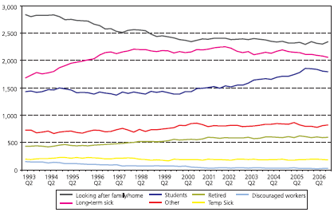{#fig-8-1}

Figure 8.1 below.

165

Freud, D. (2007). "Reducing dependency, increasing opportunity: options for the future of welfare to
work."
Retrieved
26
June,
2009,
from
http://www.dwp.gov.uk/publications/dwp/2007/welfarereview.pdf.

Figure 8.1 'Reasons for Inactivity'
Source & title from Fig. 5 of Freud, D. (2007) 'Reducing dependency, increasing opportunity: options for the future
of welfare to work', London: CDS

Some observations are worth noting:
The rank order of each of the economically inactive categories has remained the
same throughout the time series. „Looking after the family or home‟ has always
accounted for more „inactivity‟ than has being long-term sick, which has in turn
accounted for more „inactivity‟ than being a student, and so on. No qualitative
transitions of this kind have occurred during the time period.
However, the three main reasons -- looking after the home, long-term sickness,
and being a student -- for economic inactivity have increasingly converged in
magnitude, towards a figure of about two million claimants each.
Working age (i.e. „early‟) retirement has been an increasing cause of economic
inactivity. The official numbers of „discouraged workers‟ has always been a
relatively small number, but has reduced further to a small fraction of its original
magnitude.
Within the time period 1993-2006, then, the relative composition, and size, of the
working age economically inactive population has remained relatively stable. Broader
changes in benefit receipts -- including IB and IVB, have been more dramatic, however,

over the time period 1979-2005, as indicated in 

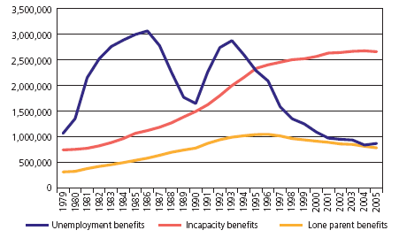{#fig-8-2}

Figure 8.2, also taken from The Freud
Report.

Figure 8.2 Number of people on benefits, 1979-2005
Source: ONS, Department for Work and Pensions Information Directorate, Work and Pensions Longitudinal Study

Although the graph is technically mislabelled - Incapacity Benefit did not exist prior to
1995, and so working-age long-term sick people prior to this period could not have
claimed it (instead they claimed Invalidity Benefit) -- it highlights a very significant
transition in the composition of the working age population: During the late 1970s and
1980s, long-term sickness (IVB) claimants were fewer in number than were
unemployment benefit claimants. The levels rose, however, at some point during the
1990s, long-term sickness (IB) claimant rates came to exceed unemployment benefit
claimant rates.
8.3.1 Sickness and Unemployment Benefits: Some comparisons
The previous paragraph, however, describes IVB/IB claimant levels relative to a
„moving target‟: that of unemployment benefit receipts. Unemployment benefit rates
have, looking again at Figure 8.2, been above three million (in 1986), and below one
million (from 2001 onwards). Unemployment levels -- and changes in unemployment
levels - during this period of observation have been much more variable than those of
long-term sickness benefit receipts.

One, fairly intuitive, way of quantifying this difference in variability between IVB/IB
benefit receipts, and unemployment rates, is to compare the sum of the modulus
(magnitude) of the differences from consecutive years between the two benefit types,
over the same period of observations.166 For the years 1975-2007 inclusive, this
produces values of 6499 for ILO unemployment, and 2273 for IVB/IB;167 the ratio
between these two values is 2.86, so by this measure ILO unemployment levels have
been almost three times as variable as IVB/IB levels during this time period.
8.3.2 Exploring Longitudinal Patterns in More Detail
The data used to calculate the above metric, taken from a variety of sources, are plotted
in 

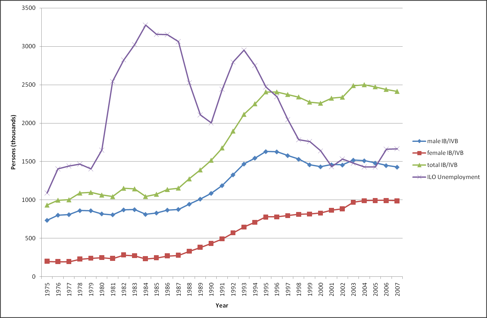{#fig-8-3}

Figure 8.3.168 Although this graph is broadly the same as that displayed in the Freud
Report, it differs in at least two subtle, but perhaps important, respects.

Figure 8.3 IVB/IB and ILO Unemployment levels within UK, 1975-2007
Sources: Social Security Statistics (courtesy of Duncan McVicar); the Labour Force Survey; claimant count data;
Accessed 29 February 2008, from www.nomis.co.uk; and
http://www.statistics.gov.uk/StatBase/tsdataset.asp?vlnk=429&Pos=2&ColRank=1&Rank=272

166

i.e.
where is the value of the observation (either IVB/IB, or ILO Unemployment)
at time t, and y is observed for t
167
The data sources used in this calculation are described in the caption of Figure 8.3.
168
Unlike the graph used in The Freud Report, which are based on survey data, the values presented in
this graph are based on actual claimant count data -- and hence are a 'population' rather than a
'sample'.

Firstly, whereas the Freud Report graph suggested that IVB/IB graphs represent a fairly
smooth and gradual transition from a fairly low to a fairly high number of claimants
over the time period (like a sigmoid or logistic regression curve), these figures instead
suggest changes in IVB/IB rates instead have a more „hinge-like‟ shape, and look more
like three straight lines:
1. Line one, from 1975 to 1987: very slightly positive but almost flat. Beginning at
934,000 claimants, and ending at 1,155,000 claimants.
2. Line two, from 1987 to 1995: steep upwards climb. Beginning at 1,155,000
claimants, and rising to 2,406,000 claimants
3. Line three, from 1995 to present: relatively flat but more variable than previous
two lines. Starting at 2,406,000 claimants, ending at 2,414,000 claimants, and
varying in the intermediate period between 2,260,000 claimants (in 2000) and
2500,000 claimants (in 2004)
The important change in the IVB/IB rates, therefore, occurred during the period 19871995 („line two‟). It may not be a co-incidence that 1987 marked the start of the steepest
drop in ILO unemployed (from 3.1 million to 2.5 million in 1988, followed by 2.1
million in 1989) for over a decade; and that 1995 was the year in which Invalidity
Benefit (IVB) was replaced by Incapacity Benefit (IB), which is generally accepted as
having much tougher entry criteria.
A second notable feature of the claimant count graph is the unusually steep rise in ILO
unemployment from the period 2005-2006, from 1.43 million, to 1.66 million (and
rising to 1.67 million in 2007). Though this may simply be a particularly large
instantiation of the natural, year-on-year, variability in unemployment levels („noise‟), it
might also represent early signs of a new „shift in the fundamentals‟ („signal‟).
8.3.3 Longitudinal Comparisons between IVB/IB and other Longitudinal
Statistics
A great many things have, of course, changed since 1975 in addition to the level of
working age long-term sickness benefit claimants. In this section, we will observe, both
graphically and statistically, the co-development of a number of statistical and
demographic factors concurrently with incapacity benefit claims, in order to try to
understand how such factors may be related to one another.

8.3.4 IVB/IB and Working Age Population
Firstly, one relationship worth noting is that the IVB/IB claimant levels over the period
1975-2007 have been strongly correlated (r= 0.87) with changes in the number of
people of working age over that same period, as shown in 

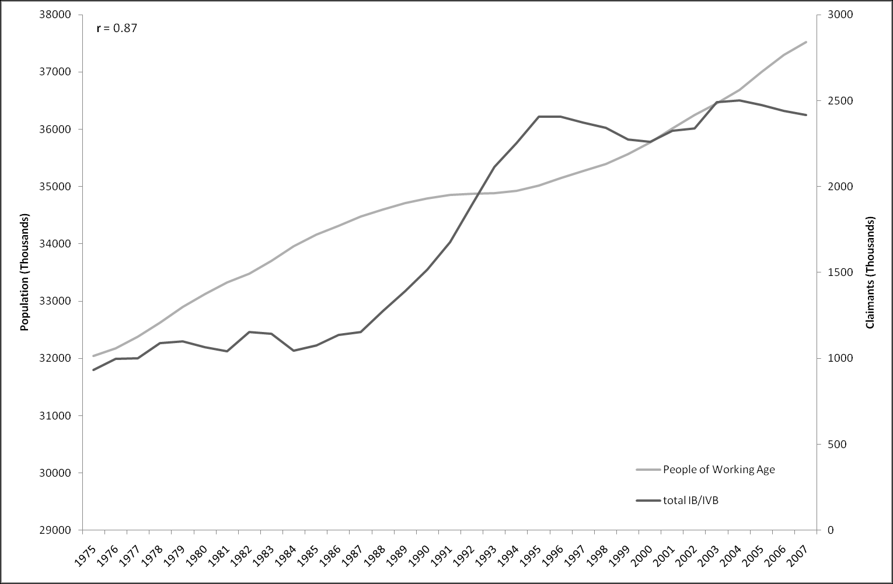{#fig-8-4}

Figure 8.4.

Figure 8.4 Working age population and IVB/IB claimant numbers, 1975-2007
Sources: See Figure 8.3

However, as mentioned previously, the rise in IVB/IB numbers appears to be a story in
three parts, with the majority of the increase during the observation period occurring
during just eight years: from 1987 to 1995. The size of the working age population,
however, has grown throughout the period, and so it would seem naïve to assume that
the rise in claimant count is „just‟ a demographic one. 

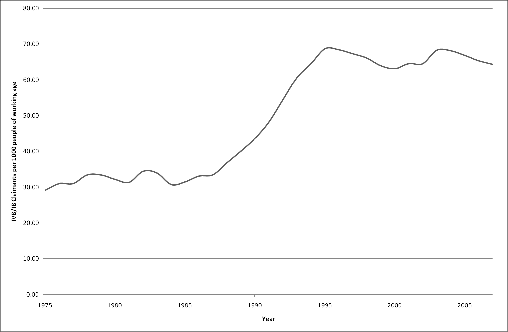{#fig-8-5}

Figure 8.5 „controls for‟ this
broad demographic factor by plotting total claimant rates over this period (more
specifically, the number of IVB/IB claimants per 1000 people of working age):

Figure 8.5 IVB/IB claimants per 1000 people of working age, 1975-2007
Sources: See Figure 8.3

If anything, this „correction‟ shown in makes the three part structure of the claimant
count rise even more prominent, with the disjuncture between the three periods (19751987; 1987-1995; 1995-2007) even more apparent. Claimant count rates more than
doubled over the central period, but not before or since.
8.3.5 IVB/IB and Female Working Age Economic Activity
An intuitive, if sometimes reticently admitted, assumption about the reason for increases
in IVB/IB claimant levels, amongst men at least, is that there are now more women in
the labour market, making it more competitive and thus harder for those less „fit‟
(whether physically, psychologically, or „intellectually‟) to remain within it.
To some extent, there seems to be some reality in this assumption, although the likely
paths of causal influence are hard to disentangle. To begin with, 

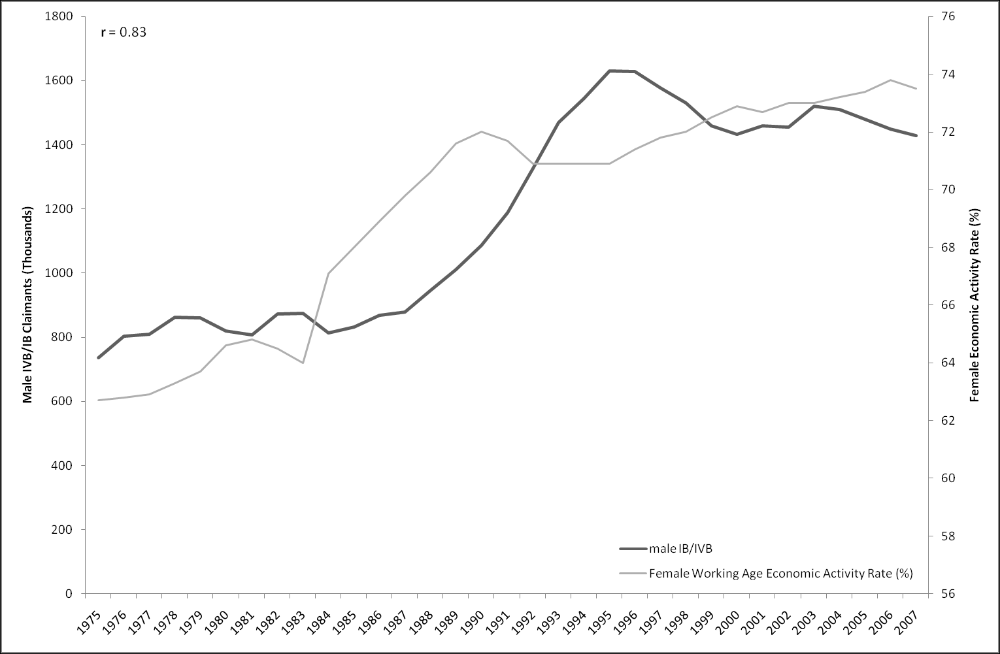{#fig-8-6}

Figure 8.6 plots the
changes in the proportion of the female working age population who are „economically
active‟ (either in or seeking employment) alongside the male IB/IVB claim rate:

Figure 8.6 Numbers of male IVB/IB claimants and female working age economic activity rates
Sources: See Figure 8.3

The two series exhibit an apparently strong correlation (r= 0.83). However, females do
not simply seem to have „displaced‟ males. Rather, as females have become more
economically active, and engaged in the labour market, so they have found themselves
facing increasingly similar labour market pressures, including those which lead people
onto IVB/IB. One way of seeing this is to plot the number of female IVB/IB claimants,
per 1000 male claimants, over this time period, as shown in 

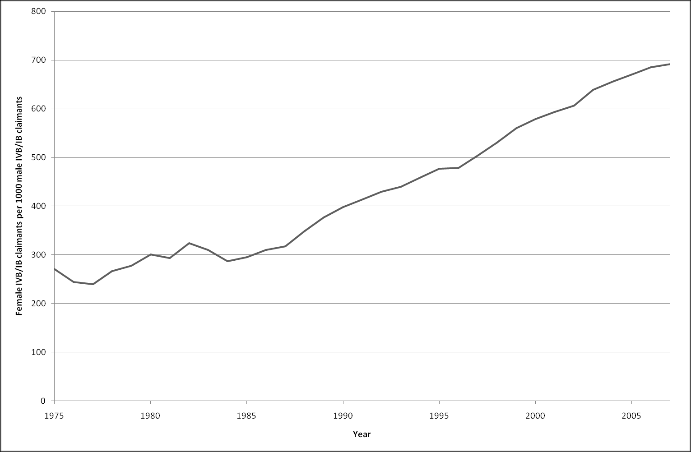{#fig-8-7}

Figure 8.7.

Figure 8.7 Female IVB/IB claimants per 1000 male IVB/IB claimants, 1975-2007
Sources: See Figure 8.3

This shows that female and male claimant rates have been moving closer to parity,
almost linearly,169 for the last thirty-two years.
Another comparison which may be of interest is to compare changes, since 1975, in the
ratio of IVB/IB populations to overall working age population, for males, females, and
both males and females. This is shown in 

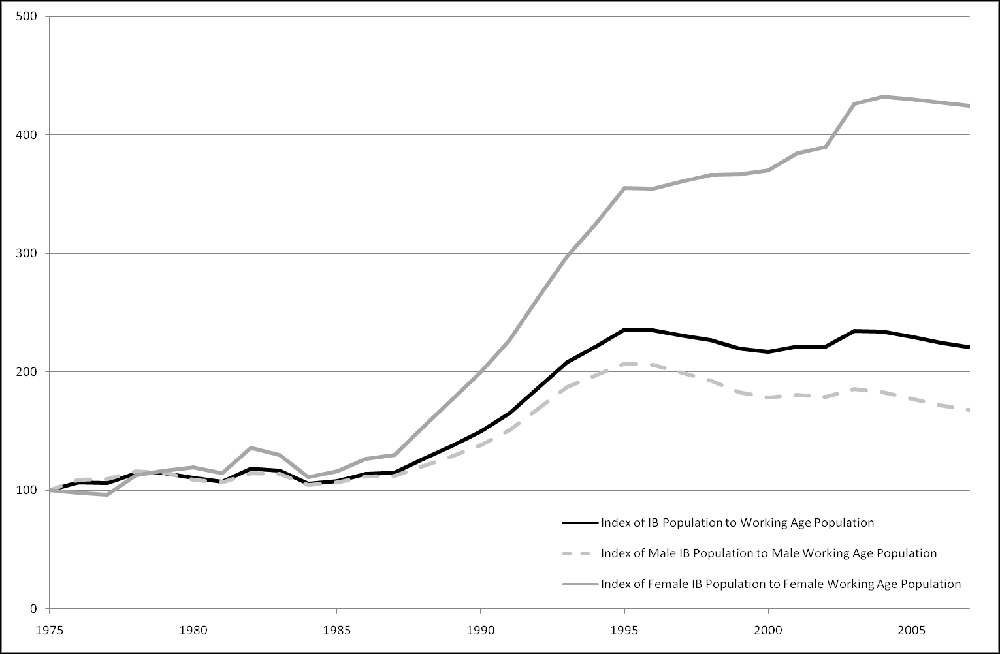{#fig-8-8}

Figure 8.8, where 1975 values are indexed at
100:

169

A linear regression of the values estimates parity in 2042, converging at a rate of 14.8 additional
females per 1000 males per year.

Figure 8.8 Index of IVB/IB population to overall working population, for males, females, and combined
(1975=100)
Sources: See Figure 8.3

This shows that, during the period 1987-95, the female claimant index grew with a
much steeper gradient than the male index. Additionally, whereas, after 1995, the male
claimant index began to decline slightly, the female index continued to rise.
8.3.6 Cohort Effects and Social Class
The preceding discussions have attempted to disentangle demographic factors from
other factors. We have seen that, although IVB/IB claimant levels have risen alongside
population size, they have done so at a much faster rate, and with a „hinge-shaped‟ and
somewhat disjoint pattern of growth, rather than the kind of smooth, curvilinear shape
one might expect if demographic factors were the primary cause (and as suggested in
Figure 8.2, reproduced from The Freud Report).
One way of trying to disentangle other, socioeconomic, factors from demographic
factors is to look at cohorts: the differences and similarities between peoples at the same
stages in their life-courses -- the same age -- but born at a different times. 

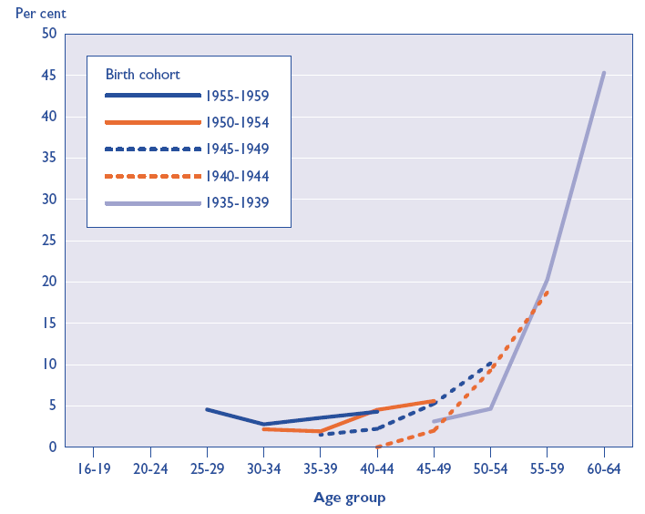{#fig-8-9}

Figure 8.9
presents the economic inactivity levels for five different cohort groups, at ages ranging
from 25 to 64, with at least an A-level:

Figure 8.9 'Inactivity rates for men with high levels of qualifications [A levels and above] by age group and birth
cohort; 1986 to 2001' (Original image in colour)
Source: Figure 4b of Barham, C. (2002) "Patterns of economic inactivity among older men", Labour Market
Trends, June 2002, pp. 301-310 (Original Data Source: Labour Force Survey)

For better-qualified males in society, economic inactivity is largely a demographic
factor: each cohort experiences broadly the same likelihood of inactivity when it reaches
the same age, with a sharp increase in economic inactivity during the final five-to-ten
years of the working age timespan.
For those with no qualifications, however, the story is very different, as shown in Figure
8.10.



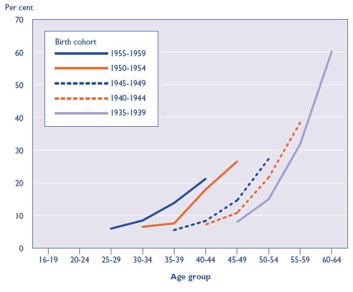{#fig-8-10}

Figure 8.10 'Inactivity rates for men with no qualifications by age group and birth cohort; United Kingdom; 1986
to 2001' (Original image in colour)
Source: Figure 4a of Barham, C. (2002) "Patterns of economic inactivity among older men", Labour Market
Trends, June 2002, pp. 301-310 (Original Data Source: Labour Force Survey)

8.4 On the relationship between sickness, employment, and social
class amongst males
8.4.1 Introduction and Summary
There has been a dramatic change in the relationship between sickness, employment,
and social class, but this drama has played out slowly and quietly over the last three
decades, and so occurred largely unnoticed. In 1996, however, a five-page British
Medical Journal paper by Mel Bartley and Charlie Owen,170 presented some results
which showed a dramatic change in relationship between social class, economic
inactivity, sickness, and unemployment.
The graphs presented in that paper plot the changing labour markets of male workers, of
various social classes, and levels of health. They show that, over time, employment has
170

Bartley, M. and C. Owen (1996). "Relation between socioeconomic status, employment, and health
during economic change, 1973-93." British Medical Journal 313(7055): 445-449.

become increasingly a function of social class, with those people whose work is more
physical, manual, in nature less likely to be in employment. They investigate this
further, by sub-dividing each class into those who have self-identified as having a
„limiting longstanding illness‟, and those who have not. For each class, those who
answered in the affirmative were less likely to be employed, across all time periods.
This disparity, on average, grew from 1973 to 1993. It grew much faster, however, for
the „lower‟ classes, whose work was of a more manual and (from the perspective of
formal qualifications) „unskilled‟ nature.
Disadvantages for manual and formally unskilled workers had thus been compounded
substantially over the last twenty years: the job security of such types of work has
decreased; the level of pay --relative to non-manual jobs -- has decreased; and the
detrimental effect of sickness and injury on one‟s employability has increased.
The article also shows that this labour market disadvantage of manual labourers has not
manifested itself very substantially --though it has manifested itself moderately
substantially - in unemployment figures. Though, for each class, the level of recorded
unemployment for those with limiting longstanding illness (henceforth „LLTI‟) was
slightly higher than for those without, this gap was not large, and even crossed over
slightly for some classes and for some years. For all classes, the unemployment levels
of those with and without LLTIs followed each other closely, showing up-turns and
down-turns characteristic of changing general economic circumstances.
The article then answers a conundrum suggested by the previous three figures: if
employment has gone down, but unemployment has not gone up by the same amount,
then what has happened? It shows that the reduction in employment -- with those with
LLTIs suffering the blunt of the employment effect - has been complemented much
more closely by a rise in working age economic inactivity than working age
unemployment. As I will show, this relationship can be statistically quantified through
correlation coefficients, as well as appearing the most visually intuitive interpretation of
the evidence.
8.4.2 Replication
The British Medical Journal summarised above was published in 1996, and uses data
from the General Household Survey up until 1993. I wished to find out whether the
patterns shown over the twenty-year period 1973 to 1993 had been maintained or
altered in years since. To do this, I attempted to use the datasets (the General Household

Survey) and follow the methods described in the original article as closely as possible,
in order, firstly, to replicate the original findings; and secondly, to update the results to
include the effects of -- for example -- a new, centre-Left, government regime.
The results of the attempt at replicating the results from 1973 to 1993, and updating the
results to cover the years up until 2003, are shown here as figures 8.11, 8.12, 8.13, and
8.14 below.
Although some of the particular percentages are not exactly the same -- perhaps due to
differences in the coding schemes adopted -- all of the major qualitative patterns
observed in the original research have been replicated. The changes and continuities
observed in the period 1994-2003, i.e. in the new part of the research, deserve noting.

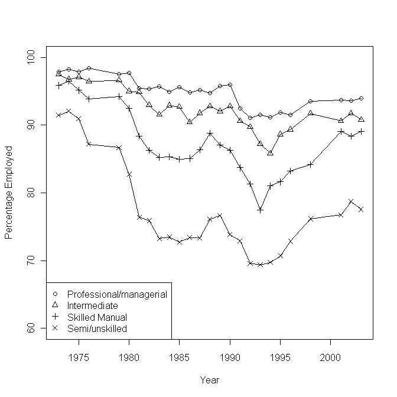{#fig-8-11}

Figure 8.11 Proportions employed according to socioeconomic group, 1975-2003
Source: General Household Survey, based on Figure 1 of Bartley, M. And Owen, C (1996) 'Relation between
socioeconomic status, employment, and health during economic change, 1973-93', BMJ 13(7055): 445-449

If one first considers Figure 8.11, based upon Figure 1 of the original research, one sees
that 1993, the final year of the original analysis, turned out to be a point of inflection,
rather than a mid-point in a trend, with employment rates rising in the years since, for
all classes. The general level of working age employment, however, is lower for all
classes than in 1973. The employment levels of the „top‟ three social classes --
professional/managerial, intermediate, and skilled manual -- have begun to converge,
producing a wide gap between these classes and the semi/unskilled manual class, which
was characteristic of the data even in 1973.

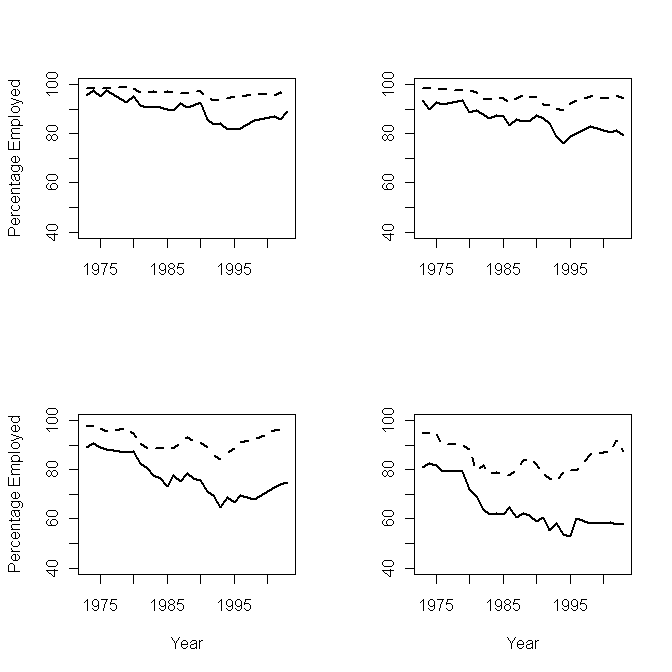{#fig-8-12}

Figure 8.12 Proportion employed according to limiting longstanding illness and socioeconomic group
Dashed lines indicate no LLTI; full lines indicate LLTI. Classes: top left: 'Professional/managerial'; top right:
'Intermediate non-manual'; bottom left: 'Skilled manual'; bottom right: 'Semi and unskilled'
Source: General Household Survey. Based on Figure 2 of Bartley, M. And Owen, C (1996) 'Relation between
socioeconomic status, employment, and health during economic change, 1973-93', BMJ 13(7055): 445-449

Figure 8.12, which updates Figure 2 of the original research, shows some further
evidence of a somewhat improved general economy, but with differential effects for
those of different classes and health statuses. For each class, the differentials between
those with and those without LLTIs seem roughly to observe the following pattern:
during labour market downturns, the employment rate goes down, but faster for those
with LLTIs than those without. Conversely, during labour market upturns, the
employment rate goes up, but faster for those without LLTIs than those with. Both
when the labour market is good, and when it is bad, the effect on the differential
fortunes of those with and without LLTIs is the same: a widening in the employment
gap between people, of all classes, on the grounds of health, which is especially
pronounced amongst those of poorer health.

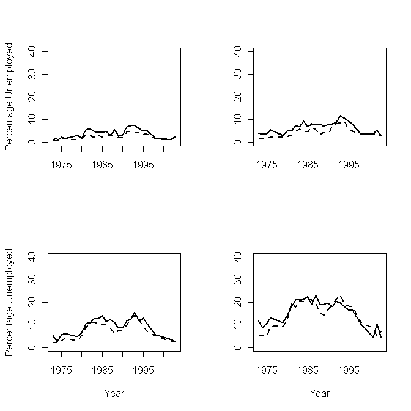{#fig-8-13}

Figure 8.13 Proportions unemployed according to limiting longstanding illness and socioeconomic group
Dashed lines indicate no LLTI; full lines indicate LLTI. Classes: top left: 'Professional/managerial'; top right:
'Intermediate non-manual'; bottom left: 'Skilled manual'; bottom right: 'Semi and unskilled'
Source: General Household Survey. Based on Figure 3 of Bartley, M. And Owen, C (1996) 'Relation between
socioeconomic status, employment, and health during economic change, 1973-93', BMJ 13(7055): 445-449

Figure 8.13, based on Figure 3 of the original research, continues the broad pattern
observed in Figure 8.12: differentials between unemployment amongst those with and
without LLTIs are small, and if anything have decreased slightly over the period 19942003.

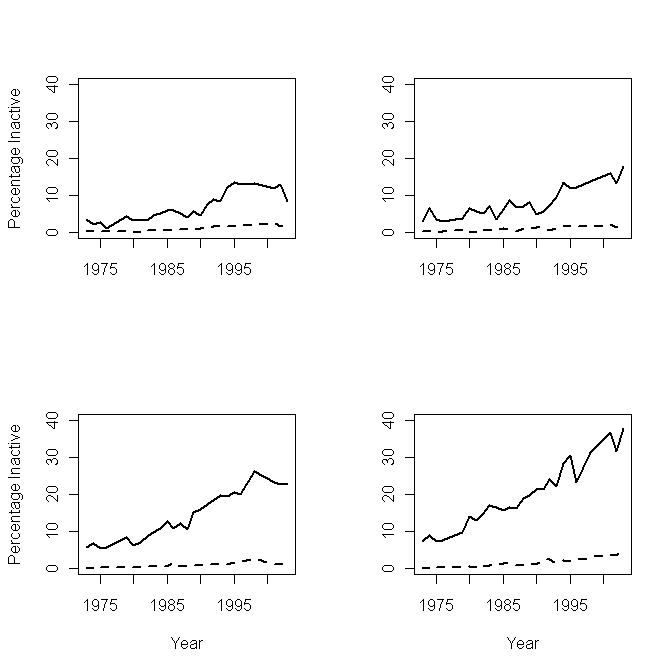{#fig-8-14}

Figure 8.14 Proportions inactive according to limiting longstanding illness and socioeconomic group
Dashed lines indicate no LLTI; full lines indicate LLTI. Classes: top left: 'Professional/managerial'; top right:
'Intermediate non-manual'; bottom left: 'Skilled manual'; bottom right: 'Semi and unskilled'
Source: General Household Survey. Based on Figure 4 of Bartley, M. And Owen, C (1996) 'Relation between
socioeconomic status, employment, and health during economic change, 1973-93', BMJ 13(7055): 445-449

Figure 8.14, though it does not reproduce quite the same magnitude of the effects shown
in Figure 4 of the original research on which it was based (again probably due to
different coding/operationalisation of the problem), shows the same qualitative patterns,
and shows them continuing and, for most classes, expanding over the additional decade.
For the „lowest‟ three classes, the level of inactivity amongst those with LLTIs has

increased, almost linearly as a function of time.171 For these three classes, the magnitude
of the gradient increases as the social class „decreases‟.
8.4.3 Correlations
Another way of understanding the data is to observe the correlations between
percentages of the male working age population unemployed, employed, and
economically inactive, for both of the two possible health conditions (has LLTI/does not
have LLTI); and all four of the possible social classes; for each comparable year in the
GHS between 1973 and 2003 inclusive. This produces a four-by-two cell table, each
cell containing the three possible correlations of the three variables.
The results of doing this are shown in Table 8.1, and lead to some interesting
observations:

171

In fact, if one were to run four simple linear regressions of inactivity rates regressed against year, one
for each social class, the estimated gradients produced (i.e. the ß1 coefficient values) are as follows:
Professional/managerial class: 0.39 % rate increase in inactivity per year
Intermediate (non-manual) class: 0.42% increase per year
Skilled manual class: 0.72% increase per year
Semi-skilled and unskilled manual class: 0.99 % increase per year

unemployment
unemployment

employment

employment

unemployment

-0.33
unemployment
-0.82 -0.27 inactivity

unemployment

unemployment
inactivity

employment

Semi and
Unskilled
Manual

unemployment

-0.52
unemployment
-0.86 0.01 inactivity

-0.96
-0.49 0.24

-0.99
-0.34 0.17
unemployment

unemployment
inactivity

Skilled
Manual

employment

-0.48
unemployment
-0.86 -0.02 inactivity

-0.87
-0.69 0.25

employment

unemployment
inactivity

Intermediate
Non-manual

unemployment

-0.57
unemployment
-0.90 0.15 inactivity
employment

unemployment
inactivity

employment

Professional /
Managerial

No Limiting Illness
unemployment

employment

Limiting Illness

-0.98
-0.09 -0.12

Table 8.1 Pairwise correlation coefficients, employment, inactivity, and unemployment, given social class and
health, 1973-2003 inclusive
Source: General Household Survey, based on methods described in Bartley & Owen 1996

Firstly, as one may expect, employment rates and unemployment rates are negatively
correlated in all eight conditions. However, the strength of this negative correlation
changes dramatically from cell to cell, ranging from almost perfect (-0.99) correlation
for Skilled Manual workers without LLTI; to relatively weak (-0.33) for Semi- and
Unskilled Manual workers with LLTI.
Tellingly, and perhaps crucially, the strength of the correlation between unemployment
and employment is weaker than the correlation between inactivity and employment for
all groups with LLTI; whereas for all classes without LLTI, the converse is true. The
strength of this correlation within the LLTI column-- ranging from 0.82 to 0.90 in
magnitude -- is similar for all classes.

For the „lowest‟ class (the bottom row), and under both the LLTI and non-LLTI
conditions, the correlation between inactivity and unemployment is negative, but weak.
For „higher‟ classes, however, it is either positive (but weak), or non-existent.
One way of interpreting these results is to think of the effect of LLTI as being to „flip‟
the relationship between employment and unemployment, and employment and
inactivity. Amongst those without a LLTI, less employment is very strongly correlated
with more unemployment, and only moderately to weakly so with more inactivity;
amongst those with a LLTI, however, less employment is more strongly correlated with
more inactivity, and less so with more unemployment.
8.4.4 A Graphical Illustration
The above results suggest a complex, but far from intractable, picture of the relationship
between male working age employment, unemployment, and inactivity. A simplistic
but hopefully plausible diagram illustrating this relationship is indicated in 

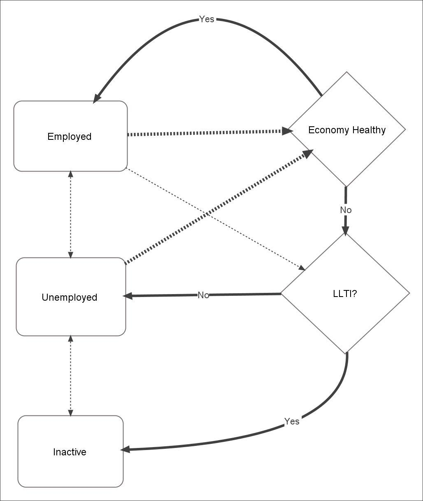{#fig-8-15}

Figure 8.15.
This, for simplicity, omits the class influences in order in order to concentrate on the
relationship between the general economy and whether an individual has a LLTI.

Figure 8.15 Suggested relationship between economic activity, personal health and economic 'health'

Rectangular nodes indicate status. Diamond nodes represent 'decisions' or influencing factors. Dashed lines
represent random transitions. Thickness of lines suggest strength of trajectories.

Here, I suggest that, if an individual is already employed, and the economy is „healthy‟,
then it is likely the individual will stay employed. Furthermore, if one is unemployed,
and the economy is „healthy‟, then one is fairly likely to become employed. When the
economy is „healthy‟, then one‟s own health plays a fairly minor role.
When the economy becomes „unhealthy‟, however, then one‟s health becomes more
important in determining one‟s future employment trajectory. If one starts off as
employed, and the economy becomes unhealthy, and one is healthy, then one is more
likely to become unemployed. However, if one starts off as employed, then the
economy becomes unhealthy, and one is unhealthy, then one is more likely to become
Inactive.
If the economy makes the transition from being „unhealthy‟ to „healthy‟, and one is
unemployed, then one is likely to become employed. However, if one is Inactive, and
the economy makes the transition from unhealthy to healthy, then this does not greatly
affect one‟s probability of making the transition from Inactivity to employment. By this
route, the individual has become detached from the labour market. Both the general
health of the economy (an „external‟ factor), and the general health of the individual (an
„internal‟ factor: though much less exclusively „internal‟ than commonly assumed) play
a powerful role in „sifting‟ individuals into and out of the labour market. The further
effect of class is to strengthen and weaken the degree of influence of these causal
influences.

8.5 Cross-Sectional Trends and Characteristics
8.5.1 Introduction
So far, in this chapter, I have looked both at a legal history of the benefits system (or
systems) since the start of the Twentieth Century, and at some longitudinal relationships
between benefit claim trends and other socioeconomic trends that have occurred over
the last one-to-two generations. I concluded with evidence demonstrating that people‟s
likelihood of finding themselves a member of the „working age economically inactive‟
population more generally, and of being on Incapacity Benefit more specifically,
depends significantly upon a variety of personally identifiable characteristics: gender,
educational levels, and „latent sickness‟ (operationalised as an affirmative response to a

particular question asked almost annually in series of General Household Survey
question from its inception onwards). Within this section, I will explore these personal
characteristics in more detail by looking at cross-sectional data from the recent past (not
less than ten years old).
8.5.2 'Reasons for Inactivity'
A useful introduction to understanding economic inactivity patterns may be provided by
looking at 

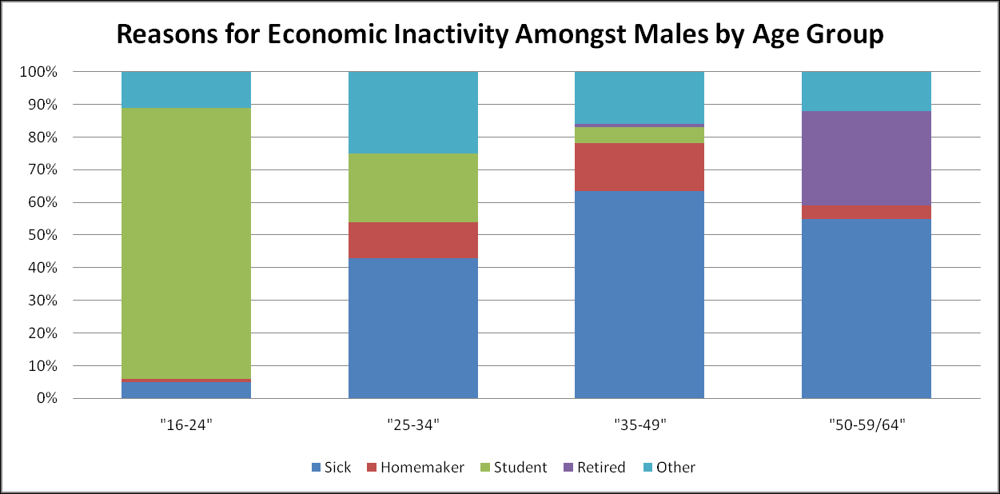{#fig-8-16}

Figure 8.16 and 

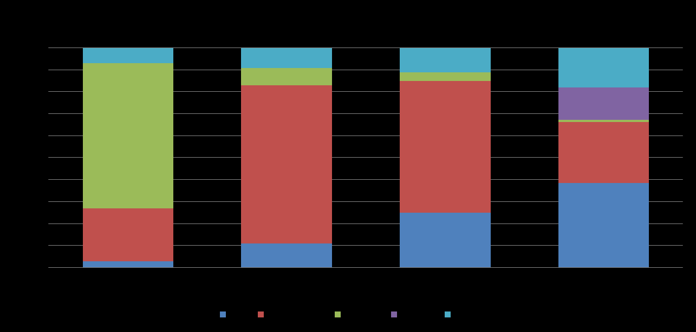{#fig-8-17}

Figure 8.17, which compare, respectively, the male and
female reasons for economic inactivity across a variety of different age groups.

Figure 8.16 Reasons for economic inactivity amongst males by age group (Original figure in colour)
Source: Adapted from table 1 of Barham, C. (2002) "Economic Inactivity and the Labour Market", Labour Market
Trends, Feb. 2002

Figure 8.17 Reasons for economic inactivity amongst females by age group (Original figure in colour)
Source: Adapted from table 2 of Barham, C. (2002) "Economic Inactivity and the Labour Market", Labour Market
Trends, Feb. 2002

Here one sees that the reasons for „inactivity‟ differ substantially from males and
females, and from younger, to middle-aged, to older members of the working age
population. Initially, for both genders, the primary reason for inactivity is further
education, with a large majority of those who are economically inactive, instead
engaged in earning further qualifications through educational establishments.
For both males and females, sickness tends to rise with age group as a cause of
inactivity, but constitutes a much larger proportion of male than female inactivity. For
females, for all but the youngest age group, home-making constitutes the largest cause
of (to use the standard definition) economic inactivity.
For females, sickness rises as a proportion of all inactivity as the age-group increases;
for males, however, the peak of proportional recorded inactivity due to sickness is
within the 35-49 year age group, rather than the oldest, 50-65 year age group. Amongst
this oldest group, for both genders, a new cause of inactivity -- retirement before state
retirement age -- plays a substantial part. Retirement as a cause of inactivity plays a
proportionately much greater role for males than for females within this final age group.
Given that recorded sickness amongst this age group, for males, goes down
proportionately compared with the 35-49 year group, but that people inevitably, and on
average, face increasing physical and mental impairment with age, it seems sensible to
assume that many of the sicker males -- substantially more so than for females -- retire
before state retirement age.
Retirement, however, is an option that not all sick people can afford to do. Receiving a
state pension is dependent upon making sufficient National Insurance contributions; and
sufficient company pensions are dependent upon many decades of additional
contributions from regular work.
8.5.3 On the relationship between incapacity benefit claimant levels and
state retirement age
As previously mentioned, male and female state retirement ages are different: 60 for
females and 65 for males. This historical artefact of a time of greater gender inequality,
which is neither socially nor -- given females tend to outlive males -- biologically
justified, nevertheless allows a kind of simple „natural experiment‟ to be performed
using claimant data, in order to tease out the relationship between Incapacity Benefit
and retirement. The raw results of this experiment are presented in 

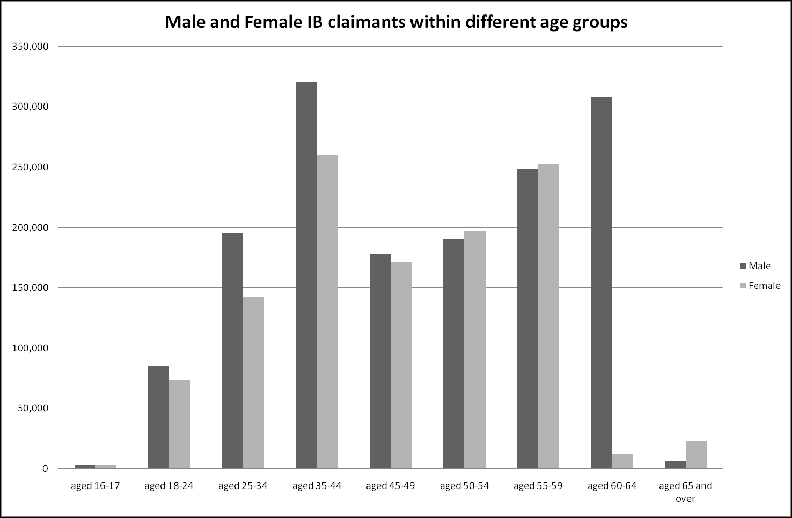{#fig-8-18}

Figure 8.18.

Figure 8.18 Numbers of IB claimants by gender and age group, May 2007
Source: May 2007 Claimant Count data, available at www.nomisweb.co.uk (Accessed 27 February 2008)

What one sees here -- both for males and females -- is that the incapacity benefit
claimant count drops dramatically in the age category that includes the gender‟s state
retirement age (60-64 for females; aged 65 and over for males), but rises progressively
up until that point.172 For females, there is a 95% drop in claimants at state retirement
age: from 253,210 claimants in the 55-59 age group, to 11,860 claimants in the 60-64
year age group. For males, the drop -- 308,070 claimants amongst 60-64 year olds, to
6,990 claimants aged 65 and over -- is around 98%.
The fact this drops occurs so dramatically, and consistently, for both genders, suggests
that, for many claimants, Incapacity Benefit is used as a kind of state-based „early
retirement‟ benefit. Incapacity Benefit pays more than Jobseekers‟ Allowance (and
increasingly so as claimants remain on the benefit for more than 6 and 12 months), and
isn‟t (or hasn‟t been until recently) conditional upon seeking employment. However,
incapacity benefit pays less than a full state pension, and therefore it seems reasonable
to assume that once people on IB become eligible for this other benefit, they
overwhelmingly make this transition.

172

This progressive rise up until state retirement age may not be fully evident because of the unequal
divisions between the age groups, with the age category 'aged 35-44' comprising 15 years, and the next
three categories each of 5 years.

An even clearer way of seeing this is to consider the degree of over- and underrepresentation of IB claimants within different age groups, relative to the census. This is
presented graphically in 

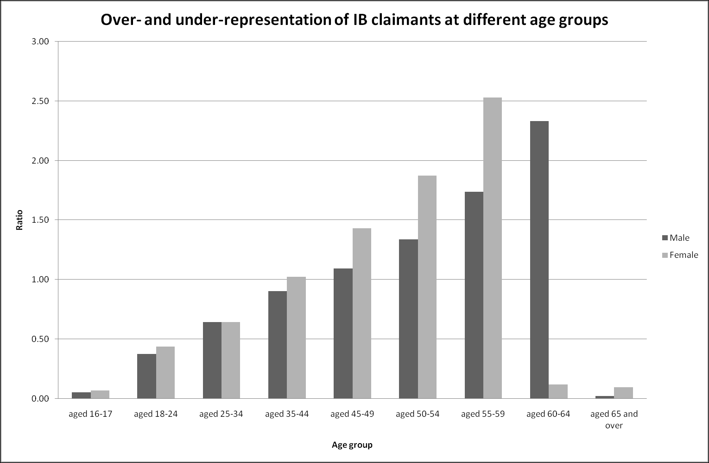{#fig-8-19}

Figure 8.19.

Figure 8.19 Over- and under-representation of IB claimants at different age groups
Sources: ONS, http://www.statistics.gov.uk/populationestimates/svg_pyramid/uk/index.html (Accessed 27
February 2008); DWP, https://www.nomisweb.co.uk/Default.asp (Accessed 27 February 2008)

As discussed previously, many official statistics impose rigid categorical identities upon
fuzzy individual existences. One of these rigid categorisations is of working age: up to
60 for females; and up to 65 for males. The assumption is that those below this age
should be fit for and expected to work, and those above should not. The reality is more
complicated, because fitness and health is a continuous rather than categorical variable.
Generally, health deteriorates with age, much faster during the final years of life.
Furthermore, males generally age faster than females. The increasing overrepresentation of Incapacity Benefit claimants at older ages is consistent with this fuzzy
reality, as older, but categorically „working age‟ people, find themselves incapable of
performing the sorts of activities that previously they had been performing.

8.6 Summary and Discussion
Within this chapter, I have considered a variety of historical, longitudinal and crosssectional sources and measures in order to attempt to improve our intuitive
understanding of the causes of modern Incapacity Benefit claimant levels. No neat,

definitive, conclusion is possible. However, the following factors all seem to play an
important part:
Female labour market participation
Population Size
Age
Latent sickness (Longstanding Limiting Illness)
Mass unemployment during the 1980s
Social Class
State Retirement age
The list is very far from comprehensive and exhaustive, and cannot hope to represent a
full and definitive treatment of the issues involved. To conclude by saying that the
relationship between the various physiological, biological, psychological, sociological,
demographic, economic, historical, bureaucratic, institutional, political, social and
societal factors involved is „complex‟, „unclear‟, or „complicated‟, however, would be
both a cop-out and a cliché.
Instead, I should say that, although the issues covered here have been partial and
methods and sources of data used here have been limited, we probably -- to use the term
in an unquantifiable sense -- have enough new information about Incapacity Benefit to
alter our sense of understanding and intuitions about the subject in a number of respects.
I probably have begun to see enough statistical „slices‟, comprising enough qualities
and aspects, through the subject that one‟s impression of it, within „the mind‟s eye‟, is
somewhat clearer and more detailed.
