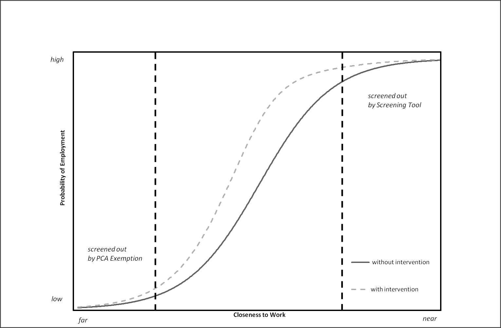
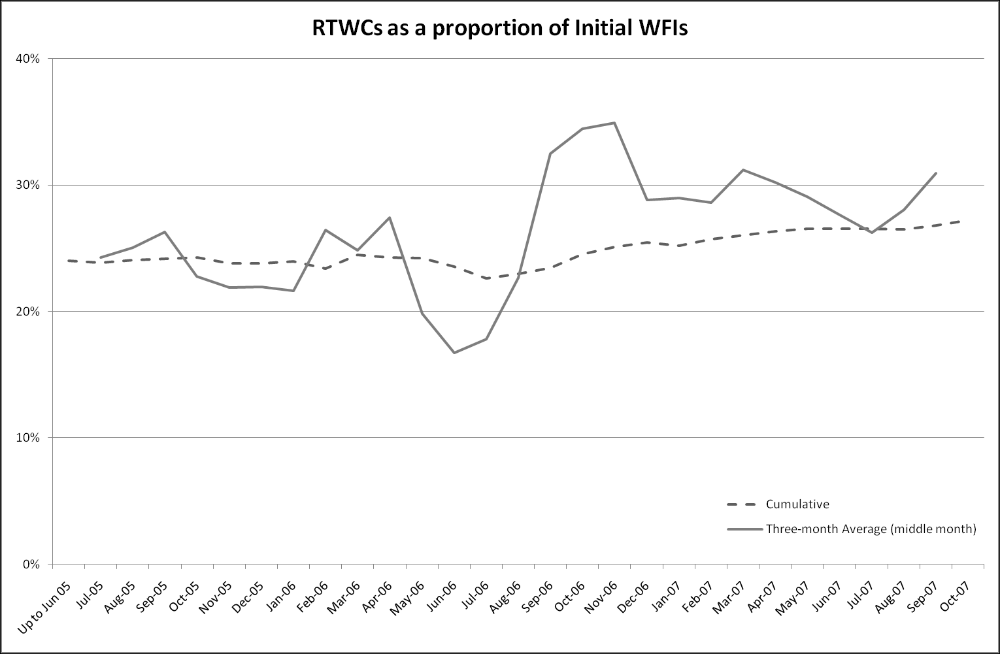
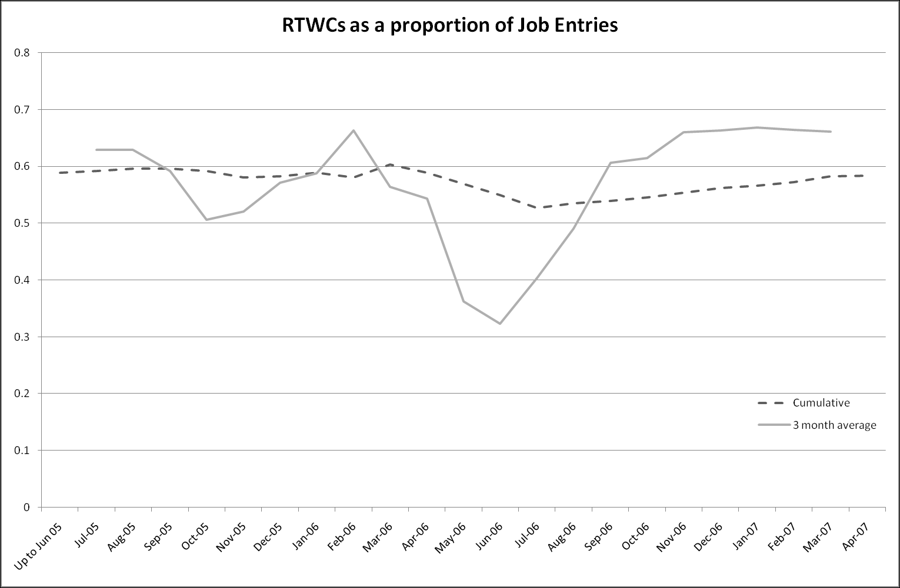

::: {.archive-notice}
**Source:** Pages 163--203 of *MintonThesis.pdf* (September 2009). Text extracted from PDF; figures extracted directly as images.
:::

9 Pathways to Work: Qualitative Descriptions
9.1 Introduction
Within this chapter, I will look at Pathways to Work: a recent programme of measures,
introduced in 2003, and ostensibly designed to reduce the number of Incapacity Benefit
claimants by making it more likely that both new and existing claimants make the
transition into paid employment.
I will begin by summarising and quoting from a number of Department of Work and
Pensions (DWP) commissioned documents which introduce and describe the
programme, together with the events and changes which have led to the programme‟s
introduction. Understanding more about this official introduction to the programme will
require learning more about two further, broader, aspects of recent government policymaking: the government‟s New Deal and Welfare-to-Work programmes; and the
government‟s professed commitment to evidence-based policy making. Both of these
areas will thus be considered in more detail.
It is due to the government‟s apparent commitment to evidence-based policy-making
that Pathways to Work was first introduced as a pilot scheme in 2003, before being
extended to cover the entire country by April 2008.173 While it was still a pilot scheme,
a number of independent organisations were commissioned to produce research as to the
programme‟s effectiveness. The reports produced from these organisations, which are
both qualitative and quantitative, and consider a number of different facets of the
programme, will be considered in some detail.
I will then consider some of the quantitative evidence as to the effectiveness of the
scheme in more detail. This will allow us to explore the likely substantive implications
of the programme, and whether -- based on the evidence available -- it appears to be „fit
for purpose‟. This exploration will be complemented and augmented by a number of
independent statistical investigations as to the effectiveness of the programme.
Finally, I will conclude by discussing the veracity of suggestions that Pathways to Work
is an example of „evidence-based policy‟, and considering the extent to which Pathways
may instead represent a symbolic gesture aimed at wavering voters, more so than the
ostensive „customers‟ of the programme.

See, for example, JobCentrePlus. (2008). "Opportunities to Tender Pathways to Work." Retrieved 18
March
2008,
2008,
from
http://www.jobcentreplus.gov.uk/JCP/Partners/Opportunitiestotender/Dev_012570.xml.html.

9.2 What is Pathways to Work?
Pathways to Work represents a continuation in a long line of changes to benefits
payable to people of working age who are out of work due to long-standing illness. The
key benefit reform events which have led to Pathways to Work, according to a DWP
memo submitted to a government select committee, are shown in Table 9.1.
Year

Events

1995
Incapacity Benefit (IB) introduced, replaced Sickness Benefit and Invalidity Benefit.
The Government's proposals for modernising Incapacity Benefit by strengthening the link to recent work and
1998

taking a more positive approach to peoples‟ capabilities outlined in the consultation paper, 'A New Contract for
Welfare: Support for Disabled People', published October 1998.

1999

Welfare Reform and Pensions Act gives effect to the Government‟s Welfare Reform Measures.

2000 All Work Test replaced with the Personal Capability Assessment so that as well as establishing entitlement
to benefit it provides constructive information about capabilities to help people plan to return to work.
IB reforms implemented: • first NI contribution condition revised so that contributions have to be paid in one
of the last three tax years before the benefit year instead of any tax year; • if the IB recipient gets an
occupational or personal pension of £85 a week or more their IB will be reduced by half the amount which
2001 exceeds £85; • people whose illness begins before age 20 (or 25 if in education or training before age 20) will
be able to receive IB without having to satisfy the contribution conditions; and • all people making new and
repeat claims to Incapacity Benefit in Jobcentre Plus pathfinder offices are offered a work-focused meeting as
a condition of receiving benefit. These changes are implemented by The Social Security (Jobcentre Plus
Interviews) Regulations 2001.
New Permitted Work Rules were introduced from 8 April new permitted work rules for those in receipt of
incapacity benefits. People can work for: • less than 16 hours a week for up to £78 a week, for a 26 week
period. This can be extended for another 26 weeks if a Personal Adviser, Job Broker or Disability Employment
Adviser agrees that an extension will help them towards work of 16 hours or more a week; or • up to £20 a
week, at any time, for an unlimited period; or • up to £78 a week for an unlimited period if the work is
2002 supervised by someone who works for a public or local authority or voluntary organisation whose job it is to
arrange work for people with disabilities. This could be work done in the community, a sheltered workshop.
Similarly, anyone working under medical supervision as part of a hospital treatment programme can work
indefinitely for earnings of up to £78 a week. • People doing therapeutic work before 8 April 2002 were
transitionally protected until 6 April 2003. • Severe Disablement Allowance recipients who were under 20 on 6
April 2001 transferred onto the long-term rate of IB on 6 April 2002. From 8 April new permitted work-rules
came into force for those in receipt of incapacity benefits.
2003
Pilots testing the new approach outlined in Pathways to Work start in three pilot areas in 2003.
2005 There are currently seven pilots operating in Jobcentre Plus districts and these will be extended from October
2005 to an additional 14 districts, to cover around one-third of the country based on benefit recipiency.
Table 9.1 Key Incapacity Benefit events, according to the DWP
Source: www.parliament.uk (2006) 'Inquiry into Incapacity Benefits and Pathways to Work', retrieved 4 July from
www.parliament.uk/docukents/upload/WPwebmemos31to60.pdf

As previous chapters have shown (see pages 137-148), 1995 marked the replacement of
Invalidity Benefit (IVB) with Incapacity Benefit (IB), and with it a severe curtailing in
the rise of claimant numbers. In 1997, the Labour government came into power, which
performed all but the first change shown in table 9.1.
An interesting point to note is that, based on this table, it appears that the majority of the
changes made to IB have been with respect to work,174 and making the associations
between work and benefit receipts more explicit: Incapacity Benefit claims are made in
Jobcentres; the Personal Capability Assessment, introduced in 2000, is presented as a
way of helping claimants remain more work-focussed and work-ready by highlighting
capabilities rather than incapacity175; work-focussed interviews have been offered as a
matter of course since 2001; and claimants have been allowed to work without
repercussions to their benefit levels, for up to 16 hours a week, since 2002.

9.3 Pathways to Work: Plans and Pilot Schemes
Pathways to Work, as a specific scheme aimed at a specific group of working age nonemployed, was first introduced by the Department of Work and Pensions (DWP), in
November 2002, through their report Pathways to Work: Helping people into
Employment. In the Foreword to the report, the then176 Secretary of State for Work and
Pensions, Andrew Smith, wrote that:
I believe that everyone who wants to work has the right to do so and that is why
Pathways to work is right at the heart of our welfare reforms. In 1997 we
inherited a system where, all too often, people were written off to a lifetime of
benefits and which let down those who needed help the most. I am determined to
put this right, and this paper sets out the next stage in our approach to help those
with health problems or a disability, giving everyone the chance to turn their
potential into reality.177

Within Table 9.1, I have underlined each explicit mention of a 'work-based' development.
In this sense, the Personal Capability Assessment seems rhetorically similar to (at the time of writing)
recent announcements by (at the time of writing) Health Secretary Alan Johnson's announcements that
GPs should issue 'well notes' -- stating what claimants can do -- rather than 'sick notes' -- stating what
they cannot. (See news.bbc.co.uk. (2008, 20 February). "Bid to Tackle 'sick-note culture': Health
Secretary Alan Johnson says he wants to see doctors take a lead in tackling the sick-note culture."
Retrieved 19 March, 2008, from http://news.bbc.co.uk/1/hi/health/7253577.stm..)
Andrew Smith held this role, which was created in June 2001, from May 29 2002, until September 8,
2004. He was succeeded by Alan Johnson, who left on May 6, 2005; followed by David Blunkett (until
November 2, 2005); then John Hutton (until June 27, 2007); and then Peter Hain. At the time of writing
(19 March, 2008), James Purnell occupies this role, which he has occupied since January 24, 2008.
DWP (2002). Pathways to work: Helping people into employment. DWP. London, TSO., p. v

Smith continues:
At the heart of our Welfare to Work strategy are the New Deals, Jobcentre Plus
and tax credits, and it is on their success that we intend to build. This „workfirst‟ approach has always been central to the Government‟s strategy and has
been a success for most groups.
However […] those with health problems or disabilities […] have not yet had a
chance to share in this success.178
Smith then states that Pathways is "not, and never will be, about pressurising sick
people back to work against their will", because: "We recognise that for those with the
most severe conditions work is often unlikely to be an option. For this group we need to
ensure that incapacity benefits continue to provide vital support."179
For all but the claimants with most severe conditions, Pathways to Work "is about
providing support [into employment] and changing attitudes -- both their own and
others. […] We want to ensure that these people get the support they need to make the
right decision -- getting back to work, in many cases, will actually improve recovery and
well-being."180
Towards this goal, the document suggests there should be three major changes to the
Incapacity Benefit claims process:
Change 1: A better framework for support in the first phase of a claim
Change 2: Improved referrals to disability employment programmes
Change 3: New employment programmes: rehabilitation support to help people
manage their conditions181
To assess how effective such changes will be, the document writes that: "we believe the
best approach is to test out further significant changes. From around October 2003 we
will pilot, in selected areas, improved pathways to work for people on incapacity
benefits."182

Ibid., p. v
Ibid., p. v, emphasis added
Ibid., p. v
Ibid., pp. 25-32
Ibid., p. 25, emphasis added

More specific details, both regarding the pilot schemes, and the exact changes being
proposed, are given in a DWP Working paper published in 2006.183 According to this
report, Pathways to Work was first piloted in three Jobcentre Plus districts184 from
October 2003; then in another four districts185 from April 2004. Early indications of the
success of the pilots led to further expansions in October 2005 186, April 2006187,
October 2006188, and December 2006. A November 2007 performance summary,
written by the same author, stated that "Pathways is available in 19 complete Jobcentre
Plus districts, covering around 40% of the national incapacity benefit caseload. By
2008," the November 2007 report states, "Pathways will be rolled out to all areas, with
the remainder of the country to be covered by external providers from the private and
voluntary sector."189

9.4 Key Elements of Pathways to Work
The 2006 Working Paper states that the key features of the Incapacity Benefit Reforms
Pathways to Work pilots are:
a series of mandatory work focused interviews (WFIs);
new specialist adviser teams of specially trained incapacity benefit personal
advisers (IBPAs);
a Choices package of interventions to support return to work;
new work focused condition management programmes developed jointly
with local NHS providers; and
52 week return to Work Credit (RTWC) of £40 per week.190

These are described more substantively in the document as follows:
• New specialist teams of specially trained IB Personal Advisers (IBPAs), as
well as Disability Employment Advisers (DEAs) and work psychologists, have
been set up to advise and support people directly.

Blyth, B. (2006). Incapacity Benefit reforms - Pathways to Work Pilots performance and analysis.
DWP. Leeds, Corporate Document Services.
Bridgend, Rhondda, Cynon & Taff; Derbyshire & Renfrewshire; and Inverclyde, Argyll & Bute
Essex; Gateshead & South Tyneside; Lancashire East; and Somerset
Cumbria; Glasgow; Lancashire West; and Tees Valley
Barnsley, Rotherham and Concaster; City of Sunderland and County Durham; Lanarkshire & East
Dunbaronshire; Liverpool & Wirral; Greater Manchester Central; and Swansea Bay & West Wales
Eastern Valleys; Greater Mersey; Staffordshire
Blyth, B. (2007). "Pathways to Work Performance Summary, November 2007." from
http://www.dwp.gov.uk/asd/workingage/pathways2work/pathways_perf_1107.pdf.
Blyth, B. (2006). Incapacity Benefit reforms - Pathways to Work Pilots performance and analysis.
DWP. Leeds, Corporate Document Services.

• As in all Jobcentre Plus integrated offices, all customers making a claim to an
incapacity benefit must attend an initial WFI eight weeks after making their
claim, except in cases where the WFI is deferred or waived. Non-attendance at
this or any subsequent mandatory interviews can result in deductions from
benefit (sanctions).
• Many customers then go on to attend a further five mandatory WFIs at
roughly four-week intervals. The customers who are not mandated into the
further WFI process are: a) those who are exempted as a result of the Personal
Capability Assessment (PCA) (see below); and b) those judged as being most
likely to return to work without additional help. This judgement is made by way
of a Screening Tool (see below).
• In order to satisfy the requirements for receiving an incapacity benefit, a
customer must undergo a PCA. In most cases in the Pathways Pilot areas, this
process is fast-tracked and should be complete within 12 weeks of the claim
being made, so that the results should be available in time for the second
compulsory WFI. In cases where the customer is assessed as having a severe
illness or disability, they will be exempted from participation in the further
mandatory WFI process. In the cases of the most extreme illness or disability,
the customer is exempted from participation in the PCA process and also from
the further mandatory WFI process.
• At the initial WFI, the Screening Tool is applied to everyone except those who
have been exempted as a result of their PCA. Those who are screened out by the
Screening Tool have no further mandatory involvement with the Pathways
process as they are deemed least likely to need additional help, but they may
participate on a voluntary basis. Those who are not screened out must go on to
attend a further five WFIs at roughly four-week intervals (if they remain on IB).
• The Choices package is available to all Pathways customers. This is a range of
programme provision aimed at improving labour market readiness and
opportunities. Key aspects of Choices are the NDDP and the Condition
Management Programme (CMP). The CMPs are run in co-operation with
local health providers with the aim of helping the customer manage their
disability or health condition.

• Return to Work Credit (RTWC)191 -- customers who enter employment
qualify for a weekly payment of £40 per week for twelve months if their salary
is below £15,000 per year and they are working at least 16 hours per week.
• IBPAs have access to an Advisers' Discretion Fund (ADF). This allows them
to make awards of up to £100 per customer (up until April 2005 it was £300) to
support activities that can improve the likelihood of a person finding or taking
up a job (for example, purchasing new clothes to attend interviews).
• In Work Support (IWS) -- this is a programme of provision which is
contracted out to specific providers (and includes one or more of the following
elements: mentoring, a job coach, occupational health support, in-depth support,
financial advice/debt counselling and an aftercare service) rather than the other
forms of in-work support which may be provided by PAs and/or NDDP Job
Brokers.
• Existing incapacity benefit customers whose claim commenced prior to the
rollout of Pathways are entitled to access all the support available in Pathways
on a voluntary basis.192
Most of these key elements have been written about to varying levels of detail, both by
the DWP, and by various organisations193 commissioned to conduct research on the
Pathways pilots by the DWP. These elements will be considered in more detail later in
the chapter.
The available commissioned Pathways to Work pilot reports, as of 19 March 2008, are
shown in Table 9.2.

The Return to Work Credit is active only for the first year of employment. After one year, it
disappears, with no gradual taper. Assuming a 36 hours of paid employment per week, paid at the
minimum wage (£5.52), £40 per week would represent around 17% of weekly income. Assuming 16
hours, at the same rate, £40 per week would represent 31% of weekly income. Having up to almost a
third of one's income disappear from one week to the next could be quite traumatic. The effects of this
removal of RTWC on further employment have not been assessed, although the likely direction of the
effect on employment seems obvious.
Blyth, B. (2006). Incapacity Benefit reforms - Pathways to Work Pilots performance and analysis.
DWP. Leeds, Corporate Document Services., pp. 4-5
According to the (at the time of writing) most recent commissioned and published report: "The
evaluation of Pathways is being carried out by a consortium of research organisations led by the Policy
Studies Institute and including the Institute for Fiscal Studies, Mathematical [sic] Policy Research, the
National Centre for Social Research, the Social Policy Research Unit and David Greenberg of the
University of Maryland." (Bewley, H., R. Dorsett and G. Haile (2007). The Impact of Pathways to Work.
DWP. London, Corporate Document Services.. However, at the time of writing (19 March 2008), neither
Mathematica Policy Research, nor David Greenberg, has produced any research published by the DWP.

Organisation

National Centre for Social
Research
Social Policy Research

Date

Jan-08
Jan-08

Unit
National Centre for Social
Research

Research
Social Policy Research
Unit

Institute for Fiscal Studies
Social Policy Research
Unit
Social Policy Research
Unit

Dec-07

Mar-07

Oct-06

National Centre for Social
Research
National Centre for Social
Research

475

Qualitative

474

Qualitative

Findings from a survey of new and repeat incapacity

456

Qualitative

The Impact of Pathways to Work

435

Quantitative

418

Qualitative

398

Qualitative

354

Quantitative

353

Qualitative

345

Qualitative

346

Qualitative

323

Qualitative

278

Qualitative

259

Qualitative

212

Qualitative

Qualitative

Pathways to Work: Extension to Existing Customers
(Matched Case Study)

qualitative longitudinal study of incapacity benefit
recipients

Jun-06

Jun-06

Apr-06

Feb-06

Unit

Type

Pathways to Work: Findings from the final cohort in a

Policy Studies Institute

Social Policy Research

Pathways to Work from incapacity benefits: A study of

Research

benefits customers in the first seven pilot areas

Apr-06

Research

Sanctions Regime

Report
Number

Pathways to Work: customer experience and outcomes:

Policy Studies Institute

National centre for Social

Qualitative Research Exploring the Pathways to Work

experience and use of the Job Preparation Premium

The Policy Studies Institute Jun-07
National Centre for Social

Research Title

Sep-05

Jul-05

Nov-04

Sep-04

Early quantitative evidence on the impact of the Pathways
to Work pilots
Pathways to Work from Incapacity Benefits: A study of
experience and use of Return to Work Credit
Incapacity Benefit Reforms Pilot: Findings from the
second cohort in a longitudinal panel of clients
Pathways to Work: Qualitative research on the Condition
Management Programme
Pathways to Work extension to some existing customers:
Early findings from qualitative research
Incapacity Benefits Reforms - The Personal Adviser Role
& Practices: Stage Two
IB Reforms Pilot: Findings from a longitudinal panel of
clients
Incapacity Benefit Reforms - The Personal Adviser Role &
Practices
Incapacity Benefit Reforms - Early findings from
qualitative research

Table 9.2 Pathways evaluations as of 19 March 2008
Source: Blyth, B. (2008), 'Pathways to Work performance summary, March 2008', retrieved 19 March 2008 from
http://www.dwp.gov.uk/asd/workingage/pathways2work/pathways_perf_0308.pdf

The two quantitative reports are highlighted in grey; the other thirteen are qualitative. In
the next section of this chapter we will consider what various pieces of qualitative
research have said about the various key elements of Pathways to Work listed above.
Afterwards, we will investigate some of the quantitative findings -- both produced as
commissioned research by the Policy Studies Institute and the Institute for Fiscal
Studies, and as „In-house‟ research by Billy Blyth -- in more detail.

Following the order in which the key elements of the Pathways programme were
introduced previously, we will now consider, respectively, Incapacity Benefit Personal
Advisers (IBPAs), Work-Focussed Interviews (WFIs),

the Screening Tool, The

Condition Management Programme (CMP), Return to Work Credit (RTWC), and the
Advisers‟ Discretion Fund (ADF).

9.5 Incapacity Benefit Personal Advisers (IBPAs)
In their 2004 report to the DWP on the role of the Personal Advisor within Pathways to
Work, Dickens, Mowlam and Woodfield194 write that:
The PA [Personal Advisor] role varies between and within different
programmes, yet key features of the PA role remain. In employment
programmes, like the New Deal, the role of the Personal Adviser is to give
individual support in finding a job. PAs can provide access to training and
advice and match individuals to vacancies. They are frontline staff whose role it
is to provide information, advice and practical support to their clients or
customers who are seeking to return to employment. PAs engage in a one-to-one
relationship with clients helping them to establish their goals and needs. They
will explain, and help people to access, the full range of entitlements and support
which can help to further their goals. Personal Advisers can also give
information about new benefits or forms of support (like in work tax credits) that
may be available once in employment.195
On IBPAs‟ perception of their role, Dickens, Mowlam & Woodfield state:
The broad consensus amongst IBPAs […] was that the ultimate aim of
government was to reduce the number of people claiming IB by moving people
back into work. However, the whole ethos of the reforms was seen very much as
being about providing help and support to enable recipients of IB to overcome
barriers to employment. The approach IBPAs said that they took was to
empower customers to make choices about their employment options rather than
forcing people down particular routes.196

Dickens, S., A. Mowlam and K. Woodfield (2004). Incapacity Benefit Reforms - the Personal Adviser
Role & Practices. DWP. Leeds, Corporate Document Services.
Ibid., p. 4
Ibid., p. 9

The report states that "IBPAs viewed their role as being about addressing potential
barriers to employment";197 that "Listening skills; Adopting a non-judgemental
approach to customers; Patience; and Empathy" were of key importance in dealing with
claimants;198 and that IBPAs broadly held the view that "IB customers were a
challenging group to work with."199 Often, these different qualities led IBPAs to
experience:
A tension in their role between the emphasis on the personal relationship with
customers on the one hand, and the mandatory aspect of the IB Reforms on the
other [which] was an issue for some IBPAs. Although IBPAs did not [in May
2004] have targets to meet for getting IB customers back into work, this was
expected to change, and there was evidence of some early pressure on IBPAs to
contribute to office targets for IB customers.200
The twin issues of work-based targets, and the mandatory aspect of the work-focussed
interviews, are important to consider. One of the key changes within Pathways to Work
is that the majority of new (and some existing) claimants are expected to attend a series
of Work-focussed Interviews (WFIs), and that these WFIs will be conducted by the
Personal Advisers. Failure to attend such interviews could lead to various financial
sanctions imposed upon benefit claimants, and so IBPAs may find themselves dealing
with claimants

who are unwilling to engage and unenthusiastic about the work-

focussed interview process, and see the IBPAs in an adversarial fashion.
During initial pilots, IBPAs were recruited from existing Jobcentre Plus staff. "Whilst
some had actively applied for the IBPA role, others had been 'volunteered' by
managers."201 "[S]ome staff described somewhat ironically having been „told to
volunteer‟ for the IBPA role."202
IBPAs during the initial trials expressed a number of concerns, including:

Ibid., p. 10
Ibid., p. 10
Ibid., p. 14
Ibid., executive summary
Dickens, S., A. Mowlam and K. Woodfield (2004). Incapacity Benefit Reforms - early findings from
qualitative research. DWP., p. i
Ibid., p. 9

worries about encouraging moves into work which could be detrimental to
customers' health condition; feeling out of their depths when faced with the
range of health conditions customers could present with[,]203
And were concerned that:
their limited knowledge of medical conditions relative to health professionals
made it difficult to know whether work was a realistic option for customers and
they were sometimes afraid of inappropriately putting pressure on customers to
consider work, possibly even to the point of worsening their condition, or of
raising false hopes.204
New IB claimants were first told of their requirement to attend a mandatory workfocussed interview with someone at the Jobcentre "either by telephone, letter or
both".205 According to early research: "Customers knew - from the letters they had
received - that their benefits could be affected if they did not attend these meetings,
which had been distressing to some".206 "The appointment letter raised anxieties for
some who thought that the legitimacy of their claim was being questioned or that they
would be forced off benefit into work." 207
In response to this: "[C]ustomers [thought] it was 'fair enough' to attend a meeting
(although not necessarily a series), to demonstrate the genuine nature of the claim."208
This last point suggests that claimants perceived the process as somehow questioning
their honesty, and the reality of their illness.
Such perceptions may not be entirely false: Alison Ravetz, a disability rights
campaigner, suggests209 that the 2006 Green Paper, A New Deal for Welfare:

Ibid., p. i - unlike the assertions in Aylward, M. and G. Waddell (2005). The Scientific and Conceptual
Basis of Incapacity Benefit. London, The Stationary Office., IBPAs do appear less confident about
whether people should be trying to work than doctors.
204
Dixon, J., M. Mitchell and S. Dickens (2007). Pathways to Work: Extension to existing customers
(matched case study). DWP, Corporate document Services.158. p. 4
205
Dickens, S., A. Mowlam and K. Woodfield (2004). Incapacity Benefit Reforms - early findings from
qualitative research. DWP., p. 13
206
Ibid., p. i
207
Dixon, J., M. Mitchell and S. Dickens (2007). Pathways to Work: Extension to existing customers
(matched case study). DWP, Corporate document Services., p. 3
208
Dickens, S., A. Mowlam and K. Woodfield (2004). Incapacity Benefit Reforms - early findings from
qualitative research. DWP., p. i (emphasis added)
209
Ravetz, A. (2006). "Green Paper: A New Deal for Welfare: Empowering people to work. 2006: An
independent assessment of the arguments for proposed Incapacity Benefit reform." Retrieved 2
September,
2008,
from
http://www.leeds.ac.uk/disabilitystudies/archiveuk/ravetz/Green%20Paper%20IB%20critique.pdf.

empowering people to work,210 within which Pathways to Work is central to the
proposed reforms, bases many of its assumptions, on the nature of the kinds of longterm illnesses common amongst Incapacity Benefit claimants, on claims made by
Gordon Waddell & Mansel Aylward in a DWP commissioned report called The
Scientific & Conceptual Basis of Incapacity Benefits.211 Within this report, Waddell &
Aylward write, of the establishment of the Welfare State in the 1940s, that "Perhaps, in
the idealistic mood of the times, [Beveridge] assumed that only those who were truly
sick and incapacitated would claim benefit,"212 suggesting they believe that illegitimate
claimants are now somewhat endemic; and that "IB trends over the past 20-30 years
reflect a fundamental shift in the culture that surrounds sickness, disability and
incapacity for work,"213 suggesting that the reasons for the rise in benefit levels are
more related to „supply side‟ issues -- existing claimants preferring benefits to work --
than „demand side issues‟ -- employers preferring not to employ people with longstanding illnesses. In a press release announcing the Green Paper on 15 March 2005, the
then Secretary for Work and Pensions, Alan Johnson, was quoted as stating that
Pathways to Work "means more people … getting the opportunity to swap a sick note
for a pay slip", and that "Together … we can replace the sicknote culture with one of
hope and opportunity".214
The IBPAs described in the earlier research are employees of Jobcentre Plus, itself a
division of the Department for Work and Pensions. In this sense, they are thus
bureaucratic „functionaries‟, charged with particular bureaucratic functions. Their goal
is generally perceived -- both by themselves and by claimants, to try to move IB
claimants into employment; but their functions are to perform a set of expected
behaviours which satisfy the bureaucracy‟s rules of engagement. Both goals and rules
are set, not by the functionaries themselves, but by those within a superior position
within the hierarchy, within government.
A number of later reports highlight some of the tension involved in IBPAs performing
„functionarial‟ duties, which adhered to the explicit rules of engagement set them by
superiors, but also appeared detrimental to the empathic, sympathetic, supportive
210

DWP (2006). A New Deal for Welfare: Empowering people to work. DWP, The Stationery Office.
Aylward, M. and G. Waddell (2005). The Scientific and Conceptual Basis of Incapacity Benefit. London,
The Stationary Office.
212
Ibid., pp. 59-60
213
Ibid., p. 101, emphasis added
214
DWP. (2005, 15 March 2005). "Johnson announces summer green paper to reform Incapacity Benefit
as radical "pathways" pilots get 10,000 off IB in a year."
Retrieved 1 September, 2008, from
http://www.dwp.gov.uk/mediacentre/pressreleases/2005/mar/pathways150305.asp.
211

personal relationship with claimants that many IBPAs considered an important aspect of
their role. For example, report 475215, also conducted by the National Centre for Social
Research, explores the effects of IBPAs duty to impose financial sanctions on
claimants, who did not attend all of their mandatory WFIs, on claimant/IBPA
relationships. It suggests that claimants were often "able to distinguish between the
enabling and enforcement roles of the IBPA",216 which helped to attenuate the impact of
imposing sanctions on "the customer-IBPA relationship"217.
Typically, sanctioned customers said that they retained a good relationship with
their IBPAs despite the sanction. One key reason for this was that customers
made a distinction between the policy of sanctioning and the rule of individual
IBPAs as enforcers of the regime. An example of this was a customer who
explicitly stated that it was the Government who were trying to reduce the
number of people in IB and that is was therefore not her IBPA‟s fault that she
had been sanctioned. A recurrent theme was that the customers thought that
IBPAs were simply „doing their job‟.218
In turn, "IBPAs revealed an overwhelming reluctance to impose sanctions", and, "on
the whole … tended to do everything possible to enable customers to show „good cause‟
[for not attending WFIs: the only condition under which financial sanctions are not to
be applied] and to avoid imposing sanctions."219
Similar tensions between „the role‟ and „the person‟ were described in a report which
described an expansion of the Pathways to Work scheme from „new claimants‟ to
„existing claimants‟, who tend to be less healthy, on average, than new claimants.
Regarding the cohort, the commissioned report220 writes:
In the second cohort of the panel, a picture emerged of chronic ill-health and
widespread and intensive use of NHS services among the incapacity benefits
recipients taking part in the research. There was a similar picture in the third
cohort. It seems likely, therefore, that the overall panel was largely composed of

215

Mitchell, M. and K. Woodfield (2008). Qualitative research exploring the Pathways to Work sanctions
regime. DWP. London, The Stationary Office.
216
Ibid., p. 9
217
Ibid., p. 9
218
Ibid., p. 68
219
Ibid., p. 48
220
Corden, A. and K. Nice (2006). Pathways to Work: Findings from the final cohort in a qualitative
longitudinal panel of incapacity benefits recipients. DWP. London, Corporate Document Services.

people who may face particular disadvantages and problems in thinking about
and making progress towards work.221
In these cases, "some [existing] customers reported negative impacts, feeling that the
IBPA had not taken on board the severity of their condition and was pushing them
inappropriately towards work."222
IBPAs experienced a tension between, on the one hand, obtaining enough
information about customers‟ health conditions and other circumstances so as to
make effective referrals and interventions and, on the other, not „dwelling‟ on
barriers and problems.
Different patterns of interaction appeared to emerge in WFIs between IBPAs and
existing claimants, which seemed to indicate IBPAs recognised that, although their
bureaucratic function required them to conduct an arbitrary number of WFIs, the
substantive effectiveness and suitability of such interviews, as a device designed to
allow claimants to make transitions into the active labour market, may be doubtful.
Compared with WFIs conducted with new and repeat customers, there was less
discussion of work in the WFIs with existing customers. In first WFIs
especially, IBPAs tended to focus on exploring health and other barriers,
building up a relationship with the customer and reassuring them that the
purpose of the programme was not to force them back to work. Customers
attending first WFIs commonly recalled IBPA‟s assurances that they would not
be forced into work and that the IBPA talked about new forms of support being
potentially available to them. ...

Later WFIs also were commonly less

concerned with discussion about work than was usual with new or repeat
customers and these often involved customers updating IBPAs on barriers,
exploring referral options in more detail or discussing any referrals
undertaken.223

9.6 Work-Focussed Interviews (WFIs)
As suggested by prior discussions, Work-Focussed Interviews (WFIs) are one of the key
aspects, if not the key aspect, of Pathways to Work. New claimants must attend an
221

Ibid. p. 2
Dixon, J., M. Mitchell and S. Dickens (2007). Pathways to Work: Extension to existing customers
(matched case study). DWP, Corporate document Services., p. 7
223
Ibid., p. 3 -- this suggests IBPAs generally considered getting employment for most existing IB
claimants to be both very difficult and not appropriate.
222

initial WFI within eight weeks of a new claim, followed by up to (and in most cases
including) five further mandatory WFIs at approximately monthly intervals. Specific
details about the contents and expectations of claimants and IBPAs within WFIs are not
made clear within official documents; the content and quality of WFIs is thus likely to
differ significantly between claimants, personal advisors, and regions. The Newcastle
City Council website, for example, offers the following information about their content:
Attending a work focused interview is a condition of receiving benefit. The
claimant must "take part" in the interview -- simply turning up is not enough.
Taking part means that the claimant must be prepared to answer questions (if
asked) about such matters as:
Educational qualifications/vocational training
Employment history and employment related skills
Any current paid/unpaid employment
Caring responsibilities
Any medical condition which puts the person at a disadvantage in getting
a job
Most claimants are now (from 31 October 2005) required to complete an action
plan which reflects the discussion with the personal adviser. S/he can also advise
about in work benefits and can issue Tax Credit claim forms. The personal
adviser can refer the claimant to any of the New Deal options or to a Disability
Employment Adviser.
The law states that a claimant is regarded as taking part in an interview if s/he
"participates in discussions with the officer in relation to their employability,
including any action the claimant and the officer agree is reasonable and the
claimant (and where appropriate the officer) is willing to take in order to help
enhance their employment prospects".
This wording suggests that the claimant does not have to agree to take any
action. It is attending and taking part in the interview, including which is a
requirement, not actually taking up opportunities for work or training. However,
the requirement to agree an action plan has only been in effect for a short time

and we are not yet sure how it will be implemented. Keep checking for further
information.224
Within Report 475, quoted from previously, the authors state that: "It is important not to
confuse increased attendance at WFIs with positive engagement. While financial
penalties triggered greater attendance they did not always lead to greater engagement or
enthusiasm on the part of the customer."225 Again, there may be a tension: between
those aspects of an interview which are easily measurable, recordable, and conveyable
to managers; and between the more intangible qualities relating to the interviews which
lead to it being a „positive engagement‟ for both concerned. Bureaucratic regimes which
attempt greater accountability and formalised assessment of its staff may be overly
willing to assume the former an adequate proxy of the latter, and so concentrate
measures on maximising the measurable quantity of the former, even at the expense of
the immeasurable quality of the latter.
Two broad forms of response to difficulties with the closeness of „fit‟ between the
quality one wants to assess (a positive, motivating interview), and the quantifiable
proxy one uses to assess it (attendance at interviews): the first type of response is to
accept that proxy measures of qualities of interest are liable to be inexact, and subject to
distortion pressure in circumstances involving incentives for their maximisation or
minimisation.226 The second type of response is to augment the first proxy with one or a
variety of other measurable proxy measures, and thus make one‟s audit of the situation
more comprehensive.
The advice given above could be interpreted as evidence of that the latter form of
response may be more likely, in that „the action plan‟ may become a further measurable
proxy employed by auditors in order to try to measure the degree of effectiveness (or at
least consistency) of the interview.

9.7 The Screening Tool
An interesting, and contentious, aspect of the Pathways to Work process is known as
The Screening Tool. Full details regarding the Tool were not originally released in the

224

www.newcastle.gov.uk/. (2008). "Jobcentre Plus work focused interviews." Retrieved 20 March,
2008, from http://www.newcastle.gov.uk/core.nsf/a/wr_jcpluswfi.
225
Mitchell, M. and K. Woodfield (2008). Qualitative research exploring the Pathways to Work sanctions
regime. DWP. London, The Stationary Office., p. 9
226
See, for example, Campbell, D. T. (1976). Assessing the Impact of Planned Social Change. Dartmouth
College, Harvard University Press., discussed in more detail on pages 139-141.

public domain, but were made available through Freedom of Information Act request I
made on 4 March 2008. These details are provided in the appendix.
The March 2008 Pathways to Work Performance Summary defines the Screening Tool
as follows:
[A] Web-based questionnaire into which IBPAs input claimants‟ answers. These
answers are then converted into a score that estimates the probability of the
customer still being on benefit in 12 months time without further mandatory
activity. Those most likely to leave benefit without additional help are not
required to attend further mandatory WFIs -- although they are entitled to have
voluntary meetings with a PA, and to access the further provision. The intention
is to focus the available support on those who need it most.227
On the process of applying the Screening Tool, the same report states that: "At the
initial WFI the Screening Tool is applied. Those who are screened out have no further
mandatory involvement with Pathways. Those who are not screened out must go on to
attend a further five WFIs at four week intervals (if they remain on IB)." 228 This
emphasis of the words „screened out‟ may be a response to some initial confusion
amongst IBPAs as to the function of the Tool, which is to exclude those claimants
considered „closest to work‟. As another report229 states:
A key element in the original design of Pathways to Work was that resources
should be focussed where their impact would be greatest. Incapacity Benefit
Personal Adviser [sic.] (IBPAs) were to employ a „screening tool‟ at the initial
Work Focussed Interview (WFI) to identify customers who were already
sufficiently close to moving into work to be unlikely to need assistance and this
group was to be screened out of the mandatory programme (although they could
still volunteer for the various elements). At the other end of the spectrum,
customers with manifestly significant impairments or conditions (and who were
exempt from the Personal Capability Assessment, as a result) were also not

227

Blyth, B. (2008). Pathways to Work Performance Summary, March 2008. DWP. London., p. 3
Ibid., p. 3, emphasis in original
229
Bailey, R., J. Hales, O. Hayliar and M. Wood (2008). Pathways to Work: customer experience and
outcomes: Findings from a survey of new and repeat incapacity benefit customers in the first seven pilot
areas. DWP. London, Corporate Document Services.
228

intended to be included (although here too they could volunteer for programme
elements).230
The theory underlying the use of the Screening Tool can be represented graphically, as
in 

{#fig-9-1}

Figure 9.1.

Figure 9.1 Theory Underlying Screening Tool

From the DWP‟s perspective, the „added value‟ of an intervention is represented by the
vertical distance between the two curves. This value is greater at the centre than at either
of the two extremes. From this perspective, therefore, the resources -- IBPAs, WFIs,
CMPs, ADFs, and so on -- are most „efficiently‟ employed when these two extremes are
excluded from treatment. This is the function of the PCA exempt list, at one extreme,
and the Screening Tool, at the other extreme.
9.7.1 Size of the 'included middle'
According to the initial DWP report introducing Pathways to Work:
Around 20--25 per cent of people on IB have very severe medical problems and
are completely exempt from the PCA process. This group includes, for example,
those who are already in receipt of Disability Living Allowance (DLA) highest

230

Ibid., p. 22

rate care, those with terminal illnesses, and those with severe conditions like
tetraplegia, chronic degenerative disease and schizophrenia.231
This is consistent with figures from the (at the time of writing) most recent Performance
Summary, which states:
A total of 251,400 Initial WFIs for new/repeat customers had taken place by
October 2007. Of these, the Screening Tool was applied in 186,700 cases (74%).
The 26 percent that are not screened will include customers that are PCA exempt
and cases where IT problems hindered the use of the Screening Tool.232
Table 4 of Annex A of this summary233 shows that, on average, 33% of those to whom
the Screening Tool was applied during the initial WFI, were screened out by the
Tool.234 This means that the Pathways to Work programme of intervention is applied to
around, if not slightly less than, half of the new claimant population.235 In raw numbers,
this subset represents around 125,000236 claimants up until October 2007.
9.7.2 Micro/Macro-scale Conflicts of Interest
Although the screening out of those judged „closest to work‟ may make sense from the
DWP‟s perspective, in terms of improving organisational „efficiency‟, it appears to be
in conflict with many IBPAs‟ desires to focus their attention on those most ready and
willing to work; for this reason the Screening Tool appears deeply unpopular among
many IBPAs, especially during earlier stages of the trial. A recent report on the role and
experiences of IBPAs summarises their experiences and views of the Screening tool as
follows:
In terms of the types of customers required to attend further mandatory
interviews after the application of the screening tool, IBPAs were also still being
surprised by the outcome. The IBPAs felt that some customers were not going to
be possible or appropriate to work with at that time. Examples of the types of
231

DWP (2002). Pathways to work: Helping people into employment. DWP. London, TSO., p. 56,
emphasis added
232
Blyth, B. (2008). Pathways to Work Performance Summary, March 2008. DWP. London., p. 6
233
Ibid., p. 15
234
The consistency of the proportion screened out during each period for which the data are available --
around 33%; and seldom below 32% or above 34% - suggests the Screening Tool threshold may be
moving and relative rather than fixed and absolute, and always attempts to screen out the third most
'close-to-work' claimants, in order to keep IBPA workloads relatively stable. However, this may also be
an artefact of the similarity of the population of new claimants from quarter to quarter.
235
(1 -- 0.26) (1 -- 0.33) = 0.50 (to 2 decimal places.)
236
125,060, according to: Blyth, B. (2008). Pathways to Work Performance Summary, March 2008. DWP.
London., p. 15

people this was happening with were customers with severe mental health
problems, those whose use of drugs or alcohol was problematic, or customers
who had a job to return to. For these reasons, one IBPA said that it had been
nicknamed „the screaming tool‟ in her area.
[…] [There] were reports from IBPAs that the screening tool was excluding
some customers, who advisers thought would be ideal candidates to benefit from
involvement in the IB Reforms. Part of the explanation for this was thought to
be the answers that customers were giving. For example, one IBPA reported that
she had seen one customer who was a „drug addict‟, who she thought would
benefit from the help available as part of the IB Reforms. The IBPA was
surprised when this customer was screened out and felt it was as a result of this
customer‟s response to the question about when she would like to return to work
having been „tomorrow'.
[...] [A]dvisers stressed the fact that they would strongly encourage those
customers who were not required to attend any more WFIs to continue working
with the IBPA on a voluntary basis, and provide them with contact details and
information about the Choices package.
[…] [S]ome advisers were still arguing for the screening tool to be scrapped and
for the decision about who to work with to be made at the discretion of the
IBPA. However, another significant development was the way in which waivers
and deferrals were being implemented. To some extent, this could be seen to be
alleviating the strong objections raised to the use of the screening tool. As
explored below, if an IBPA felt strongly that a customer was not going to benefit
from the WFIs, they now reported making use their ability to waive or defer,
thus claiming back some of the autonomy they felt the screening tool had taken
from them.237
The above suggests a point of contention regarding the Screening Tool: that the
decisions produced by it -- a computer programme - appeared to be privileged over the
judgements and intuitions of the IBPAs. Structurally, therefore, the Screening Tool may
have been perceived as being a kind of abstract „authority figure‟, capable of
countermanding and „second guessing‟ the decisions made by the IBPAs. Their sense of
237

Dickens, S., A. Mowlam and K. Woodfield (2004). Incapacity Benefit Reforms - the Personal Adviser
Role & Practices. DWP. Leeds, Corporate Document Services., pp. 29-30

consternation might be further exacerbated by the fact that the Pathways to Work
processes requires that they carry out the Screening Tool procedure during the first WFI.
As well as, in a sense, questioning the IBPAs‟ authority, the Screening Tool -- if it
works as intended -- will reduce individual IBPAs‟ apparent personal effectiveness: the
proportion of the claimants they „treat‟ who move into employment. Here one should
note that individual IBPAs deal with „cases‟ -- particular claimants, each with a unique
set of characteristics and particular set of circumstances -- and the outcomes of „treating‟
these claimants are to an extent binary in nature: from the perspective of the IBPA,
either one of her cases enters employment, or he doesn‟t. 238
„Value-added‟, the quality the DWP is ostensibly trying to maximise by focussing
treatment on those claimants in the middle-range of the „work closeness‟ scale, is a
property of the statistical aggregate, rather than the individual case, and so is not
something the IBPA will be able to observe directly in her dealings with claimants.
Instead, assuming that the IBPA behaves psychologically in a way similar to the bulk of
the general population, is seems reasonable to assume that she will tend to infer the
value she has „added‟ to the claimant‟s work trajectory by trying to imagine and judge
the likelihood of, for each case, the counter-factual outcome to that observed. Given
what social and personal psychology has termed the „self-serving bias‟, common
amongst psychologically well-adjusted people, it may be appropriate to assume that, in
this kind of situation, the IBPA will demonstrate an „asymmetry in causal attribution‟:
believing herself to be more of a positive influence in „positive outcomes‟ (claimant
enters employment) than a negative influence in „negative outcomes‟ (claimant stays on
benefit).239 From this perspective, IBPAs may be resisting the Screening Tool because it
robs them of a disproportionately large number of potential „success stories‟ (whose
success the IBPA can attribute disproportionately to herself), and leaves them with
cases that are more likely to result in „negative outcomes‟ (whom the IBPA, in order to
maintain her sense of self-esteem and professional „value‟, will attempt to attribute to
factors external to herself: such as „his‟ personal characteristics and broader labour
market factors).

238

To avoid ambiguity, and for brevity, when discussing IBPA-claimant dynamics, I will use the female
pronoun to refer to the IBPA, and the male pronoun to refer to the claimant. This is not meant as a
normative assertion of gender roles, but simply to avoid having to refer to 'the IBPA' and 'the claimant'
throughout.
239
On the 'self-serving bias' see, for example, Myers, D. G. (1999). Social Psychology. New York,
McGraw-Hill.

9.7.3 Notes regarding Targets and Incentives
Later in this chapter, I will explore the role of target-setting and rewards with respect to
the IBPA role more generally, and the increasing role of financial incentives and „third
sector‟ organisations in providing the IBPA role. For now, and with the above,
psychological, perspective in mind, we should simply note that, in many bureaucratic
situations, a functionary will respond to incentives to maximise targets even where such
incentives are not financial in nature, but instead relate to the normative expectations
within an organisation and individual functionaries‟ implicit understanding of their role
therein.240 Furthermore, the maximisation of such targets may be aimed for even when
the targets are not explicitly articulated.
With respect to the issues with which I am presently concerned, I presume that, if an
IBPA, working within a Jobcentre Plus office, has the implicit understanding that her
role within the organisation is to help reduce the number of people on IB and increase
the number of people of new claimants who find employment, then she will implicitly
understand the ends she should achieve in order to be a „good functionary‟; and
conversely that, if she fails to achieve these ends, then she is a „bad functionary‟. To
return to a theme addressed previously: the IBPA, as an individual, may well recognise
that her structural integrity within the organisation -- her continuing employment, her
chances of promotion, her likelihood of being appreciated and respected by managers --
depends upon the extent to which she does as she believes she is expected to do.241
It should not surprise researchers, therefore, to observe target-maximising practices
occurring in organisations even where financial incentives are not directly linked to
outcomes. (Just as, conversely, one should not always expect target maximisation in
organisations where financial incentives and outcomes are directly linked.)
240

Such an assertion should not be considered contentious, given that the preoccupation amongst much
of economic theory with money is generally justified by the assumption that money is an adequate,
measurable, proxy for 'utility': a hypothesised, latent, and ultimately psychological quality.
241
In considering the role of the organisational norms in incentivising people to maximise targets, it may
be helpful to consider Robert K. Merton's refinement of Emile Durkheim's concept of Anomie. For
Merton, social norms may strongly dictate the common ends to which people should strive, and the
common means by which they attempt to attain such ends. There may be a discrepancy between the
extent to which the social value system dictates means, and dictates ends. Merton suggested that,
where the ends are strongly determined, but the means are not, the social 'strain' may lead individuals
in some circumstance towards crime. (See, for example, Merton, R. K. (1968). Social Theory and Social
Structure. New York, Free Press.) More generally, a culture where the ends -- or 'goals' -- are much more
strongly determined than the means is one where persons will attempt to achieve such ends by a
greater variety of possible means, including those means which are . In an 'audit-based' culture, one
may presume that the ends are often easier to observe than the means, and thus a culture which
attempts to 'measure and reward excellence' may be one where ends are determined more powerfully
than means.

9.8 The Condition Management Programme (CMP)
The Condition Management Programme is one of a number of „elements‟ available in
the Choices package of services. The full range of „elements‟ available is listed in a
recent report as follows:
CMP -- health management services through NHS providers;
NDDP -- job broker services;
Programme Centres242 -- job search and related work preparation
services;
Work-Based Learning for Adults (WBLA) and Training for Work
(TfW);
Work Preparation -- independent provision of various work-oriented
services;
Work Trials -- a period in an actual job for up to 15 working days;
Permitted Work -- longer-term paid work of up to 16 hours per week;
WORKSTEP -- supported work.243
Of these elements, CMP is the only one not explicitly focussed on work. A qualitative
report on the CMP stated that it was "developed jointly between Jobcentre Plus and
local NHS providers".244 It continues:
These programmes have been designed in response to the main conditions
reported by those claiming IB (mental health, musculoskeletal and cardiovascular) and adopt a bio-psychosocial model with an emphasis on enabling the

242

This service is provided by Seetec, who are, according to their website:
one of the UK's largest and most experienced private sector providers of Government funded
employment and training programmes benefiting employers, employees, job seekers and
Government agencies (www.seetec.co.uk. (2008). "About Seetec Government Programmes."
Retrieved 26 March, 2008, from http://www.seetec.co.uk/seetec-18.
The same website describes the Programme Centre as:
Designed to offer jobsearch provision for jobseekers from a range of backgrounds. Programme
centres provide assistance to participants who are in need of specific help in overcoming
barriers to obtaining work. The provision consists of packages of modules, individual support
and supplementary advice, which reflect individual participants needs. (www.seetec.co.uk.
(2008).
"Programme
Centre."
Retrieved
26
March,
2008,
from
http://www.seetec.co.uk/seetec-454.)
243
Bailey, R., J. Hales, O. Hayliar and M. Wood (2008). Pathways to Work: customer experience and
outcomes: Findings from a survey of new and repeat incapacity benefit customers in the first seven pilot
areas. DWP. London, Corporate Document Services., p. 66
244
Barnes, H. and M. Hudson (2006). Pathways to Work: Qualitative research on the Condition
Management Programme. DWP, Corporate Document Services.., p.7

customer to better manage their health condition, to improve their quality of life
and employability.245
9.8.1 Notes on 'The Bio-psychosocial model' and 'Illness Behaviour'
The term „bio-psychosocial model‟ may well be an allusion to some of the ideas posited
by Waddell & Aylward -- mentioned earlier in this chapter -- as to the nature of most
forms of Incapacity Benefit conditions. The report on the CMP quoted from previously
states:
Based on a bio-psychosocial model of health and illness, the aim of CMP is to
go beyond simple medical interventions and tackle more deep-seated issues such
as anxiety, pain management and lack of confidence. It is intended to be
empowering, and is explicitly not about providing „treatment‟.246
Regarding the underlying theory, Waddell & Aylward write:
Social security systems were originally designed for people with severe medical
conditions that have objective evidence of disease and permanent physical or
mental impairments. … However, such severe conditions now account for less
than a quarter of IB recipients […]
Some three-quarters of people with long-term incapacity now have less severe
health conditions … described and … referred to here as common health
problems […]
[…] [T]hey are „common health problems‟ in that they are similar in nature and
sometimes even in degree to those experienced by most (working) people. […]
Diagnosis is often non-specific and based mainly on the patient‟s self-report […]
[They] are „characterised more by symptoms and distress than by consistently
demonstrable tissue abnormality‟ [… ] [;] have been described as „subjective
health complaints‟ … or as „medically unexplained symptoms‟ to emphasise the
limited evidence of objective disease […] They have also been described as
„vague‟ or „unclear‟ -- not the illness, but the cause and the solution, usually
because of their biopsychosocial complexity[.]247

245

Ibid., p. 8, emphases added
Ibid. p. 16
247
Aylward, M. and G. Waddell (2005). The Scientific and Conceptual Basis of Incapacity Benefit. London,
The Stationary Office., p. 34, emphases added
246

Drawing upon a variety of theoretical sources -- including Parsonian Structuralism and
Disability Studies theories -- Waddell & Aylward attempt to disambiguate the meanings
of terms such as „impairment‟, „sickness‟, „disability‟, and „impairment‟, in order to
suggest that, for the large proportion of those people on Incapacity Benefit with
„common health problems‟, their health conditions may well not objectively severe
enough to lead them onto the benefits system without the additional influence of a
variety of other cultural, social, and psychological factors.248 Given the importance of
the „psychosocial‟ to the apparently „biological‟, they suggest that "sickness, disability
and incapacity associated with common health problems can then be viewed as „illness
behaviour‟"249 which "includes all the things that ill people say and do that express and
communicate their feelings of being unwell"250
The „bio-psycho-social model‟251 is central to both the DWP and the Department of
Health (DH), who were jointly involved in developing the provision. In a report
submitted to a board meeting between three primary care trusts, proposing that CMP be
implemented, Bob Grove and Cathy Harrison of the Department of Health write that:
We are particularly seeking to address the psycho-social, as well as the physical
barriers to work faced by recipients of state incapacity benefits, hence the
centrality of the "bio-psycho social model" of rehabilitation (Waddell G and
Burton K 2004 Concepts of rehabilitation for the management of common health
problems TSO London). A Key aim of the condition management programmes
is to help clients manage their own condition and firmly re-focus them on their
potential to work, with an appropriate focus on actual job related activity during
the programmes themselves.252
This same report states that the culture of clinicians, as well as claimants, should be
changed in order to be more supportive of work-based activities for those with poor
health:
[T]here is an urgent need to change clinical attitudes and behaviour to better
support work retention, work resumption and work-focused management when
248

Ibid., pp. 23-55
Ibid., p. 39
250
Ibid., p. 39
251
However it is hyphenated
252
Smillie, M. (2005, 26 May). "Pathways to Work: Joint PCT Board Meeting (Carlisle and District, Eden
Valley
and
West
Cumbria)."
Retrieved
28
March,
2008,
from
http://www.cumbriapct.nhs.uk/pct/about/trustboard/2005/05_may/pathways.pdf., p. 14
249

someone of working age falls sick or becomes disabled. In parallel with the
CMP, work has therefore been undertaken within the pilot areas to educate and
support GPs and other health professionals in the idea that productive activity
has a role in determining both short-term and long-term health. The messages
are that the negative consequences of economic inactivity, unemployment,
and/or underemployment include: Physical ill health […] [;] Psychological ill
health […] [and] Risky health behaviours253
Given the assumption that around three quarters of IB claimants are, to a large extent,
claimants because social and psychological factors have caused them to exhibit „illness
behaviour‟ in response to an otherwise manageable impairment, then it does seem to
follow that an effective intervention for these claimants would be to teach them to better
manage their condition, so that they may learn to respond to their impairment in a way
that does not lead them to exhibit long-term „illness behaviour‟ (that they in part justify
by claiming something called „incapacity benefit‟). From this perspective, far from
being a palliative measure unrelated to employment, the Condition Management
Programme is instead a key measure aimed at treating claimants‟ economic inactivity.
9.8.2 Funding and Provision
As alluded to previously, "The Condition Management Programme (CMP) provision
was drawn up jointly between the Department of Health (DH) and Department for Work
and Pensions (DWP)".
Plans for service delivery were drawn up in each district according to the area‟s
needs profile, and commissioned by Primary Care Trusts (PCTs). Widely
varying models of delivery have been adopted, including in-house, full or partly
contracted out, and involving a single or multiple PCTs.254
The report presented to three primary care trusts, mentioned earlier, which advocates the
implantation of the scheme, states clearly that: "It is important to note that NHS
participation is funded by the Department for Work and Pensions and all costs
incurred are fully recoverable."255 The report also states that, "Overall, the pathways
253

Ibid., p. 14
Barnes, H. and M. Hudson (2006). Pathways to Work: Qualitative research on the Condition
Management Programme. DWP, Corporate Document Services., p. 13
255
Smillie, M. (2005, 26 May). "Pathways to Work: Joint PCT Board Meeting (Carlisle and District, Eden
Valley
and
West
Cumbria)."
Retrieved
28
March,
2008,
from
http://www.cumbriapct.nhs.uk/pct/about/trustboard/2005/05_may/pathways.pdf. p. 4, emphasis in
original
254

to work programme is self financing as the amount of benefits claimed is reduced."256 In
a Questions-and-answers section near the end of the report, in response to the question
"How will the programmes be funded?", the report states that around £100 million was
secured in a 2002 Spending Review, for pilots lasting until April 2006; and that a
further £200 million was allocated "to cover the roll out of the programme until 2008".
However, it does not state how much of this funding is available for the CMP.257
A recent report on Pathways to Work overall, rather than on the CMP specifically,
states that:
Common activities and services provided for participants in CMP were
counselling (37 per cent) and physiotherapy and exercise-related activities (15
per cent), reflecting the aim of the CMP to focus on those with mild mental
health conditions, back pain and heart conditions.
A third (33 per cent) mentioned seeing particular health professionals (including
counsellors, cognitive behavioural therapists, physiotherapists and others) while
13 per cent mentioned getting general help and advice with their health
condition.258
Generally, the claimant is usually referred to a CMP provision by the IBPA.
9.8.3 Some facts and observations
According to the (at the time of writing) most recent Pathways to Work performance
summary, there have been a total of 36,220 Condition Management Programme
referrals,259 around 14% of those who attended an initial Work-focussed Interview. The
summary estimates that "Of all those referred, […] around three-quarters actually start
provision",260 which would suggest around 27,000 claimants have attended a Condition
Management Programme of some sort, representing around one-tenth of those who have
attended the initial mandatory WFI.261
In a survey of claimants who undertook at least one of the Choices package elements,
people who undertook the CMP -- followed by those in the NDDP - had the worst self256

Ibid., p. 2
Ibid., p. 24
258
Bailey, R., J. Hales, O. Hayliar and M. Wood (2008). Pathways to Work: customer experience and
outcomes: Findings from a survey of new and repeat incapacity benefit customers in the first seven pilot
areas. DWP. London, Corporate Document Services., p. 99
259
Blyth, B. (2008). Pathways to Work Performance Summary, March 2008. DWP. London., p. 16
260
Ibid., p. 8
261
"289,740 mandatory initial WFIs". (Ibid., p. 5)
257

assessed health, and stated that their health condition had the greatest detrimental effect
upon everyday activities.262 Within this survey, a larger proportion of those who
undertook the CMP were not looking for work than other groups, and a much smaller
proportion were reported as being in paid work by the end of the survey observation
period. 263 The report states that logistic regression analysis of the survey showed
participation in the CMP to be a statistically significant predictor of not being in paid
work around 14 months after the initial claim.264
The same report suggests, however, that participants who took part in the CMP were
more engaged with this element than any of the other, more ostensibly work-focussed,
elements: 44 percent of those who participated in the CMP stated that they "did
activities in their own time related to their involvement [in the element]", as against
between 4 percent (Work prep or Work Trial) and 33 percent (WORKSTEP or
permitted work) of those who took part in the other elements.265 This seems broadly
consonant with observations in a previous, qualitative research report that:
[CMP] Practitioners had generally been pleasantly surprised at customers'
responses to provision, finding the majority of people they saw to be highly
motivated, despite often severe health problems.266
Regarding the types and severity of health problems, this report states that some
practitioners "commented that as much as 80 per cent of the customers they saw had
mental health problems, and this group was generally viewed as harder to help."
Additionally, "A number of practitioners commented on the complexity and difficult
circumstances of customers' lives."267 The report also states that:
While acknowledging that a return to paid work of over 16 hours was 'the gold
standard' from the point of view of Jobcentre Plus, CMP practitioners
262

62 per cent of those who took part in the CMP element declared their health to be either 'low
declining' or 'medium changeable', more than any other element. 87 per cent of CMP element claimants
declared their health to have either a 'great effect' or 'some effect' on their everyday activities. (Bailey,
R., J. Hales, O. Hayliar and M. Wood (2008). Pathways to Work: customer experience and outcomes:
Findings from a survey of new and repeat incapacity benefit customers in the first seven pilot areas.
DWP. London, Corporate Document Services., pp. 82-4)
263
47 percent and 18 percent respectively; as against between 19 and 31 percent, and 38 and 53
percent, respectively (Ibid., p. 118)
264
Or rather, the logistic regression showed that 'no participation in CMP' was a significant predictor of
being in paid work. (Ibid., p. 126)
265
Ibid., p. 100
266
Barnes, H. and M. Hudson (2006). Pathways to Work: Qualitative research on the Condition
Management Programme. DWP, Corporate Document Services., p.3
267
Ibid., p. 2

themselves also had different outcomes in mind when working with customers.
These included reduced need for medication (e.g. lower doses of painkillers or
anti-depressants), increased functioning (e.g. being able to leave the house after
tackling agoraphobia) and improved quality of life (e.g. joining a walking group
or a gym).268
This suggests that, given training, resources, time, and a personal knowledge of a
claimant‟s condition and situation, CMP practitioners often arrive at an understanding
of how to help improve the claimant‟s condition that is specific to the claimant and does
not necessarily subscribe to the view that paid work is quite the panacea that the DWP
and Department of Health suggest it to be.
Even if around one-tenth of claimants go on to use the CMP after their initial WFI, the
qualitative report states that, "Despite considerable interest in the Condition
Management Programme, few people went on to use this programme", 269 perhaps
suggesting that supply of CMP services may be limited relative to demand. If future
evidence suggests the CMP is not effective in curing patients of the „illness behaviour‟
that prevents claimants from entering the labour market, and so does not pay for itself in
terms of reduced social security benefits costs, then this imbalance between supply and
demand may become even more pronounced.
9.8.4 Return to Work Credit (RTWC)
In order to try to make paid work more financially attractive for claimants, a key
component of Pathways to Work is to offer claimants who find employment an
additional £40 per week, payable for the first year of employment only, and known as
the Return to Work Credit (RTWC). "To qualify for the RTWC customers must be
working 16 or more hours per week in a job that they expect will last for at least five
weeks and be earning no more than £15,000 per year. Customers must have been on a
qualifying benefit or Statutory Sick Pay (SSP) continuously for 13 weeks and apply for
the RTWC within the first five weeks of the job."270
The logic behind the RTWC is that, without it, it may not always be economically
rational for IB claimants to move into employment. Waddell & Aylward, in their report
268

Ibid., p.3 -- I think this last point is extremely important to note.
Corden, A. and K. Nice (2006). Pathways to Work: Findings from the final cohort in a qualitative
longitudinal panel of incapacity benefits recipients. DWP. London, Corporate Document Services., p. 7
270
Bailey, R., J. Hales, O. Hayliar and M. Wood (2008). Pathways to Work: customer experience and
outcomes: Findings from a survey of new and repeat incapacity benefit customers in the first seven pilot
areas. DWP. London, Corporate Document Services., p. 51
269

on incapacity benefits mentioned earlier, state that: "There is some evidence that
moving into work needs to provide a net gain of > £40-50 per week to provide any real
financial incentive"271. The evidence they cite includes a 1998 report,272 whose lead
author is Richard Dorsett at the Policy Studies institute, and may refer, in particular, to
table 7.11 of the report, "Net income changes over time by nature of exit from
Incapacity Benefit", which suggests the mean net loss in income after leaving
Incapacity benefit, compared to being on IB, is around £50 per week.273
The original Green Paper that introduced the Pathways to Work pilot states that the
Return to Work Credit should be an aspect of Pathways to Work because of its success
within an earlier scheme: New Deal 50 plus, for claimants aged over 50. On the
effectiveness of the credit for those on New Deal 50 plus, the Green paper states:
This payment (which will form part of the Working Tax Credit structure from
April 2003) has clearly improved the financial incentives for this group to return
to work. The New Deal 50 plus has helped many people into work and over
75,000 have claimed the Employment Credit on making the move. Research274
into the credit showed that:
nearly 90 per cent of clients had found the payment very useful;
33 per cent said they would not have been able to afford to move into
work without it; and
the payment encouraged some people to take a job more quickly than
would otherwise be the case and to stay in that job for longer.275
Based on this apparent success, the paper recommends the RTWC for IB claimants too:
Such payments will not only be highly visible but will also make a significant
difference to the financial incentives for this group to return to work. […] This
measure increases the numbers who would be at least £40 a week better off

271

Aylward, M. and G. Waddell (2005). The Scientific and Conceptual Basis of Incapacity Benefit. London,
The Stationary Office., p. 73
272
Dorsett, R., L. Finlayson, R. Rord, A. Marsh, M. White and G. Zarb (1998). Leaving Incapacity Benefit.
D. o. S. Security. London, Corporate Document Services.
273
Ibid., p. 144. This same table shows a wide variation in outcomes, however, with a standard deviation
around the -£50 mean of around £50.
274
The research cited is: Atkinson, J. and D. S. (2001). Evaluation of the New Deal 50 plus - Research with
Individuals (Wave 1). DWP. Leeds, Corporate Document Services.
275
DWP (2002). Pathways to work: Helping people into employment. DWP. London, TSO., p. 36

from work (30 hours plus) to over 90 per cent during the crucial first 2 months
of work[.]276
Table 9.3 reproduces Figure 8 of the paper, which estimates the difference in financial
situation of those people leaving the benefit and entering the labour market, with and
without the RTWC.
Gains from entering work for
incapacity benefits caseload
Without credit 16 hours
30 hours
With credit
16 hours
30 hours

Loss
49%
5%
9%
2%

Gains of up to
£40
49%
40%
44%
5%

Gain over £40
3%
55%
47%
92%

Table 9.3 'Gains to be realised by those moving into work from an incapacity benefit whilst the return-to-work
credit is payable
Source and title: Figure 8 of DWP (2002) Pathways to Work: Helping people into employment, London: TSO

In order to gauge the relative importance of the award, it is useful to consider what may
be thought of as the „best case‟ and „worst case‟ employment scenarios to which the
claimant is still eligible for the benefit.
„Best Case Scenario': The claimant finds a minimum wage job for 16 hours a
week, the minimum number of hours the claimant can work whilst still eligible
for the award. Assuming the claimant is over twenty-two years of age, the
minimum wage is £5.52 per hour,277 and so the (now former) claimant can
expect to earn £88.32 per year.278 £40 per week thus represents around a 45%
boost279 in weekly income for employment.
„Worst Case Scenario': If the claimant earns £15,000 per year, the maximum
amount for which he is still eligible for RTWC, then his average weekly income
would be £288.46 per year. An additional £40 per week would thus represent
around a 14% boost280 in weekly income for employment.
Of course, the above scenarios make a number of very naïve assumptions. For example,
they assume that the cost of transport to and from work is non-existent, and that the
former claimant earns the same amount each week for a year, rather than receiving a
276

Ibid., p. 37
www.hmrc.gov.uk. (2008). "NM Revenue & Customs: National Minimum Wage." Retrieved 31
March, 2008, from http://www.hmrc.gov.uk/nmw/.
278
Around £4,600 per year; or £4,200 in the slightly more realistic situation where the employee works
48 paid weeks per year
279
40 /88.32 = 0.45 (2 d.p.)
280
40/288.46 = 0.14 (2 d.p.)
277

varying amount. Given that a large proportion of entry level jobs are on temporary
contracts, which offer no guarantee of the employee continuing to be employed from
week to week (or from day to day), and limited (or non-existent) paid holidays, this
assumption may be „optimistic‟.
A slightly more accurate estimate of the proportional impact of the RTWC on weekly
income may be if we use estimates of the amount of income persons who leave IB for
employment tend to earn. The 2007 PSI report, The Impact of Pathways to Work,
estimates an average net monthly income of around £780 per month, or around £180 per
week.281 This is similar to a 2006 Institute for Fiscal Studies report estimate for weekly
earnings before the intervention of around £170 per week.282
Both estimates are based on survey responses to the question: "Last time you were paid,
how much take-home pay did you receive, that is after all deductions for tax, national
insurance, pension contributions and so on, but including overtime, bonus, commission
or tips?"283 Unfortunately, as the IFS report states, "we do not know if some individuals
include the RTWC in their estimate of net pay".284 If one assumes, however, that the
estimates exclude the RTWC, then £40 per week represents around a 22-25% boost to
weekly earnings.
The Pathways to Work Performance Summary reports offer a number of statistics which
may help us determine how often the RTWC is used. For example, headline statistics
are provided at the start of each of the four summaries, for the number of job entries
recorded and RTWCs awarded.
These figures, for the most recent performance summary, are cumulative figures for
different time periods: up until April 2007 for job entries; and up until October 2007 for
RTWC awards, and so should be treated with caution.

281

Bewley, H., R. Dorsett and G. Haile (2007). The Impact of Pathways to Work. DWP. London, Corporate
Document Services., p. 28
282
"The estimated impact of the Pathways to Work pilots of an increase of £72 suggests that in the
absence of these pilots, the average level of earnings would have been £172" (Adam, S., C. Emmerson,
C. Frayne and A. Goodman (2006). Early quantitative evidence on the impact of the Pathways to Work
pilots. DWP, Corporate Document Services.) The PSI report was unable to detect a statistically significant
effect of being in employment on earnings.
283
Ibid.. p. 42; Bewley, H., R. Dorsett and G. Haile (2007). The Impact of Pathways to Work. DWP.
London, Corporate Document Services., p. 52
284
Adam, S., C. Emmerson, C. Frayne and A. Goodman (2006). Early quantitative evidence on the impact
of the Pathways to Work pilots. DWP, Corporate Document Services., p. 18



{#fig-9-2}

Figure 9.2 plots the number of RTWCs awarded as a proportion of the number of initial
WFIs (The „assessment‟ interview within which claimants are „triaged‟ into PCA
Exempt, Screened Out, and Screened In). Both the cumulative figures, and the threemonth average figures, are shown:

Figure 9.2 RTWCs as a proportion of initial WFIs
Sources: DWP Pathways to Work Performance Summaries
http://www.dwp.gov.uk/asd/workingage/ib_ref_p2w.asp )

(Retrieved

1

April

2008

from

The graph suggests that, for every 100 people who enter the Pathways „system‟ as new
claimants, around 25-30 leave for employment with an RTWC.
An interesting comparison to make is between this proportion (25-30%) and the
proportion of those who attend the initial WFI that are „screened out‟ by the Screening
Tool, under the assumption that they are not in need of further intervention. As figures
mentioned previously (page 180) indicate, around three-quarters of the claimants who
attend the initial WFI are processed by the Screening Tool; around one-third of whom
are then „screened out‟ by the Tool. The product of three-quarters and one-third -- i.e.
the proportion of those who attend WFIs who are „screened out‟ as already close-towork - is one-quarter, or around 25%. Thus, the two numbers -- the proportion of
(largely) new claimants assessed as „work-ready‟ and the proportion of (largely) new
claimants who enter employment each month with an RTWC -- are roughly the same. If
one were thus to make a (perhaps naïve) inference from this (aggregate level) data, than

it may be that a large proportion of those who claim the RTWCs are those whom the
DWP -- through the Screening Tool -- believes are likely to re-enter the labour market
without further significant intervention in any case.
The eligibility criteria for the RTWC, detailed on page 191, may reduce the proportion
of those who are screened out by the screening tool and are also eligible for the award,
though not necessarily by a large margin: one eligibility criterion for the RTWC is that
the claimant must have been claiming benefits for at least 13 weeks: the „benefits‟
includes Statutory Sick Pay (SSP), which is paid by the employer for up to 28 weeks, 285
as well as incapacity benefits. This criterion may thus make some new claimants, who
begin a claim for IB without previously claiming SSP, ineligible for the award, though a
significant proportion of those claiming IB for the first time are likely to have
previously been on other benefits, and a large proportion of them, to have been on the
benefit for the required duration.286
Another (hopefully) informative statistic to plot is the number of RTWCs as a
proportion of recorded job entries amongst former Pathways IB claimants, as this
provides a measure of the extent to which the RTWC contributes to new employee‟s
incomes. This is shown in 

{#fig-9-3}

Figure 9.3.

285

DWP. (2006, April). "Statutory Sick Pay (SSP)."
Retrieved 1 April, 2008, from
http://www.dwp.gov.uk/lifeevent/benefits/statutory_sick_pay.asp.
286
Specific numbers are difficult to come by. However, the 2007 DWP report Routes onto Incapacity
Benefit suggests, based on survey data, that 35% of new claimants were 'off sick from job' before
starting IB, 9% were 'permanently off work due to sickness or disability', and 18% were 'unemployed
and looking for work'. Collectively, these three groups comprise 62% of the sample, and are all likely to
have been claiming either SSP or Jobseekers' Allowance (JSA) prior to IB. The lengths of such prior
claims, however, are not provided. (See Kemp, P. and J. Davidson (2007). Routes onto Incapacity Benefit:
Findings from a survey of recent claimants. DWP. Leeds, Corporate Document services., p. 27)

Figure 9.3 RTWCs as a proportion of recorded job entries
Sources: DWP Pathways to Work Performance Summaries
http://www.dwp.gov.uk/asd/workingage/ib_ref_p2w.asp )

(Retrieved

1

April

2008

from

This shows that RTWCs accompany only around 60% of job entries. Reasons for this
may include the eligibility criteria mentioned above, difficulties with the process of
claiming the RTWC, and lack of awareness of the credit amongst those eligible for it.
This latter issue, lack of awareness, may be more common than one would initially
assume. A report based on a survey of users of the RTWC states that: "it was more
common for people to say they learned about RTWC after making arrangements to
move into work than while they were thinking about it."287 The report continues:
An experience described by many was being told about RTWC and other forms
of financial support such as Working Tax Credit (WTC) when they visited
Jobcentre Plus to end a claim to incapacity benefit or, for one person, to talk
about changes in work currently done as Permitted Work. At this point,
Jobcentre Plus staff told people they would be eligible to apply for RTWC, and
helped them make a claim. There was considerable surprise when people learned
about RTWC in this way. Some found it odd that there was extra money from
Jobcentre Plus for people who were already going back to work. This did not
287

Corden, A. and K. Nice (2006). Pathways to Work from Incapacity Benefits: A study of experience and
use of Return to Work Credit. DWP, Corporate Document Services., p. 17, emphasis added

seem quite right to some people, sensitive to the idea that they might be seen by
other people to be getting something for nothing. Some felt there was more need
for extra money while claiming benefits than when people went back to work.
Others could not square the extra payments with the government‟s perceived
intent to cut spending on people claiming incapacity benefits. Some remembered
being doubtful they would actually turn out to be entitled, for example, if they
were going back to a job held open, or if their partner had earnings. Despite
assurances from Jobcentre Plus staff, some were ready to discover „some sort of

catch in it‟ when they signed applications.288
As with the Condition Management Programme, there does seem to be evidence that,
from an „actuarial‟ perspective, the financial costs of the scheme -- in terms of
administrative costs and payments -- may be greater than the financial benefits (the
reduced benefit payments due to additional claimants leaving IB who would not have
done so otherwise). Though, in both cases, there is evidence that claimants make use of
the scheme in substantial numbers, and that the schemes benefit those who use them, it
is less clear whether either scheme operates effectively in the manner intended by the
DWP: as measures that reduce net claimant numbers and net social security costs.

9.9 Section Summary and Discussion
Within this section of the chapter, I have drawn from a range of sources, produced by
and for government agencies, and available in the public domain, in an attempt to
develop a nuanced understanding of Pathways to Work: both as a whole, and as a series
of discrete, interconnected aspects. This introduction to the programme was not, and to
an extent cannot be, either exhaustive or systematic. It did not aim at, and cannot be
used to, „prove‟ anything -- to the extent that the legal archetype, the „reasonable
person‟, would be unable to believe other than that which is presented here -- but instead
simply to develop a deep impression of the „ontology‟ of Pathways to Work by
considering it from a number of different scales and perspectives.
For conceptual clarity, it may be helpful to differentiate between images and
impressions. Here I use the term image in a somewhat broader sense than the
exclusively visual, in a similar sense to that used by Antonio Damasio earlier in this
thesis: an image is thus (loosely) defined as a recorded state of an object (which could
itself be thought of as something that exists „externally‟ to an observer). An impression,
288

Ibid., p. 18

by contrast, may be thought of as a subject‟s internalised sense or understanding of an
object, emerging as a result of the synthesis of a series of images, each considered to be
„of‟ the object. More colloquially, an impression is how people „make sense‟ of „things
they‟ve seen (or heard, or smelt, or felt)‟ (the images) about „something‟ (the object).
With this distinction in mind, I offer the following impressions of the images presented
above:
Despite a number of changes in the line-up of persons who occupy the role of
„being in charge‟ of the Department for Work and Pensions (as well as in the
persons who occupy the role senior to that of head of the DWP: the Prime
Minister) , Pathways to Work has appeared to follow an inexorable path from
Green Paper to pilot projects to act of parliament to standard practice within the
functionarial, administrative, routine-ised parts of the bureaucratic structure: i.e.
certain non-managerial staff such as Incapacity Benefit Personal Advisers within
Jobcentre Plus centres; together with practitioners who hold analogous roles
within parallel public sector bureaucracies such as the Department of Health;
and their analogues within private- and third-sector organisations, contracted by
high- and mid-level managers within the DWP to provide certain functions and
services. Despite, or perhaps because, at no point appearing to have a central
architect or protagonist with a singular commitment and determination to
promote and protect the programme, Pathways to Work has made an apparently
successful transition from „theory‟ (or more correctly „theories‟) to „practice‟ (or
more correctly „practices‟).
Pathways to Work, as a set of ideas, did not emerge spontaneously, but from a
process of adaptation, distortion, re-interpretation, and re-application of existing
ideas, that themselves represent aspects of a more general milieu of
governmental ideology.
This successful permeation of the „idea‟ of Pathways into organisational practice
has thus comprehensively altered the „standard‟ and „normal‟ ways in which
thousands of individuals, employed to perform certain bureaucratic functions,
are expected to interact and administer to tens of thousands more individuals,
who find themselves in physical, social, and economic circumstances that bring
them to request a certain form of national security payment.

The „more general milieu of governmental ideology‟ is not something that can be
definitively and inarguably specified, and is thus open to a wide variety of contested
interpretations. With this proviso of „unfalsifiability‟ in mind, a possible typology of the
milieu may include the following elements:
An implicit belief in (if not comprehensive understanding of) broad
macroeconomic theories that suggest that the role of the government is to
improve the „efficiency‟ of „the economy‟, and that „the economy‟ can be
effectively described and measured using a relatively small number of key
metrics, such as working age unemployment rate, working age employment rate,
working age non-employment rate, inflation rate, and gross domestic product.
A related belief that the actions of all government departments should be coordinated in order to ensure high economic efficiency, which is operationalised
as meaning that the recorded values of the metrics believed to adequately
describe „the economy‟ should either exceed or fall within certain threshold
values, or continually exhibit a particular (either upwards or downwards)
trajectory.
A further belief that an effective way of increasing the rate with which „the
economy improves‟ is to agree upon threshold values of particular
macroeconomic metrics -- most notably 80% working age economic activity -- as
desirable targets towards (or away from) which the economy should be „driven‟.
Once such a broad framework of targets, aims and objectives is accepted, they
become central to the manner in which individual policies and practices are
considered and developed.
In order to try to make sense of the way in which Pathways to Work may have altered
the lived experiences of thousands of employees within the DWP and related
organisations, and tens of thousands of Incapacity Benefit claimants, it may be helpful,
if somewhat surreal, to focus our attention on the relationship between the Incapacity
Benefit claimant (or Customer) and the Personal Advisor; and, in doing so, to adopt
something akin to the „dramaturgical perspective‟ of sociologist and social psychologist
Erving Goffman. 289 From this perspective, the Customer and the Personal Advisor may
be considered roles, and the Work-focussed Interview (in particular), becomes a stage.

289

Goffman, E. (1959). The Presentation of Self in Everyday Life. New York, Doubleday Anchor Books..

A consequence of Pathways to Work has been to substantially alter the nature of
the role of „Incapacity Benefit Claimant‟ (re-titled „Incapacity Benefit
Customer‟); and to create a stage (The Work-focussed Interview) on which
Claimant (or Customer) must perform with another actor, playing the role of
Incapacity Benefit Personal Advisor. Although the dialogue performed by both
actors is (to a large degree) improvised, the actors have both been provided, to
varying extents, with details regarding both the character of their respective
roles, and the functions of the scenes they are expected to perform within a
broader storyline arc. The central theme of this broader storyline is „the quest for
work‟, with central feel-good themes including „triumph over adversity‟ and
„personal transformation‟.
Both Personal Advisor and Customer are expected to play complementary roles
within the story: the Customer as someone who is, in a sense, „spoiled‟, „fallen‟
or „incomplete‟; and the Personal Advisor as a wise, firm-but-fair, enabler of the
Customer‟s inner potential. Together, Customer and Personal Advisor achieve
where, previously, alone they failed. Central to the over-arching drama is that
the events encountered by the Customer, enabled by the Personal Advisor,
unfold in a progressive sequence, a dramaturgical arc, that results in the
transformation of non-working Customer -- who is „spoiled‟ and „abnormal‟290 --
into a working Citizen -- who is „fixed‟ and „normal‟. Once this transformation
has occurred, the play ends, and the Audience (who include both government
officials, politically engaged members of the public, and to some extent the
stage directors, who attempt to ensure consistency of performance from show to
show) leaves the theatre, feeling that the performance has been good value for
money.
Where the story does not progress in the manner intended by the script-writers --
a team with quickly changing membership, but whose members tend to come
from similar backgrounds -- then something strange happens: the same scene
gets played again and again; the actors perform the same role, in the same scene,
on the same stage (the Work-focussed Interview), and say broadly the same
things. For some of the actors, playing either role, the enthusiasm they exhibit
for their role, and for the overall story, may begin to wane; at this point, the

290

On playing the role of the 'subnormal', see Goffman, E. (1990 [1963]). Stigma: Notes on the
Management of Spoiled Identity. London, Penguin Books.

audience may start to become restless, noticing that the plot doesn‟t seem to be
„going anywhere‟.
In response to this, some actors may try to occupy their roles, as they are
written, more faithfully and comprehensively, perhaps because they take pride in
performing their role to the best of their ability (irrespective of the quality of the
rest of the actors, the script, and the stage), or perhaps in order to be able to
avoid being seen as personally culpable for overall failures of the production in
toto. Other actors may respond by gradually altering and reinterpreting the roles
that they were brought onto stage to perform: the Personal Advisor role may be
re-interpreted as being „palliative‟ rather than „transformative‟; the Customer
may be re-interpreted as someone who is „positively different‟ and in need of
acceptance, rather than „negatively sub-normal‟ and in need of transformation.
Some actors may begin to discard their roles altogether, improvising dialogue
that draws increasingly heavily from their respective repertoires of back-stage
experiences, perhaps recounting and reviving roles they performed in the past, or
reinventing their characters anew. Some actors may simply fall mute, saying the
minimum required of them whilst on stage, and nothing more.
Gradually, as the individual performances repeat themselves, the overall story --
the progressive, transformative arc -- becomes forgotten: by actors, by stage
managers, and even by the script-writers themselves (who have since moved on,
as a loose conglomerate, to new productions). The original intentions of the
scenes -- that they fit together in a dynamic, progressive sequence -- becomes lost
on all involved, and instead they become a disconnected set of repetitive setpieces, that are expected to be performed ad infinitum, for reasons that no-one
can recall.
In this chapter, I have drawn from a wide range of sources -- research evaluations,
administrative statistics, policy documents, and so on -- in order to try to develop what
might be thought of as a „qualitative impression‟ of Pathways to Work. I have tried to
view Pathways from a variety of angles, laid out to produce a rich tapestry of images, in
order to try to make sense of its somewhat nebulous ontology.
This rather „messy‟ approach to social research cannot definitively confirm or deny,
prove or disprove, anything. It can, however, guide us towards asking particular
questions of data, formalising particular hypotheses that, within the rules of statistical
inference, are falsifiable. It may also allow (and to an extent „cause‟) us to draw

different qualitative inferences from existing quantitative data and statistical models that
formulaically interpret such data.
Within the next two chapters, I will make the transition from a relatively broad, to a
much more specific analysis of Pathways to Work. I will restrict myself, mainly, to
trying to answer the following question: "Does Pathways to Work work in the manner
intended?" In operationalising this question as a series of statistical investigations, we
benefit, to some degree, from a reduced level of ambiguity, subjectivity, and vagueness.
In the parlance used above, we may presume that the degree of divergence of possible
impressions when presented the same images will be reduced. However, I will show
that such divergence of impression (or substantive qualitative interpretation) is not
banished, even when we confine ourselves to looking at the images of statistical
inference.
