::: {.archive-notice}
**Source:** Pages 204--240 of *MintonThesis.pdf* (September 2009). Text extracted from PDF; figures extracted directly as images.
:::

10 Pathways to Work: Secondary Analysis of Early Quantitative
Evidence of Programme Effectiveness
10.1 Introduction: 'The Graph'
Within the previous chapter, I tried to understand the political changes and bureaucratic
practices that, collectively, can be referred to as „Pathways to Work‟. I attempted to
identify its main elements, focussed on each of these elements separately, and drew
upon a range of sources -- green papers, administrative records, information available on
websites for practitioners, government-commissioned research papers and books - in
order to see how each element appears to function in practice, both in isolation, and in
concert with other elements. The purpose of the chapter was not to „prove‟ anything,
but to develop a more nuanced understanding of how Pathways appears to be
understood and implemented by persons occupying a wide range of bureaucratic roles.
The purpose of this chapter is more constrained, more quantitative by design, and as a
result the conclusions drawn at the end of it will be more unambiguous. Within this
chapter, I will try to determine whether, and to what extent, Pathways to Work works in
the manner intended by policy-makers: as a coherent set of measures that reduce the
size of the incapacity benefit claimant population by making claimants‟ transition into
paid employment significantly more likely.
The underlying purpose of Pathways to Work appears to be to contribute towards two
professed goals of the Department for Work and Pensions: to reach an 80% working age
employment target; and to reduce the cost of social security benefits payable to the
working age economically inactive (with a target reduction in IB claimant numbers of
one million by 2015).291 Both of these issues will be addressed, though not to the extent
of providing a conclusive answer, within the chapter.
Department for Work and Pensions Working Paper number 26, Incapacity Benefit
reforms -- Pathways to Work Pilots performance and analysis -- begins with a one-page,
six-point summary. The first point in this summary states that:
Evidence on the performance of the Pathways to Work Pilots is very
encouraging. There are indications of around an eight percentage point increase
291

"Our aim is to reduce by a million the number of people receiving incapacity benefit by 2015", Mr.
Timms, source: www.parliament.uk. (2008). "House of Commons Hansard Debates for 31 March 2008
(pt 0003)."
Retrieved 21 May, 2008, from http://www.parliament.the-stationeryoffice.co.uk/pa/cm200708/cmhansrd/cm080331/debtext/80331-0003.htm.

in the Incapacity Benefit (IB) six month off-flow rates in the Pilot districts […].
It is not yet possible to be certain that these additional exits from benefit all
relate to entries to employment. However, there is no evidence that the
additional off-flows are disproportionately caused by transfers to other
benefits.292
This evidence is presented graphically in Figure 3.1 of the report, reproduced as Figure
10.1 below.

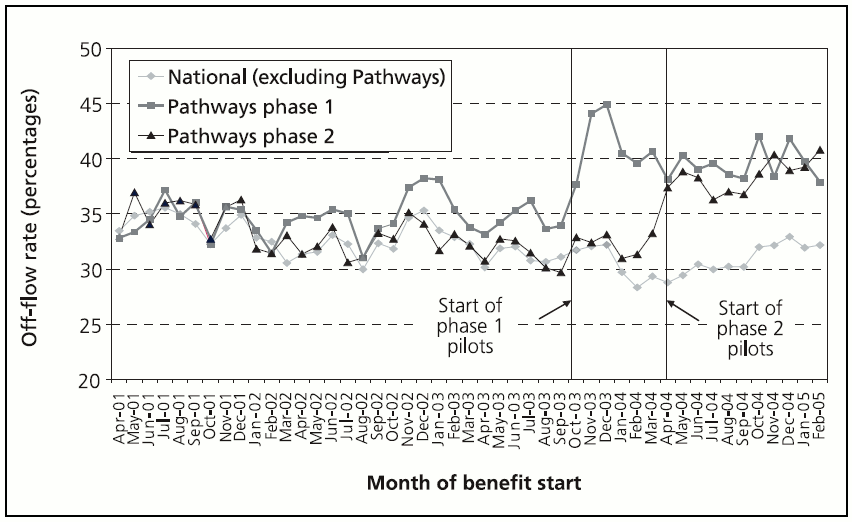{#fig-10-1}

Figure 10.1 Six Month Off-flow Rates (Blyth 2006)
Source: Figure 3.1 of Blyth, B. (2006) 'Incapacity Benefit Reform -- Pathways to Work Pilots performance and
analysis' , Leeds, Corporate Document Services

This graph was reproduced as Figure 2.3 of the DWP Green Paper A New Deal for
Welfare: Empowering people to work, together with the statement that:
Early evidence from the pilots is very encouraging. We are engaging
significantly greater numbers of claimants and substantially improving their
prospects for work. The evaluation so far demonstrates an increase of around
eight percentage points in the number leaving benefits in the first six months of
their claim compared with national rates.293

292

Blyth, B. (2006). Incapacity Benefit reforms - Pathways to Work Pilots performance and analysis.
DWP. Leeds, Corporate Document Services., p. 1
293
DWP (2006). A New Deal for Welfare: Empowering people to work. DWP, The Stationery Office., p. 28

Different versions of the graph have also been published in a variety of other sources.
The earliest version of this graph the author has identified is from 2005, as figure 12 in
the book The Scientific and Conceptual Basis of Incapacity Benefits,294 (discussed in
more detail in the previous chapter), which is reproduced as 

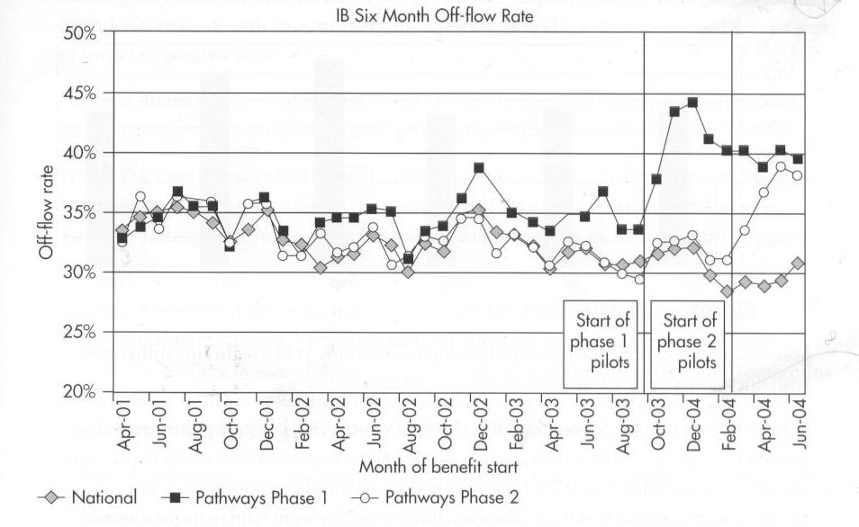{#fig-10-2}

Figure 10.2 below.

Figure 10.2 'IB outflow in Pathways pilot districts compared with non-Pathway*sic+ districts'
Source & title: Figure 12 of Waddell, G & M. Aylward (2005) The Scientific and Conceptual Basis of Incapacity
Benefits, London, TSO

The latest version of the graph I have identified is from December 2006, as shown in

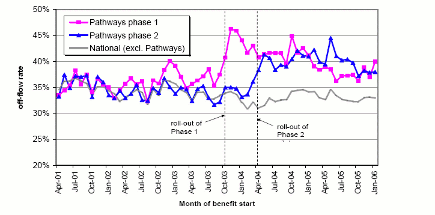{#fig-10-3}

Figure 10.3:

294

Aylward, M. and G. Waddell (2005). The Scientific and Conceptual Basis of Incapacity Benefit. London,
The Stationary Office.

Figure 10.3 'Pathways six month off-flow rate by month of benefit start and pilots phase' (Original image in
colour)
Source and title: Chart 3 of Blyth, B (2006) 'Pathways to Work Performance Summary, December 2006, retrieved 8
May 2007 from http://www.dwp.gov.uk/asd/workingage/pathways2work/pathways_perf_1206.pdf

A version of the graph has been reproduced for the Organisation for Economic
Cooperation and Development (OECD) Economic Survey of United Kingdom, 2005, as
shown in 

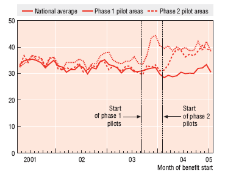{#fig-10-4}

Figure 10.4 and 

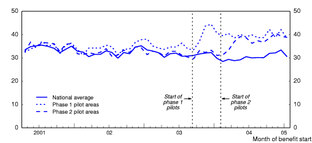{#fig-10-5}

Figure 10.5:

Figure 10.4 '"Pathways to work" increases the off-flow from incapacity benefit (Six month off-flow rate, per
cent)' (Original image in colour) Source and title: Figure 3 of OECD (2005) 'Economic Survey of the United
Kingdom, 2005', retrieved 3 July 2009 from http://www.oecd.org/dataoecd/18/34/35473312.pdf

Figure 10.5 '"Pathways to Work" increases the off-flow from incapacity benefit' (Original image in colour)
Source and title: www.oecd.org (2006), "Pathways to Work", retrieved 1 September 2008 from
http://www.oecd.org/document/47/0,2340,en_33873108_33873870_35461999_1_1_1_1,00.html

Given the prominence of versions of this graph -- which I will refer throughout this
section as a proper noun: „The Graph‟ - in 2005 and 2006, in a number of key
publications meant for consumption by the general public and international economic
interest groups, and each time used to indicate the effectiveness of Pathways to Work in
helping the government towards its economic goals, it would probably not be an
exaggeration or distortion to describe The Graph as „iconic‟ in its political function and
application; in the sense that, when the government wished, during this time period, to
demonstrate the success of the programme, this is the graph used as corroborating
evidence. In this sense, The Graph was employed as a visual rhetorical tool to advance a
particular political course of action.
In order to understand how and why The Graph has been used in this fashion, it will be
helpful to address both what it rhetorically infers, by formalising one‟s intuitive
understanding of „treatment effect‟, and seeing how the graph fits with this intuitive
understanding; and also what The Graph logically implies, by reading the graph and
related materials more carefully, and employing some simple (but unintuitive)
mathematical operations in compound probability.

10.2 Inference
The new few subsections of this chapter will summarise a number of ideas and issues
related to the concept and inference of „treatment effects‟. These will then be applied in
the next section of this chapter to better understand and interpret The Graph.

10.2.1 The Concept of The Treatment Effect
In most tests of economic theory, and certainly for evaluating public policy, the
economist‟s goal is to infer that one variable (such as education) has a causal
effect on another variable (such as worker productivity). […] The notion of
ceteris paribus - which means "other (relevant) factors being equal" -- plays an
important role in causal analysis. […] Holding other factors fixed is critical for
policy analysis[.] […] In most serious applications, the number of factors that
can affect the variable of interest […] is immense, and the isolation of any
particular variable may seem like a hopeless effort. […] However, […] when
applied carefully, econometric methods can simulate a ceteris paribus
experiment.295
Poincaré was the first known big-gun mathematician to understand and explain
that there are fundamental limits to our equations. He introduced nonlinearities,
small effects that can lead to severe consequences[.] […] Poincaré‟s entire point
is about the limits that nonlinearities put on forecasting; they are not an
invitation to use mathematical techniques to make extended forecasts.
Mathematics can show us its own limits rather clearly. […] Poincaré showed
[that the degradation of forecasts compound abruptly] in a very simple case,
famously known as the "three body problem." If you have only two planets in a
solar-style system, with nothing else affecting their course, then you may be able
to indefinitely predict [their behaviour]. But add a third body […] ever so small
[…]. Initially the third body will cause no drift, no impact; later, with time, its
effects on the two other bodies may become explosive. […] Our world,
unfortunately, is far more complicated than the three body problem; it contains
far more than three objects.296
Epistemologically, and given the complexity of the social world, the very idea that we
can reasonably estimate the effect of one variable on another may be foolish. The
problem lies with the definite article: as with the „third body‟, „the‟ effect of A on B
may be small initially, then become „explosive‟ later. Or the converse may occur: „the‟
effect may start large, then atrophy, becoming (apparently) negligible months or years
later; „the‟ effect of A on B may be large in the presence of C, but not otherwise. The
295

Wooldridge, J. M. (2006). Introductory Econometrics: A Modern Approach. Mason, OH, Thompson
South-Western., pp. 13-4, emphasis in original
296
Taleb, N. N. (2007). The Black Swan: The Impact of the Highly Improbable. London, Penguin., pp. 1766

apparently innocent assumption underlying the use of the definite article could be
fundamentally mistaken when one introduces A into a complex, dynamic, nonlinear
social system that contains not only B, but countless other objects whose relationships
with A, with B, with the relationship between A and B, and with one another, can only
be assumed.
However, the notion of „treatment effect‟ is intuitive to us, and appears frequently
confirmed by everyday experiences: flick a switch, and the room changes from gloomy
to bright; drink some water, and go from feeling thirsty to satiated. More formally, and
more generally:

Where

refers to the Treatment Effect of treatment Tr (a binary variable), with

respect to outcome variable Y of object i.
In practice,

can never be known directly, because for any object i, only either
or

is observed. Colloquially: we did something to him, and one

thing happened; and we didn‟t do that thing to her, and another thing happened; but we
don‟t know what would have happened if we didn‟t do that thing to him, and did do it
that thing to her. Technically: half of the data required to know „the treatment effect‟ (if
it exists) is always missing.
10.2.2 Controlling for Variables
„Controlling for‟ variables in a linear regression analysis is a common approach used to
try to work around this problem. The statistician has a dataset containing k + 2 pieces of
quantitative information about n objects; she begins analysing the dataset with the
assumption that there exists a linear relationship between variable Y

and Tr, the

„treatment‟, that exists „on average‟. She thus partitions the dataset into two column
vectors, Y and Tr, each of length n, and an n by k +1 matrix X containing the other
variables, preceded by a column of 1s. Then she states that:

Where

is a scalar value, and

a row vector

Then she uses a mathematical rule to populate
square of the distance between

and

of length k+1.
and

with values that minimise the

, as well as producing measures -- variance

estimates - that identify the degree of precision with which these coefficients have been
identified.
Then, she divides the coefficient

by the square root of its variance, and compares this

value to a list of numbers, known as „critical values‟. If the ratio is above the critical
value, she declares it „statistically significant‟; if it is below, she declares it „statistically
insignificant‟.
If the coefficient is „statistically significant‟, then she will proceed to state something
like, "controlling for [lists some of the pieces of information held in X], the effect of
[variable Tr] on [variable Y] is to increase [/decrease] Y by between [ - 1.96 times its
standard deviation] and [ + 1.96 its standard deviation] [whatever the unit of Y is]."
This statement, which follows from, and is produced by, a sequence of largely
mechanical and algorithmic procedures, is the endpoint of a lot of quantitative social
science (and medical) research.
The level of technical sophistication (or, depending upon perspective, algebraic
alchemy) involved in the above should not distract us from two key points: First, that
the procedure develops from a common intuition that „the treatment effect‟ exists and
should be identified; and secondly, that in operationalising the intuition, a variety of
assumptions have to be made about the social world that may not be valid.
10.2.3 Comparisons
Although „controlling for‟ variables is a relatively simple and standard approach used to
operationalise the intuition of „the treatment effect‟ within statistical investigations, the
way most people try, informally and implicitly, to estimate „treatment effects‟ is by
comparison. For example:
Bill is like Ben. They both went to the same school, listened to the same music,
got the same grades… then Bill met Elle. Now Ben‟s got a degree and a good
job, and Bill‟s got no qualifications and a drug habit… it‟s all Elle‟s fault.
Here the counterfactual is being imputed by matching one observed treated object
(„Bill‟) with another observed untreated object („Ben‟) that is assumed to differ
substantially only to the extent that the former has been treated (to „Elle‟) and the latter
has not. The difference in outcomes between the two objects is thus assumed to result
from the treatment, so producing a treatment effect estimate.

Some of the more sophisticated statistical methods employ the principle of comparisons
too, by using a variety of matching procedures to try to pair each treated datum with a
„similar‟ untreated datum, then trying to find the average difference between pairs with
respect to the outcome variable. Methods such as propensity score matching, and
computationally intensive hill-climbing and genetic algorithms, are used in order to do
this.
10.2.4 Changes over Time
Inductive reasoning suggests that past performance can be indicative of future
performance, and so one of the objects with which an object may usefully be compared
is its past self. If something happens (Tr=1) to an object at time T, and soon afterwards
there is a sudden change in the recorded level of a given quality associated with the
object, then perhaps that change resulted from the treatment.
Of course, as the counterfactual (Tr = 0 at time T) was unobserved, one cannot know if
this would have happened regardless. Mis-attributing a change in an observed outcome
(Y) to a given event (Tr) because the change occurred soon after the event is the fairly
well known logical fallacy of post hoc ergo propter hoc. ("After this, therefore because
of this") However, it is only a fallacy if it, the given event, has been mis-attributed as
cause. Given that the counterfactual is unobserved, it is in practice often difficult to be
confident about whether a particular causal attribution is fallacious, or a legitimate
inference based upon the data available.
10.2.5 Combination
The two approaches described above -- comparing treated objects with „similar‟
untreated objects, and comparing a given object post-treatment with the same object
pre-treatment -- are often combined, in order to try to differentiate the effects of time
(which both „treatment‟ and „control‟ groups of objects incur) from the effects of
treatment (which only the „treatment‟ group incurs).
Within both of the quantitative evaluations of Pathways to Work297, this combined
approach has been operationalised and formalised using linear regression, producing
what is known in various pieces of econometrics literature as the „Differences-inDifferences‟ (DiD) method of evaluation. We will consider this more formalised
combination of various intuitions about causal inference in the „Present‟ section of this
297

Adam, S., C. Emmerson, C. Frayne and A. Goodman (2006). Early quantitative evidence on the impact
of the Pathways to Work pilots. DWP, Corporate Document Services. And: Bewley, H., R. Dorsett and G.
Haile (2007). The Impact of Pathways to Work. DWP. London, Corporate Document Services.

chapter; however, this concept is introduced at this stage because it is, effectively, the
approach used informally by those using The Graph to make judgements about „the
treatment effect‟ of Pathways to Work on Incapacity Benefit claimants.

10.3 Inferring Treatment Effects from The Graph
The Graph indicates to the viewer a treatment effect because it compares two groups --
collections of jobcentre plus districts -- that have been „treated‟ with Pathways to Work
with:
Themselves, before treatment;
Each other, before and after treatment;
Control regions (everywhere else), before and after treatment.
In this sense, it informally and visually presents a Difference-in-Differences argument
for the existence of the treatment effect.
The treatment effect -- the increase of around eight percentage points - is estimated by
simply comparing the difference between both regions after becoming Pathways to
Work regions, with the control regions.
The issue of the unobserved counterfactual is ultimately intractable, and applies to all
treatment effect evaluations. With the five graphs presented, that together constitute The
Graph, there are also one or two additional, more specific, difficulties with attributing a
treatment effect to Pathways to Work. We can see this by describing each of the five
graphs in more detail, in order to identify both similarities and differences between
them.
With figure 10.1, from the 2006 DWP working paper, the scale of the vertical
axis is from 20% to 50%. The horizontal axis is from April 2001 to February
2005, and displays a datapoint for each month. Phase one treatments are
identified as beginning at the end of September/start of October 2003; and phase
two treatments are identified as beginning at the end of March/start of April
2004. For phase one regions, the off-flow rate appears somewhat higher than
those of the other two, by around two to four points for each month from around
December 2002 onwards: i.e. there already appears to be a small, but consistent
difference between these regions and all others, almost a year before the start of
the pilot programme. After phase one treatment, there is a noticeable rise from
around 34 points in the previous month, to a peak of 45 points two months after

the start of the pilot; this then declines to around 38-40 points from around
January 2004 onwards. For phase two regions, there is a similar longer-term rise,
to around 37-40 points from May 2004 onwards. However, most of this rise,
compared to control regions, occurs in the three months before the start of
treatment, in the period February-April 2004.
With figure 10.2, produced earlier in a less publically available source, the
vertical axis scale is also from 20% to 50%. The horizontal axis is from April
2001 to June (or perhaps July) 2004: a datapoint appears to be plotted for each
series, for each month, but the labels on the horizontal axis are slightly more
ambiguous, in that it is not immediately obvious whether a given month refers to
one of the tick-marks just before the labels, or to the labels themselves. (Also,
half of the months are unlabelled.). Assuming that the datapoints correspond to
the labels, the graph indicates that phase one pilots began at or after September
2003; and phase two pilots began at or after February 2004. The phase two start
date implied in thus differs from that implied in, and official statements, that
phase two began in April 2004. The effect of (apparently) shifting the start date
of the phase two pilots forwards by two months in is to give the impression that
most of the rise in off-flow levels occurred immediately after the treatment, even
though, with the correct start date, shows this rise to occur immediately before
the treatment. Aside from this difference, the datapoints plotted on the two
graphs are generally very similar, although not exactly the same, with some
slight differences some datums:298 this appears to be the result of occasional
update and corrections to the database figures themselves,299 rather than a visual
illusion, but do not appear so severe as to invalidate the general interpretation of
the data.
Figure 10.3, an update of figure 10.2, displayed in a Performance Summary
written by the same author as the Working Paper, and the last known update of
The Graph, also uses a vertical range of 20% to 50%, also begins from April
2001, and continues until January 2006. Interestingly, there has been a subtle but
significant rise in the values plotted for both control and treatment regions, and
perhaps of greater magnitude for the former than for the latter: for example,
298

For example: the three phase one datapoints for phase one regions between November 2002 and
January 2003 are each around 37-38% in figure 10.1, but within figure 10.2 only the December 2002
point appears to be near this level.
299
Within each of updates of the Pathways to Work Performance Summaries, there is an appendix
containing a wide range of measures: within each update, the values for each month tend to be slightly
different.

within figure 10.1 the off-flow rates fell below 30% between January and July
2004, but within figure 10.3 no value for any of the series is below this level. As
with figure 10.1, the majority of the rise in off-flow rate that occurs in phase two
regions begins around two to three months before the treatment; but within
figure 10.3, unlike figure 10.1, it also appears that much of the rise in phase one
region off-flow rates occurred in the months preceding treatment, with increases
occurring in six of the previous seven months, but only three of the seven
months after treatment.
Figures 10.4 and 10.5, the two versions of The Graph submitted to the OECD in
its economic evaluation of the UK, has a vertical axis ranging from 0% to 50%,
which is perhaps less misleading than the 20% to 50% range used in the
previous graphs, as it is less likely to visually infer a misleadingly large effect
magnitude. As no datapoints are plotted, only the lines connecting them, and as
months are not labelled, it is difficult to tell whether the datapoints plotted lie on
the tickmarks, or between them; assuming that they lie between them, the period
of observation plotted ranges from April 2001 to January 2005. If this is true,
then the graph identifies phase one treatments as beginning between the end of
August and the start of September, 2003; and phase two treatment beginning
between the end of January and start of February, 2004. As with figure 10.2, the
initiation of phase two treatment appears to have been shifted forwards by two
months, in order to suggest that most of the rise in off-flow rates for these
regions occurred immediately after, rather than immediately before, the
treatment.
Pedantic though some of these observations may appear, they are important when
assessing the validity of the claim -- made implicitly and visually using The Graph itself,
and explicitly and verbally within some accompanying commentaries -- that Pathways
to Work has a substantial and unequivocal effect of the type intended.
10.3.1 Axis Scales
The choice of axis scale has, potentially, a great influence on the likely interpretation of
graphically represented data, as shown in 

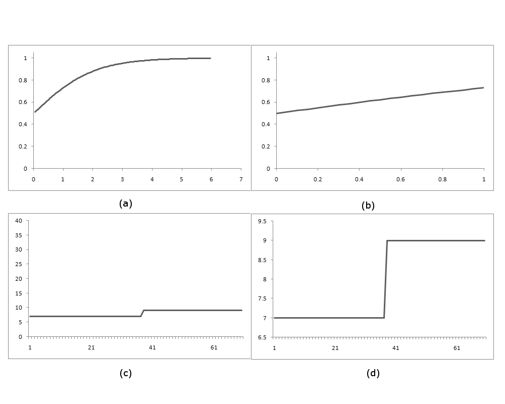{#fig-10-6}

Figure 10.6. The apparent magnitude of an
effect can either be made to appear much inflated, or much reduced, depending upon the
scale of reference used; the use of a vertical scale ranging from 20% to 50%, in figures
10.1, 10.2, and 10.3, rather than, say, 0% to 50% (used in figures 10.4 and 10.5), or 0%
to 80%, thus makes the effect size appear larger than it would appear with larger range.

Figure 10.6 Examples of the importance of scale
Sub-figures (a) and (b) differ only with respect to the vertical axis used. Sub-figures (c) and (d) differ only with
respect to the horizontal axis used

10.3.2 The Rising Trend in Control Regions
The later graphs appear to show the control regions rising faster than the treatment
regions. This can probably be explained by the expansion of the Pathways to Work
programme to non-pilot areas from October 2005 onwards: If more of the comparison
areas begin to adopt Pathways strategies, and Pathways has a substantial effect, then
would expect that the comparison areas begin to rise to the level of the Pathways pilot
areas. This is similar to the reason given for discontinuing updates of The Graph, as
stated in the November 2006 update of the performance summary, the last to contain
The graph, which states that:
8.3. The internal comparative analysis of off-flow rates between Pathways and
non-Pathways areas was designed to provide an initial indication of the effects
of the programme, prior to the formal evaluation evidence becoming available.
Whilst it provides a clear snapshot of the impact from the early months of the
pilot, the comparison with non-Pathways areas becomes less relevant over time

as the number of non-Pathways areas reduces and other initiatives are
introduced. We therefore do not intent to update this analysis in future
versions of this publication. The Pathways evaluation will assess the longer
term impact of Pathways. This is due for publication in 2007.300
The report referred to at the end of the paragraph is that produced by Helen Bewley and
colleagues at the Policy Studies Institute,301 which will be the main focus of the
„Present‟ section of this chapter.
10.3.3 Shifting Start Dates and Anticipatory Treatment Effects
A more substantial concern with some of the graphs (Figures 10.2, 10.4 and 10.5) is the
apparent shifting of the start date of the second phase to February 2004, in order to
make „apparent cause‟ and „apparent effect‟ appear to be in the correct temporal order
(i.e. with the former occurring prior to, rather at the same time as or after, the latter),
even though the start date for phase two pilots was unambiguously and consistently
stated elsewhere as beginning in April 2004. The versions of The Graph produce in inhouse publications appear to exhibit this „temporal ordering problem‟, for phase two
pilots, and perhaps also for phase one pilots, that appears to invalidate common-sense
intuitions about cause and effect; the version submitted to the OECD, however, does
not. Whether by accident or otherwise, the version of the graph submitted as evidence of
the success of the programme to the „international economic community‟ appears,
through this adjustment to the time-line, to disguise an issue with inferring a consistent
treatment effect for both groups of pilot regions that is apparent in other graphs meant
for less „prestigious‟ audiences.
The existence of Effect-before-Cause does not, necessarily, completely invalidate the
argument that Cause is causing Effect. When discussing the phase two pilots „temporal
ordering issue‟ with Duncan McVicar, a labour economist with a strong interest in
incapacity benefit patterns, I was directed to a 2003 paper by Dan A. Black and
colleagues,302 which appears to identify an „anticipatory treatment effect‟ within a
similar US labour market intervention conducted in the state of Kentucky in the mid
1990s. „Treated‟ Unemployment Insurance (UI) claimants are provided a range of
300

Blyth, B. (2006). Pathways to Work Performance Summary, December 2006. DWP., Emphasis in
original
301
Bewley, H., R. Dorsett and G. Haile (2007). The Impact of Pathways to Work. DWP. London, Corporate
Document Services.
302
Black, D., J. Smith, M. Berger and B. Noel (2003). "Is the Threat of Reemployment Services More
Effective than the Services Themselves? Experimental Evidence from the UI System,." American
Economic Review 93(4): 1313-1327.

services, designed to improve their labour market „orientation‟. Around a week before
the intervention, the UI claimants are informed of this by letter. The paper concludes
that the letter, warning claimants of the intervention, appeared to have a greater
„treatment effect‟ (on the probability of leaving UI) than the intervention itself.
Analogously, with respect to Pathways to Work, one could imagine that employees of
Jobcentre Plus offices, when informed that they have been selected as an area where an
important new government policy will be trialled, whose intended outcome is to
increase the Incapacity Benefit off-flow rate, may take action to try to improve the IB
off-flow rate before the official start of the scheme; they may, for example, offer more
forthright encouragement for new IB claimants to leave the benefit than they would
have done otherwise. This explanation has not, however, been offered within
government documents regarding the impact of Pathways, and for this reason the
existence of Effect-before-Cause remains a prominent, unexplained anomaly when
considering The Graph as evidence for the Treatment Effect.

10.4 Off-flow Rates and Number Needed to Treat
I will now attempt to infer the likely substantive meaning of the treatment effect
claimed above. I will do this by trying to convert between the metric displayed above,
off-flow rates, and the epidemiological measure of effectiveness, Number Needed to
Treat (NNT),303 which I will define as follows:

Technically: the reciprocal of the modulus of the difference in outcome probabilities
between treated and non-treated groups. More colloquially, to use a description within
the British Medical Journal: "In a trial comparing a new treatment with a standard one,
the number needed to treat is the estimated number of patients who need to be treated
with the new treatment rather than the standard treatment for one additional patient to
benefit. It can be obtained for any trial that has reported a binary outcome."304
Converting between probabilities and NNT does not mitigate any of the epistemological
issues associated with calculating and assuming treatment effects. However, it does
303

See Cook, R. J. and D. L. Sackett (1995). "The number needed to treat: a clinically useful measure of
treatment effect." British Medical Journal 310: 452-454.
304
Altman, D. G. (1998). "Confidence intervals for the number needed to treat." Ibid. 317: 1309-12.,
Cook, R. J. and D. L. Sackett (1995). "The number needed to treat: a clinically useful measure of
treatment effect." British Medical Journal 310: 452-454.

provide a much more intuitive and meaningful description of the substantive
implications that follow if one assumes the treatment effects calculated are true. People
do not, in their daily lives, encounter percentages and fractions of a person, but they do
encounter groups of other people, and NNT describes the treatment effects in terms of
these groups of other people.
Table 10.1 presents a range of estimates, based upon figures 10.1, 10.2 and 10.3, for the
level of off-flow for control regions, and for the two treatment regions, after treatment.
This range of values is required in order to provide an indication of the range of realistic
values for the NNT; a lower limit of this range (an so, for NNT, the „best case scenario‟)
can be calculated by comparing the upper estimate for the treatment region percentage
with the lower limit for the control; and the upper limit (the „worst case scenario‟) can
be calculated by doing the converse.
Figure
10.1
10.2
10.3

Min
28%
28%
32%

Control
Mid
31%
29%
33%

Max
33%
31%
34%

Treatment 1
Min
Mid
Max
38%
40%
45%
39%
40%
45%
37%
40%
46%

Treatment 2
Min
Mid
Max
37%
39%
40%
39%
39%
39%
37%
39%
44%

Table 10.1 Six month off-flow rate estimates, control & treatment regions
Sources: See figures 10.1, 10.2, and 10.3

Table 10.2 presents, to the nearest integer,305 the NNT estimates produced based upon
these three graphs. For each graph, a low, middle, and high estimate is produced, for
both the phase one (NNT 1) and phase two (NNT 2) pilot regions. These have then been
averaged in order to produce indicative figures for low, middle, and high overall NNT
estimates.
Figure
10.1
10.2
10.3
Overall

Min NNT estimates
T1
T2
T
7
11
9
6
10
8
8
9
8
Low estimate: 9

Mid NNT estimates
T1
T2
T
11
13
12
9
10
10
14
17
15
Middle estimate: 12

Max NNT estimates
T1
T2
T
20
25
23
13
13
13
33
33
33
High estimates: 23

Table 10.2 Six month off-flow Number Needed to Treat estimates
T1: phase 1 pilot; T2: phase 2 pilot; T: average of phase 1 and phase 2
Sources: see figures 10.1, 10.2, and 10.3

305

The use of integers follows from the intuitive, common sense meaning of the NNT estimate. Whole
numbers tend to be easier to visualise and comprehend than fractions, and persons asked to solve
problems involving risks and probabilities tend to perform better if the problems are framed in terms of
'natural frequencies' -- for example, the number of persons per 1,000 persons, to a whole number --
than as percentages. (See, for example Gigerenzer, G. (2003). Reckoning with Risk: Learning to Live with
Uncertainty. London, Penguin.)

The overall NNT estimates range from around 9 persons to 23 persons, with a central
estimate of 12. This suggests that, for every 12 new claimants „treated‟ by Pathways to
Work, one more claimant will make the transition off incapacity benefit within six
months than in comparable, non-Pathways areas.
10.4.1 Proxy Measures and Intended Outcomes
However, the outcome measured is not, quite, the outcome desired by the DWP. All
versions of The Graph plot, according to the working paper from which [X] is taken,
"Pathways six month off-flow rate by month of benefit start and pilots phase."306 This is
the proportion of new claimants and repeat claimants who start their benefit in a
particular month, and then are not on that benefit six months later. This measure is a
proxy for the outcome of interest: the proportion of claimants who make the transition
onto employment.
Unfortunately, this outcome is not known, because The Graph is based on
administrative, incapacity benefits data307, and so does not track the status of all
claimants when they leave the system. Instead, this has to be inferred from survey data.
As the working paper states, The Graph:
is not yet conclusive evidence of an overall impact on off-flows or employment
-- for example, the gap may reduce in later months(i.e. nine- and twelve-month
off-flows) and this will be assessed in future. However, the Destinations of
Benefit Leavers 2004 survey shows that 56 per cent of IB leavers in Pathways
districts enter employment of 16 hours or more. This is consistent with the
national IB figure. This indicates that the increase in off-flows is not resulting in
a disproportionately high movement of people onto other benefits.308
Both of the issues raised here -- the longer term treatment effects, and the employment
outcomes of benefits leavers -- are important to consider. The former issue could, in
theory, either reduce or increase the treatment effect size, in that longer term treatment
effects may be either larger or smaller than shorter term treatment effects. The latter

306

Blyth, B. (2006). Incapacity Benefit reforms - Pathways to Work Pilots performance and analysis.
DWP. Leeds, Corporate Document Services., p. 9
307
According to Ibid. (p. 9), the National Benefits Database
308
Ibid. p. 10

issue, however, can only reduce the effective size of the treatment,309 and conversely
increase the NNT estimate.
The report for the survey mentioned above, the Destination of Benefit Leavers 2004
survey, contains the proportion stated above, 56 per cent, in table 3.16; this comprises
54% for phase one regions, and 57% for phase two regions.310 (N= 2127) It also states,
in table 3.1, that the proportion of IB leavers entering employment of 16 hours more
nationally was 52 per cent.311 (N=6295) If we use these figures then the estimated NNT,
for the intended outcome „enters employment of 16 hours or longer‟ (rather than the
proxy outcome of „is not on IB 6 months from start of claim‟), becomes:

The result of including this additional stage is indicated in Table 10.3. This changes the
„low‟ estimate from 9 to 13; the „middle‟ estimate from 12 to 18; and the „high‟
estimate from 23 to 27.
Figure
10.1
10.2
10.3
Overall

Min NNT estimates
T1
T2
T
12
15
14
11
14
12
13
13
13
Low estimate: 13

Mid NNT estimates
T1
T2
T
18
16
17
15
14
15
23
20
21
Middle estimate: 18

Max NNT estimates
T1
T2
T
30
25
28
20
16
18
43
29
36
High estimates: 27

Table 10.3 Pathways NNT estimates for employment outcome estimates, assuming 54% 'conversion' in phase one
and 57% in phase two regions
T1: phase 1 pilot; T2: phase 2 pilot; T: average of phase 1 and phase 2
Sources: see figures 10.1, 10.2, and 10.3

The result of making the slightly „harsher‟ assumption that, because the national figures
of 52% are based upon a larger sample size than the figures for comparable figures of
54% and 57% for the two pilot regions, the 52% figure should be assumed to be a better
estimate of the „true‟ value for pilot regions as well as other regions, increases the
estimated NNT even further, to 16, 24, and 44 for „low‟, „middle‟, and „high‟
respectively. This is shown in Table 10.4.

309

This follows from the logic of compound probability: P(B | A) =

which is always smaller than

(or in the limiting case where either P(A) or P(B) = 1, equal to) either P(A) or P(B).
310
Coleman, N. and L. Kennedy (2005). Destination of benefit leavers 2004. D. f. W. a. Pensions. Leeds,
Corporate Document Services., p. 39
311
Ibid., p. 21

Figure
10.1
10.2
10.3
Overall

Min NNT estimates
T1
T2
T
14
21
18
12
19
16
15
17
16
Low estimate: 16

Mid NNT estimates
T1
T2
T
21
24
23
17
19
18
27
32
30
Middle estimate: 24

Max NNT estimates
T1
T2
T
38
48
43
24
24
24
64
64
64
High estimates: 44

Table 10.4 Pathways NNT estimates for employment outcome estimates, assuming 52% 'conversion' in all regions
T1: phase 1 pilot; T2: phase 2 pilot; T: average of phase 1 and phase 2
Sources: see figures 10.1, 10.2, and 10.3

The results indicate a significant degree of uncertainty as regards what the substantive
effect of the programme actually is, even within the relatively short term. They also
indicate that, irrespective of whether one adopts a „best case‟ or „worst case‟ scenario, it
seems that one would have to engage in the fairly labour intensive (and thus costly)
process of „treating‟ a lot of people in order to get one additional person in employment.

10.5 Cost Per Successful Intervention: an illustrative approximation
In order to produce an estimate of the cost per successful intervention one needs to
produce plausible estimates for a lot of other quantities. Each of these estimates is
subject to substantial uncertainty, and so can at best produce a cost estimate that is
indicative of the order of magnitude of cost, rather than something more precise. In this
illustration, I will make the following assumptions:
1. The IBPA earns £20,000 per annum.312
2. For this she works 47 weeks of the year,313
3. And works for 5 days a week, 8 hours a day (a 40 hour week),314
4. And has, on average, one Work-focussed Interview per hour.315
312

The position of IBPA trainer is, at the time of writing (2 May 2008), advertised on the website
www.fecareers.co.uk for "£19000 - £21000 Per Annum + Bonuses". (See www.fecareers.co.uk. (2008).
"Personal Job Advisor, Tutor / Trainer."
Retrieved 2 May, 2008, from
http://www.fecareers.co.uk/jobboard/cands/jobview.asp?v=497971.) After this initial estimate was
produced, the author identified a passage in a Select Committee report indicating that the average
trainer him- or herself receives, on average, just £12,000 per annum, but also that this level may be too
low to attract suitable applicants, and so may be raised (see www.parliament.uk (2006). Incapacity
Benefits and Pathways to Work: Third Report of Sessions 2005-06. H. o. C. W. a. P. Committee. London,
The Stationery Office. Vol 1., para. 221). Within the following parentheses, I will include estimates based
upon this lower, £12,000 figure, in addition to the £20,000 figure initially assumed.
313
According to the website, "HR in a box", "out of the 52 weeks in the year an employee is entitled to
take 4.8 weeks off, so will work 47.2 weeks". (See www.hr-in-a-box.co.uk. (2008). "Statutory Holiday
Entitlement - New Rules." Retrieved 2 May, 2008, from http://www.hr-in-a-box.co.uk/holiday.php.)
314
The ESRC-funded Website, www.tomorrowproject.net, summarising labour force survey data, states
that the average number of hours worked by full time employees in the UK in 2005 is 42.6 hours per
week, which is the highest average rate in Europe, but has been slowly declining since the late 1990s.
(See www.tomorrowproject.net. (2008). "The story so far."
Retrieved 2 May, 2008, from
http://www.tomorrowproject.net/pub/1__GLIMPSES/Employment/-285.html.)

5. The average claimant attends two WFIs.316
6. The IBPA has to interview 18 claimants (the NNT) in order to get one extra
person in employment.
Then it takes, on average, 36 hours worth317 of interviews in order to get one extra job
outcome. I.e. it takes almost a full working week to get one extra person in employment.
The cost of the IBPA‟s labour alone would thus be around £400318 per successful
transition.
At the short-term (lower rate) at which IB is paid,319 this would be equivalent to around
6 weeks‟ benefit;320 at the higher long-term basic rate,321 this is closer to four and a half
weeks‟ benefit payment322. Assuming that a £40 Return to Work Credit (RTWC) is
paid, then it would take almost 17 weeks323 to recoup the costs of a successful
intervention at the lower rate, and around 9 weeks324 at the higher rate.
The only costs assumed in the above are for the IBPA and the RTWC. All other costs
associated with the process -- such as general administrative costs for processing
claimants within the Jobcentre Plus Offices -- are assumed to be negligible. Even with
this unrealistically optimistic assumption, it becomes apparent that one cannot be sure
315

This figure has been assumed largely for mathematical simplicity. However, a 2006 National Audit
Office (NAO) report states that "the average interview length with a Personal Advisor is 41 minutes",
and so the one hour estimate appears to be broadly valid, if not, given the length of time spent between
interviews the number of non-attendances, fairly 'generous'. (See NAO (2006). Jobcentre Plus:
Delivering Effective Services through Personal Advisers., p. 14. Cited in Davies, S. (2008). "Contracting
out employment services to the third and private sectors: A critique." Critical Social Policy 28(2): 136164.)
316
This estimate is based upon data on numbers of initial and repeat WFIs listed in the appendices of
various Pathways to Work performance summary reports, for the period June 2005 to May 2007.
Assuming that WFIs are approximately monthly, then a claimant who attends the initial WFI in month N
will attend the second WFI in month N+1, the third WFI in month N+2, and so on. Lagging the Kth WFI K
months back thus creates a crude 'pseudo cohort' for each month's new IB claimants. Multiplying these
WFI attendee numbers by the number of WFIs an IB claimant will have attended by the time they have
finished that WFI (e.g. 3 for the second repeat WFI), then dividing by the total number of WFIs thus
produces an estimate for average number of WFIs attended per claimant. This estimate was 2.12 (to 2
decimal places).
317
Assumption 5 multiplied by Assumption 6
318

per successful

outcome; or alternatively £229.79 (2 d.p.) per outcome if one assumes the IBPA earns £12,000 per
annum but works the same number of hours
319
£63.75 per week
320
; assuming a £12,000 salary this estimate changes to 3.6 weeks
321
£84.50 per week
322
; assuming a £12,000 salary this estimates changes to 2.7 weeks
323
324

; assuming a £12,000 salary this changes to 9.7 weeks
; assuming a £12,000 salary this changes to 4.2 weeks

that, from the perspective of the DWP‟s accounts, the net financial benefits of the
programme will outweigh the costs.

10.6 Aggregate Effects
More than half of the 2.4 million people claiming incapacity benefit have been
off work for more than five years, new figures have revealed. The damning
statistics contradict Government assurances that the problem of widespread
incapacity claims is being tackled by getting the long-term sick back to work.
The official figures from the Department for Work and Pensions, unearthed by
the Conservatives, show that the proportion of long-term incapacity benefit
claimants has risen steadily in recent years. […]
In 2005, the Government announced plans to reduce the number of people
claiming incapacity benefit by one million, with claimants considered to have
only minor ailments threatened with benefit cuts if they did not try to find
suitable work. The Welfare Reform Act, passed this year [2007], also paves the
way for a detailed review of each incapacity benefit claimant's medical condition
before being given personalised support and advice aimed at returning them to
work. […]
Chris Grayling, the shadow work and pensions secretary, who uncovered the
figures, said they were a damning indictment of Labour's record on welfare
reform. "This is a depressing demonstration of the failures of the Government's
welfare to work programme," he said. "We keep hearing grand announcements
about helping people off incapacity benefit back into work but, when you read
the small print in the statistics, you find it's just not happening. Once again, you
just can't trust what this Government is saying".
Caroline Flint, the welfare reform minister, said: "The number of people on
incapacity benefits is falling after two decades of substantial growth and is the
lowest it has been for seven and a half years."325
In the previous part of this chapter, I have shown how the Department for Work and
Pensions, working under a (nominally) centre-left Labour government, has selectively
employed administrative statistics in order to suggest that Pathways to Work is, in
325

www.telegraph.co.uk. (2007). "Incapacity benefit claims still on the rise." Retrieved 6 May, 2008,
from http://www.telegraph.co.uk/news/newstopics/politics/1567016/Incapacity-benefit-claims-still-onthe-rise.html.

general, an effective and successful policy. In the above extract, from the website of a
British right-wing newspaper, administrative statistics have been selectively employed
in order to suggest the converse: that Pathways to Work is, in general, an ineffective and
unsuccessful policy.
These two opposing positions can both be supported by the same body of statistics
because different outcomes are being assessed. The numbers used by the DWP are with
respect to new claimants, as the Pathways programme, during the period of assessment,
has only been applied to those making new or repeat claims. Conversely, the numbers
used in the above article refer to aggregate statistics. Within this section, we will
attempt to uncover the effect the former has had, and is likely to have, upon the latter;
i.e: the extent to which apparent changes to new claimants numbers, as a result of
Pathways to Work, have had, and are likely to have, an effect on overall IB claimant
numbers.
In order to do this, it will be helpful to consider a variety of aggregate IB statistics, so as
to see how such numbers have changed over time. This will help us try to distinguish
between changes that are more likely, and less likely, to be the result of Pathways to
Work.
I will begin by considering the main claim made in the above article: that more "than
half of the 2.4 million people claiming incapacity benefit have been off work for more
than five years".326 Such statistics, contrary to the inference made in the article, are
freely available for all to view on the official labour market statistics website,
www.nomisweb.co.uk.327 

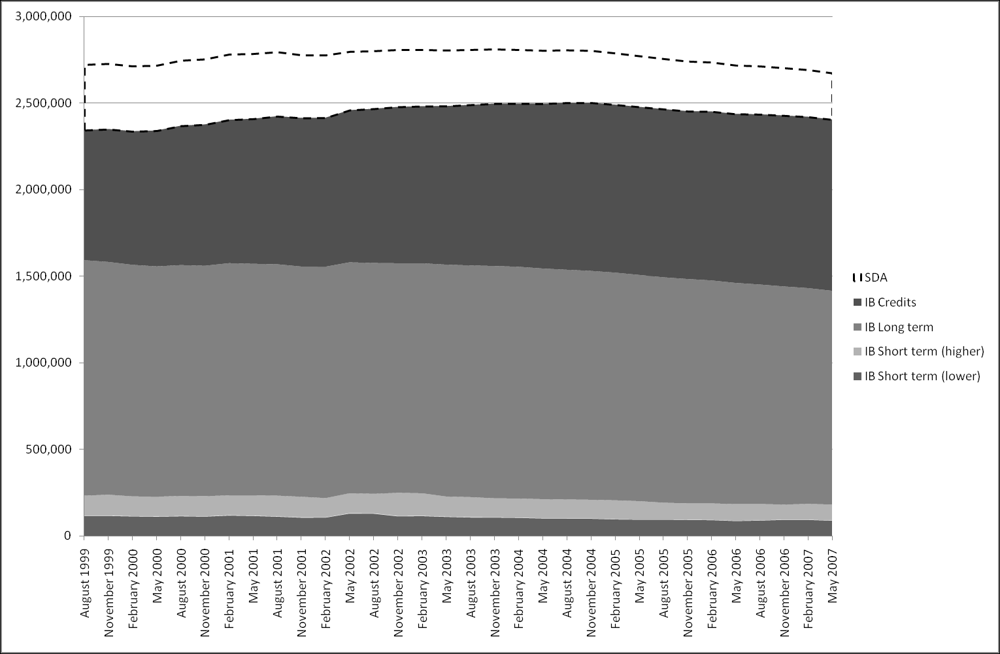{#fig-10-7}

Figure 10.7 presents the total number of persons, within the
United Kingdom, claiming one of the three types of IB (Lower short-term rate; higher
326

Ibid.
Up until May 2007. The Nomis website states that:
The release of August 2007 DWP benefits data, scheduled for Wednesday 13 February 2008,
has been delayed. Therefore, May 2007 figures will remain the most recent statistics available.
In light of the announcement by the Chancellor of the Exchequer last November about data
transfer and security at HMRC, the DWP Permanent Secretary announced a review of how DWP
transfer data. Whilst the review was ongoing, a temporary suspension of any movement of
data was introduced.
This temporary data transfer freeze meant that not all of the data that would be used to
compile the statistics was complete or up-to-date.
Data is gradually being restored and updates will be released as soon [sic.] possible.
Source: www.nomisweb.co.uk. (2008). "DWP benefits: release of August 2007 figures delayed."
Retrieved
8
May,
2008,
from
https://www.nomisweb.co.uk/articles/showArticle.asp?title=&article=news/080207_dwp.htm..
The August 2007 may be the figures that the Conservative minister mentioned in the article has
'unearthed'. However, they could simply be the May 2007 figures already available, as these also
support the assertions made in the article.
327

short-term rate; long-term rate), or IB Credits, or Severe Disablement Allowance
(SDA).328

Figure 10.7 Total number of IB/SDA claimants by claimant type, August 1999 - May 2007
Source: www.nomisweb.co.uk, retrieved 6 May 2008

The first point to note is that, in order to arrive at the figure of 2.4 million IB claimants
overall, the SDA numbers appear to have been excluded, but the IB Credits numbers to
have included. IB Credits claimants are those who do not have sufficient National
Insurance (NI) contributions to be eligible to IB, although have been assessed as
incapable of work. "They do not receive any IB payment but their National Insurance
account is credited for the duration of the claim. They are referred to as claimants but
are not beneficiaries (they are getting no monetary benefit)."329 IB Credits claimants
have grown steadily since late 1999, from around three quarters of a million in August
1999,330 to almost one million in May 2007.331 During this period, when IB credits

328

No one has been eligible to claim SDA since April 2001. (Source: www.jobcentreplus.gov.uk. (2008).
"Customers: Working Age Benefits: Severe Disablement Allowance (SDA)." Retrieved 6 May, 2008, from
http://www.jobcentreplus.gov.uk/jcp/Customers/WorkingAgeBenefits/Dev_008431.xml.html.)
329
www.nomisweb.co.uk. (2008). "Benefits payments - incapacity benefit/ severe disablement - benefit
type
information."
Retrieved
6
May,
2008,
from
https://www.nomisweb.co.uk/query/advanced.aspx?Session_GUID={FE5AE536-9F97-4D17-BC3075F80651C2EA.
330
753,420 claimants
331
991.850 claimants

levels rose by around 238,000 claimants,332 the contributory IB Long term claimant
numbers reduced by around 126,000, from around 1.36 million to 1.23 million.333 Thus
the former rates have risen around twice as fast as the latter rates have fallen.
The second point to note is that IB Credits and Long Term IB claimants, which include
the claimants whose duration of claim has been in excess of five years, represent the
vast majority of the claimant population. Conversely, Short Term IB claimants, which
include the new claimants who will be treated with Pathways to Work, represent only a
small, and declining, proportion of all claimants.334

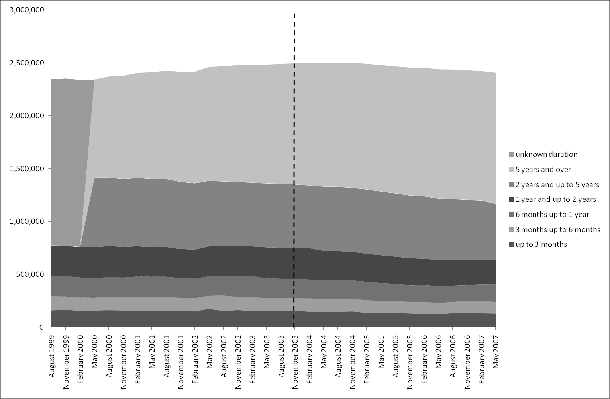{#fig-10-8}

Figure 10.8 plots the total number of IB (Short Term, Long Term, and Credits)
claimants by duration of claim, in Great Britain, from August 1999 to May 2007. A
vertical dashed line is shown to indicate when Pathways to Work was first introduced.

Figure 10.8 Total number of IB claimants (including IB Credits but excluding SDA) by duration of claim, August
1999 - May 2007
Source: www.nomisweb.co.uk, retrieved 6 May 2008

Looking at this graph, it is hard to discern any specific impact of Pathways on overall
claimant numbers, but a longer term trend seems apparent: the proportion of all IB
332

238,430 claimants
August 1999: 1,359,810 claimants; May 2007: 1,234,040 claimants; difference: 125,770 claimants
334
As a proportion of all non-SDA claimants, IB Short Term (Higher) and IB Short Term (Lower) claimants
represented between 9.0 % and 10.1 % of claimants during the period August 1999 to May 2003;
steadily falling thereafter to around 7.5% by May 2007.
333

claimants who have been on IB for five years or over appears to be increasing. This is
confirmed in 

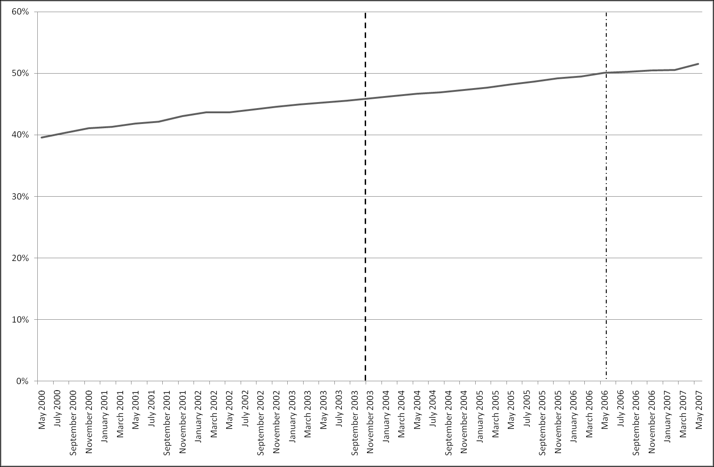{#fig-10-9}

Figure 10.9, which shows claimants who have been on IB for five years or
longer as a percentage of all claimants.

Figure 10.9 Proportion of all IB claimants (including IB credits, excluding SDA) who have been on IB for 5 years or
over, August 1999 - May 2007
Source: www.nomisweb.co.uk, retrieved 6 May 2008

Figure 10.9 also indicates something else: that this value first exceeded fifty percent at
or soon after May 2006, over a year before the date335 the article was published, and so,
in a sense, the fact that more than half of the IB claimant claimants had been on benefits
for this length of time was not „news‟ in the sense of having been a recent development.
With respect to these aggregate statistics, Pathways to Work appears to have done
nothing either to increase nor to decrease this trend.
The particular metric focussed on within the article is, to an extent, a „harsh‟ and
inappropriate choice for evaluating the success of Pathways to Work. This is because,
given that Pathways is directed towards new claimants, any programme success would
increase the proportion of total claimants who have been on IB for five years or longer,
provided the number claimants who have been on IB for five years or longer has
remained static. Given this, an increase in this metric could actually indicate the
success, rather than failure, of Pathways.
335

24 October 2007

In order to determine whether this appears to be the case, let us look at trends in IB
numbers by duration of claim. This is shown in 

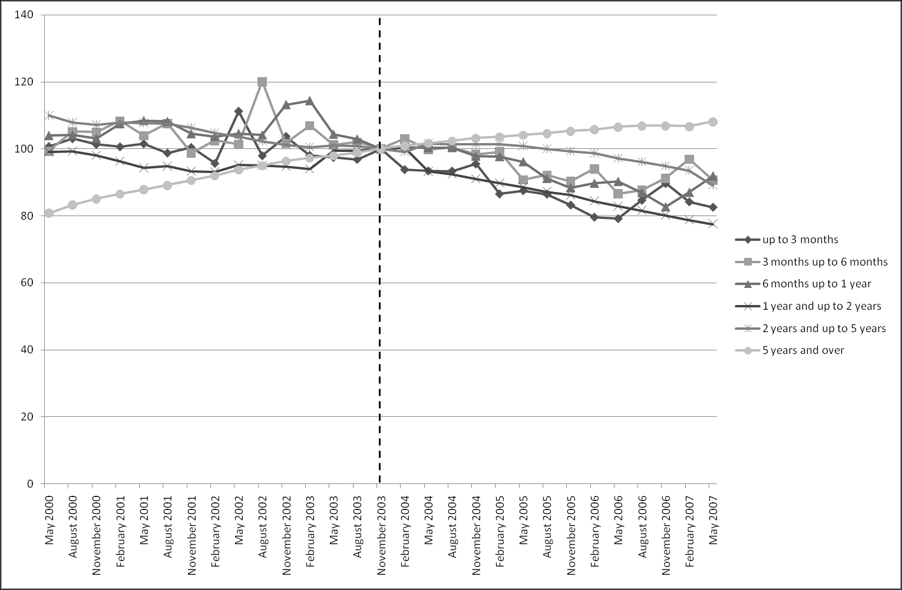{#fig-10-10}

Figure 10.10, where numbers for each
duration type are indexed to their level in November 2003 (the time Pathways to Work
was first piloted).

Figure 10.10 Trends in IB numbers by duration of claim, August 1999 - May 2007, indexed to November 2003
(Pathways Pilot) levels
Source: www.nomisweb.co.uk, retrieved 6 May 2008

In broad terms: the trends are upwards for the five-year-and-over duration, and
downwards for all other durations. Amongst these other durations, there appears to be
no consistent difference between the up-to-three-months duration, the three-to-sixmonths duration, and the six-to-twelve-months duration; but the one-to-two-years
duration appears to have dipped more sharply than the two-to-five-years duration.
Additionally, there appears, visually, to be no significant difference in the trends after
the initial introduction of Pathways to work, as compared to before.336

336

A relatively simple statistical test to determine if such an effect exists is to compare the fit of a
'restricted' linear regression model, that regresses the outcome on time (i.e.
), with an
'unrestricted' model that also regresses the outcome on a dummy variable indicating whether Pathways
has been initiated (i.e.
, where D is 0 for observations up until November 2003, and 1
thereafter). As
is technically 'nested within'
one can check for a statistically significant
difference between the models using an F-test, with one degree of freedom, on the difference between
the residual sums of squares between the two models.



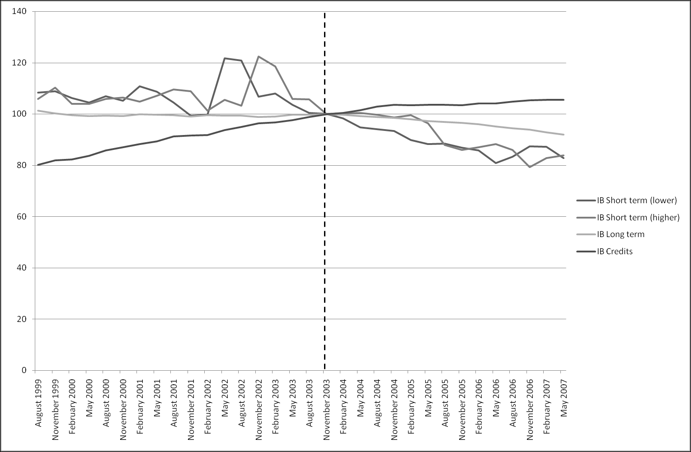{#fig-10-11}

Figure 10.11 shows claimant numbers (indexed to November 2003 levels) by benefit
type, rather than benefit duration. Unlike in Figure 10.10, this graph suggests that
Pathways to Work may have influenced some more general trends: Long term IB
numbers remained almost completely level during the four years preceding the
introduction of Pathways, but began to decline afterwards. As one would expect, given
that the claimants pass from the former to the latter after 28 weeks, the lower and higher
Short term IB numbers appear to have a lagged relationship with one another, with
lower-rate trends influencing higher-rate trends six months later. Both Short term
benefit rates have started to decline around six-to-twelve months before the introduction
of Pathways, but the decline after November 2003 is fairly persistent, and falls to a level
not seen in the previous eight years. IB Credits levels grew by a quarter 337 from August
1999 to November 2003, but thereafter more slowly.338

Figure 10.11 Trends in IB numbers by type of claim, August 1999 - May 2007, indexed to November 2003
(Pathways Pilot) levels
Source: www.nomisweb.co.uk, retrieved 6 May 2008

Performing this test for all duration outcomes only indicates a statistically significant difference in fit
between models for the two-years-to-five-years outcome; for all other outcome durations, the
difference between
and
is not statistically significant.
337
338

Comparison of 'restricted' and 'unrestricted' models, as described in the footnote 336, suggests the
Pathways variable was statistically significant at the 5% level for the short term (lower) IB level;
statistically significant at the 10% level for the short term (higher) IB level; and not statistically
significant for the other two benefit types.

The above graphs show that, although there are some indications that aggregate trends
in some forms of IB may be different in the years after Pathways was first introduced,
as compared to the years before, it is not possible to know whether such differences can
be attributable to the programme (especially considering that, when Pathways was first
introduced, it only covered a small proportion of Jobcentre Plus offices). Additionally,
the size of any effect that may be the result of Pathways appears slight. The net effect
of the aggregate trends has been for IB claimant levels to remain roughly level during
the last eight years, although there is evidence that levels peaked at approximately the
time that Pathways was first introduced.
10.6.1 Heavily Diluted Aggregate: Mixing 'Treated Flow' with 'Untreated
Stock'
The previous part of this chapter showed that, as regards aggregate claimant numbers,
the introduction of Pathways to Work appears to have had no conclusive, immediately
apparent, or substantial impact on more general, longer term trends in claimant numbers
and claimant types. Although not immediately obvious from The Graph, this lack of
substantial aggregate treatment effect follows as a logical implication of the data and
claims already published, by the DWP, as to the effectiveness of Pathways to Work.
In order to see this, one needs to remember that the data used to construct The Graph is
only of new claimants, as originally Pathways to Work was only applied to this subset
of the claimant population. Additionally, as indicated by the discussion of the Screening
Tool in the previous chapter (pages 178-185) only around half of claimants screened
remain subject to the Pathways programme. Furthermore, if one compares, for those
quarters where both sets of data are available, the number of Pathways starts (defined as
people who make an initial enquiry to begin Incapacity Benefit within a Pathways
district) with the number of new claimants (whose duration of claim is three months or
less), then a similar proportion emerges, as shown in Figure 9.2.

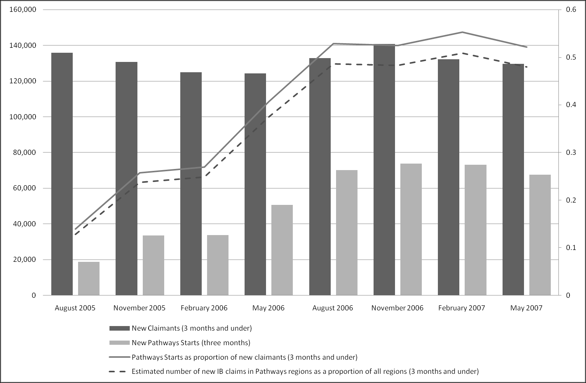{#fig-10-12}

Figure 10.12 suggests that, since August 2006, Pathways starts, both in total and as a
proportion of all new claimants, have plateaued at around 65,000 claimants per quarter
(around 21,000 claimants per month), or around half of all new claimants. According to
the most recent Pathways to Work Performance summary, around 92 percent of
Pathways starts (i.e. initial enquiries) result in the individual claiming IB. 339 This

339

"There were a total of 694,410 starts to Pathways to Work from 535,410 individuals to the end of
October 2007. Of these 694,410 starts, 637,930 are currently identifiable as new customers, eligible to

indicates that, as of May 2007, very slightly less than half of all new claimants come
from Pathways areas.340

Figure 10.12 New IB claimants (duration of 3 months and under), and Pathways starts, August 2005- May 2007
Sources: www.nomisweb.co.uk (accessed 6 May 2008); Pathways to Work Performance Summaries (retrieved 20
May 2008, from http://www.dwp.gov.uk/asd/workingage/ib_ref_p2w.asp)

10.7 Introducing the Number Needed to Observe (NNO)
The figures described above, together with a few other numbers available from the same
data sources, allow us to produce a new metric, based upon the concept of Number
Needed to Treat (NNT), that indicates the extent to which the treatment effect suggested
within The Graph have led, and will lead, to noticeable changes in the overall IB
claimant levels. I will refer to this metric as „Number Needed to Observe‟ (NNO), as it
indicates the number of randomly selected claimants one would have to observe, on
average, in order to see one additional person leave IB as a result of Pathways to Work.
The logic of this metric can perhaps be most easily understood by considering the
following hypothetical example: a given treatment (Tr) increases the proportion of those
treated who exhibit the desired outcome (Y=1) from one-fifth to two-fifths; however,
be mandated into the process" (Blyth, B. (2006). Incapacity Benefit reforms - Pathways to Work Pilots
performance and analysis. DWP. Leeds, Corporate Document Services.
340
Multiplying the number of Pathways starts recorded for the quarters whose central month is
November 2006, February 2007, and May 2007, by 92%, then dividing this number by the total number
of new claimants for this quarter, produces revised proportions of 48%, 51% and 48% (from 52%, 55%,
and 52% respectively); an average of 49%

only a small subgroup of the population in the treatment region, say one tenth of the
region‟s population, has the treatment applied to them (as against, of course, none of the
population in the control region). The hypothetical observer does not know whether an
observed member of the treatment region‟s population is, or is not, a member of the
subgroup of the population eligible for treatment. Given this, and assuming that the size
of the treatable subgroup, as a proportion of the regional population (f), is the same for
both treatment and control regions, then NNO can be defined as follows:

Where f is simply the „treatment eligible‟ proportion of the treatment region. In the
hypothetical example, the NNT is 5 (i.e.

); and as f is

, the NNO would be 50.

For Pathways to Work, there are at least two ways of interpreting the quantity f: either
as the proportion of the total IB population currently treated ( ); or as the proportion of
the total IB population that would be eligible for treatment if Pathways, as evaluated
within The Graph, were available nationally ( ). The NNO estimates that follow from
both versions,

and

, will be calculated.

10.7.1 Estimating the Number Needed to Observe (NNO)
Within The Graph, the subgroup of the IB population for whom the treatment effect is
being attributed are new claimants; the outcome, Y, being the proportion of such
claimants who „flow off‟ IB within six months of their original claim. The same data
sources that allowed one to produce Figure 10.12 can also be used to produce Figure
10.13, which show the same quantities over this slightly longer period of observation.



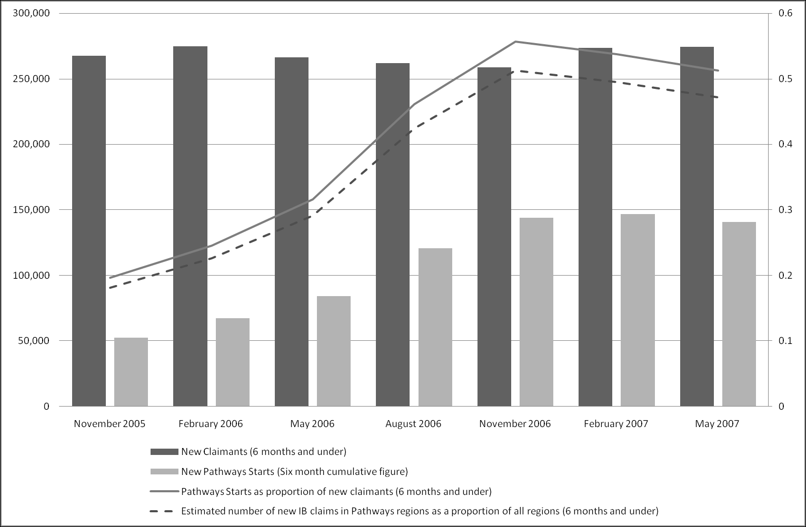{#fig-10-13}

Figure 10.13 New IB claimants (duration of 6 months and under), and Pathways starts, November 2005- May
2007
Sources: www.nomisweb.co.uk (accessed 6 May 2008); Pathways to Work Performance Summaries (retrieved 20
May 2008, from http://www.dwp.gov.uk/asd/workingage/ib_ref_p2w.asp)

The dashed line show the estimated proportion, based on the Pathways „starts‟ figures
for the previous two quarters and the 0.92 start-to-claimant „conversion‟ estimate
produced earlier, of claimants, whose duration is under six months, within Pathways
regions. 

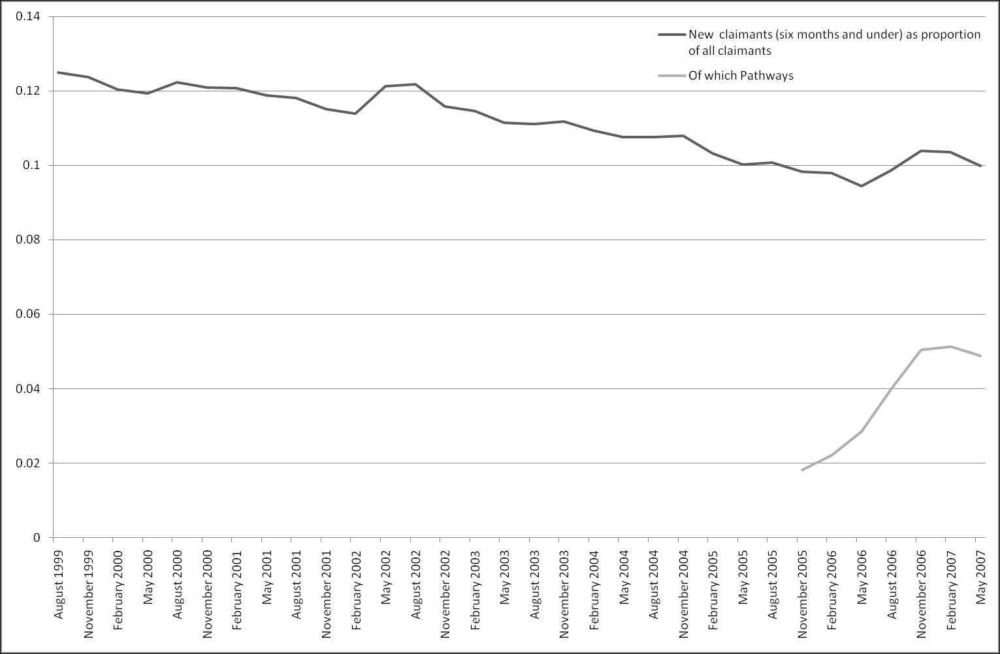{#fig-10-14}

Figure 10.14 presents this curve in the context of longer-term trends in the
proportion of all IB claimants whose duration is six months or less.

Figure 10.14 New claimants (6 months and under) as a proportion of all claimants, including Pathways region
contributions
Sources: www.nomisweb.co.uk (accessed 6 May 2008); Pathways to Work Performance Summaries (retrieved 20
May 2008, from http://www.dwp.gov.uk/asd/workingage/ib_ref_p2w.asp)

The darker line provides an estimate of

, and the lighter line presents an estimate of

. The average value of the three most recent quarters (November 2006, February
2007, and May 2007) are 5.0% for

, and 10.2% for

.341

The following NNO estimates follow from the NNT estimates shown in Table 10.2,
Table 10.3, and Table 10.4:
Table 10.2: the low, medium and high estimates for NNT are 9, 12, and 23
respectively. For the

measure, this results in NNO estimates of 170, 244, and

453 respectively. For the

measure, the equivalent values are 83, 120, and 222.

Table 10.3: the low, medium and high estimates for NNT are 13, 18, and 27
respectively. For the

measure, this results in NNO estimates of 258, 352, and

546 respectively. For the

measure, the equivalent values are 126, 173, and

268.
Table 10.4: the low, medium and high estimates for NNT are 16, 24, and 44
respectively. For the

341

measure, this results in NNO estimates of 327, 470, and

5.05%, 5.14%, 4.88% respectively for

; and 10.38%, 10.35%, 9.99% for

(to 2 d. p.)

872 respectively. For the

measure, the equivalent values are 160, 230, and

428.
A corollary of the NNO metric is that one can infer the amount by which the treatment
effect is likely to reduce the aggregate IB population size, simply by dividing the IB
population size (which may be thought of as the „number observable‟) by the NNO.
Based on the May 2007 quarter figures for IB (but not SDA) claimant numbers, this
total IB population size is around 2.4 million;342 if Pathways coverage does not extend
beyond the level assumed in the

measure, then the programme is likely to reduce the

IB claimant population by between around 5,300 and 14,200 claimants;343 and if
Pathways extends to cover the entire country without changing in effectiveness (the
measure), then the programme is estimated to reduce the IB population by between
around 10,800 and 29,000 claimants.344 In terms of the government‟s professed goal of
reducing the IB claimant population by one million, this suggests a national roll-out of
Pathways, in a six month period, would bring the government between 1.1% and 2.9%
closer to their target. If the effect were linear and cumulative, and Pathways caused this
level of reduction in claimant numbers every six months, then the Pathways programme
would cause numbers to reduce by one million by between 2021 and 2050. 345 and so the
2015 target would be missed. However, and of course, Pathways will not be the only
factor that will influences claimant numbers.346
In terms of increased employment, the same logic suggests that, using the NNT
estimates within Table 10.3 and with the

assumption, between around 4,400 and

9,300 more claimants per six months (nationally) will be employed than would
otherwise have been the case;347 with the

assumption, the estimate range is between

342

More precisely, 2,406,190 (to the nearest 10); 1,239,840 of whom have a claimant duration of five
years or over
343
From Table 10.2, NNTs: Low estimate NNO of 170 implies 14,150 less claimants; middle estimate of
244 implies 9,860 less claimants; and high estimate of 453 implies 5,300 less claimants (rounded to
nearest 10)
344
From Table 10.2, NNTs: Low estimate NNO of 83 implies 28,990 less claimants; middle estimate of
120 implies 20,050 less claimants; and high estimate of 222 implies 10,840 less claimants (rounded to
nearest 10)
345
; assuming 2004 start
346

For example demographic factors, in particular the proportion of existing claimants who turn 60 (in
the case of women) or 65 (in the case of men) and leave IB for state pensions, may substantially reduce
the claimant size, helping the government towards the target.
347
From Table 10.3 NNTs: Low estimate NNO of 258 implies 9,330 more former claimants in
employment; middle estimate of 352 implies 6,840 more former claimants in employment; and high
estimate of 546 implied 4,410 more former claimants in employment (rounded to nearest 10)

around 9,000 and 19,100 more employees.348 For illustration, if one assumes a working
age population of 30 million, and employment rate of 75%, then an additional 1.5
million people will need to be employed for the 80% target to be achieved. At the
current rate, therefore, a linear projection would suggest that Pathways alone would
achieve this by between around 2040 and 2090.349

10.8 Subsection Concluding Remarks
Within the two previous sections, in order to try to assess the validity of a newspaper
report which suggested that government IB reforms have been ineffective, I have
considered trends in aggregate IB statistics over the period August 1999- May 2007: the
period during which statistics are publically available.
The first of these two subsections indicated that a number of trends have developed and
continued over the period of observation: very long duration claimants have represented
an increasing proportion of claimants, from an already large base, as evidenced both by
the numbers of claimants whose duration has been for 5 years or longer, and the number
of claimants only eligible for IB Credits. This latter trend deserves some further
attention, as it indicates that a large, and increasing, proportion of IB claimants have
been on the benefit for so long that they have exhausted the fund of National Insurance
contributions they accrued previously. As mentioned previously, recipients of IB
Credits are not financial beneficiaries, but simply have their National Insurance
contribution credited for the duration of the scheme. For these claimants, the „supply
side problem‟ assumption implicit within the thrust of welfare reform programmes like
Pathways to Work -- that the levels of benefit received by claimants are too generous,
and thus encourage more indolent, non-work-seeking behaviour -- appears untenable.
The only ostensive benefit of IB Credits receipt appears to be to increase the likelihood
of receiving a full state pension after retirement age; a benefit that almost any form of
employment would also provide.
Although the introduction of Pathways to Work appears to have coincided with an eight
year apex of aggregate claimant numbers, it is not possible to know to what extent, if
any, the introduction of Pathways contributed to the subsequent decline in numbers. A
visual inspection of the trends, together with a slightly more sophisticated statistical
348

From Table 10.3 NNTs: Low estimate NNO of 126 implies 19,100 more former claimants in
employment; middle estimate of 173 implied 13,910 more former claimants in employment; and high
estimate of 268 implies 8,980 more former claimants in employment (rounded to nearest 10)
349
; assuming 2004 start

comparison of the trends before and after the intervention, suggests that, perhaps, the
introduction of Pathways has significantly influenced trends in short-term (lower rate)
benefit claimants (See footnote 338), but does not appear to have significantly
influenced trends in other claimant types. This is the finding one would expect to find,
given that the intervention is directed primarily at new claimants. However, it is not the
finding one might expect if one did not know much about the details of the programme,
but was still somewhat aware both of the programme and, through various governmentproduced press releases, of its apparent success. The majority of members of the public
can be expected to have this more partial, rather than detailed, level of knowledge about
the programme, and so the finding, highlighted by the newspaper article quoted on page
224, that the intervention has not had a clear impact on aggregate claimant numbers,
may still be surprising to many people.
The second part of this subsection, beginning on page 231, attempted to show more
clearly how the treatment effect claims made implicitly within The Graph (described
and detailed on pages 1204-217) could be expected to lead to observed change in
aggregate claimant numbers. A variant of the metric „Number Needed to Treat‟ (NNT),
called „Number Needed to Observe‟ (NNO), was developed in order to indicate that,
within the shorter term at least, the reduction in overall claimant numbers likely to result
from the treatment effect suggested by The Graph is likely to be relatively small, and
not easy to detect within aggregate claimant number trends. The disjuncture between
small-scale effectiveness (changes in new claimant off-flow rates indicated within The
Graph) and large-scale observability (changes in aggregate claimant numbers) is a key
reason why, depending upon political orientation and organisational position, statistical
evidence can be utilised both to give the impression that „Pathways is a success‟, and to
give the impression that „Pathways is a failure‟.
10.8.1 Concluding Observations Regarding The Graph: 6 Month verses 12
Month Off-Flow Rates
This chapter has been primarily concerned with the way a particular metric (Incapacity
Benefit six-month off flow rates), based upon a particular source of administrative data
(the National Benefits Database), assessing a particular outcome (stops claiming IB)
amongst a particular subset of the Incapacity Benefit population (new claimants), has
been used to promote, and indicate the success of, a particular policy intervention,
Pathways to Work. I have seen how the likely substantive implications of the claims
implied by this frequently and prominently repeated metric are less impressive than The

Graph initially appears to suggest. In short, I have seen a graphical metric utilised by a
government organisation as a rhetorical device.
Why has this particular metric been used in this way, when other metrics, based on the
same and related sources of administrative data, have not? One possible explanation is
that the six month off-flow rate is sufficiently illustrative of the general, longer-term,
effectiveness of the scheme that other metrics present a very similar story, and so
provide an unnecessary repetition of the same information. However, the inadvertent
release of a 12 month (rather than six month) off-flow rate version of the graph, shown
in 

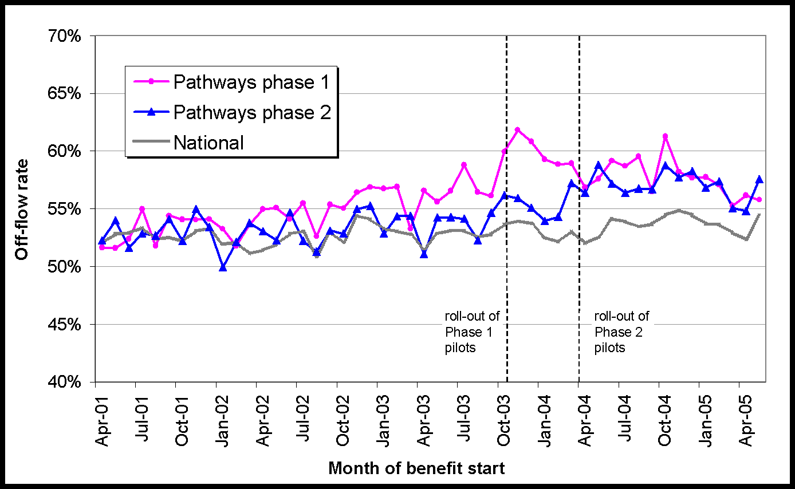{#fig-10-15}

Figure 10.15, suggests otherwise.

Figure 10.15 '12 Month off-flow rate' Source: Slide 21 of DWP (2007), 'Pathways to Work: Invitation to Tender
Provider Event', retrieved 14 May 2007 from
www.jobcentreplus.gov.uk/JCP/stellent/groups/jcp/documents/websitecontent/dev_013465.ppt

The above was displayed on a slide within a powerpoint presentation, as part of an
„invitation to tender provider‟ event, held in late 2005, organised by Jobcentre Plus and
the DWP, for private- and third-sector organisations bidding to provide Pathways
services as part of its national expansion in 2008. The Powerpoint file,
„dev_013465.ppt‟, was hosted on the Jobcentre Plus website, and thus is freely
accessible to members of the public. However, unlike the working papers and
performance summaries, it appears not to be intended for political or public
consumption.

Unlike the 6 month off-flow rate graph („The Graph‟) shown earlier, the 12 month offflow rate version shown in Figure 10.15 does not infer a substantive treatment effect, in
that there appears to be no substantial difference between Treatment and Control
regions at the end of the period of observations, and that differences between Treatment
and Control regions do not appear to increase following from the introduction of the
Treatment. The metric presented in Figure 10.15 cannot provide the same political
function, as a rhetorical tool that may be used to support a political intervention, as the
six-month variant which has been published and updated on so many occasions.
Whereas the six-month variant infers that the programme has been successful in its
aims, the 12 month version of the metric suggests that much of the apparent initial
effectiveness of the treatment is lost in later months, and thus raises doubts about the
programme effectiveness as a long-term solution to a long-term problem.
The next chapter will consider more recent evidence, produced by the Policy Studies
Institute in 2007,350 that has an interpretation consonant with that given above of Figure
10.15.

350

Bewley, H., R. Dorsett and G. Haile (2007). The Impact of Pathways to Work. DWP. London, Corporate
Document Services.
