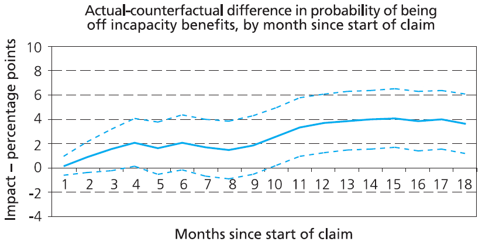
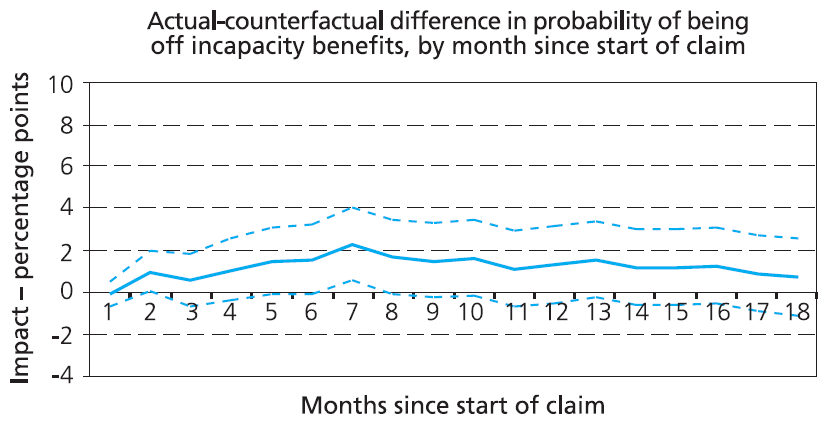
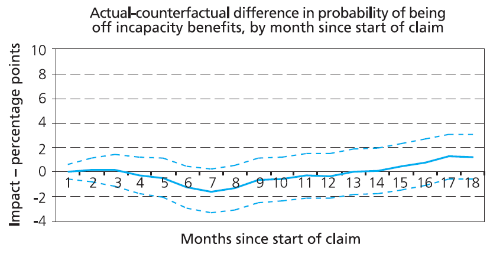
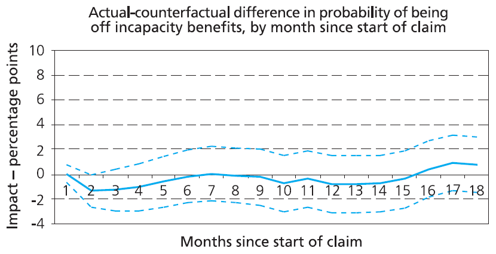
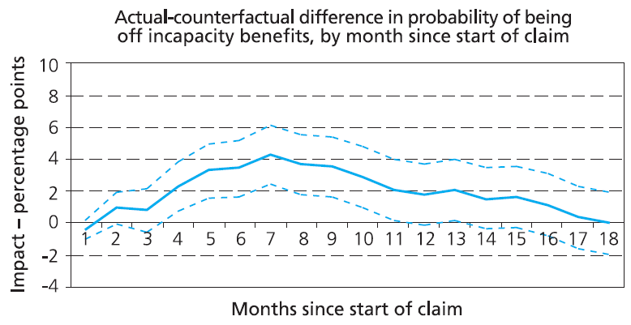
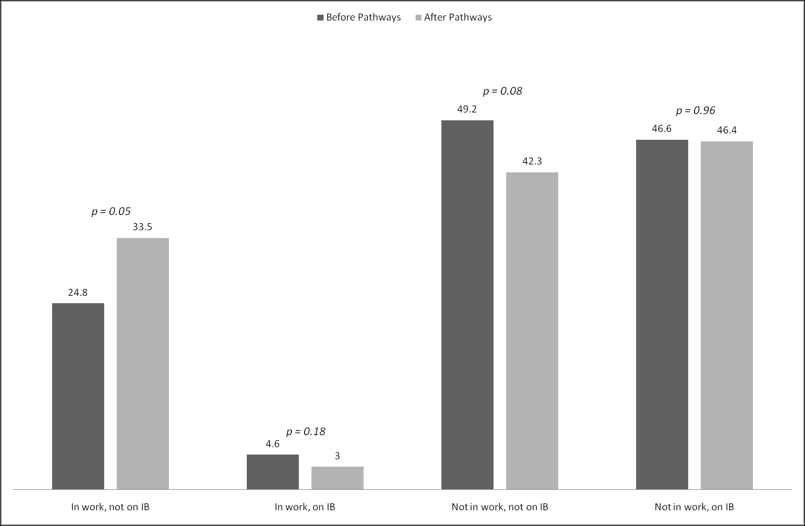
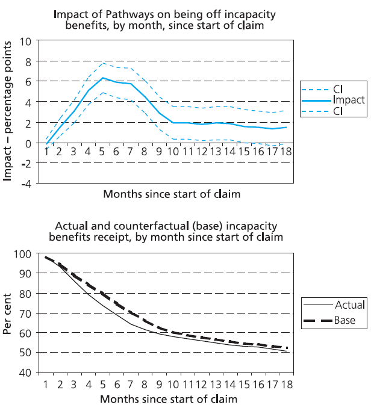

::: {.archive-notice}
**Source:** Pages 241--254 of *MintonThesis.pdf* (September 2009). Text extracted from PDF; figures extracted directly as images.
:::

11 Pathways

to

Work:

Secondary

Analysis

of

Later

Quantitative Evidence of Programme Effectiveness
11.1 Introduction
In the previous chapter, I considered some early statistics produced by the Department
for Work and Pensions that appear to indicate the substantive effectiveness of Pathways
to Work. My analysis suggested that the substantive effects of the intervention may be
much less than commonly-replicated graphical presentations infer. I concluded the
section by considering 'accidentally released' evidence suggesting that the longer-term
effects of the programme are significantly less than the shorter-term effects.
This chapter begins by considering the longer-term - one-year and over - effects of the
programme, both on employment and benefit outcomes, for new benefit claimants. This
longer term impact can be assessed fairly thoroughly, rather than simply guessed at
based upon anecdotal reports and incidentally 'leaked' metrics like the 12 month version
of the Graph, because they are the subject of a 2007 DWP-commissioned report
produced by the Policy Studies Institute, called 'The Impact of Pathways to Work'.351
The results of this report will be the focus of our analysis within this section.
I will proceed as follows: firstly, I will describe and discuss the methodological
approach adopted for treatment effect estimation within the PSI report, known as
Differences-in-Differences (DiD). Then I will consider the assumptions both implicitly
and explicitly made when one adopts this approach, and thus reasons for caution against
accepting the results at face value; and then I will conclude this discussion by
considering the prevalence of 'false positives' described within the PSI report.
Having provided a set of reasons to be cautious about the treatment effect estimates
produced within the PSI reports, the rest of the section will proceed under the
assumption that the results are valid. As with the previous chapter, we will consider the
substantive implications that follow from assuming the treatment estimates as true.
I will consider the possible interpretations of a characteristic 'humped' shape within
many of the longer-term treatment effect estimates produced within the analysis. I will
then attempt to identify NNT estimates, both for the samples as a whole, and for various
sub-groups.
351

Ibid.

11.2 The Policy Studies Report: Methodology
The PSI report uses an approach known as Differences-in-Differences (commonly
abbreviated DiD) to attempt to produce estimates of the treatment effect. The report
provides a pedagogic example of the approach352 but not a formal definition of the
approach. An earlier report by the Institute for Fiscal Studies (IFS), however, uses the
approach and provides the following, more precise, definition of it:

Where

denotes the outcome of interest (for example employment outcomes)

for individual i and

denotes observed individual characteristics.

is a

dummy variable indicating whether the individual‟s enquiry about claiming
incapacity benefits was made in a Pathways to Work pilot area or in one of the
comparison areas, and

is a dummy variable indicating whether the

enquiry about claiming incapacity benefits was made before or after the
Pathways to Work pilots were actually implemented (regardless of whether the
individual lived in one of the seven pilot areas or in one of the comparison
areas).

is an error term.

The term of particular interest is

which is a dummy variable

taking the value 1 for those observed in one of the seven Pathways to Work pilot
areas after the policy was introduced, and 0 otherwise. Hence,

is the main

coefficient of interest. This measures the effect of being subject to the Pathways
to Work pilot in a period in which the policy was in effect, controlling for all
other observed factors. In addition it is net of any effect of being observed in the
period after the policy was implemented that is constant across pilot and
comparison areas ( ) and any effect of being in a pilot area that is constant over
time ( ).353
Notice, therefore, that the Differences-in-Differences approach is a fairly simple
extension of the multivariate linear regression approach described on page 210. As such,
estimates based upon the approach are contingent for their validity on a range of
assumptions. As the IFS description goes on to state:

352

Ibid., pp. 33-35
Adam, S., C. Emmerson, C. Frayne and A. Goodman (2006). Early quantitative evidence on the impact
of the Pathways to Work pilots. DWP, Corporate Document Services., p. 26
353

[DiD] captures shifts in the outcome measure among those in the Pathways to
Work pilot areas vis-à-vis those in the comparison areas that occur after the
policy is introduced. However, this can be interpreted as the causal impact of the
intervention only under two assumptions: first … that the effect of unobserved
characteristics on the outcomes of interest does not vary differentially between
pilot and comparison areas over time; second, that the characteristics included in
our regressions that are correlated with

have a linear effect on

the outcomes of interest as assumed in [the equation above].354
The PSI report also indicates that the validity of the DiD estimates is dependent upon
two assumptions, which it phrases as follows:
1. [That] the composition of the pilot and comparison area samples before and after
the introduction of Pathways should remain unchanged with regard to those
unobserved characteristics that may affect outcomes.355
2. [That] those unobserved characteristics that change over time and affect
outcomes do so equally for the pilot and comparison areas.356
In order to test for conditions that this second assumption into doubt, and based on an
approach outlined within a highly cited econometrics paper,357 the report conducts what
it calls „pre-programme tests‟
Such tests are carried out using DiD to estimate the effect of a hypothetical --
that is, non-existent -- intervention taking place between two periods of time,
both of which pre-date the introduction of Pathways. If these effects are found to
be significant, it suggests that, in the past, it has not been possible using the DiD
approach to achieve reliable estimates of the counterfactual. 358
To rephrase the above slightly: pre-programme tests show whether the DiD approach
detects a statistically significant treatment effect even when there is no treatment;
otherwise known as a „false positive‟.

354

Ibid., pp. 26-7
Bewley, H., R. Dorsett and G. Haile (2007). The Impact of Pathways to Work. DWP. London, Corporate
Document Services., p. 36
356
Ibid., p. 36
357
Heckman, J. J. and V. J. Hotz (1989). "Choosing Among Alternative Nonexperimental Methods for
Estimating the Impact of Social Programs: The Case of Manpower Training." Journal of the American
Statistical Association 84(408): 862-874.
358
Bewley, H., R. Dorsett and G. Haile (2007). The Impact of Pathways to Work. DWP. London, Corporate
Document Services., p. 36
355

For both Phase One (real treatment start date October 2003) and Phase Two (real
treatment start date April 2004) regions, the pre-programme tests were conducted by
changing the

variable above to falsely indicate that the programme began either

one or two years before its actual start date. This produced the estimates for the (nonexistent) treatment effect on probability of leaving IB reproduced as 

{#fig-11-1}

Figure 11.1, Figure
11.2, 

{#fig-11-3}

Figure 11.3, and 

{#fig-11-4}

Figure 11.4 below.

Figure 11.1 'Tests of the counterfactual estimates of incapacity benefits receipt in October 2003 areas in the
period one year before the introduction of Pathways'
Source & title: Figure 4.2 of Bewley, Dorsett & Haile (2007), 'The Impact of Pathways to Work'

{#fig-11-2}

Figure 11.2 'Tests of the counterfactual estimates of incapacity benefits receipt in October 2003 areas in the
period two years before the introduction of Pathways'
Source & title: Figure 4.3 of Bewley, Dorsett & Haile (2007), 'The Impact of Pathways to Work'

Figure 11.3 'Tests of the counterfactual estimates of incapacity benefits receipt in April 2004 areas in the period
one year before the introduction of Pathways'
Source & title: Figure 4.4 of Bewley, Dorsett & Haile (2007), 'The Impact of Pathways to Work'

Figure 11.4 'Tests of the counterfactual estimates of incapacity benefits receipts in April 2004 areas in the period
two years before the introduction of Pathways'
Source & title: Figure 4.5 of Bewley, Dorsett & Haile (2007), 'The Impact of Pathways to Work'

So, in one of the two tests for the Phase One regions, shown in Figure 11.1, the DiD
approach indicates a statistically significant and steadily rising treatment effect on the
probability of leaving IB, even though there is no real treatment. It also indicates a
statistically significant effect for the seventh month following a claim in one of the tests
for the Phase Two regions (Figure 11.3), although this false positive is not as persistent
and systematic as that indicated in Figure 11.1.
The PSI report reacts to the false positive indicated in Figure 11.1 by concluding that
results from Phase One regions are not as reliable as those from Phase Two regions; the
majority of the estimates produced within the rest of the report are thus based upon
Phase Two rather than Phase One regions. The methodology section of the report also
adds the following:

While the results for the April 2004 areas are more encouraging than those for
the October 2003 areas, it should be noted that the results for the period one year
before the introduction of Pathways -- that is, the results that revealed a problem
for the October 2003 areas -- differ across the two phases of Pathways rollout in
that the October 2003 test results apply to a cohort of individuals commencing a
claim just before Pathways was introduced while the April 2003 results apply to
a cohort of individuals some months before Pathways was introduced locally.
One possible explanation for this difference may be that individuals starting a
claim shortly before the introduction of Pathways are affected by Pathways in
some way. For the purpose of comparability, it is useful to carry out an
additional pre-programme test to see if those individuals in the April 2004 areas
who started a claim just before the introduction of Pathways appear to have been
affected by Pathways. The DiD test in this case is based on a cohort of
individuals starting a claim between 1 January and 4 April 2004 and a cohort
starting a claim in a similar period one year earlier. The results […] show that in
this case statistically significant effects are found between months 4 and 11.
Beyond this point, effects are statistically insignificant.359
These results, based upon a more consistent comparison of Phase One and Phase Two
regions, are shown in 

{#fig-11-5}

Figure 11.5. The „possible explanation‟ suggested in the above
quotation is compatible with the „anticipatory treatment effect‟ theory discussed in the
previous chapter, with respect to the Phase Two regions, although this theory does not
appear to be explicitly countenanced within any commissioned publications evaluating
Pathways.

359

Ibid., emphasis added

Figure 11.5 'Tests of the counterfactual estimates of incapacity benefits receipt in April 2004 areas in the period
one year before the introduction of Pathways for those starting a claim immediately prior to the introduction of
Pathways'
Source and title: Figure 4.6 of Bewley, Dorsett & Haile (2007), 'The Impact of Pathways to Work'

More broadly, the above raise concerns about the fundamental reliability of the DiD
estimates. Two out of the five pre-programme tests (Figure 11.1 and Figure 11.5)
produce false positives for a large proportion of the months post (hypothetical)
treatment. One further pre-programme test (Figure 11.3) revealed a statistically
significant false positive for one month; if a 90% rather than 95% confidence interval
were chosen, then a number of other months within this test would likely also have been
false positives. Additionally, for either region, there appears to be no consistency
between the results of the one- and two-year versions of the pre-programme tests: i.e.
„passing‟ the test when the hypothesised treatment is two years before the real treatment
does mean that the one year version of the test will also be passed, and vice-versa.
Given this, one should treat the estimates that follow with caution; absence of evidence
of false positives in two (out of three) pre-tests for Phase Two regions is not evidence of
absence of the kinds of „biases‟ that invalidate the assumptions that must hold for DiD
impact assessments to be „true‟. As discussed in the previous chapter, „the evaluation
problem‟ may well be fundamentally intractable, and thus not amenable to technical
fixes, irrespective of their level of statistical sophistication.

11.3 Reported Impact Estimates

{#fig-11-6}

Figure 11.6 presents a graphical representation of table 5.5 of the report, showing the
estimated impact of Pathways to Work on four mutually exclusive outcome states360 of

360

Not in work and not claiming IB; not in work and claiming IB; in work and claiming IB; and not in work
and not claiming IB

a sample of new claimants interviewed, on average, around 19 months after starting to
claim IB. 361

Figure 11.6 Estimated impact of Pathways treatment on four mutually exclusive outcomes
Source: derived from tabled 5.5 of Bewley, Dorsett & Haile (2007), 'The Impact of Pathways to Work'

According to these estimates, the longer-term impact of Pathways to Work is to
(statistically and substantially) increase the proportion of new IB claimants who, within
about one-and-a-half to two years, stop claiming IB and are in employment. However, it
has no noticeable longer term impact on the proportion of new claimants still claiming
IB.
Both of these findings may appear paradoxical, and to contradict the results published
by the DWP previously, detailed in the „Past‟ section of this chapter, which looked at
six-month off-flow rates of new claimants to suggest that Pathways does have a
noticeable impact on the proportions of new claimants leaving IB (and then that offflow rates should be seen as a proxy for employment outcomes). This apparent paradox
or contradiction can be resolved, however, by considering figure 5.2 of the report,
reproduced as 

{#fig-11-7}

Figure 11.7 below.

361

Bewley, H., R. Dorsett and G. Haile (2007). The Impact of Pathways to Work. DWP. London, Corporate
Document Services., p. 17

Figure 11.7 'Impact of Pathways on being off incapacity benefits by month, 2004 areas'
Source and title: Figure 5.2 of Bewley, Doresett & Haile (2007), 'The Impact of Pathways to Work'

These estimates, based on the same administrative data source as that used to produce
both the six-month and (less popular) twelve-month version of The Graph, the National
Benefits Database, indicates that most of the positive effect on IB off-flow rates is short
term, reaching a peak of around 6 percentage points within the first six months
following the start of the claim, before falling over the next six or so months, to reach a
sustained long term level of around 2 percentage points. The peak of the effect,
therefore, is over the six-month period illustrated within The Graph. In selecting this
particular metric, the DWP were thus presented Pathways at the peak of its
effectiveness.
The „humped‟ shape of the top sub-figure within may also help to explain the apparent
effectiveness of Pathways in increasing employment rates. To see this, it is worth
comparing the peak of the estimated impact to its long-term level. This information is
summarised in table 5.4 of the PSI report, reproduced, together with two additional
columns of derived values, as Table 11.1 below.

Probability of
receiving IB...
1-6 months
7-12 months
13-18 months

Impact
estimate
-6.2
-2.1
-1.1

P-value

Base

0
1
17

73.2
54.5
49.2

Sample
size
54837
54837
54837

NNT
estimate
16
48
91

Ratio

3.0
5.6

Table 11.1 'Effect of Pathways on receipt of incapacity benefits - summary measures for April 2004 areas', with
additional NNT estimates
Source & title: Table 5.4 of Bewley, Dorsett & Haile (2007), 'The Impact of Pathways to Work', London: TSO

The two additional columns show the Number Needed to Treat estimates that follows
from the impact estimates (the reciprocal of the modulus of the „Impact estimate‟
value); and the Ratio of the estimated shorter-term (1-6 months) to longer term
programme effectiveness. These estimates suggest that, though within six months one
would expect to have to treat 16 new claimants to Pathways to see one additional person
leave IB as a result of it,362 over the following six months this number increases to 48
claimants, and over the next six months to 91 claimants. Furthermore, the p-value for
this last estimate (17 %) exceeds the bounds of conventional statistical significance, and
could be interpreted as suggesting there is approximately a one-in-five chance that the
„real‟ NNT for this time period is infinite (i.e. that the „real‟ impact over this time period
is nil).
The ratio may be interpreted in a number of ways. As the bottom sub-figure of
indicates, both the „base‟ and „pathways‟ benefit receipt estimates appear to be
monotone functions of duration, in the sense that the percentages decrease or remain
stable, rather than increase, as time increases. This means that the aggregate probability
of remaining on IB reduces continually over time in both Pathways and non-Pathways
areas. However, as the top sub-figure within indicates, the estimated impact of
Pathways on probability of remaining on IB has a humped shape, and so is not a
monotone function of time. The 1-6:7-12 month, and 1-6:13-18 month impact ratios
(3.0 and 5.6 respectively) are thus due to a gap in IB probabilities emerging within the
first six months following the claim, then closing over the next 12 months. Different
interpretations of this ratio thus depend upon why one believes this gap is closing.
A fairly benign explanation for the closing gap focuses on comparatively large increase
in off-flow rates within the first six months, and attributes this to ways in which

362

This is within the range of NNT estimates based on visual inspection of different version of The
Graph, of between 9 and 23, shown in Table 10.2

Pathways has improved and made more efficient the IB claims process at Jobcentre Plus
offices. As the summary of the PSI report states:
One potential explanation [for the impact estimate pattern] may be that most
exits are the result of the WFIs which generally take place within the early
months of a claim. It is also perhaps consistent with the structure of Pathways
that exits from incapacity benefit should be concentrated in the first six months
or so after the claim starting, if the accelerated PCA results in those
disallowances from incapacity benefits occurring earlier.363
Within the report summary, a second potential explanation is not provided.
A somewhat less benign explanation for the closing gap is based upon a more intuitive
reading of the top sub-figure of, and of the ratio. This explanation is that many of the
additional claimants who leave IB in the first six months following a claim, as a result
of the Pathways intervention, leave the benefit prematurely and inappropriately, and
subsequently return to IB in later months. I will refer to this pattern of short-term exit,
followed by a longer-term return to IB, as a „false exit‟.
There are, in turn, at least two possible explanations for this kind of false exit: one
explanation, which I will refer to as the Procedural Explanation (or alternatively the
„Push Explanation‟), is that something about the organisational structure and process of
Pathways, such as differences in administering the PCA process, causes more claimants
to be inappropriately made to leave IB during these early months than was previously
the case. A second explanation, which I will refer to as the Motivational Explanation (or
alternatively the „Pull Explanation‟) is that Pathways to Work causes more claimants to
want to leave IB within the first few months following the claim, presumably with the
intention of finding or beginning employment, but then return to IB in later months after
finding themselves unable to cope with the labour market. An intuitive (though
speculative) interpretation of the ratios above, that follows from the Motivational
Explanation, is that, for every six persons who leave IB within six months of their initial
claim due to Pathways, about three will return to IB within the next six months, and
another two more will return within the six months thereafter.
I contacted Richard Dorsett, co-author of the PSI report, to enquire as to whether the
Motivational Explanation appeared „fair and reasonable‟. Dorsett responded as follows:
363

Bewley, H., R. Dorsett and G. Haile (2007). The Impact of Pathways to Work. DWP. London, Corporate
Document Services., p. 4

There could be a number of explanations for such a hump and what you suggest
is one possibility. An alternative interpretation is that individuals exit IB more
quickly in Pathways areas due to the accelerated PCA process but later return.
Whether your interpretation is relatively fair and reasonable is a more
demanding question. [Personal communication, 18 September 2007]
i.e. with a version of the Procedural Explanation. This brief response acknowledges, as
page 84 of the report itself does, that there may be a high rate of returns to IB from new
claimants who leave the benefit within six months as a result of the intervention; and so
the intervention may be causing the PCA process to operate with reduced accuracy (in
the sense that someone who is disallowed within the accelerated PCA process but then
returns probably should not have been disallowed in the first place) as well as greater
speed.

11.4 The Motivational Explanation and Employment Outcomes
If one is ready to contingently accept the Motivational Explanation for the estimated
claimant off-flow impact pattern, then an explanation for the apparent success of the
intervention regarding employment outcomes follows fairly readily: this is that, for
every one person who successfully finds suitable, long-term employment as a result of
Pathways, a number of other persons (perhaps between three and six) had attempted to
cope within the labour market but were unable to (for example, by finding themselves
unable to cope within a job that had been identified as suitable for them).
The substantive implications that follow if one accepts this kind of explanation are as
follows: Pathways means that the more job-ready IB claimants are more likely to enter
employment; but Pathways doesn't seem to make more of the claimants job-ready.
Pathways increases the chances of 'job-readiness' leading to employment by
encouraging more people who are both job-ready and not job-ready to try employment.
Considering the sieve metaphor used earlier, if tougher labour market conditions are
analogous to shaking the sieve more vigorously, increasing the numbers of grains
(people) who fall through the holes, then Pathways is analogous to someone taking a
number of the recently fallen grains and throwing them upwards, back into the sieve
from below. Although some proportion of those thrown will make this reverse
transition, gravity (demography) is working against them, and so the majority of those
thrown up into the labour market will then fall back down into economic inactivity.

11.5 Concluding Remarks
One of the most interesting aspects of the government-commissioned PSI report is the
manner in which these largely negative findings are interpreted and presented. In the
conclusion to the report, for example, the following statement is made:
Overall, the results in this report are encouraging. They show that the positive
employment effects detected in Adam et al (2006) for a cohort of individuals
making an enquiry about incapacity benefits shortly after Pathways was
introduced can be found also in a later cohort making their initial enquiry some
time after Pathways was introduced. This provides some reassurance that the
original positive estimated effects were genuine. Furthermore, the results in this
report provide the first indication that the effects may be sustained in the
medium term since the positive employment effects relate to a period of time
about a year and a half after they initially got in touch with the contact centre to
enquire about claiming incapacity benefits.364
Similarly, the first point made in the list of findings within the Summary of the
document states that: "Pathways significantly increased the probability of being
employed about a year and a half after the initial enquiry by 7.4 percentage points."365
The report concludes the list of summary results by stating: "Overall, the results are
encouraging in that they suggest Pathways continues to have a positive impact on
employment and, furthermore, that this impact may be sustained."366
The following two points in the list of summary findings are as follows:
The small sample size of those in work and with earnings information at the
time of the outcome interview reduced the likelihood of detecting an impact on
earnings. No statistically significant impact of Pathways on monthly net
earnings about a year and a half after the initial incapacity benefits enquiry was
found […]. It is not possible with the survey data to observe earnings between
the time of the initial enquiry and the outcome interview; it is possible that there
may have been an earnings effect during this period. In view of the employment
effect of Pathways, one would expect a positive impact on earnings.

364

Bewley, H., R. Dorsett and G. Haile (2007). The Impact of Pathways to Work. DWP. London, Corporate
Document Services., p. 83, emphasis added
365
Ibid., p. 2
366
Ibid., p. 4

The effect of Pathways in incapacity benefits receipt about a year and a half after
the initial incapacity benefits enquiry was small and not statistically significant
[…]. Estimates based on administrative data were of a reduction of 1.5
percentage points in the probability of claiming incapacity benefits a year and a
half after the start of the claim […]. Using administrative data, it was possible to
look at the effect on incapacity benefits for each month following start of claim.
This showed that Pathways reduced incapacity benefits receipt by a maximum of
6.3 percentage points five months after the start of claim (from a base of 80 per
cent). The seemingly stable long-term effect of 1.5 to two percentage points was
reached in month ten.367
The findings regarding the long-term ineffectiveness of Pathways with respect to
benefits receipt are thus „buried‟ in the third of three increasingly dense paragraphs of
summary findings, prefaced by a paragraph inferring that statistically insignificant
findings are more likely to be the result of inadequate sample size than inadequate effect
size. The first sentence of the third paragraph begins by stating the statistical
insignificance of the findings. The next two sentences begin with the words "Estimates
based on administrative data" and "Using administrative data" respectively, which
could be interpreted as suggesting that that the „statistically insignificant‟ findings
mentioned in the first sentence refer only to survey sample estimates, and are an artefact
of small sample size (which is not the case). The last two sentences in the paragraph
begin by stating the maximum recorded level of effectiveness, then conclude by
referring to the eventual effects with the psychologically positive adjectives „long-term‟
and „stable‟.

367

Ibid. p. 2, emphasis added
