::: {.archive-notice}
**Source:** Pages 255--308 of *MintonThesis.pdf* (September 2009). Text extracted from PDF; figures extracted directly as images.
:::

12 Discussions and Conclusion
12.1 Introduction
In the introduction to this thesis, I described the five „empirical‟ chapters (chapters 711) as addressing either a five-year, thirty-year, or hundred-year version of the same
overall topic (covered in chapters 9-11, 8, and 7 respectively). Following from this
division, this last chapter will offer three different discussions, one for each scale of
observation.
Within the five-year discussion, I will indicate how my analysis of the Pathways
to Work pilot project research and related policy documents (chapters 9-11) can
contribute to more general (but currently contemporary) debates about evidencebased policy and political decision-making.
Within the thirty-year discussion, I will offer a theory - closely following the
evidence presented in chapter 8, and based to a large extent on research
published by Christina Beatty and Stephen Fothergill368 - suggesting why,
following „structural adjustments‟ in the UK labour market in the 1980s and
early 1990s, rates of working-age sickness benefit receipt increased so
substantially and persistently.
Within the hundred-year discussion, I will address the concept and category of
„working age‟ more generally, as it has developed both within political
bureaucracies and the public imagination over the last century, and as it relates
the complementary concept and category of „retirement‟.
These three discussions will not attempt to offer full and systematic accounts of the
material covered within the chapters to which they relate, and do not attempt to formally
„prove‟ or articulate the arguments being suggested. Instead, they simply attempt to
present and describe a number of „middle range theories‟369 that appear consonant both
with the evidence discussed in the last half of the thesis, and many interconnected
theories that preface them in the first half of the thesis. In short: these summaries are
368

Beatty, C. and S. Fothergill (1996). "Labour market adjustment in areas of chronic industrial decline:
The case of the UK coalfields." Regional Studies 30(7): 627-640, Beatty, C., S. Fothergill and P. Lawless
(1997). "Geographical variation in the labour-market adjustment process: the UK coalfields 1981-91."
Environment and Planning A 29(11): 2041-2060, Beatty, C., S. Fothergill and R. Macmillan (2000). "A
Theory of Employment, Unemployment and Sickness." Regional Studies 34(7): 617-630, Beatty, C. and S.
Fothergill (2002). "Hidden unemployment among men: A case study." Regional Studies 36(8): 811-823,
Beatty, C. and S. Fothergill (2004). "Economic change and the labour market in Britain's seaside towns."
Regional Studies 38(5): 461-480, Beatty, C. and S. Fothergill (2005). "The diversion from 'unemployment'
to 'sickness' across British regions and districts." Regional Studies 39(7): 837-854.
369
Merton, R. K. (1968). Social Theory and Social Structure. New York, Free Press.

attempts to distil „knowledge‟ into „insight‟. Whether, and to what extent, they do so is
largely a matter of the reader‟s judgement.

12.2 The Five-year Discussion: Evidence-based politics and the
rhetorical use of statistics
12.2.1 Introduction
Within chapters 9-11, I showed how, as Pathways to Work developed from a policy
document written in 2002, to a nationally rolled-out new standard in social security
provision by 2008, the quantitative evidence in support of the programme, based on
longer-term evaluation of the pilot programme, became harder to interpret in a positive
light. The initial effects in off-flow rates, which appeared to suggest the programme‟s
unambiguous effectiveness when presented in The Graph (Chapter Ten), were shown
only to be effective in the shorter-term (0-6 months), and faded into statistical and
substantive insignificance over the next twelve months (Chapter Eleven). By the time
evidence of the longer-term ineffectiveness of Pathways became available, however, the
government appears to have already become ideologically and politically committed to
the programme, to believe in its efficacy, and to its national roll-out.
This five-year discussion will attempt to suggest how later evidence, not consonant with
the government‟s hopes for Pathways, has been presented and interpreted so as to
appear more positive than it actually is. In other words: this discussion will look at how
statistics have, in this case, been used rhetorically, to justify political decisions, rather
than evidentially, to make political decisions.
12.2.2 Redefining Purpose and Success
The findings of the „Impact of Pathways to Work‟ (analysed in chapter 11) do not
appear, publically at least, to have reduced the DWP‟s commitment to Pathways and to
roll it out nationally. They do, however, seem to have led to a change in the official
stated purpose of the programme. For example, from the „Impact of Pathways to Work‟
report onwards, PSI research reports on Pathways have stated that the programme "is
intended to encourage employment among people claiming incapacity benefits";370 in
doing so, the only intended outcome of Pathways to have been evaluated as statistically
370

Bewley, H., R. Dorsett and G. Haile (2007). The Impact of Pathways to Work. DWP. London, Corporate
Document Services. p. 1; Bewley, H., R. Dorsett and M. Ratto (2008). Evidence on the effect of Pathways
to Work on existing claimants. DWP. Norwich, HMSO., p 1; Adam, S., A. Bozio, C. Emmerson, D.
Greenberg and G. Knight (2008). A cost-benefit analysis of Pathways to Work for new and repeat
incapacity benefits claimants. DWP. Norwich, HMSO., p. 1, emphasis added

significant, an increase in employment rates, has been declared the primary purpose of
the programme. The only PSI research report on Pathways produced prior to the
„Impact of Pathways to Work‟ provided a slightly different description of the
programme purpose, stating that:
The new package is intended to re-focus customers on the prospects of returning
to work through the combination of a series of Work Focused Interviews (WFIs)
and various associated services and incentives.371
Other, earlier research reports also stated that:
The Incapacity Benefits (IB) reforms … aim to increase the number of
incapacity benefit recipients who move towards and into paid work.372
Within internal performance summaries, the stated aim of Pathways has remained
consistent throughout the four updates that have (to date)373 been produced:
The Pathways to Work Incapacity Benefit Reform Pilots is an initiative aimed at
improving opportunities for people on incapacity benefits.374
Although one early report, by NatCen, stated that "The new Pathways to Work pilots are

central to the Government‟s aim of reducing the rates of customers moving onto, and
remaining on IB",375 in general two types of approach appear to have been adopted
when stating the aim of Pathways:

371

Barnes, H. and M. Hudson (2006). Pathways to Work: Qualitative research on the Condition
Management Programme. DWP, Corporate Document Services., p. 7. This description of the purpose of
Pathways is also used in a couple of reports of qualitative research produced by NatCen in 2007 and
2008, perhaps suggesting that the description was an older 'boilerplate' and that NatCen were unaware
that the official description had changed.
372
Corden, A. and K. Nice (2006). Incapacity Benefit Reforms Pilot: Findings from the second cohort in a
longitudinal panel of clients. DWP, Corporate Document Services., p. 1; Corden, A., K. Nice and R.
Sainsbury (2005). Incapacity Benefit Reforms Pilot: Findings from a longitudinal panel of clients. DWP,
Crown Copyright., p. 1; Corden, A. and K. Nice (2006). Pathways to Work: Findings from the final cohort
in a qualitative longitudinal panel of incapacity benefits recipients. DWP. London, Corporate Document
Services., p. 1
373
25 June 2008
374
Blyth, B. (2007). Pathways to Work Performance Summary, May 2007. DWP: 21.; Blyth, B. (2007).
"Pathways
to
Work
Performance
Summary,
November
2007."
from
http://www.dwp.gov.uk/asd/workingage/pathways2work/pathways_perf_1107.pdf.; Blyth, B. (2007).
Incapacity Benefits Reforms, Pathways to Work Performance Summary.; Blyth, B. (2008). Pathways to
Work Performance Summary, March 2008. DWP. London.
375
Knight, T., S. Dickens, M. Mitchell and K. Woodfield (2005). Incapacity Benefit reforms - the Personal
Advisor role and practices: Stage Two. DWP, Corporate Document Services., p. 8

The Aspirational Approach: To state the aims of the programme in such
general terms that they are incapable of empirical falsification (such as „to move
forward‟ or „to facilitate change‟); or
The Technical Approach: To subtly rephrase the stated aims of the programme
so as to focus upon those intended outputs which have been empirically
„verified.‟ („According to this survey‟, „for this sub-group‟, „as measured using
this indicator‟, and so on)
Both approaches, using antithetical means, allow the DWP to avoid having to declare
Pathways as „unsuccessful‟: the Aspirational Approach by making claims that are
neither provable nor disprovable; and the Technical Approach by making claims that
have already been proven.
Effective management of the results of Pathways, from the perspective of the DWP,
appears to have involved attempting to highlight those aspects of the programme that
appear to be successful (the employment outcomes), whilst at the same time not
bringing to public and media attention the fact that other aspects of the programme have
not been successful (financial outcomes, benefit off-flows, and so on). In attempting to
do this, the Technical and Aspirational approaches are often combined or blended, in
order to try to assuage concerns that may be raised in a casual viewer‟s or reader‟s mind
if just one of the approaches were adopted exhaustively.
To defend and clarify this previous assertion, I will introduce some of the concepts and
terminology used in the statistical family of techniques known as „latent variable
modelling‟.376 Within this approach, an ontological distinction is drawn between two
types of object: „observed variables‟, and „latent variables‟. By convention, these
objects tend to be represented graphically as rectangular and elliptical shapes
respectively, as indicated in 

{#fig-12-1}

Figure 12.1.

Figure 12.1 Observed and latent variables

376

See, for example, Loehlin, J. C. (1998). Latent Variable Models: An Introduction to Factor, Path, and
Structural Analysis. Mahwah, N. J., Lawrence Erlbaum Associates.

Much of latent variable modelling involves following a set of formal procedures for
populating the latent variables, following from the researcher‟s formal assertion
(through the model specification) that the latent variables „exist‟; and, through the
specification of causal and correlative paths, that they have particular forms of
relationship with one another, and with the observed variables. My interest here,
however, is not in the technical procedures involved, but in adopting and developing the
ontologies, proposed and assumed by these procedures, for conceptual clarity. They
form a starting point for a philosophical argument, rather than for a technical
investigation.
Given the concept of observed/latent variable distinction, I propose using a slightly
different terminology: instead of „observed variable‟, I will use the term „empirical
object‟; and instead of „latent variable‟, I will use the term „imagined object‟.
Following from this, I suggest a new distinction be made: between objects that are
„observed‟, and objects that are „not observed‟.377 Graphically, I will represent this
distinction by adopting solid lines for „observed‟ objects, and dashed lines for „nonobserved‟ objects, as shown in 

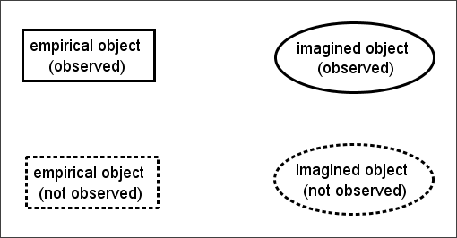{#fig-12-2}

Figure 12.2.

Figure 12.2 Graphical representation of empirical/imaged and observed/not observed object distinction

With these four distinct objects in mind, I will now suggest why and how „Aspirational‟
and „Technical‟ approaches are combined to make a political argument.
Within my terminology, Pathways to Work is an „imagined object‟: not something that
can be observed or measured in-and-of itself, but instead that may be inferred from -- or,
more accurately but less intuitively, used to make sense of the relationship between -- a
variety of „empirical objects‟. As a way of illustrating the idea that imagined objects are
377

Given that this terminology means partially 'over-loading' the term 'observed', one may prefer to use
the term 'instantiated' -- 'brought into being' in a more general, rather than primarily visual sense --
instead.

inferred relationships between empirical objects, consider a simple mathematical
example where one observes three empirical objects, which are points specified along
two axes: the objects one observes are [x=1; y=1], [x=2; y=4], and [x=4; y=16]. From
these three empirical objects, the observer assumes the existence of a particular
imaginary object, a Generative Rule stating that the value of any point on the second
axis should equal the square of the value of the point on the first axis; the assumed
existence of the Generative Rule then allows the observer to infer the existence of other,
non-observed, empirical objects (such as [x=3; y=9]). This above process is represented
graphically in 

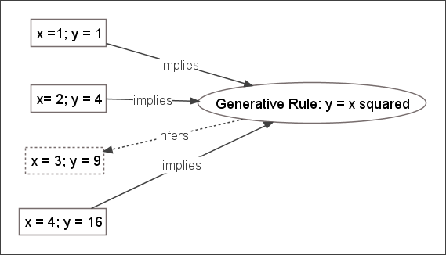{#fig-12-3}

Figure 12.3.

Figure 12.3 Example of imagined object as generative rule

Not that this type of model is very popular in disciplines like psychometrics, and
represents the intuition underlying most quantitative measures of intelligence.
Technically, the instantiation of an imagined object may be thought of as a „data
reduction technique‟, as correct specification of an imagined object can operate as both
an effective summary of a collection of previously observed empirical objects; and also
a means by which one can avoid the expense of observing many more empirical objects,
whilst not being substantially less able to predict and respond effectively towards them
as and when they become observed.
With respect to political claim-making, an example of this type of empirical object/
imagined object relationship is represented graphically in 

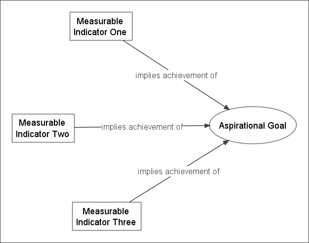{#fig-12-4}

Figure 12.4.

Figure 12.4 Three measurable indicators supporting the assertion that an 'aspirational statement' is valid

For example, the imagined object being asserted could be that "Intervention X causes
old people to live better lives". The three empirical objects used to support the imagined
object may be that 1) "people aged 65 and over, living in the area where the intervention
was introduced, after the intervention was introduced, have a lower standardised
mortality ratio people aged over 65 in the average of other regions where the
intervention was not introduced"; 2) "the mean value of an index of mental health,
derived from the aggregate score of five Likert questions (where responses are
numerically coded 1-5) on mental functioning, asked to a randomly selected sample of
300 people over 65 in the area after Intervention X, was statistically significantly lower
than a sample of 300 person over 65 in other areas"; 3) "The proportion of those aged
over 65 who are wheelchair-bound in the area post Intervention X was 5% lower than
the national average". Each of the empirical objects being proposed works to increase
the readiness with which the observer will accept the validity of the imagined object.
During the period over which the original Pathways pilots were being implemented and
evaluated, described in chapter 10, DWP accounts and descriptions of Pathways
involved repeatedly promoting two objects: the imagined object, „Pathways to Work is
effective‟, and the empirical object (or more accurately family of empirical objects), „six
month off-flow rate‟, that I have referred to as The Graph. The rhetorical function of
this type of pairing is that the (observed) empirical object can be used to imply the
validity of the imagined object, the validated („observed‟) imagined object infers a

family of other (unobserved) empirical objects, the observed empirical object infers
some of the unobserved empirical objects, and these inferred and unobserved empirical
objects themselves appear to support the validity of the „observed‟ imaginary object
being asserted. Graphically, a version of this web of associations is represented in

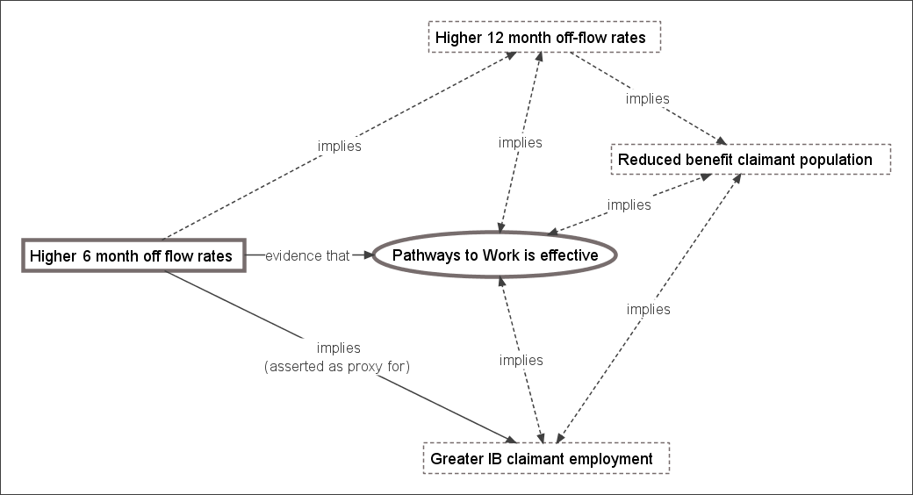{#fig-12-5}

Figure 12.5.

Figure 12.5 Pathways Evaluation: Original pairing of technical and aspirational assertions

Here, most of the empirical objects used to support the validity of the imagined object,
„Pathways to Work is successful‟, are unstated, unobserved, chimeral. The empirical
object, The Graph, was asserted to be an adequate proxy for a range of other empirical
objects. 

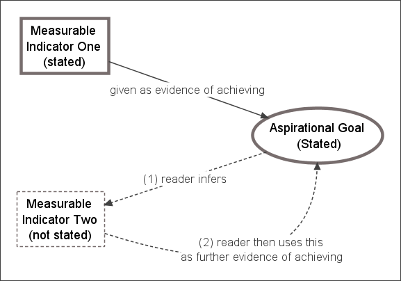{#fig-12-6}

Figure 12.6 presents a graphical illustration of this type of process. Here a
strong claim is made to the reader that two objects should be accepted: an imagined
object, and an empirical object in support of the empirical object. The empirical object
is used to overcome the reader‟s reticence to accept the imagined object; once the
imagined object has been accepted, however, the reader is readier to infer the existence
of further empirical objects in support of the imagined object (Stage 1). Having now
accepted the existence of an empirical object that has not been stated or observed (as
this appears to follow as a consequence from accepting the imagined object), the reader
may in the future come to believe that the empirical basis for belief in the imagined
object is stronger than has ever been explicitly claimed (Stage 2). More generally: the

causal influence between evidence378 and belief379 can, and often does, run in both
directions.

Figure 12.6 A recursive process leading readers to infer that more empirical objects exist in support of an
imagined object than are officially stated

I suggest that the empirical object „The Graph‟ was used as an instrument with which to
„implant‟ the imagined object, „Pathways to Work works‟, in the mind of the reader.
Once successfully implanted, and due to the recursive paths of causal influence
described above, the imagined object can effectively generate assumptions that other
belief-supportive empirical objects exist. Using a form of circular reasoning, the reader
who accepts the imagined object will sense that these unobserved belief-supportive
empirical objects can be accepted without being observed because the imagined object
is an effective accounting summary of the empirical objects.
Crucially, the belief may persist even if the evidence that originally caused the reader to
accept the belief does not. 

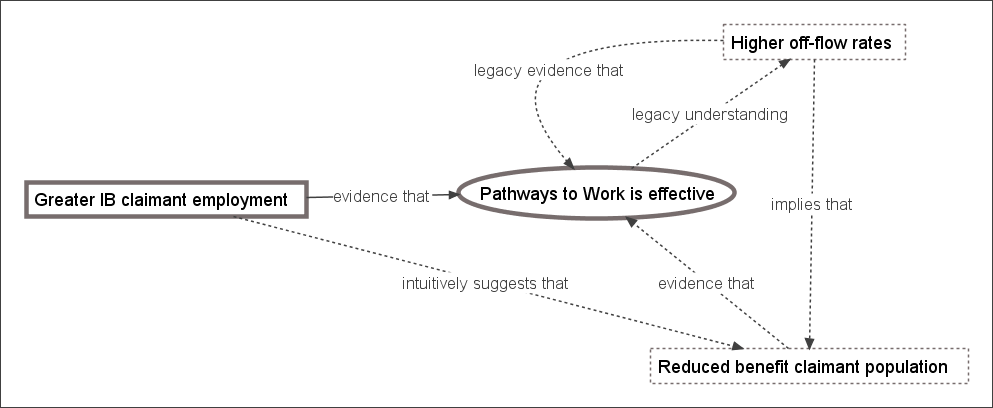{#fig-12-7}

Figure 12.7 graphically indicates how this aspect of beliefs
appears to have been utilised in continuing to promote Pathways to Work following
from the PSI report. Here, as before, an empirical object is being paired with, and used
to support, an imagined object. The imagined object, „Pathways to Work is effective‟, is
the same as before, but the empirical object, „Greater IB claimant employment‟, is
different. A reader who already accepts the imagined object may recall that she did so
on account of a different empirical object (higher six month off-flow rates); having not

378

Roughly defined as an empirical object whose existence increases the apparent veracity of claims
that a particular imagined object 'exists'; i.e. that one should have a particular belief
379
Broadly synonymous with 'imagined object'

noticed the findings suggesting this empirical object can no longer be used to support
the imagined object (because the findings have been phrased more ambiguously and
promoted less strongly than when they were seen as supportive of the imagined object),
she may think that the new empirical object operates in addition to, rather than instead
of, the original empirical object.

Figure 12.7 Revised argument for the 'success' of Pathways
A different empirical object is being used to continue to support the same imaginary object. By not strongly
disasserting the original empirical object (off-flow rates), the reader can be led to believed that the new evidence
is in addition to, rather than instead of, the old evidence.

What appears to have happened is that an initially and apparently strong piece of
evidence was used to promote the belief in Pathways. Later, and surreptitiously, this
strong piece of evidence was removed and replaced with a much weaker piece of
evidence. Having already accepted the belief that „Pathways is effective‟, however, this
weaker evidence will generally be sufficient to maintain the belief. This follows from a
more general observation about evidence and beliefs: the strength of the evidence
required to maintain a belief is lower than that required to accept the belief in the first
place.
12.2.3 Bait and Switch
In the above discussion, I have attempted to suggest why and how evidence has been
used rhetorically, to indicate that a particular set of alterations to the way in which new
Incapacity Benefits are administered, collectively known as Pathways to Work, has led
to a constellation of empirically observable changes to the labour markets, to individual
attitudes, to health outcomes, to social security expenditure (and thus personal taxation
levels), to existing IB claimants, and to other „improvements‟ in the welfare state from
the perspective of „the general public‟ (as politicians imagine them to be). Collectively,
this particular, directed constellation of changes, which is inferred more often than is
demonstrated, is meant to be understood as showing that „Pathways is effective‟: i.e.

that the particular (and empirically observable) set of alterations to the administration
and processing of new Incapacity Benefits claimants, that the DWP has collectively
labelled Pathways to Work, has created a „general factor‟ that can be accurately thought
of as the root cause of the empirically observable and beneficial changes listed above.
The problem from the DWP‟s perspective, however, is that much of the empirical
evidence produced by and for the DWP in evaluating Pathways has indicated that these
empirically observable changes have not been observed, and cannot be demonstrated
statistically. Many of the changes one might have expected from the intervention, if it
has operated effectively as a general factor responsible for the above-listed beneficial
improvements, have not occurred. The expectations a reader may have of the effects of
the intervention are likely to depend, partly, on the level of detail with which the reader
understands the specifics of the intervention, and the social conditions into which it is
being introduced.
For example, if the reader understands that the intervention is only directed towards
new claimants, and that new claimants only represent a small proportion of all
claimants, then their expectations for the magnitude and range of the observable effects
of the programme may be more circumscribed than if they are unaware of most of the
specific details of the programme, but has a broad awareness that it is meant to „sort out
the problem of there being too many IB claimants‟.
The above discussion suggests a reason why the declared purpose of Pathways tends to
vacillate between the very technical and specific, and the very aspiration and general.
Aspirational goals, and aspirational claims, cannot be directly either verified or
falsified; their verity or falsity can, however, be indicated through an empirical proxy or
proxies. By vacillating between Technical and Aspirational statements, the DWP may
be attempting to direct the reader towards the DWP‟s preferred empirical proxy.
Between the „Past‟ and the „Present‟ phase of the evaluation, and as a consequence of
the results indicated in the PSI report, this preferred proxy changed. In pairing a
circumscribed and carefully selected proxy with a very broad claim („To improve
"opportunities for people on incapacity benefits"‟), the DWP is attempting to infer the
verity of a very general causative „factor‟, and thus that one should expect a wide range
of improvements to result from the intervention.

In making rhetorical use of statistics and quantitative evidence in this way, the
government can avoid either admitting or suggesting that one of its flagship welfare
reform policies has failed.
12.2.4 Discussion
The story of the previous three chapters seems, at its simplest, to be as follows:
1. Central government identified a strong public demand to intervene to reduce
IVB/IB claimant rates, which the public believed constituted a violation of an
implicit work-based „promise‟ that one should work during working age and
only stop working after retirement age. (In the game-theoretic terms of the
Prisoner‟s Dilemma: the public saw IVB/IB claimants as „defectors‟ and
themselves as „cooperators‟, and wanted the government to raise the cost of
„defecting‟ to prohibit such actions.)
2. Central government broadly accepted the public‟s interpretation of the issue, and
set about intervening in IVB/IB populations in much the same way they did with
other groups of working age persons whom they, and the public, identified as
„defectors‟ -- single parents; uneducated young persons who had been
unemployed for a long period of time; and so on -- through a „New Deal‟ style
programme which aimed to increase the size of the reward if the individual
chooses to „cooperate‟ (through „Return to Work Credits‟ in the case of
Pathways; and various forms of in-work tax credit more generally), and increase
the size of the punishment if the individual chooses to „defect‟ (up to and
including financial sanctions for the chronically non-compliant).
3. Early evidence, produced at the earlier stages of the initial pilot schemes,
appeared to suggest that Pathways was effective. This early evidence was
sufficient to convince central government to proceed with a national roll-out of
the scheme, and to promote it as an example of effective government
intervention.
4. Later evidence, which came to light only some time after central government
had come to believe that Pathways was an effective intervention, indicated that it
was not. However, by the time this evidence had become available, central
government was already inexorably committed to its wholesale implementation:
if they were to make a „u-turn‟ and explicitly declare that, despite early evidence
suggesting otherwise, their intervention was not successful, they would be
attacked by their political rivals and by unsympathetic media commentators, and

so Pathways would cause them to „lose face‟ with the same members of the
public whom it was designed to impress. If, instead, they were to proceed with
the expansion as if they still believed it was effective, and not promote later
evidence of its ineffectiveness as vigourously as they had promoted earlier
evidence of its effectiveness, then perhaps neither the political rivals nor the
unsympathetic media would notice that it was not effective.
5. Thus began a small but significant campaign of „evidence-based rhetoric‟: using
quantitative data and statistical inference not to help make political decisions,
but to justify political decisions that had already been made. This could in part
be achieved by commissioning more „reliable‟ and „trustworthy‟ research
organisations to produce the research: organisations that already knew what the
government wanted them to find; who understood how tricks of terminology and
phraseology (such as using the term „mixed evidence‟ to mean „no evidence‟ or
„disconfirmatory evidence‟) can be used to make weak supportive evidence look
strong and strong contradictory evidence look weak; and who understood that
most politicians, journalists, and members of the public lack both the necessary
interest and understanding of statistics to be able to notice when numbers are
being manipulated and presented unclearly in order to misdirect and mislead.
6. Though such evidence was being „spun‟ as best as it could, it was not being
promoted as strongly as earlier evidence that required less massaging in order to
look convincing; as a result of this, later evidence was promoted less strongly,
and less widely, than earlier evidence, as if such evidence were promoted more
widely, it would be more likely that someone in politics or journalism would
look at the claims more closely, and identify the problems with the programme.
Central government seemed content to let Pathways fall out of mainstream
political and public consciousness; for later research reports to not be so overtly
and unambiguously critical as to re-awaken mainstream interest in public
bodies; and for Pathways to become a „historical‟ rather than „current‟ issue
before anyone noticed something was wrong. Pathways continued to roll,
therefore, as a political damage limitation exercise.
In around five years, Pathways to Work made the full transition from a set of broad
proposals outlined in a short green paper380 to a new national standard. Pathways to

380

DWP (2002). Pathways to work: Helping people into employment. DWP. London, TSO.

Work is no longer new, revolutionary, attention grabbing; but commonplace, standard,
mundane.
Irrespective of the processes involved in its commissioning, evaluation, and expansion,
the end result was that Pathways to Work became the national standard way of
processing first IVB/IB claimants, and then later Employment & Support Allowance
claimants. Millions of people in thousands of jobcentres now have their benefit claims,
and their selves, processed in accordance with this revised set of procedures and
protocols. Pathways represents, in terms of Weberian bureaucratic theory (Chapter
five), the successful re-writing of role definitions of thousands of functionaries
operating in Jobcentre Plus offices, and related organisations, throughout the 94,000 or
so squares miles381 that constitute the United Kingdom. Thousands of people are now
simultaneously treating millions of other people „this way‟ rather than „that way‟, quite
possibly because a few dozen people either did not notice that long-term evidence
suggested doing things „this way‟ was not really an improvement over doing things „that
way‟; or thought that if they pretended the long-term evidence did not suggest „this
way‟ was no better than „that way‟, then hopefully a few hundred people would not
notice this either, and would not then alert a few hundred-thousand people of the few
dozen people‟s failure.
In the Radio 4 programme 'Analysis: Dead Cert', broadcast on 6 November 2008,
journalist Michael Blastland considers reasons why politicians often attempt to project a
greater sense of certainty about the effectiveness of policies than can be empirically
justified. The social world, like the physical world out of which it is constituted, is an
incredibly complex system, in which the networks of causal influence between elements
are almost invariably unknown and unknowable, and may be constantly shifting.
Because of this, the short, medium, and long-term effects of any particular type of
policy intervention can never be „known‟ beforehand with any substantial level of
certainty. However, the programme suggests that if any politicians express reasonable
uncertainty about the effects of policies they advocate or have implemented, they are
likely to be attacked as incompetent or weak; and if they express regret or recognition
that policies they initiated were found to be failing and should be stopped, they are
attacked as inconsistent, indecisive, and wasteful.382 Within the programme, Gloria
381

CountryReports.org. (2009). "United Kingdom - Statistics."
Retrieved 9 May, 2009, from
http://www.countryreports.org/country.aspx?Countryname=United%20Kingdom&countryId=251.
382
It is for these reasons that, personally, I consider "I screwed up" to be a much more radical and
impressive three word sentence for a politician to say than "Yes we can".

Laycock, an academic who has worked on policy evaluation for the Home Office,
describes how programme evaluations can become overrun by broader political
considerations:
[In theory, neutral, experimental evaluation of policies are] something we've always
been very keen on. Unfortunately, that process has been called a pilot study. The
Home Office ministers who will launch something called a pilot study on, let's say,
the first of January, by the first of February they're screaming to know whether it
worked or not, and by the first of March they've launched the roll-out programme
and we still don't know whether it worked or not, and then by, I don't know,
September, somebody said it was a complete disaster, but "oh well, that's a shame,
because we've now rolled it out across half the country!" Hey: you might have to
wait a year to find out what the answer is. But impatience is just the … a massive
driver in public policy, they are just impossibly impatient. And, anything that
smacks of a complicated answer: forget it! They behave as though the public
couldn't cope with [anything] complicated.383
Given the pressures driving cabinet ministers towards this kind of conceptual myopia
and confirmation bias-- to want impossible certainty now rather than reasonable
confidence in eighteen months‟ time, to want all interventions divided neatly into
„failures‟ and „successes‟, and to want reasons why policies already initiated are
successes, and why policies already rejected would be failures if they were implemented
-- one can see why decisions about the testing, evaluation, and implementation of
complex social interventions might not be most effectively handled by central
government. Actual programme efficacy often only plays a very secondary role in the
implementation of programmes to apparent programme efficacy, and the apparent
personal efficacy of the individuals making political decisions.

383

21 minutes in, 'Analysis: Dead Cert', Broadcast BBC Radio 4, Thursday 6 November 2008, 8.30PM

12.3 The Thirty-year Discussion: On the nonlinear relationship
between

'job

fitness'

(including

physical

fitness)

and

employability
12.3.1 Introduction
The previous section has suggested that politicians were perhaps too ready to accept and
promote evidence appearing to support Pathway‟s claims to efficacy, and conversely too
willing to overlook or bury evidence challenging these claims. As well as the usual
„face-saving‟ explanations for this asymmetry -- politicians, like everyone else, tend to
have a self-serving bias in interpreting the effects of their own actions; and politicians,
like many other people in competitive occupations, tend to be attacked particularly
severely by rivals if and when their actions are seen to be failing -- in the case of
incapacity benefits, broader structural and historical factors also matter. As I showed in
chapter 8, over the past three decades, and in particular since the end of the 1980s, there
has been a very substantial increase in the numbers of people claiming IVB/IB, with
rates roughly doubling from about 30 to 60 per thousand persons of working age from
the mid-1980s to mid-1990s . Within that chapter, in my replication and updating of
Bartley & Owen‟s 1996 British Medical Journal article, (pages 148-157) I also showed
that, for men of working age, the strength of the correlation between employment rates
and inactivity rates is much stronger for those reporting longstanding limiting illness
than for those without, suggesting that decreases in employment levels lead to
increasing levels of economic inactivity. For men especially (but increasingly so for
women too) this economic inactivity took the form of IB receipts. The chapter also
showed that, for both males and females of working age, the IB claimant population is
drawn disproportionately from those nearer the end of the working age range, indicating
that, for many, IB functions as a form of „early retirement‟ benefit.
I think these findings all point in the same direction, and can be largely explained by
assuming that there is a nonlinear relationship between employment „fitness‟ (how well
or poorly a candidate compares to others when being assessed for a particular job) and
employability (the ease or difficulty a candidate faces in getting a job). For this section
of the conclusion, I want to describe and explain the nature and causes of this nonlinear
relationship, by formalising a number of assumptions about the „fitness‟/employability
into a very simple statistical model. This model is based substantially on Beatty,

Fothergill, & MacMillan‟s Theory of Employment, Unemployment and Sickness,384 and
I believe can be seen as supporting a „demand-side‟, rather than „supply-side‟,
explanation for much of the increase in the rates of IVB/IB that occurred over the last
thirty years.
12.3.2 The Model
The assumptions I make in constructing the model are as follows:
1. Jobs are allocated through a first-past-the-post selection process. This means
employers, when selecting a candidate for a job, choose who they believe to be
the „best‟ candidate for the job, rather than, for instance, allocating fractions of a
job in proportion to the relative perceived fitness of the candidates. In the model,
this is represented by positing a „job fitness‟ axis, with „worst candidate
imaginable‟ at one and of the axis, „best candidate imaginable‟ at the other end,
and all actual levels of perceived job fitness lying somewhere between these two
extremes.
2. There is a level of variability and inconsistency in the level of apparent job
fitness an applicant has for a job. For example, on some occasions he may
appear a particularly good candidate for a job (Perhaps he woke up especially
rested, or heard something on the radio that happened to bolster his confidence
just before the interview, or perhaps the employer interviewing him happened to
like what he was wearing because he was dressed like someone the employer
knew and liked); and on others he may appear a particularly bad candidate
(Perhaps he shares the same first name as someone whom the employer dislikes,
or perhaps he had had a particularly stressful conversation with a spouse or
sibling immediately prior to the interview, or perhaps he tripped when
attempting to greet the interviewer, and so made a particularly poor first
impression). In the model this is represented by imagining that an applicant‟s
apparent job fitness follows a Normal distribution curve.
3. Each job applicant also has an average level of apparent job fitness, a central
level of apparent fitness around which displays of fitness (i.e. performance in
applications for jobs) tend to converge. Again, this is represented using a
Normal distribution curve.

384

Beatty, C., S. Fothergill and R. Macmillan (2000). "A Theory of Employment, Unemployment and
Sickness." Regional Studies 34(7): 617-630.

Visually, this is shown in 

{#fig-12-8}

Figure 12.8, in which the fitness distribution of two
applicants, A and B, are shown using the blue and red Normal distribution curves,
respectively. For simplicity, the variance of both applicants‟ distributions are assumed
to be identical, but the theoretical mean of B‟s performance is lower than A‟s. This
difference in means is B‟s fitness disadvantage relative to A, and is represented by the
letter d.

B

A
d

Job 1
Job 2
Job 3
Job 4

Terrible

Employer's appraisal of candidate's job

Fantastic

fitness

Figure 12.8 Example of job selection process with two candidates for four jobs (Original image in colour)

As a simple illustration of the process, below the curves, I have shown how A and B
might perform on four separate occasions, when both applying for the same job, for
which there are no other candidates. On each occasion, a random draw is taken from the
applicant‟s distribution, and the candidate with the highest score is selected for the job
(represented using the dashed box). In this illustration, candidate A, the nondisadvantaged candidate, gets the job on three occasions, and B, the disadvantaged
candidate, gets the job on one occasion (in which B performed significantly above
expectation, and A performed significantly below expectation).
Note, from this diagram, that the likelihood of a candidate getting a job does not depend
upon the absolute position of the candidate‟s draw on the job fitness axis (i.e. all
candidates for the job could be either very good or very bad candidates, in objective
terms), but instead entirely on the candidate‟s position relative to other candidates.
In this model, what I want to explore are the effects of job competition, and the effects
of B‟s fitness disadvantage (the size of d) on the probability of getting a job (i.e. coming

first in the queue). To simulate the effect of job completion, I simply take k draws
(rather than just one draw) from distribution A, to represent the apparent fitness of k
equally non-disadvantaged candidates in getting a particular job, in addition to one draw
from distribution B. To simulate the effects of fitness disadvantage, I vary the distance
d, to increase or decrease the amount of overlap between the distributions.
Repeating

this

process

many

times,385

for

,

and

(i.e. for between 1 and 15 job rivals; and for between no
disadvantage, and for a disadvantage equal to almost five standard deviations below the
average fitness of A), produces a set of estimated probabilities of B getting a job under
each of these scenarios. The reciprocal of this probability is thus the expected number of
interviews B would need in order to get a job (For example, if a candidate has a 25%
probability of getting a job then the expected number of interviews required will be 4).
In 

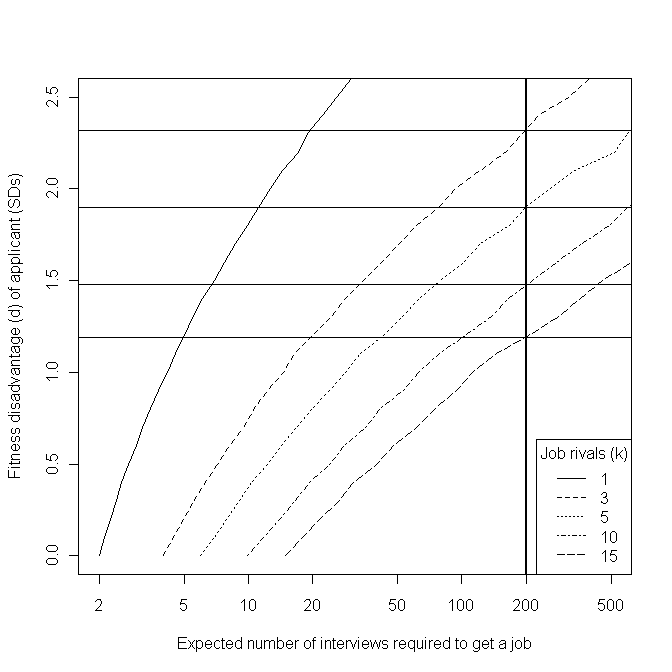{#fig-12-9}

Figure 12.9 below, I present B‟s job fitness disadvantage, d, on the vertical axis, and
the expected number of interviews needed to get a job, a measure of employability, on
the horizontal axis. I plot this relationship for k = 1, 3, 5, 10, and 15.

385

In my model, I have replicated the results using each combination of k and d 100,000 times, to
average out the stochastic uncertainty in the results. It would be possible to arrive at these conclusions
analytically rather than through simulation, but I do not believe the results would be qualitatively any
different.

Figure 12.9 Predicted relationship between job 'fitness', number of rivals, and employability

Note that I have used a log-scale on the horizontal axis, but a linear scale on the vertical
axis. For reference, I have indicated the level of fitness disadvantage expected to result
in an employability level of, on average, one job offer per 200 applications: a level of
failure

that

would

be

extremely

disheartening,

and

effectively

close

to

„unemployable‟.386
The relationship between employability and job fitness (the horizontal and vertical axes)
is approximately log-linear. The effect of increased competition, however, is to shift this
log-linear relationship towards the bottom-right corner of the graph, so that the same
level of job fitness disadvantage results in exponentially increasing levels of
386

A different threshold could be used if the one-in-200 level is seen as either too high or too low, but
the same overall argument still applies.

employability disadvantage. In times of greater job scarcity, slight disadvantages in job
fitness (which in the case of manual labour occupations, especially, includes physical
fitness) result in extremely severe disadvantages in labour market employability. In
these more competitive situations, even if a disadvantaged candidate could do a job, he
or she has a vanishingly small chance of being allowed to do so.
12.3.3 Objections and Provisos
The model described above is highly simplistic, and so the objection could be raised
that it is insufficiently realistic, and either ignores extremely important factors involved
in real-life recruitment processes, or misrepresents such processes to such an extent that
the results that follow from the model, and the qualitative interpretation I have offered
of these results, are technical artefacts of the way in which I operationalised and
formalise the problem, rather than something with substantive meaning. As with many
technical models of this sort, countless iterations and variations of the basic set-up could
be produced: the variance of different candidates‟ apparent fitness could be allowed to
vary, rather than be assumed the same for everyone; the effects of constant and
persistent rejection could be assumed to have some effect on B‟s average performance,
either reducing d, as B gains increased practice and experience at performing at
interviews, or increasing d, as B becomes increasingly disillusioned, demotivated, and
despondent as job-search efforts fail to yield noticeable rewards; and so on and so on.
Attempting to „correct for‟ and investigate the effects of these various modelling
assumptions could very easily be made to occupy a lot of time and space: a three page
description could conceivably be turned into a thirty page paper, or even a threehundred page thesis. In doing so, an issue of substantive social importance becomes
reinterpreted as a set of technical challenges, with the models becoming ever more
complicated and unintuitive, and in the process abstracted and rarefied to such an extent
that any insight the model originally brought to the social phenomena it was inspired by
becomes buried under a mass of graphs and equations. The abstract machine becomes
overloaded, until it collapses in on itself.
Accepting this proviso, I now want to briefly discuss verbally, rather than formalise
algebraically, a number of issues that I think are important in job-selection processes,
but which are not represented in the model. At the end of each description, I will
suggest how I think attempting to represent these issues may alter the model results, and
if so whether it would change the overall interpretation of the model.

Conventions and Codes filter candidates prior to fitness assessment: For
example, a company might state in a job advert that applicants need to have
either a first or upper-second class degree to be considered for interview (a
code), and apply this rule unfailingly. Or, the human resources manager of a
company may adopt a number of heuristics (conventions), such as "Don‟t
interview anyone over 50", "Don‟t interview anyone with a gap in their
employment record of more than six months", "Don‟t interview anyone who
ticks the box saying they have a criminal record", and so on, and apply these
conventions as informal (and perhaps technically illegal) decision-rules, just as
in the prior example a code was used as a decision-rule. I believe that, if this
process were also included in the model, then the likely result would be to
further increase, rather than decrease, the employability disadvantage faced by
disadvantaged applicants, and so would not invalidate the arguments I have
made above.
Temp Agencies: For many, if not most, low-paid jobs, employment is not
secured through interviews or recruitment processes conducted by the employers
themselves, but through temp agencies and similar human resource brokerage
services. This may modify the process modelled slightly, but not, I believe,
substantially. Whenever someone contacts a temp agency in need of a job, the
employee at the temp agency will likely attempt to judge and assess that person
as she believes the employers whom the agency services would, to imagine
herself in the position of an employer on her books, and assess them in terms of
suitability („fitness‟) for the vacancies she has been asked to fill. Only those
temps who are seen as „best‟ for a vacancy would then be matched with
employers and given a chance to work. In this sense, the temp agency employee
acts as a kind of surrogate interviewer for the employer, and so exactly the same
argument applies. (The „casual‟ and „flexible‟ nature, and low pay, of most of
the jobs temp agencies offer, however, perhaps does function to decrease the
number of candidates per vacancy.)
Local Fitness Disadvantage: Perhaps, in a certain region, a large proportion of
the local workforce have a substantial job fitness disadvantage, relative to a
nationally or internationally „average‟ candidate. If there were little or no labour
market mobility from region to region, the low regional fitness of candidates
would not lead to these candidates suffering from a severe employability
disadvantage, as they would not be disadvantaged relative to most other

applicants (i.e. they would all be more like candidate A rather than candidate B,
but A‟s mean fitness would be lower). Where labour market mobility increases,
however, this regional fitness disadvantage quickly becomes a very severe
employability disadvantage, as the pool of rivals expands to include more people
from other parts of the country, and from other countries. Where there are vast
disparities in average wages between regions, or between countries, then people
from poorer areas, and poorer countries, tend to be willing to travel increasing
distances in search of better paying work. Immigrant labour, either from other
regions or other countries, will tend to be „fitter‟ (younger, stronger, healthier,
better motivated, better prepared to work for what locals consider low wages),
from the employers‟ perspective, than local labour, and so, through the
processes described in the model, increased immigration can effectively render
large sections of the local workforce „unemployable‟.
Homophily: Perhaps employers are not as rational or calculating as I have
assumed in the model. Instead, perhaps employers tend to want to pick
employees who are like themselves, and not pick employees who are
substantially different from themselves. Assuming that a large proportion of
selection is based on homophily and the properties of social networks and group
identities, rather than a rational scale of apparent job fitness, would lead to a
substantially different model to that which I have discussed in this section. It
could either exacerbate, or it could ameliorate, the fitness/employability
relationship described here. Perhaps if the managers of a company are in their
sixties, male, and working class, then they will treat older, male, working class
candidates preferentially. If most of the managers are middle-class thirtysomething university-educated females, however, then the converse may occur.
Homophilic selection might be thought of as a much more dominant mechanism
than fitness selection, or it might be seen as a fundamentally a modifier of
fitness selection rather than a genuine alternative („people like us‟ get moved
forward in the queue, but not so far that they are guaranteed a job), or perhaps
the two mechanisms could be imagined to interact in some way, to produce a
hybrid model (perhaps with different streams of job offered for homomorphic as
against heteromorphic candidates). The issue of homophily in employment is
very important, but I expect not so fundamentally that the argument developed
in the fitness model is not credible.

12.3.4 Concluding Remarks
My main aim in creating and describing the model presented above was to explore a
few intuitions I had about why having a slight but noticeable impairment relative to
others in the labour market might lead to people becoming, effectively, „unemployable‟.
In doing so, I have indicated why what have been called demand-side explanations for
the rapid rise in incapacity benefit claimant rates since the late 1980s may be much
more important than many politicians appear to assume.
As David Webster, an economic geographer and director of housing services at
Glasgow City Council suggests, the government "is very confident that the problem lies
entirely on the supply side of the labour market. In other words it is caused by the
characteristics or motivation of workless people and not by any shortage of demand for
labour".387 Webster suggests that "government focus on supply-side explanations of
worklessness has led to supply-side labour market policies [such as the] development of
a more proactive employment service, oriented towards identifying people‟s labour
market handicaps and helping to remedy them".388 Conversely, demand-side policies --
such as providing sheltered employment opportunities for those with fitness
disadvantages that, in a more competitive labour market, effectively renders them
unemployable through usual selection processes; or subsidising employers to keep or
take on employees with fitness disadvantages - have been persistently avoided, and
demand-side „legacy‟ organisations, such as Remploy, which was established in 1945 to
provide sheltered employment for disabled people, have been forced to shed thousands
of jobs.389
The broader reasons for avoiding demand-side interventions seem to be ideological.
Demand-side interventions, the extension of the State‟s role in the production of goods
and services, have, until the global financial crisis which began in late 2008, been
rejected as deleterious distortions of the Economy, that should be avoided except where
completely necessary, because they reduce the „efficiency‟ with which the market
operates. In many cases, the government‟s belief in the comparative „inefficiency‟ of
public sector organisations has led them to encourage private and third sector
organisations to take over the provision of public services that previously were provided
387

Webster, D. (2006). "Welfare Reform: Facing up to the Geography of Worklessness." Local Economy
21(2): 107-116., p. 107
388
Ibid., p. 114
389
Davies, C. (2008). "Job losses are 'betrayal' of disabled: Unions protest after the government refuses
to rescue factories that keep thousands in work."
Retrieved 12 April, 2009, from
http://www.guardian.co.uk/society/2008/mar/09/disability.

by the public sector. John Kay, an economist who has actually worked in the private
sector, rather than exclusively in academia, has suggested that: "There is something of
the zeal of the convert in [New Labour‟s] embrace of the market." 390
In the case of Pathways to Work, this zeal has led to the use of private- and third-sector
organisations to deliver Pathways in the majority of the country, 391 even though all of
the pilot studies were conducted using public sector Jobcentre Plus, and so the
effectiveness of private- and third-sector organisations‟ provision is unknown.
According to at least one academic article, this contacting out of public services to the
private and third sector is fairly typical, despite there being little or no evidence that
such contractors are any more effective at providing public services than the public
sector.392 It follows from a belief in the superior efficiency of the unfettered market,
however, that these providers do not have to be evaluated with the same level of
scrutiny as the public sector, because they can simply assumed to be more effective and
efficient in providing any goods and services, including public goods and public
services. The measured effectiveness of the public sector, therefore, can be assumed to
represent a „worst-case scenario‟ for the effectiveness of the private and third sector in
providing the same services.
Of the private sector and the third sector, the government seems to prefer the former,
presumably because they are thought to respond better to the financial incentives that
are thought to be key to the efficiency of the free markets.393 Perhaps, given the global
financial crisis which began in 2008, these kinds of beliefs, which emphasise supply-

390

Kay, J. (2007, August). "The Failure of Market Failure." Prospect Magazine. Retrieved 12 April, 2009,
from http://www.prospect-magazine.co.uk/pdfarticle.php?id=9709.
391
The DWP distinguishes between 'Jobcentre Plus led Pathways to Work', which includes the pilot
studies, and 'Provider led Pathways to Work'. According to a brief statement on a DWP website: "From
April 2008, in [...] 60 per cent of the country Pathways to Work has been delivered by external
contractors." DWP. (2008). "Pathways to Work Process."
Retrieved 12 April, 2009, from
http://www.dwp.gov.uk/welfarereform/pathways_process.asp.
392
Davies, S. (2008). "Contracting out employment services to the third and private sectors: A critique."
Critical Social Policy 28(2): 136-164.
393
For example, the response provided by the DWP to the question, "How many third sector prime
contractors and subcontractors are currently involved in the delivery of DWP-funded employment
programmes?" at a Work and Pensions Committee was "DWP currently has just under 600 providers
delivering DWP funded employment programmes of which 30% are Third Sector" [Emphasis added].
[Source: www.parliament.uk. (2009, 5 March). "'Supplementary memorandum submitted by the
Department for Work and Pensions', DWP's Commissioning Strategy and the Flexible New Deal -- Work
and Pensions Committee." Retrieved 12 April, 2009, from
http://www.publications.parliament.uk/pa/cm200809/cmselect/cmworpen/59/59we28.htm.

side labour market policies at the expense of demand-side policies, will not be held with
the same degree of conviction by future governments.

12.4 The Hundred-year Discussion
12.4.1 Introduction
So far in this conclusion, I have offered a five-year discussion, about the ways in which
evidence in Pathways evaluations have been presented and interpreted in a rhetorical
fashion; and a thirty-year discussion, offering a simple explanation for why IVB/IB
levels rose as substantially as they did, and why purely supply-side labour market
interventions such as Pathways are unlikely to be very successful. In this section of the
conclusion, I will look at these issues from a century-long perspective, and indicate how
I think the issues discussed in the previous two sections form part of a much broader
and more significant change that has occurred over the course of the Twentieth century
in the UK, most of the rest of the developed world, and much of the developing world.
This change is not just to do with labour economics or social policy evaluation, but the
nature of life itself.
12.4.2 The Second Epidemiological Transition, Ageing, and Retirement
The crux of my argument is presented in 

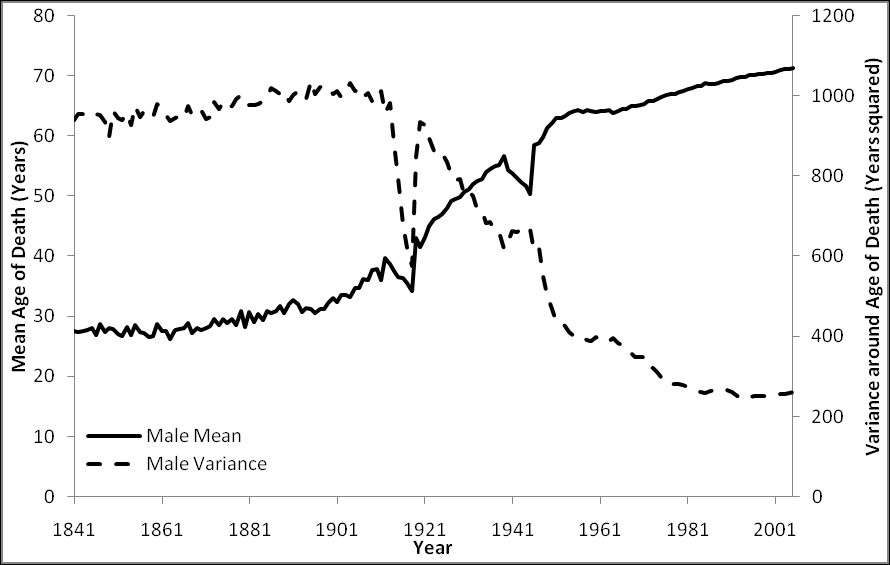{#fig-12-10}

Figure 12.10 and 

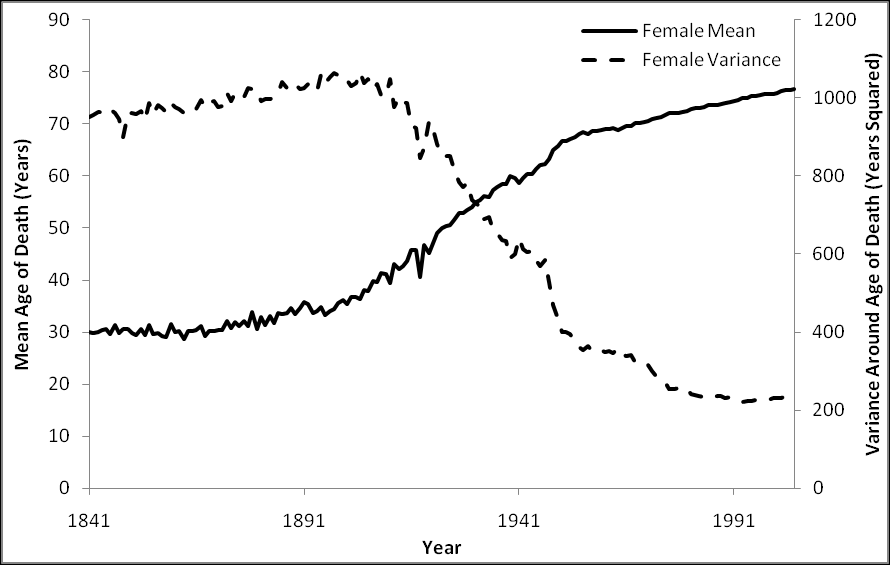{#fig-12-11}

Figure 12.11 below. These
two graphs show, for males and females respectively, both the mean age of death, and
also the variance around this mean age, for people in England and Wales, from 1841 to
2005.

Figure 12.10 Male mean and variance of age of death, England and Wales, 1841-2005
Estimated used weighted average of median ages within five-year age-bands, such as 10-14, 15-19, etc
Source: 'England & Wales, Total Population: Deaths 1841-2005', retrieved 20 November 2008 from
http://www.mortality.org

Figure 12.11 Female mean and variance of age of death, England and Wales, 1841-2005
Estimated used weighted average of median ages within five-year age-bands, such as 10-14, 15-19, etc
Source: 'England & Wales, Total Population: Deaths 1841-2005', retrieved 20 November 2008 from
http://www.mortality.org

The graphs indicate that something incredible took place for both males and females
during the first half of the Twentieth Century: average life expectancy more than
doubled, from around 30 years to over 60 years of age. At the same time, the variance of
life expectancy reduced by an even greater factor, to around a fifth of its previous level.
Life became less risky, in the sense that ever larger proportions of the population could
realistically expect to reach old age.
This shift has been termed „the epidemiological transition‟,394 which Richard Wilkinson
defines as "the well-known process by which the old infectious causes of death, which
killed people at all ages but particularly in childhood, gave way to degenerative
diseases such as cardiovascular diseases and cancers, which appear mainly in later
life."395 To provide a sense of historical perspective, I will refer to it as the Second
Epidemiological Transition, as I believe it represents almost as substantial a qualitative
shift in the nature of people‟s lives, deaths, and lived experiences as the adoption of
agriculture and animal husbandry (the First Epidemiological Transition), and with it the
adoption of sedentary lifestyles and deep social inequalities, did many thousands of
years earlier. This second epidemiological transition, however, occurred far faster than
the previous one, over the course of decades rather than centuries, and within living
memory.

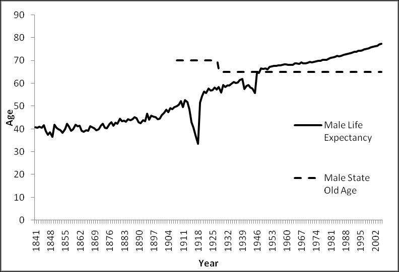{#fig-12-12}

Figure 12.12 indicates one way in which the Second Epidemiological Transition starts
to become directly relevant to the issues discussed in this thesis. It plots male life
expectancy (rather than mean age of death, as in Figure 12.10), together with male state
retirement age, from 1841 to 2005.

394

Wilkinson, R. (2005). The Impact of Inequality: How to make sick societies healthier. Oxford,
Routledge., pp. 9-14, emphasis added
395
Ibid., p. 10, emphases added.

Figure 12.12 Male mean age of death and state retirement age, England & Wales, 1841-2005
Estimated used weighted average of median ages within five-year age-bands, such as 10-14, 15-19, etc
Source: 'England & Wales, Life expectancy by year of death', retrieved 6 November 2009 from
http://www.mortality.org

In 1928, when the male state pension age was first set at 65, average male age of death
was 58.3; by 2005, it was 77.3. In other words, whereas in 1928 a state guarantee to
provide financial assistance to men aged over 65 could be interpreted as a promise to
allow men to live without working if they happen to live around 16% longer than they
are expected to live, by 2005 state pensions had become a promise to allow people to
live without working for almost the last fifth of their life. Due to increases in life
expectancy, and massive decreases in the risk of early death, the same state-legislated
promise in chronological terms came to mean something very different in experiential
terms.
The two changes depicted in Figure 12.10 and Figure 12.11, increased life expectancy
and reduced life risk, occurred somewhat faster than, but contemporaneously with,
another broad qualitative shift in common social experiences and expectations. As
chapter seven has suggested, there has been an increasing formalisation of the concept
of work: what it means be in work, and what it means to be out of work, as well an
increasing normative demand that men (particularly and historically, and women within
the last generation) should be employed within a formally recognised and registered
industry. As chapter five has suggested, a prerequisite of the demand that people work

in industries is that these industries, private-sector bureaucracies, exist, and thus that
bureaucracies become a ubiquitous and predominant form of organising the actions of
groups of individuals towards purposive activity. And as chapter three has suggested, a
prerequisite of the existence of bureaucracies, formalised durable multi-level hierarchies
with functional specialisation, are the long-term societal and material developments that
led to and propagated deep and durable power structures and occupational
specialisation: chiefdoms beat tribes, and empires beat chiefdoms; an army beats a
militia, and a satanic mill beats a spinning wheel in the corner of a cottage. By the end
of the Twentieth Century, this meant that everyone was expected, by themselves, by
others, and by the state, to spend a significant portion of their waking, working lifespan
in regular employment, as paid functionaries operating in economic industries. To do
otherwise is not just considered unusual, but suspect, unjust and unfair to those who do
work.
Notions of fairness and justice cut both ways, however, and interact with broader
societal circumstances. As life became less risky and longer, the meaning of the state
guarantee of guilt-free out-of-work support for those who live to retirement age
changed: from a meagre provision to prevent those few individuals who had somehow
managed to avoid being struck down with infectious disease for over six decades but
were now too decrepit to be employable from suffering utter destitution; to a general
expectation that all workers, in exchange for devoting most of their lives to industrial
productivity, should be rewarded for their efforts with a work-free „third age‟ known as
retirement, during which they are free from the moral obligation to work under which
they had been burdened for the previous four or five decades.
Over the course of the Twentieth century, a meagre contingency plan for a few
individuals turned into a generous promise for everyone. As result of this promise, the
idea that people should live most of their lives to serve industries, rather than that
industries should exist only to serve people, came to be seen as more fair, and more just,
from a secular perspective than had previously been the case. Whereas previously, as
Max Weber famously intimated, belief in the fairness of hard work may have rested on
the religious foundation of a compensatory afterlife („This world may be unfair, but in
the next world I will be rewarded‟) and a mysterious but ultimately just cosmic
ordering,396 once levels of deadly infectious disease began to drop precipitously in the
UK during the early twentieth century, people could more realistically „bank‟ on living
396

Weber, M. (2002 [1930]). The Protestant Ethic and the Spirit of Capitalism. London, Routledge.

their full life-course. Perhaps as a result of this, „the third age‟ took the place of „the
afterlife‟ as a secular means of justifying and maintaining belief in a Work Ethic that
originally had its roots in religious fundamentalism.

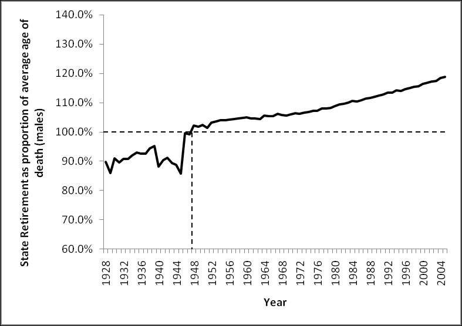{#fig-12-13}

Figure 12.13, based on the 1928-2005 portion of the data plotted in Figure 12.12,
illustrates how the promise of retirement at 65 has changed in experiential terms, by
plotting, for males, average age of death as a proportion of state retirement age. As the
figure shows, average age of death first came to exceed state retirement age soon after
World War 2, in 1948, and has risen steadily since.

Figure 12.13 Male state retirement age as a 'changing promise'
Average age of death for males, England & Wales, 1928-2005, as a percentage of male state retirement age
Estimated used weighted average of median ages within five-year age-bands, such as 10-14, 15-19, etc
Source: 'England & Wales, Life expectancy by year of death', retrieved 6 November 2009 from
http://www.mortality.org

Based on these same numbers, and in somewhat more substantial terms, retirement at 65
meant a promise of not having to work for the last forty-third of one‟s life in 1950, for
the last twentieth of one life in 1960, for the last seventeenth of one‟s life in 1970, for
the last eleventh of one‟s life in 1980, for the last eighth of one‟s life in 1990, and for
the last sixth of one‟s life in 2000.397
397

Male age of death was 2.3% above 65 in 1950, 5.0% in 1960, 6.0% in 1970, 8.8% in 1980, 12.4% in
1990, and 16.4% in 2000. Proportions of life stated in paragraph are reciprocals of these percentages.

However, though life expectancies have risen on average, they have neither risen at the
same rate, nor equalised between different social groups, between regions, and between
social classes. This disparity between a national standard age of retirement, and
systematically differing life circumstances and life expectancies, means that the implicit
promise of retirement, its experiential meaning of being able to live decently without
working for a particular (and increasing) proportion of the end of one‟s life, is „overfulfilled‟ for some people, and severely „under-fulfilled‟ for others.
If the experiential promise of retirement were to be kept, „on average‟, for more of the
nation‟s citizens, then the duration of working age expected (and „morally demanded‟)
of different people would be a function of life expectancy (or more accurately healthy
life expectancy) rather than an arbitrary value chosen more than three generations ago.
Based on this premise, and using the data used to produce Figure 12.12 and Figure
12.13, together with an ONS report produce in 1999, 

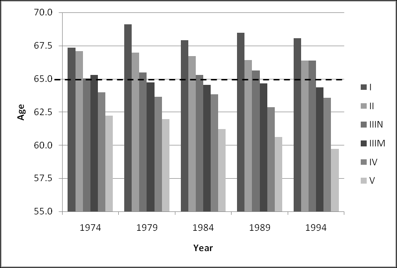{#fig-12-14}

Figure 12.14 indicates, for
selected years between 1974 and 1994, the age at which men of different social
classes398 „ought‟ to retire if they are to be retired for a national „average‟ proportion of
their lives.399

398

Registrar General's Social Class
Calculated by first finding, for each of the five years listed, the number of years by which national
male age of death exceeded 65, as a proportion of national male age of death, i.e.
399

Where 65 may be considered
each year, using
Where

, then imputing a fair-retirement age, , for each class, and for

is average age of death for a specific class in a specific year. (e.g. class IIIM in 1984)

Figure 12.14 Estimates of 'Fair' retirement ages based on social class
Age at which men of different social classes 'should' retire if they were, on the average, to spend the same
proportion of their life retired
Sources: 'England & Wales, Life expectancy by year of death', retrieved 6 November 2009 from
http://www.mortality.org; Hattersley, L. (Summer 1999) 'Trends in Life Expectancy by Social Class -- an update',
Health Statistics Quarterly, retrieved 8 November 2008 from
http://www.statistics.gov.uk/articles/hsq/HSQ2LifeExpectancy.pdf

Another possible means of deriving „fair-retirement age‟ is to use geographical
variables. Using National Statistics data on male life expectancy, in 2005-2007 and at
local authority level,400 the five areas with the lowest fair-retirement ages are:
1. Blackpool (North West): 61.56 years
2. Manchester (North West): 61.78 years
3. Liverpool (North West): 62.18 years
4. Blackburn with Darwen (North West): 62.39 years
5. Sandwell (West Midlands): 62.44 years
Conversely, the five areas with the highest fair-retirement ages are:
1. Kensington & Chelsea (London): 70.43 years
2. Westminster (London): 68.56 years
3. East Dorset (South West): 68.41 years
4. Elmbridge (South East): 68.20 years
400

See ONS. (2008). "Life Expectancy at birth by health and local authorities in the United Kingdom:
Results
for
England
and
Wales."
Retrieved
19
November,
2008,
from
http://www.statistics.gov.uk/statbase/Product.asp?vlnk=8841.

5. Hart (South East): 68.10 years
Note that the disparity between highest and lowest fair retirement ages using this
measure is of a similar magnitude to that based on social class. Note also that four of the
five worst local authorities for life expectancy are in the same region (North West), and
that four of the five best local authorities for life expectancy are either within London or
the South East.401
12.4.3 Concluding Remarks: Fair Retirement Ages and Incapacity Benefits
I believe the concept of the „fair retirement age‟ can do much to explain the
geographical concentrations and occupational social gradients of IB claimant rate
trends. As I have shown, stark mortality gradients exist between places, and between
occupationally-defined social classes. These mortality gradients do not result, to any
substantial extent, from differential exposure to infectious diseases, but instead due to
differential rates of degenerative illness; in short, to people from different geographical
and occupational backgrounds ageing at different speeds. Though almost everyone in
the UK can now expect to experience the full life-course, this life course is travelled
faster by some people than others.
More specifically, it seems reasonable to assume that, on average, the level of health of
a seventy-year-old man from Kensington & Chelsea is similar to that of a sixty-twoyear-old man from Blackpool, and in both cases be like that of a (nationally average)
sixty-five-year-old male retiree. However, whereas the seventy-year-old Kensingtonian
is not expected either by the State, or the general public, to be in employment, the sixtytwo-year-old from Blackpool is, and would be financially penalised by the State
(through conditionality within social security payments), and morally chastised by the
public (through newspaper stories and diatribes), for not achieving or seeking
employment.
Together with the demand-side explanation offered in the thirty-year discussion section
of the conclusion, I suggest that part of the reason for the patterning of IB claimant rates
may be to do with the effect that lower paid, lower status work has on the ageing
process, accelerating the rate at which degenerative illnesses develop and accumulate.
In many cases, I suggest, people move onto incapacity benefits only when they have
401

Geographic data, including low-level post-code data, are starting to be used by financial institutions
to calculate pensioner mortality rates, and from this produce more accurate estimates of pension-based
liabilities and opportunities. (See, for example, Richards, S. J. (2008). "Applying Survival Models to
Pensioner
Mortality
Data."
Retrieved
20
November,
2008,
from
http://www.richardsconsulting.co.uk/laws.pdf.)

reached a level of physical and mental decline equivalent to that of a retiree. Therefore,
such claimants may sense and feel that their claim is a reasonable way of satisfying the
implicit national „promise‟ of non-working third age, even if many politicians (who tend
to be drawn from less socially deprived backgrounds) and members of the general
public do not.

12.5 Policy Recommendations
In the past three sections I have discussed, and suggested explanations for, processes
that occurred over five, thirty, and hundred-year time scales. These discussions and
speculative explanations are attempts at novel interpretations both of evidence collated
in the second half of the thesis, and of theories summarised in the first half of the thesis.
In this section of the conclusion, I will briefly offer a small number of policy
recommendations that I believe follow from these discussions and speculative
explanations. Policy recommendations differ, of course, from explanations of societal
processes and phenomena. An effective recommendation requires not just that one has
an adequate theory about a societal phenomenon, nor also just an adequate theory about
political structures and actions; it also requires an adequate theory about how societal
phenomena and political structures interact, and how and what political actors can do
through the political structure to affect societal phenomena in ways that are intended
and desired. Policy recommendations thus need to identify „Archimedean points‟
through which political actors can, through the political structure, interact with a
societal phenomenon to bring about and maintain desirable societal conditions.
Without an adequate understanding of the societal phenomena, and the political
structure, and the means of interaction that exist between the two, policy
recommendations may as well be thought of as nothing more than random perturbations
within the political structure, that may or may not have some kind of intended or
unintended effect upon any number of types of societal phenomena. I hope, but can of
course in no way guarantee or prove, that the following policy recommendations would,
if implemented, be better able to affect change in desired and intended ways than many
policies that have actually have been implemented.
12.5.1 Hundred Year Recommendation: Flexible Entry to the Third Age
If, as I have suggested in the hundred-year discussion, people in the UK have come to
believe that they have been „promised‟, by the State and by wider society, a generous
„third age‟ of relative leisure after a long period (a „second age‟) of continual

employment, and that this third age should begin as and when individuals have become
„old‟, then perhaps this concept of „oldness‟ could be operationalised using something
other than just chronology.
I recommend that people be allowed to apply to claim a state pension before statutory
retirement age, on medical grounds. All those aged over fifty (for example) would be
allowed to apply to claim. Applications to claim could be assessed through medical and
cognitive examination, with those performing below a threshold level normally
associated with people who are retired being allowed to claim such benefits early.
In practice, given strong over-representation of older persons of working age within the
IB claimant population, the fact that eligibility for IB is based on both having made
sufficient NI contributions, that applicants for IB need to „pass‟ a medical assessment in
order to successfully claim it, and that the older majority of IB claimants tend to have
extremely limited likelihoods of re-entering the labour market, I think IB is, already,
being widely used as de facto early retirement benefit, and that this recommendation has
already been adopted „in practice‟, if not „in theory‟.
If people were allowed more choice as to when they leave „working age‟ and enter the
„third age‟, then I believe the official rates of working-age „economic inactivity‟ due to
illness would decrease dramatically. Furthermore, these new statistics would better
represent lived realities, with those people forced out of the labour market due to a
combination of ill-health and unemployability no longer arbitrarily misclassified as of
„working age‟, of valid surplus labour stock, and instead officially recognised as having
legitimately entered the third age, instead of being popularly characterised as
„scroungers‟ in the second age. Formal, statistical recognition of this kind would help
convey to the public at large the message that these benefit recipients are not receiving
undue benefits (something the contributory nature of IB should itself have conveyed),
but instead fair compensation for a life abbreviated, perhaps, by decades of more
physically demanding and lower-status employment.
Allowing greater flexibility in when people officially enter the third age could have
converse, but equally beneficial, effects on other sections of the population. The
Employment Equality (Age) Regulations 2006 allow employers the right to „retire‟
employees when they reach either their company‟s official retirement age or, if they do
not have an official retirement age, the age of 65. Although employees of retirement age
have the right to request to remain in employment beyond retirement age, the employer

has no duty to honour this request or, if refusing the request, to explain his reasons for
doing so.402 These regulations have led to the forced retirement of an estimated 25,000
people per year, according to one report, and have been contested (unsuccessfully) in
the European court of Justice.403
If a standardised battery of assessment (somewhat like those currently used for
assessing eligibility for ESA) were used as a basis to allow persons to retire before the
age of 65 and still claim a state pension, then perhaps the same battery of assessments
could be used by employees, aged 65 or over, who wish to remain in employment even
if their employers want to „retire‟ them. If such „prospective forced retirees‟ were able
to demonstrate, using state-endorsed assessment, that their performance in employmentrelated tasks fits within a range expected of those of working age, then it could be used
as means by which older employees could defend their right to work, and severely
reduce the kinds of age discrimination that the 2006 regulations were, ostensibly,
introduced to outlaw.
In both cases, the kind of health-based assessment currently used to judge whether
persons are eligible to claim ESA (and previously IB and IVB) could be adapted and
developed into a means by which the imposed bureaucratic categories of „working age‟
and „retirement age‟ can better match the lived experiences of millions of citizens.
12.5.2 Thirty Year Recommendation: Sheltered Employment
My „thirty year‟ policy recommendation follows intuitively and obviously from the
„thirty year‟ discussion: The State should become much more actively and
comprehensively involved in the „demand side‟ of the labour market, in order to provide
viable and realistic employment opportunities for people who want to work but are,
through a combination of „fitness disadvantage‟ and job competition factors,
vanishingly unlikely to find employment by other means.
Such demand-side interventions could include:
Creating, and providing continuing financial assistance for, new sheltered
employment organisations, required to hire exclusively from disadvantaged
labour streams.
402

www.opsi.goc.uk. (2006, 3 April). "The Employability Equality (Age) Regulations 2006." Retrieved 26
April, 2009, from http://www.opsi.gov.uk/si/si2006/20061031.htm.
403
Osborne, H. (2009, 6 March). "British compulsory retirement age can stay at 65, says European
court." Retrieved 26 April, 2009, from http://www.guardian.co.uk/money/2009/mar/06/retirementage-ruling.

Increasing the level of financial assistance for, and expanding the remit of,
existing sheltered employment organisations such as Remploy, to provide more
employment opportunities for other disadvantaged labour streams.
Offering financial subsidies of an appropriate size to mainstream employers, if
they employ someone with an identified fitness disadvantage, rather than
someone without this disadvantage
Requiring employers to offer a proportion of its jobs to disadvantaged
employees through sheltered recruitment streams (i.e. such jobs would only be
available to persons with identified fitness disadvantages, including IB/ESA
claimants).
No demand-side intervention of this kind is, at the moment, politically popular for
IB/ESA claimants, or those with registered disabilities. Although policies of „positive
discrimination‟ or „affirmative action‟ have been applied in various ways in a large
number of countries across the world, they generally tend to be applied only on the
grounds of ethnic origin or gender, which are sometimes considered proxy measures for
identifying those who face poor employability due to systemic employer-based
discrimination, rather than based on more direct and empirically demonstrable measures
of job-fitness disadvantage. Making access to sheltered employment streams dependent
upon gender or ethnic or religious identity can be a controversial policy. Its legitimacy
depends largely on voters‟ evaluation of that of „identity politics‟ arguments more
generally, and the applicability of such arguments to the specific categorical identity for
whom the „positive discrimination‟ applies.
Policies of positive discrimination have also emerged in nations where the citizenry are
divided into a number of mutually exclusive social identities, and national stability
depends upon appeasing members of each ethnic identity. In the UK, a possible
example of this rationale for positive discrimination is in the more active recruitment of
Catholics in the Police Service of Northern Ireland following from the Good Friday
Agreement in 1998.404 A proposed Equality Bill, announced in the Queen‟s Speech on 3
December 2008 and preceded by the green paper on 26 June, is widely believed to

404

www.taoiseach.gov.ie. (1998, 10 April). "The Northern Ireland Peace Agreement: The Agreement
reached in the multi-party negotiations."
Retrieved 26 April, 2009, from
http://www.taoiseach.gov.ie/attached_files/Pdf%20files/NIPeaceAgreement.pdf.

include proposals legally permitting and encouraging positive discrimination on the
grounds of gender and ethnicity.405
Instead of access to sheltered employment opportunities being predicated on an overt
physical or cultural identity, that with few exceptions does not change throughout
people‟s lives, if sheltered employment opportunities instead were dependent upon
demonstrable circumstances that could affect persons of any social identity, then more
cross-partisan support could perhaps be found for its widespread implementation. For
example, sheltered employment opportunities could be made available to all persons
who have been seeking but unable to obtain employment for more than two years, or
after two hundred interviews; or to all persons suffering from any of a range of widely
recognised impairments (such as those included in IB and ESA); or to all persons
seeking full-time employment at a salary level they used to earn, but have been unable
to re-obtain after spending a substantial intermediate period working part-time (i.e.
certain types of sheltered employment could be offered to persons who face employer
discrimination on account of being in the kind of situation that many middle-class
women face after childbirth, but access to this employment stream is dependent upon
being in the situation faced by many middle-class women, rather than in being a middleclass woman per se).
A more nuanced understanding of the causal pathways that lead, or have historically
led, to correlations between employability and social identities could be used to
construct demand-side policies that target the deleterious circumstances that are often
concurrent with the social identities, rather than operationally fetishising the social
identities themselves by making access to demand-side interventions exclusively
dependent upon their membership. (To do so seems either to assume that perfect comorbidity exists between the deleterious circumstances and the social identity; or,
implicitly or explicitly, that being a member of the social identity is itself substantially
deleterious, and that those being targeted by programmes of positive discrimination are
in some ways „inferior‟ to those who are not.)
Through this, the ideas of demand-side „socialist‟ politics from the late 1940s and 1950s
could be combined with those of identity-focussed „radical‟ politics of the 1960s and
405

GEO. (2009, 24 April). "Equality Bill."
Retrieved 26 April, 2009, from
http://www.equalities.gov.uk/equality_bill.aspx.; Jones, A. and T. Morgan. (2008, 26 June). "Harman
defends
positive
discrimination
plans."
Retrieved
26
April,
2009,
from
http://www.independent.co.uk/news/uk/politics/harman-defends-positive-discrimination-plans854475.html.

1970s, to arrive at the following insight: identities matter, but these identities depend
upon circumstance rather than essence. This insight could help drive labour market
policies that are both effective practically, and not divisive ideologically.
12.5.3 Five Year Recommendation: Technocracy and dispersal of power
Very briefly, my five-year recommendation is as follows: In order to improve the
longer-term efficacy of programmes of social intervention, like Pathways to Work, there
should be two concurrent changes to the ways in which political actions and decisions
regarding such interventions are made: Firstly, there should be increased
decentralisation and distribution of powers to commission and operate pilot
programmes. Secondly, the evaluation of the efficacy of such programmes should be
conducted by an independent public sector organisation operating as part of the Civil
Service (or Non-departmental Public Body associated with either the Treasury or
Cabinet Office) and at arm‟s length from any and all government departments.
More briefly still, my recommendation is for more localism and more technocracy: a
combination of proposals that may be fairly unusual. My reasons for suggesting these
changes are as follows: Social policies, as with other forms of societal structure and
pattern, are largely the result of countless iterations of blind-variation-and-selectiveretention. My overall interpretation of the material presented in the three previous
chapters is that, if longer-term social programme efficacy is to be improved, then
changes need to be made to increase both the quantity and quality of programme
variations, and also to the mechanism by which programmes are selectively retained;
more possible options should be available to be tested, and then evaluated better.
The rest of this section will attempt to identify mechanisms of variation and retention
within the development of Pathways to Work. It will illustrate what a more localised
form of programme initiation might look like, and how it can improve programme
variation; and what a more technocratised form of programme evaluation might look
like, and how it may improve mechanisms of selective retention.
I interpret the national expansion and adoption of Pathways to Work as illustrating the
following: decisions were made by a few individuals in central government, with a view
to national implementation. This has implications for both social variation and retention
mechanisms. In terms of variation, because a small number of individuals can only be
attentive to and focussed on a few things at a time, the total number of social variations
considered, the range of types of intervention tested, are likely to be relatively small

compared to those attempted by a larger number of individuals and organisations. In
terms of selective retention, because „successes‟ and „failures‟ are usually attributed to
the individuals who implement programmes of policy change rather than the
programmes themselves, and because the duration of cabinet appointments is often
shorter than the length of time needed to properly assess the efficacy of a programme,
there are a number of reasons to suppose that national policies are often not made,
primarily, on the basis of the presence or absence of robust evidence for longer-term
effectiveness.
Once national political momentum in support of a programme has developed, it can be
self-generating. This appears to be the case in Pathways to Work within the Department
for Work and Pensions, and is also heavily intimated by Gloria Laycock to be the case
in the Home Office (See pages 266-270). Like a cartoon character who continues to
walk forward after having left the end of a cliff, and who only starts falling when he
looks down and explicitly acknowledges that he no longer rests on a solid foundation,
there can, in the short term, be reasons why one might not want to acknowledge a
flimsy or absent evidence-base in support of the actions and decisions one has made.
Just like everyone else, politicians do not want to make bad decisions. Once decisions
have been made and acted upon, however, evidence suggesting the decision is good will
tend to be preferred over evidence suggesting it was bad; furthermore, due to
psychological factors such as confirmation bias, and situational factors such as not
wanting to look incompetent, this asymmetry in accepting confirmatory as against
disconfirmatory evidence will tend to become more pronounced over time, at least
while the groups and individuals who originally conceived of the programme remain in
political power.
The longer a trial for a programme lasts, I suggest, the less receptive those in charge of
evaluating it become to evidence produced by its evaluation. The longer a trial lasts,
though, the better the evidence tends to become: initial and uncharacteristic chance
events regress to the mean, as the ratio of „signal‟ to „noise‟ increases, long term effects
and complex side effects become known, and more nuanced and accurate inferences
become possible. The longer a trial lasts, the better the evidence becomes; the longer a
trial lasts, however, the less the evidence seems to matter. At its most extreme, this
inverse relationship, between quality of evidence and receptivity to evidence, could lead
to a process of selective retention that is almost entirely random, determined
predominantly by the wild and noisy vicissitudes that occur at the start of the trial.

Currently, the same organisation, the DWP, appears to be in charge of conceiving and
initiating the programme pilot, running the programme pilot, producing evidence to
assess the effectiveness of the pilot, commissioning others to produce evidence
assessing the effectiveness of the pilot, evaluating and interpreting both in-house and
commissioned evidence at the earlier stages of the pilot, promoting such evidence and
their evaluations and interpretations thereof, and making decisions about whether and
how the programme should be developed and „rolled out‟. My recommendation is that
the DWP, and other large national government departments, should be less involved at
the start and the end of this process.
At the start of the process, I believe that national-level pilot programmes have two
potential pitfalls that greater decentralisation could help to alleviate: Firstly, as there are
fewer nations than regions and areas of separate jurisdiction within nations, fewer
national-level pilot programmes can be attempted concurrently than sub-national-level
pilot programmes, and so fewer possible interventions are tried out. If greater political
discretion, and associated funding, were devolved to local authorities to trial different
forms of social intervention, including interventions relating to working age nonemployment, then more variations of intervention with comparable intentions could be
tried concurrently. Secondly, if unsuccessful trials were initiated by politicians
operating in local authorities, then national politicians would have much less of an
incentive to „pretend‟ a programme is effective when it is not, as they will not be held
personally accountable for any „failures‟.
This greater political autonomy could be dependent firstly on an agreement to maintain
national minimum standards in social security provision; and secondly that data
produced over the course of the regional pilot scheme be recorded in a sufficiently
robust format for the duration of its trial, and made available for national efficacy
assessment.
Although local authorities may choose to commission a range of organisations to assess
pilot programme effectiveness, funding for these assessments would depend, at least
partially, on such data being collected and stored in a format suitable for independent
evaluation and robust meta-analysis. This meta-analysis would be performed by a
newly-formed Non-departmental Public Body (NDPB) or division of the Civil Service,
operating at „arm‟s length‟ from ministers, with a remit to evaluate the efficacy (or
otherwise) of a range of comparable local pilot schemes, and to recommend those
schemes which are most efficacious. A model for this type of body already exists in

medical research, in meta-analysis organisations like the Cochrane Collaboration and
the University of York‟s Centre for Reviews and Dissemination. The main output of
this Social Policy Review & Recommendation Office (as it might be called) would be
detailed, freely and publically available reviews and meta-analyses of the recorded
efficacy of a range of local initiatives, categorised by programme type (For example: all
programmes intended to reduce family homelessness; all programmes intended to
reduce rates of mental illness amongst working age females; all programmes intended to
reduce instances of burglaries in a particular area; or all programmes intended to reduce
recidivism amongst males, aged thirty or under, convicted of burglaries in the last
twelve months).
Together with these reviews and meta-analysis, the Office would produce programme
recommendations, publically available, and primarily to advise local authorities that
have identified local demands for particular types of social intervention, and want to
know what relevant programmes have been tried and showed to work in other areas. (As
the Office would also produce more detailed descriptions of these projects, in addition
to overall recommendations, local authorities could find out more about recommended
programmes, and make more nuanced decisions about whether they would work in their
area.) Crucially, where the Office has, based on thorough meta-analysis of the available
evidence, recommended a particular policy, the default response of the Treasury
Department would be to accept these recommendations and agree to fund any local
authority that chooses to implement a recommended programme. Although the Cabinet
Office or Treasury could choose to go against the Review Office‟s recommendations,
doing so would be an exceptional act, and require ministers involved to offer a full and
open justification for doing so.
I believe that something like this particular combination of localism and technocracy
would reduce the strategic decision-making burden on senior ministers, as the „default
option‟ available to ministers, accept and condone an evidence-based recommendation,
should lead to an effective and palatable social and political outcome, that has already
been shown to be effective. National strategy will develop from local strategies, and so
will no longer be determined by a need to make bad policies look good. Local
authorities will have greater power and responsibilities to respond to the needs of the
particular area within which they operate. Local elections will matter more, as more
substantial political decisions will be made by local politicians, who will be more
directly responsible and accountable both for successful and failed local initiatives.

12.6 Summary and Discussion
This has been a thesis of two distinct halves: five chapters describing and discussing
theories of personal, social, and societal phenomena; five chapters introducing,
describing and dissecting evidence relating to an increasingly specific area of social
policy. The first half presented popular science and political philosophy, and the second
half presented secondary analysis of government reports, statistics, and procedural
documents.
My hope is that the two distinct halves of the thesis have not appeared too distinct or
disconnected from one another, and that instead the edges demarcating the two halves
have been blurrier than originally advertised. My aim, in dedicating large sections of the
thesis to both „theories‟ and „evidence‟, rather than letting the former or the latter
predominate, has been to present a more honest and insightful account of my
understanding of at least some aspects of the world than I am used to reading in many
academic publications. Heavily „theoretical‟ academic tomes, which argue at
excruciating length „for‟ or „against‟ the existence or characterisation of one abstract
noun in terms of other abstract nouns -- for example, whether we are currently modern,
pre-modern, postmodern, or post-modern -- and which „critique‟ and comment upon
other academics‟ attempts to do exactly the same, in a form of self-perpetuating and
potentially infinite regress from quotidian reality, are often triumphs of syntax over
semantics, demonstrating the amazing capacity of sufficiently knowing and educated
humans to generate countless sentences that obey the laws of grammar whilst being
almost completely devoid of meaningful content (i.e. they manage to say nothing
beautifully).
Procedural documents, technical reports and other apparently purely „empirical‟
accounts, like many of those discussed in the second half of the thesis, are generally
both meaningless unless mediated through a sufficiently developed and comprehensive
interpretive framework (i.e. lay theories about „how stuff fits together‟), and also
themselves much more heavily theory-laden than they openly acknowledge. Much of
my task within the second half of this thesis has involved attempting to tease out the
theoretical ideas and assumptions lurking within and connecting together a range of
apparently objective and value-free documents. In doing this, I believe many of the

ideas and theories described in the first half of the thesis have been invaluable in
allowing more lateral and insightful interpretation of this data.
The most pernicious and dangerous theories and interpretations, I believe, are those that
are not even recognised as theories and interpretations, but instead thought of as
inviolate and objective „facts‟ and „truths‟. Our understanding of the world is always, to
some degree, subjective and contingent, and it can be deeply harmful to suggest or
intimate otherwise. In devoting the first half of this thesis to introducing, describing,
interpreting and commenting upon a range of ideas I currently make use of to
understand a broad range of social and societal phenomena, my aim has been to make
my own theoretical interpretive frameworks, or more simply „biases‟, more obvious.
Given the interpretive framework described in the first half of the thesis, and the
evidence presented in the second half of the thesis, I have a much more general policy
proposal to suggest: Government organisations should do more to acknowledge and act
upon the fact that „employment‟ is not the only meaningful form of individual activity,
and that „industry‟ is not the only meaningful form of group activity. Later in this
section I will suggest ways in which this greater political recognition of meaningful and
useful activity could be realised and acted upon, but first I will summarise some aspects
of the five „theory‟ chapters I feel are particularly relevant, and how I think they help
better explain the material presented in the five empirical chapters.
12.6.1 Interpretive Summary of the First Half of The Thesis
In chapter two, I presented the human individual as a complex organism. Like other
organisms, our ultimate „goals‟ are of homeostasis and reproduction. (These are, to an
extent, tautological objectives to ascribe to life-forms, as they are defining
characteristics of life-forms.) As particularly complex organisms, we have been
equipped with emotions -- complex, stereotyped patterns of response -- together with
feelings and thoughts that allow us, respectively, to be cognizant of and respond to such
emotions. As such, everything we can know, comprehend, understand, sense, believe,
and experience is both mediated through and entirely dependent upon a dizzying
melange of biological apparatuses. Though our biological goals may be fairly simple,
our experiential goals and sense of the world is anything but. It is through this complex
array of sensations, feelings, thoughts and emotions that we ascribe meaning to action.
In a more existential sense, and unless a truly neutral and objective vantagepoint could
be identified to demonstrate otherwise, it is through this complex array that action
comes to have meaning, and that meaning comes to be. Theories of human action and

purpose that fail to acknowledge the role that emotion, and our biological heritage more
generally, have in producing the sense (and reality) of utility and meaning to human
experience, such as microeconomic theories predicated on the notion of humans as
individualist rational expectation maximisers, thus lack any genuine sense of the
purpose and meaning of human actions.
Chapter three suggested how and why the immediate social environment most humans
existed within changed, in biological terms very suddenly, from relatively small,
nomadic, materially equal groups; to increasingly large, functionally delineated and
complex, sedentary, socially stratified societies. Arguably, our minds developed and
adapted to finding meaning within situations encountered in equal, small group social
environments, but now almost everyone lives in unequal and very large group social
environments. Within large societies, dedicated governments first emerged and politics
was born. The challenges of government, and governing, have been with us ever since.
Where the challenges of government have been met, large, complex societies have been
evolutionarily successful social adaptations, able to replicate themselves and displace
rival forms of social structures. Societies‟ success, judged in a crude evolutionary sense,
has been outstanding: a late group-level adaptation whose explosive expansion across
the globe has been prolific in speed and almost ubiquitous in scope. However, our
success in creating social environments in which the people, out of which they are
constituted, tend to feel meaning, happiness, well-being, and a sense of purpose, is
probably more mixed. Some canny politicians may recognised that, in the longer-term,
making societies more „mind-friendly‟ -- by encouraging and allowing to flourish the
kinds of equal, small group social interaction that we crave and to which we respond
powerfully -- can be an effective strategy for maintaining societal order and stability.
However, this is just one of many factors in determining societies‟ evolutionary fate,
and perhaps not a predominant factor.
In lieu of a genuine increase in the mind-friendliness of the social environment
experienced in large societies, proxies and psychological palliatives tend to emerge.
Within contemporary democracies, politicians often choose not to emphasise the huge
scale of the power disparity separating themselves from the average voter, and the class
disparities that often predicated the power disparities. Instead, they choose to emphasise
points of commonality instead of difference: they talk about their own friends and
families, and try to be seen with, interact with, friends with, chums with, „normal
people‟. They change the clothes they wear, the way they speak, the words they say, in

order to appear more like „normal people‟. Even where politicians do not actively try to
emphasise their humanity and humility, mass media, responding to (as well as
encouraging) public sentiments, often tries to find the ad hominem within the political,
focussing on stories of personal amiability or animosity between individual politicians,
spouses and siblings of politicians, current or childhood associates or misdemeanours,
or even facial expressions or aspects of body language that may (or may not) help to
illuminate the personal within the political.
At the time of writing,406 the UK‟s general public appear more interested in and
animated by politics than they have for over a decade. This is not so much because of
the large-scale collapse of the international banking system and huge level of
government investment of public finances in „bailing out‟ bankrupt banks, but instead
because of the comparatively miniscule amounts of money that have been claimed by
MPs as part of a second homes allowance. Parliamentary rules permit that MPs who do
not represent inner London constituencies to claim up to around £24,000 per year
towards the cost of a second home;407 with 646 MPs in total, and assuming a UK
population of sixty million, this amount represents, at most, around twenty five pence
per UK resident person per year. (UK residents concerned about this cost may wish to
forgo buying a copy of the Daily Telegraph for one day, thus offsetting the cost incurred
to them by MPs for over three years.) By contrast, the total amounts involved in just
three items mentioned in box C.4 of HM Treasury‟s 2009 Budget -- the Special
Liquidity Scheme, the Asset Purchase Facility, and the cost of supporting Northern
Rock and Bradford & Bingley -- is equivalent to around £7500 per person, or around
thirty-thousand times the amounts involved in the MPs expenses scandal.408 Generally,
the media stories that seem to have most engaged the general public about the financial
crisis have been to be those that have focussed on particular individuals within the
banking and financial system, and the vast disparities between their lavish pay and
conditions, and those of the „common man‟ and „common woman‟. Only once stories
become person-sized and person-centred, it appears, do they become emotionally
406

1 June 2009
BBC. (2009, 24 March). "Guide: Europe's MPs' pay packages." Retrieved 1 June, 2009, from
http://news.bbc.co.uk/1/hi/uk_politics/7961849.stm.
408
"The government has lent a total of £185 billion of Treasury bills to the Bank of England to run the
*Special Liquidity+ scheme". In the second phase *of the Asset Purchase Facility+ the Bank of England
creates central bank money to lend to the Fund which can purchase up to £150 billion". "Northern Rock
and Bradford & Bingley together accounted for around £123 billion of PSND including financial sector
interventions at the end of 2008-09" See pp. 250-1 of Timms, S. (2009, April). "Budget 2009: Building
Britain's
Future."
Retrieved
1
June,
2009,
from
http://www.hmtreasury.gov.uk/d/Budget2009/bud09_completereport_2520.pdf.
407

meaningful and salient. Because the society within which we live is of a size and scale
orders of magnitude above that which we can mentally intuit and emotionally
comprehend, however, our responses to social and political issues are often entirely
disproportionate to their genuine comparative importance.
Within chapters four and five, I moved towards theories of the middle range, or at least
the middle scale, and suggested how a micro-level propensity to identify authority
figures and behave obediently towards them has, when combined with the kinds of
societal changes described in chapter three, allowed the construction of a new form of
macro-level social organisation: the bureaucracy. In small groups, it may have been
adaptive, when group-level activities needed to be performed, for individuals to form
themselves into simple two-tier dominance structures, with one leader coordinating the
combined actions of a number of obedient subordinates, and for this quality of
obedience to have been instinctive rather than rationalised. Due to material constraints,
such active dominance hierarchies were likely to have been temporary and relatively
shallow, seldom more than two tiers in depth and seldom maintained beyond the
duration of the collective tasks for which they were formed. When combined with the
changes in social and material structure described in chapter three, however, these
instincts for obedience allowed these dominance chains to become deep and durable,
such that, by the end of the twentieth century, almost all people were expected to
wilfully submit themselves to a state of semi-permanent subjugation: spending either
the majority, or a sizable minority, of the middle portion of their waking lives
embedded in a formalised dominance structure. Increasingly, having a paid job became
the only way in which humans in complex societies could demonstrate to other humans
in their society that they are worthy, acceptable, meaningful members of that society.
Working, a concept operationalised as being in paid employment, is the default
expectation for all adults „of working age‟, and so those doing otherwise are expected to
justify their violation of the societal norm. Caring for a sick or disabled family member
is just about acceptable, and formally recognised (though poorly remunerated) through
the Carer‟s Allowance. Being elderly, operationalised as being at least 65 years old for
males or 60 for females, is also an acceptable reason. Looking after one‟s children is
just about acceptable, but perhaps becoming less so: within middle-class, two parent
households, there is an increasing expectation (and empirical reality) that both parents

work in the formal economy409, and that doing otherwise reflects poorly either on the
mother‟s abilities to balance employment and household duties, or the father‟s attitudes
and commitment to gender equality. Within working-class, one parent households,
public attitudes to full-time parents (predominantly full-time mothers) have become
increasingly harsh, and that having a job should take priority over looking after
children.
Short-term illness is an acceptable reason for not working, though if bouts of sickness
occur too frequently this reflects poorly on the employee‟s mental or physical „calibre‟.
Being a full-time student at university, like being a school child, is generally more
acceptable to those who have been, whose children have been, or who expect one‟s
children to go to university, than to those without such experience or expectations (i.e.
more acceptable to those of middle-class rather than working-class backgrounds); even
here, however, a distinction is often made regarding the (perceived) „utility‟ of the
course of the quality of the university, with Law degrees at Russell Group universities
generally seen as less suspect deviations than Media Studies degrees at former
polytechnics. Being on holiday, especially if it also means going on holiday for
fortnight-long tranches in foreign (but not too foreign) lands, is also an acceptable, even
enviable, reason not to be working, and often forms the basis of informal discussion
between functionaries when they are working. Being on holiday is a deserved exception
to the work norm; being a single parent, long-term unemployed, or long-term sick, are
generally seen as undeserved exceptions from the work norm. Simply admitting to not
wanting to work would, of course, be utterly abhorrent and unacceptable.
Chapter six attempts to re-imagine economics as a discipline more closely connected to
its etymology („household‟) and every-day observed reality. In doing so, it helps to
explain both the problem with over-identifying „economic activity‟ with „formal,
bureaucratised transactions between industrial entities‟, and also reasons why, in many
cases, people and organisations that fail to fit within standard economic categories elicit
responses of moral consternation and derision from many members of the general
public.
Substantivism and relational models theory (RMT) suggest that the links between
evolved morality and economic social activity are much stronger than commonly
assumed. Householding, to use Polanyi‟s term, or Communal Sharing, to use Fiske‟s
409

Berthoud, R. (2007). "Work-rich and work-poor: three decades of change." Retrieved 30 June, 2009,
from http://www.jrf.org.uk/sites/files/jrf/1978-employment-distribution-poverty.pdf.

term, involves drawing social boundaries between „them‟ and „us‟. These boundaries
determine eligibility to make use of a common pool of goods or services: „we‟ can use
them; „they‟ cannot. When „they‟ are thought to have access to „our‟ resources; or „we‟
seem to be disallowed from accessing „our‟ resources, an acute sense of moral
transgression is felt. In small, kin-based social groups, such instincts to define and
protect „our‟ goods from „them‟ may have had a strong economic function, as access to
communal goods allowed sharing of, and to an extent amelioration of, risk within an
inherently risky physical environment. In more complex societies, these same instincts
became co-opted for political ends: promoting solidarity on the one hand, and
xenophobia on the other. In modern societies, social boundaries can be relatively fluid,
and there may be differences of opinion as to who constitutes „us‟ and „them‟, and what
rights, and responsibilities, being one of „us‟ entails. (Such differences of opinion, I
believe, do much to explain the left-right political divide.) A relatively simple, but I
think fairly powerful, interpretation of public attitudes towards incapacity benefits
claimants, and political responses to such attitudes, is that many members of the general
public do not think incapacity benefits claimants (or single mothers, or economic
migrants..) are „one of us‟, and so do not think they should have access to the pool of
common goods created through (compulsory) taxation and national insurance
contribution. The principle of national insurance itself seems to have developed as a
means by which eligibility and membership to a club of common goods can more
convincingly be demonstrated. As discussed in chapter ten, incapacity Benefit was a
contributory benefit, only eligible for those who have made sufficient national
insurance contributions. Personal reserves of NI contribution deplete the longer an
individual claims the benefit, and once depleted, claimants are no longer eligible to
claim, and instead only eligible to claim IB Credits (which credits NI contributions
towards a state pension, but nothing more). Over recent decades, it seems that the
psychological purpose of NI, as a means of ensuring a greater level of trust in social
security, has become downplayed or forgotten, and NI has become thought of as just
another form of general taxation, decoupled in public minds from its more specific
purpose.
National insurance links Substantivism‟s simplest form of economic pattern,
„householding‟, to its next-simplest form: „reciprocation‟ (or „equality matching‟, its
analogue within RMT). Depending on the framework one uses, paying NI could either
be seen as a form of performance demonstrating membership of a national social
security „group‟, and so a means of proving „us‟-ness beyond reasonable doubt

(householding framework); or as the first stage of a two-stage symbolic transaction, the
input of „something‟ now in the expectation of an output of „something‟ later
(reciprocation framework). Within much recent government rhetoric and policy,
especially welfare policy, this framework seems to have been made use of extensively
in order to justify government expenditure to centrist voters. Part of this argument
seems to have been that, whereas previous Labour governments were only concerned
with „rights‟ (output without input: unbalanced symbolic transaction), now we care
about both „rights‟ and „responsibilities‟ (output and input: balanced symbolic
transaction). Increased conditionality within benefit provision seems to be driven as
much by this framing of existing arrangements as an unbalanced (and thus unfair)
symbolic transaction, as by an increased adoption of models „economic rationalism‟
(and thus monetary incentivisation) when trying to understand social behaviour. As
suggested in chapter nine, in particular, this conditionality seems almost exclusively
centred on the formal labour market, and obtaining assurances from claimants that they
are committed to the ideal of work and are actively job-seeking.
12.6.2 Theory and Government
More generally, I interpret the material presented in the second half of this thesis as
suggesting that, through the long accretion of historical „accidents‟, politicians may be
making political decisions predicated on a set of strongly held and deeply embedded
theories about personal, social, and societal actions and intentions that are at best very
partial, and at worst false. These theories, so deeply held as to have become almost
invisible and unquestionable, suggest the roles that governments should perform, and
the ends to which their, and our, actions should be directed.
Although there are a great many reasons why such a constellation of beliefs may have
emerged and become privileged as political „common sense‟, I believe a substantial part
of the explanation lies in the way power and control is exercised within large
bureaucracies (See, especially, chapters five and seven). Within the sphere of one‟s
immediate personal acquaintances and social environment, one has access to direct
knowledge of the effects of one‟s actions, and the actions and motivations of others;
outside of this sphere, however, one has to rely on indirect knowledge. In very large
organisations, central managers lack direct knowledge of the vast majority of what their
organisation does, can affect, and is affected by. This leads to managers having to rely
almost exhaustively on either „soft‟ indirect knowledge like common sense and

anecdote (that may be common only to the managers‟ social circle), or the „hard‟
indirect knowledge of statistical metrics.
My belief is that those with political power have come to believe excessively in a model
of the world where only one form of individual-level activity -- paid employment -- and
only one form of group-level activity -- industry -- really matters, and other forms of
individual-level and group-level actions are largely irrelevant. This, I believe, is because
paid employment and industry, unlike most other forms of individual- and group-level
activity, leave a clear „trace‟ of having occurred that can be empirically processed as
accounting summaries accessible to those without direct knowledge of each individual
event‟s occurrence. Whereas there may be a wide range of interlocking and
interweaving reasons why, for example, A chooses to give a gift to B -- as a
„membership fee‟ to a social commonwealth of which B presides as gatekeeper; as an
initiating or balancing gesture within an equal symbolic exchange; as a means of
establishing or maintaining an unequal relationship between „higher‟ and „lower -- from
the perspective of the formal market economy, none of this matters. A bought the gift
from C at a particular price; C bought the gift, as stock, from D at another price; D
purchased the goods and services (including human labour) that went into producing the
stock from a range of suppliers: each of these transactions left a formal trace of their
occurrence, and each transaction has an associated commensurable monetary value. As
these transactions are formally recorded, they are indirectly observable, and as the
values associated with them are rendered in a common unit, they are addable,
subtractable, multipliable, divisible, and processable through almost any combination of
arithmetic, algebraic, geometric, comparative or logarithmic operation. Because of this,
they can be easily converted into broad-brush political metrics, rational (but ultimately
subjective) measures and evaluations of the sum total of human actions that took place
within a given geographical territory over any particular period of time. Such metrics
can then be used, and have been used, as political management tools, abstracted eyes
and ears for people in charge of intervening in the lives of more people than they can
ever know or understand directly.
They can also be „gamed‟, in the sense suggested by Campbell (see chapter seven).
Games, in this sense, are anything but trivial, and do much to alleviate a sense of
existential doubt and confusion of purpose that might otherwise enter politicians‟
minds. When the goal of a polity is no longer so clear cut as to conquer a neighbouring
territory or to proselytise a group of people, the purpose of political activity can become

harder to discern. By believing that the important aspects of human activity and
interpersonal interaction can be encapsulated within a small number of metrics,
politicians are perhaps better able to convince themselves that theirs is a game they can
win, rather than theirs is a task of always muddling through and making do. The
challenge of overcoming political anomie in the post-religious, post-imperial age is met
by reinterpreting the purpose of government as to make some numbers larger and other
numbers smaller, and believing that the actions of government can have clear,
consistent and foreseeable effects on these numbers.
12.6.3 Government and Meaning
There is something ironic about the type of macroeconomic theory that underlies much
central government decision-making: economics, as I noted in chapter seven, is
etymologically about the art (rather than the science) of making do, as best as is
possible, with a finite set of resources. The form of macroeconomic theory behind most
of the privileged metrics utilised by central governments across the world, however,
seems to be predicated on a tacit assumption that physical resources are infinite. This is
because macroeconomic theory, as currently applied by central governments, appears
only able to provide tolerable conditions for citizens when the formal economy is
expanding in size and scope, and using up ever more physical resources at an ever faster
pace in the process. Periods of zero or negative growth, instead of being welcomed as
opportunities to work less and enjoy more leisure time with friends and family, are seen
by the general public and politicians alike as threats to our contemporary way of life.
Without occasional demand-side interventions by national and international
organisations like the Bank of England and the International Monetary Fund, the
formal economy risks collapsing in on itself: lower demand in one sector leads to lower
employment, leading to lower earnings, leading to less spending and thus less demand
in other sectors, leading to still lower employment in other sectors, producing a negative
feedback employment-demand spiral that eventually causes the formal economy to fail
as a means by which appropriate goods and services can be efficiently produced and
distributed to the majority of the population. When the formal economy seizes up, the
national populace becomes deprived not just of access to the financial means to engage
in broader society, but also (and increasingly) the existential means to demonstrate to
oneself and to others that one has worth and is a meaningful member of society, that one
is giving something to rather than taking something from the national commonwealth.

At present, there still seems to be no broadly acceptable steady-state alternative, no
„Plan B‟, to the expansionist macroeconomic political consensus that has emerged in
developed nations over the last couple of centuries, and which has been pursued with
increased fervour since the deleterious social consequences of the Great Depression
were identified in the 1920s and 1930s.410 Although rich nations have not collapsed
suddenly because of this, there seem to have a number of deleterious longer-term
consequences, whose effects may become increasingly severe. Regarding the social
sphere, the consequence seems to have been that of a formal, market economy that has
increasingly encroached and disrupted the functioning of basic interpersonal sociality
and non-formal economic activities. Through increasingly sophisticated marketing and
advertising techniques, the formal economy seems to have been able to displace
activities that previously were entirely informal by positing itself as a means by which
persons can engage better in such informal and prehistoric patterns of prosocial activity:
activities such as gift-giving with equals, and demonstrating commitment to a group
(whether it be a family, an office, or a rugby team); without engaging in the formal
economy, access to the informal economies too become barred. Regarding the physical
sphere, the effects may be more severe still, as an economic system that can only
function through continual expansion reaches hard and non-negotiable geophysical
limits on its maximum size.
Although the scope of this thesis has been relatively circumscribed in the material it has
considered, I think the issues and concepts raised by Pathways to Work help illuminate
a range of much broader concerns about societies, theories, and governments. I have
provided a number of more specific and proscribed suggestions about policies
governments might benefit from developing and implementing, but think that, in the
longer term, such policies should be part of a much broader range of reforms that
fundamentally re-evaluate and re-consider the role of government in promoting stable
societies that better promote human flourishing in its many forms. Such a programme of
re-evaluation is far beyond the scope of this thesis. I hope, however, that the thesis can
act as a step towards such a programme.

410

Stiglitz, J. (2002). Globalisation and its Discontents. London, Penguin.
